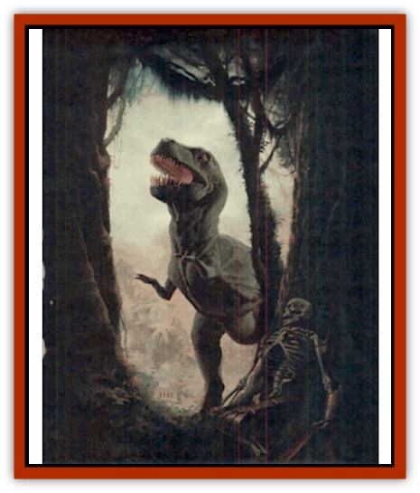
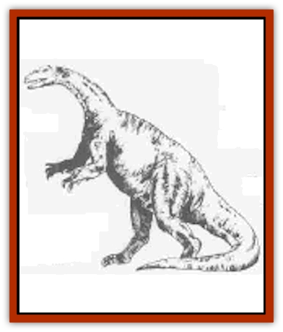
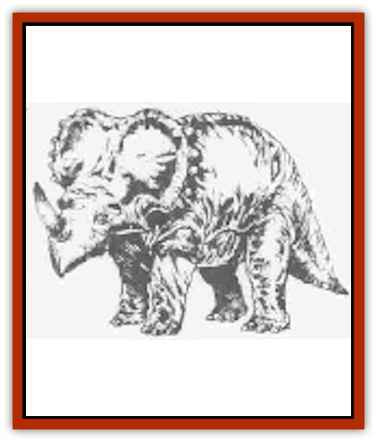
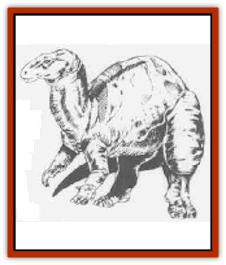
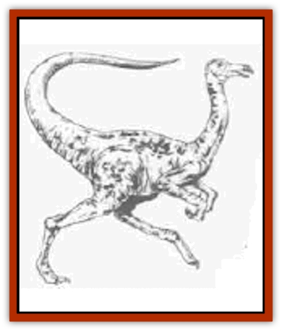
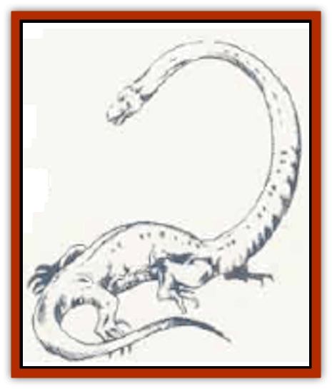
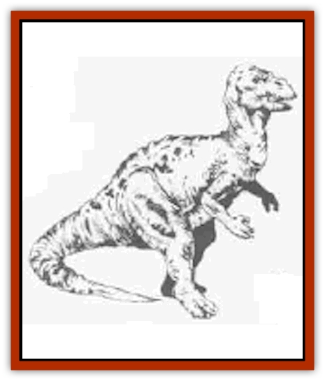
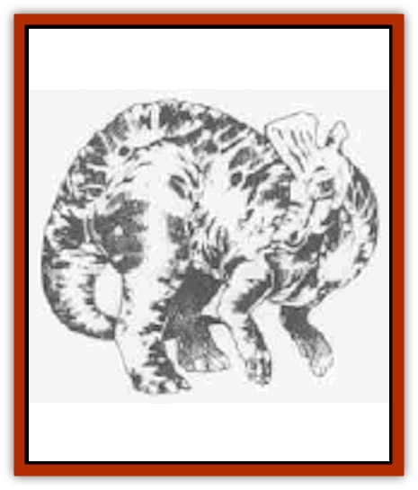

# Dinosaur III

| Statistic | **Iguanodon** | **Monoclonius** | **Plateosaurus** | **Struthiomimus** | **Tanystropheus** | **Teratosaurus** | **Trachodon** |
| --- | --- | --- | --- | --- | --- | --- | --- |
| **Activity Cycle:** | Day | Day | Day | Day | Day | Day | Day |
| **Alignment:** | Neutral | Neutral | Neutral | Neutral | Neutral | Neutral | Neutral |
| **Armor Class:** | 4 | 5 | 5 | 6 | 5 | 5 | 5 |
| **Climate/Terrain:** | Any land | Any land | Any land | Any land | Swamp | Any land | Any land |
| **Damage/Attack:** | 3d4+3 | 1d4+1 | Nil | 1d2/1d2/2d4 | 1d8+4 | 1d3/1d3/3d6 | 1d4 |
| **Diet:** | Carnivore | Carnivore | Herbivore | Omnivore | Carnivore | Carnivore | Herbivore |
| **Frequency:** | Common | Common | Common | Uncommon | Rare | Uncommon | Common |
| **Hit Dice:** | 3 to 5 | 1+1 | 3 | 6+3 | 6+6 | 10 | 12 |
| **Intelligence:** | Non- (0) | Non- (0) | Non- (0) | Animal (1) | Non- (0) | Non- (0) | Non- (0) |
| **Magic Resistance:** | Nil | Nil | Nll | Nil | Nil | Nil | Nil |
| **Morale:** | Steady (11) | Average (8) | Average (10) | Average (10) | Average (10) | Steady (11) | Steady (11) |
| **Movement:** | 12, sw 6 | 15 | 12 | 18 | 6, Sw 18 | 18 | 12 |
| **No. Appearing:** | 1-2 | 2-8 | 5-20 | 1-6 | 1 | 1-3 | 2-12 |
| **No. of Attacks:** | 1 | 1 | Nil | 3 | 1 | 3 | 1 |
| **Organization:** | Herd | Herd | Herd | Solitary | Solitary | Solitary | Herd |
| **Size:** | L (9' long) | S (3' long) | H (20'+ long) | H (6'+ tall, 16'+ long) | G (30-40' long) | H (20' long, 9' tall) | G (30'+ long) |
| **Special Attacks:** | Nil | Nil | Nil | Nil | Surprise | Nil | Nil |
| **Special Defenses:** | Nil | Nil | Nil | Nil | Nil | Nil | Nil |
| **THAC0:** | 3-4 HD: 17 / 5 HD: 15 | 19 | 12 | 13 | 13 | 11 | 9 |
| **Treasure:** | Nil | Nil | Nil | Nil | Nil | Nil | Nil |
| **XP Value:** | 65-175 | 35 | 650 | 420 | 650 | 1,400 | 2,000 |

## Iguanodon

The iguanodon is a more primitive dinosaur that walks on all fours, but it can stretch up to reach vegetation that looks particularly appealing. The creature looks much like a small sauropod, about 15 feet tall and 30 f&t long, weighing in at only five tons. Actually it is more closely related to the hadrosaurs, such as the [[Dinosaur_I|lambeosaurus]] and trachodon.

Typically traveling in herds, the iguanodon runs from carnivores, but if cornered it can employ its thumb spikes and lashing tail to defend itself.

## Monoclonius

This dinosaur, also known by the name centrosaurus, somewhat resembles a single-horned rhinoceros. Its head and neck are protected by a bony shield (AC 3), while its skin is very thick - although not plated like that of the ankylosaurus.

The monoclonius is herbivorous, and can eat almost any plant because of its strong jaws and teeth. The head of the monoclonius is attached to the neck much like a human arm is attached to the shoulder, so the creature can swing its head in almost any direction at a moment's notice. The main attack of this dinosaur is with its horn, but herds can trample smaller creatures in a stampede, with each monoclonius inflicting 2d8 points of damage.

## Plateosaurus

The plateosaurus is a herbivore that generally moves about on all fours. When watching for enemies or reaching the leafy crowns of ferns, palms, or other trees, it travels slowly in a bipedal manner, using its tail as a balance. It is more than twice as tall as man when erect

These creatures are fairly heavy, about eight to ten tons on the average, and panicky.

Plateosaurs travel in herds that migrate from feeding ground to feeding ground, and are common prey for carnosaurs such as the [[Dinosaur_II|gorgosaurus]]. They swallow large stones occasionally to help grind up plant food in their stomachs.

The creatures are an earlier form of such sauropods as the [[Dinosaur_I|diplodocus]] and [[Dinosaur_II|brontosaurus]].

## Struthiomimus

The ostrich-like struthiomimus is a bird-hipped dinosaur (ornithomimosaur), distantly related to the [[Dinosaur_I|deinonychus]], but less aggressive. Its hind legs are powerful and well adapted for running. The struthiomimus has a birdlike beak and no teeth. It has to be very hungry to attack men, but smaller humanoids and demihumans look delicious any time. This dinosaur prefers areas of tall grass as its habitat, though some closely related species are forest-dwellers.

## Tanystropheus

This swamp predator resembles a snake with thin, projecting legs. About half of its length is neck and head. The head is relatively small and the jaws are long and filled with many sharp teeth. The tanystropheus lurks along river banks and at the edge of swamps, prowling through the water. Those ambushed by the creature roll for surprise at a -6 penalty; if they are surprised the predator attacks with a +2 bonus to hit. Creatures under 500 pounds weight will be dragged into the water, to be further attacked and devoured.

## Teratosaurus

A fierce carnivore found mainly on the plains, the teratosaurus runs nimbly after any creature that appears to be edible. This creature hunts only on dry land - plains or forest. The teratosaurus is a carnosaur related to the [[Dinosaur_II|allosaurus]], [[Dinosaur_II|ceratosaurus]], and [[Dinosaur_I|tyrannosaurus rex]], but is both more primitive and somewhat heavier.

## Trachodon

This duckbilled dinosaur, also called the anatosaurus, is the archetype of its kind - anatosaurus means "duck lizard". It is a peaceful, four-ton plant eater that runs from attack; its only defense is its lashing tail. It is as at home in shallow water as it is on land, grazing on water plants and floating ferns as easily as it grinds up leaves and pine needles it finds in forested areas. Its enemies include any of the carnosaurs, especially the tyrannosaurus rex. The trachodon is a hadrosaur, and thus related to the lambeosaurus.

---
## Discovery & Documentation

**Source Publication:** Monstrous Compendium, 1995 Annual, Volume 2 (1995)
**Campaign Setting:** Advanced Dungeons & Dragons 2nd Edition
**Author(s):** Jon Pickens

### Other Creatures Found in This Source Book
   * [[Aboleth_Savant|Aboleth, Savant]]
   * [[Addazahr|Addazahr]]
   * [[Amiq_Rasol|Amiq Rasol]]
   * [[Arch-Shadow|Arch-Shadow]]
   * [[Automaton_Scaladar|Automaton, Scaladar]]
   * [[Automaton_Trobriand's|Automaton, Trobriand's]]
   * [[Bat_Sporebat|Bat, Sporebat]]
   * [[Beetle_Dragon|Beetle, Dragon]]
   * [[Bi-nou|Bi-nou]]
   * [[Boggle|Boggle]]
   * [[Brownie_Dobie|Brownie, Dobie]]
   * [[Brownie_Quickling|Brownie, Quickling]]
   * [[Cat_Crypt|Cat, Crypt]]
   * [[Cat_Great_Cath_Shee|Cat, Great, Cath Shee]]
   * [[Centaur-kin_Dorvesh|Centaur-kin, Dorvesh]]
   * [[Centaur-kin_Gnoat|Centaur-kin, Gnoat]]
   * [[Centaur-kin_Ha'pony|Centaur-kin, Ha'pony]]
   * [[Centaur-kin_Zebranaur|Centaur-kin, Zebranaur]]
   * [[Chronolily|Chronolily]]
   * [[Curst|Curst]]
   * [[Darktentacles|Darktentacles]]
   * [[Dinosaur_Aquatic|Dinosaur, Aquatic]]
   * [[Dinosaur_II|Dinosaur II]]
   * [[Doppelganger_Greater|Doppelganger, Greater]]
   * [[Dragon_Brine|Dragon, Brine]]
   * [[Dragon_Half-|Dragon, Half-]]
   * [[Dragon-kin_Sea_Wyrm|Dragon-kin, Sea Wyrm]]
   * [[Dwarf_Wild|Dwarf, Wild]]
   * [[Ekimmu|Ekimmu]]
   * [[Elemental_Nature|Elemental, Nature]]
   * [[Elf_Winged|Elf, Winged]]
   * [[Fish_Great_Glacier|Fish (Great Glacier)]]
   * [[Fish_Subterranean|Fish, Subterranean]]
   * [[Fish_Toril|Fish (Toril)]]
   * [[Flareater|Flareater]]
   * [[Flumph|Flumph]]
   * [[Froghemoth|Froghemoth]]
   * [[Ghost_Casurua|Ghost, Casurua]]
   * [[Ghost_Ker|Ghost, Ker]]
   * [[Ghul|Ghul]]
   * [[Ghul-Kin|Ghul-Kin]]
   * [[Giant_Half-giant|Giant, Half-giant]]
   * [[Golem_Burning_Man|Golem, Burning Man]]
   * [[Golem_Phantom_Flyer|Golem, Phantom Flyer]]
   * [[Gulguthhydra|Gulguthhydra]]
   * [[Hakeashar|Hakeashar]]
   * [[Horse_Moon-|Horse, Moon-]]
   * [[Human_Dragonslayer|Human, Dragonslayer]]
   * [[Human_Vistana|Human, Vistana]]
   * [[Jellyfish_Giant|Jellyfish, Giant]]
   * [[Kalin|Kalin]]
   * [[Kholiathra|Kholiathra]]
   * [[Laerti|Laerti]]
   * [[Leucrotta_Greater|Leucrotta, Greater]]
   * [[Lich_Suel|Lich, Suel]]
   * [[Lurker_Shadow|Lurker, Shadow]]
   * [[Lycanthrope_Werepanther|Lycanthrope, Werepanther]]
   * [[Lycanthrope_Wereshark|Lycanthrope, Wereshark]]
   * [[Mammal_Herd_II|Mammal, Herd II]]
   * [[Marl|Marl]]
   * [[Meenlock|Meenlock]]
   * [[Mimic_Greater|Mimic, Greater]]
   * [[Mold_II|Mold II]]
   * [[Mummy_Creature|Mummy, Creature]]
   * [[Nyth|Nyth]]
   * [[Ooze_Slime_Jelly_Ghaunadan|Ooze/Slime/Jelly, Ghaunadan]]
   * [[Palimpsest|Palimpsest]]
   * [[Peltast|Peltast]]
   * [[Plant_Dangerous_II|Plant, Dangerous II]]
   * [[Pleistocene_Animal|Pleistocene Animal]]
   * [[Pudding_Subterranean|Pudding, Subterranean]]
   * [[Raggamoffyn|Raggamoffyn]]
   * [[Snake_Serpent|Snake, Serpent]]
   * [[Snake_Serpent_Vine|Snake, Serpent Vine]]
   * [[Sphinx_Draco-|Sphinx, Draco-]]
   * [[Sprite_Seelie_Faerie|Sprite, Seelie Faerie]]
   * [[Sprite_Unseelie_Faerie|Sprite, Unseelie Faerie]]
   * [[Squealer|Squealer]]
   * [[Turtle_Giant|Turtle, Giant]]
   * [[Umpleby|Umpleby]]
   * [[Vizier's_Turban|Vizier's Turban]]
   * [[Wall_Walker|Wall Walker]]
   * [[Webbird|Webbird]]
   * [[Yak-Man|Yak-Man]]
   * [[Zorbo|Zorbo]]
