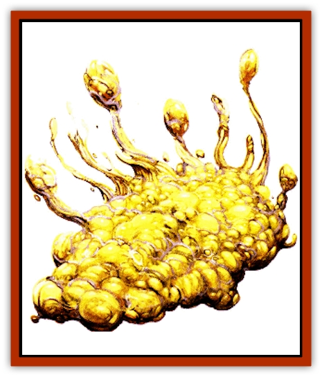

# Dirtwraith

| Statistic | **Dirtwraith** |
| --- | --- |
| **Activity Cycle:** | Night |
| **Alignment:** | Chaotic evil |
| **Armor Class:** | 9 |
| **Climate/Terrain:** | Vesve Forest, the Abyss |
| **Damage/Attack:** | 1d4 to 12d4 |
| **Diet:** | Carnivore |
| **Frequency:** | Rare (uncommon in the Abyss) |
| **Hit Dice:** | 1-12 |
| **Intelligence:** | Semi- (2-4) |
| **Magic Resistance:** | Nil |
| **Morale:** | Fearless (20) |
| **Movement:** | 1 |
| **No. Appearing:** | 1 |
| **No. of Attacks:** | 1 |
| **Organization:** | Solitary |
| **Size:** | See below |
| **Special Attacks:** | Animate plants, spores |
| **Special Defenses:** | Various immunities |
| **THAC0:** | Varies |
| **Treasure:** | Z |
| **XP Value:** | 1 HD: 420 / 2 HD: 650 / 3 HD: 975 / 4 HD: 1,400 / 5 HD: 2,000 / 6+ HD: 3,000 + 1,000 per Hit Die over 6 |

The dirt<a href=\/appendix/wraith">wraith</a>'s name comes from the commonly held (but incorrect) belief that the [[Fungus|fungus]] is a form of undead that spontaneously erupts out of the corrupt dirt beneath a decaying body. Rather, it is a form of semi-intelligent fungus that dwells in the root systems of larger plants. The fact that skeletons are commonly found nearby attests to its efficiency, not to its genesis. A dirtwraith appears as a mass of pale yellow spheroids connected by a matrix of thick, fibrous strands. Dirtwraiths are natives of the Abyss and are known as Sargusian fungi to the inhabitants there.

**Combat:** Dirtwraiths live among the root system of their plant host. As they grow, their fibrous tendrils allow them a clumsy form of undulating locomotion that lets them move about when necessary. They sense prey through ground vibrations.

A dirtwraith attacks once per round with its host plant, causing damage equal to 1d4 for each of its Hit Dice on a successful hit. Thus, a 5-HD dirthwraith causes 5d4 points of damage.

The host remains a nonsentient creature and is immune to mind-affecting magic and the like. It can withstand damage equal to the dirtwraith's hit point total before being destroyed; most plants have an AC of 6. Slaying the plant does not slay the dirtwraith; the creature simply moves to a new host once it thinks it's alone. To slay a dirtwraith, the pod network must be exhumed or else the attacker must wait motionlessly for the dirtwraith to extract itself to search for a new host (usually within 2d6 turns).

The dirtwraith is immune to fire, mind-affecting magic, and blunt weapons. Once exhumed, its only defense is to spray spores. Each pod can spray one doud of spores per day; a successful hit forces the target to make a saving throw vs. poison to avoid choking. Failure indicates that the victim suffers 1d6 points of damage per round for 2d4 rounds. A successful saving throw indicates a -2 penalty to attack rolls.

**Habitat/Society:** The Bonehart discovered the dirtwraith when one of their number accidentally brought Sargusian spores back from a trip to the Abyss. The unwitting wizard scattered spores throughout the town of Delaquenn. Before long, the spores took root and grew into dirtwraiths. The Bonehart took great interest in the fungus when it became apparent that it was not only an efficient killer but also an intelligent one.

**Ecology:** A dirtwraith's Hit Dice are directly related to its age. When a dirtwraith first "takes root", it consists of only a single pod. At this stage, it has only one Hit Die and can animate only small shrubs and creeping vines. As it feeds, new pods appear and grow to maturity at the rate of one pod per month (assuming a regular supply of food). With each pod, the dirtwraith gains an additional Hit Die and can animate increasingly large plants. Dirtwraiths cease to grow once they reach 12 Hit Dice.

Demons of all types relish dirtwraith pods as a delicacy. Unfortunately, these pods are poisonous to anything native to the Prime Material Plane. Eating even a few bites of a dirtwraith pod forces the victim to make a successful saving throw vs. poison or fall into a fevered coma for 2d6 days. Once this time has passed, the victim can make a second saving throw vs. poison to overcome the fever. If this second saving throw fails, the victim dies, and the body provides the base nutrients for a new dirtwraith pod.

---
## Discovery & Documentation

**Source Publication:** Dragon270 (2000)
**Campaign Setting:** Dragon Magazine
**Author(s):** 

### Other Creatures Found in This Source Book
   * [[Blackroot_Marauder|Blackroot Marauder]]
   * [[Kyuss_Hound_of|Kyuss, Hound of]]
   * [[Murdakus|Murdakus]]
