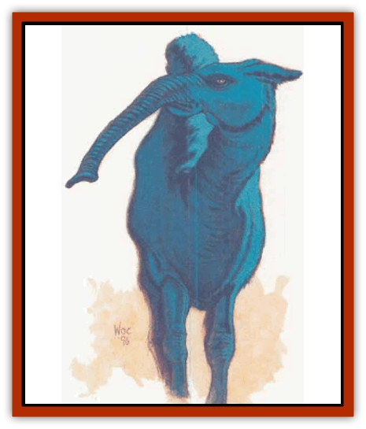

# Disenchanter

| Statistic | **Disenchanter** |
| --- | --- |
| **Activity Cycle:** | Any |
| **Alignment:** | Neutral |
| **Armor Class:** | 5 |
| **Climate/Terrain:** | Any |
| **Damage/Attack:** | Nil |
| **Diet:** | Magic |
| **Frequency:** | Very rare |
| **Hit Dice:** | 5 |
| **Intelligence:** | Average (8-10) |
| **Magic Resistance:** | Nil |
| **Morale:** | Champion (15-16) |
| **Movement:** | 12 |
| **No. Appearing:** | 1-2 |
| **No. of Attacks:** | 1 |
| **Organization:** | Solitary |
| **Size:** | L (5' tall at shoulder) |
| **Special Attacks:** | Drains magic |
| **Special Defenses:** | Can be hit only by magical weapons |
| **THAC0:** | 15 |
| **Treasure:** | Nil |
| **XP Value:** | 650 |

The disenchanter resembles a spindly [[Camel|camel]], with four legs and a single hump located on the middle of its back. The creature's small head rests at the end of a long, flexible neck. The beast also has a very flexible snout, like that of an elephant, that can reach as far as 5 feet from its head. The creature is a pale electric-blue in color. The beast is slightly translucent and sometimes appears to shimmer. When a disenchanter dies, its body shrinks to a small wizened gray lump

Much about the disenchanter is a mystery. Some of Faerun's more educated sages speculate that disenchanters were created centuries ago by the Phaerimm, the sinister creatures that live beneath Anauroch, to combat their enemies, such as the Sharn or the humans of Netheril.

While reasonably intelligent, disenchanters seldom speak to humans or related beings; disenchanters have their own language, and sages assume that only a few ever bother to learn other tongues, usually Common or elvish.

**Combat:** The disenchanter is a relatively peaceful creature, but is a ravenous eater. Since the disenchanter feeds on magic, siphoning enchantment from items or from spell effects, it often becomes aggressive when around those who have magical items - such as adventurers.

The disenchanter can *detect magic* in a 120-foot radius, and usually moves toward any enchantment it detects. It can tell the difference between the relative strength of enchantments, and prefers to consume the most powerful item; for instance, a disenchanter would choose to attack a *long sword +4* instead of a *shield +2*. A disenchanter also is intelligent enough to attack easier targets, for example trying to hit a magical shield held in a hand, rather than a magical wand in a backpack. The creature's snout is, however, very dexterous, and can hit objects in somewhat difficult positions (such as a magical dagger in its scabbard, with only the hilt showing).

To hit a magical item, the disenchanter makes a normal attack roll. The item's Armor Class is 10, adjusted by its magical plus (if any), and by the Dexterity adjustment of the individual carrying it (if any). The DM also should adjust the item's AC for cover; for example, a partially concealed item might receive an AC bonus between -2 and -4, while a totally concealed item could not be struck by the disenchanter. These penalties are left mostly to the DM's discretion. An item struck by the disenchanter's snout is permanently drained of its magic. They are intelligent and wary enough not to tap the energies of artifacts and other magics of the highest order.

A disenchanter also can disenchant a spell effect. A lasting, stationary spell effect is instantly dispelled when touched by the disenchanter's nose; such a spell effect has AC 10 and does not harm the disenchanter. If attacked with a spell, the disenchanter has a chance to intercept the spell, if the spell has a visible effect. Such a spell, like a *magic missile*, has a base AC of 5. An area effect spell cannot be intercepted by the disenchanter, unless the spell is targeted directly on the creature.

A disenchanter can be hit only by magical weapons. These weapons do not lose their enchantment when they strike the beast; only the creature's snout drains magic.

**Habitat/Society:** The disenchanter is typically found east of Anauroch, mostly around the Sea of Fallen Stars. The creature seems to have some special affinity for the area around what was once Sarbreen, the site of present-day Ravens Bluff. Disenchanters return to that area in great numbers every 150 years or so; their next mass appearance should be relatively soon, and sightings already have increased in that region.

The disenchanter's breeding habits are unknown, though it is believed by many that a disenchanter splits into two creatures of full size after consuming enough magic.

**Ecology:** Since the disenchanter has no known predators, its numbers are apparently controlled by the amount of magical energy available in an area. Most of the details of how it interacts with its environment are unknown. The creature's essence is purported to be useful in ink for scrolls, and might be used for the fabrication of a *rod of cancellation*.

---
## Discovery & Documentation

**Source Publication:** Monstrous Compendium, 1996 Annual, Volume 3 (1995)
**Campaign Setting:** Advanced Dungeons & Dragons 2nd Edition
**Author(s):** Jon Pickens

### Other Creatures Found in This Source Book
   * [[Alaghi|Alaghi]]
   * [[Alhoon|Alhoon]]
   * [[Aranea_Savage_Coast|Aranea (Savage Coast)]]
   * [[Arcane_Head|Arcane Head]]
   * [[Banedead|Banedead]]
   * [[Banelich|Banelich]]
   * [[Bat_Bonebat|Bat, Bonebat]]
   * [[Beetle|Beetle]]
   * [[Belgoi|Belgoi]]
   * [[Bladeling|Bladeling]]
   * [[Braxat|Braxat]]
   * [[Bunyip|Bunyip]]
   * [[Burbur|Burbur]]
   * [[Bvanen|Bvanen]]
   * [[Cat_Great_Snow_Tiger|Cat, Great, Snow Tiger]]
   * [[Chosen_One|Chosen One]]
   * [[Chronovoid|Chronovoid]]
   * [[Cildabrin|Cildabrin]]
   * [[Coffer_Corpse|Coffer Corpse]]
   * [[Dog_Temporal|Dog, Temporal]]
   * [[Dragon_Cerilia|Dragon (Cerilia)]]
   * [[Dragon_Ghost|Dragon, Ghost]]
   * [[Dragon_Lesser_Undead|Dragon, Lesser Undead]]
   * [[Dragon_Neutral_Amber|Dragon, Neutral, Amber]]
   * [[Dread_Warrior|Dread Warrior]]
   * [[Dreamweaver|Dreamweaver]]
   * [[Dream_Spawn_Greater_Ennui|Dream Spawn, Greater, Ennui]]
   * [[Dream_Spawn_Lesser_Morph|Dream Spawn, Lesser, Morph]]
   * [[Dwarf_Arctic|Dwarf, Arctic]]
   * [[Dwarf_Urdunnir|Dwarf, Urdunnir]]
   * [[Eel_Giant_Moray|Eel, Giant Moray]]
   * [[Elemental_Fire_Kin_Tome_Guardian|Elemental, Fire Kin, Tome Guardian]]
   * [[Elf_Rockseer|Elf, Rockseer]]
   * [[Ethyk|Ethyk]]
   * [[Faerie_Faerie_Fiddler|Faerie, Faerie Fiddler]]
   * [[Faerie_Petty_Bramble|Faerie, Petty, Bramble]]
   * [[Faerie_Petty_Gorse|Faerie, Petty, Gorse]]
   * [[Faerie_Petty|Faerie, Petty]]
   * [[Firenewt|Firenewt]]
   * [[Formian|Formian]]
   * [[Gargoyle_II|Gargoyle II]]
   * [[Giant_Cerilia|Giant (Cerilia)]]
   * [[Goblin_Cerilia|Goblin (Cerilia)]]
   * [[Golem_Magic|Golem, Magic]]
   * [[Golem_Shaboath|Golem, Shaboath]]
   * [[Hag_Bheur|Hag, Bheur]]
   * [[Hamadryad|Hamadryad]]
   * [[Hound_of_Ill-Omen|Hound of Ill-Omen]]
   * [[Human_Cerilia|Human (Cerilia)]]
   * [[Hybsil|Hybsil]]
   * [[Ibrandlin|Ibrandlin]]
   * [[Imp_Chaos|Imp, Chaos]]
   * [[Ixitxachitl_Ixzan|Ixitxachitl, Ixzan]]
   * [[Jabberwock|Jabberwock]]
   * [[Kyton|Kyton]]
   * [[Kyuss_Son_of|Kyuss, Son of]]
   * [[Lillend|Lillend]]
   * [[Life-Shaped_Creation_Guardian|Life-Shaped Creation, Guardian]]
   * [[Life-Shaped_Creation_Transport|Life-Shaped Creation, Transport]]
   * [[Lycanthrope_Werecrocodile|Lycanthrope, Werecrocodile]]
   * [[Lycanthrope_Werespider|Lycanthrope, Werespider]]
   * [[Magedoom|Magedoom]]
   * [[Manotaur|Manotaur]]
   * [[Mastiff_Shadow|Mastiff, Shadow]]
   * [[Meazel|Meazel]]
   * [[Mist_Scarlet_Dancer|Mist, Scarlet Dancer]]
   * [[Needleman|Needleman]]
   * [[Orc_Neo-Orog|Orc, Neo-Orog]]
   * [[Orc_Ondonti|Orc, Ondonti]]
   * [[Owlbear_II|Owlbear II]]
   * [[Pegataur|Pegataur]]
   * [[Phaerimm|Phaerimm]]
   * [[Reggelid|Reggelid]]
   * [[Render|Render]]
   * [[Saurial|Saurial]]
   * [[Scalamagdrion|Scalamagdrion]]
   * [[Sharn|Sharn]]
   * [[Snake_Messenger|Snake, Messenger]]
   * [[Spirit_Forest_Uthraki|Spirit, Forest, Uthraki]]
   * [[Spirit_Forest_Wood_Man|Spirit, Forest, Wood Man]]
   * [[Spirit_Ice_Orglash|Spirit, Ice, Orglash]]
   * [[Spirit_Rock_Thomil|Spirit, Rock, Thomil]]
   * [[Strider_Giant|Strider, Giant]]
   * [[Tembo|Tembo]]
   * [[Temporal_Glider|Temporal Glider]]
   * [[Temporal_Stalker|Temporal Stalker]]
   * [[Tether_Beast|Tether Beast]]
   * [[Thessalmonster|Thessalmonster]]
   * [[Time_Dimensional|Time Dimensional]]
   * [[Tomb_Tapper|Tomb Tapper]]
   * [[Undead_Dragon_Slayer|Undead Dragon Slayer]]
   * [[Unicorn_Black_Toril|Unicorn, Black (Toril)]]
   * [[Vaath|Vaath]]
   * [[Vortex_Spider|Vortex Spider]]
   * [[Weredragon|Weredragon]]
   * [[Zhentarim_Spirit|Zhentarim Spirit]]
