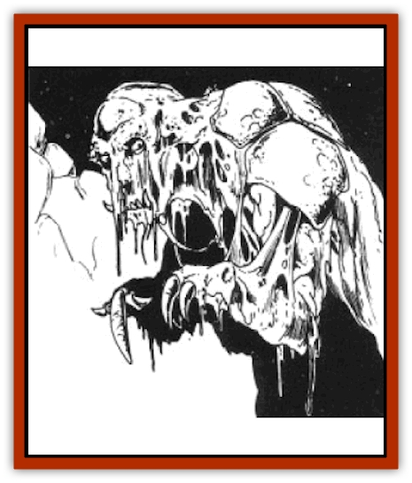

# Disir

| Statistic | **Disir** |
| --- | --- |
| **Activity Cycle:** | Any |
| **Alignment:** | Lawful evil |
| **Armor Class:** | 3 |
| **Climate/Terrain:** | Subterranean |
| **Damage/Attack:** | 2d4/2d4/2d6 |
| **Diet:** | Omnivore |
| **Frequency:** | Very Rare |
| **Hit Dice:** | 5 |
| **Intelligence:** | Highly (13-14) |
| **Magic Resistance:** | Nil |
| **Morale:** | Champion (15) |
| **Movement:** | 12 |
| **No. Appearing:** | 2d4 |
| **No. of Attacks:** | 3 |
| **Organization:** | Tribal |
| **Size:** | M (6-7' tall) |
| **Special Attacks:** | Pain |
| **Special Defenses:** | Fire resistance |
| **THAC0:** | 15 |
| **Treasure:** | (B) |
| **XP Value:** | 975 |

The disir are a race of deep-dwelling subterranean creatures of disgusting appearance. They stand about six to seven feet tall, although they are normally hunched over to a lesser height. Parts of their bodies are covered with a natural armor, while other areas show exposed rubbery flesh. Their skin tone is a pasty green-white. Their pores exude a thick coating of slimy gel. This is normally polluted with dirt, debris, and bits of dead flesh that seem to constantly slough off them. An aura of stench and decay hangs around them.

**Combat:** Disir usually fight with claws and bite, but they have been known to use weapons on rare occasions. Although their bite is more effective, disir prefer to fight with their claws whenever possible, saving their bite attack for helpless or nearly helpless victims. The claws are long and powerful and the disir are able to easily crush soft stones with one hand. Their bite is particularly vicious, both for their protruding jagged tangs and their long, razor-sharp, rasp-like tongue. This is used to shear flesh from bone.

All the attacks of the disir (claws and bite) are poisonous, due to the slimy jelly that drips from their bodies. This jelly causes intense pain to (but does not kill) its victims. Those struck by a disir must roll a saving throw vs. poison at the end of the round. Only one saving throw need be made, regardless of the number of times the character has been hit. Each claw causes a -1 penalty to the saving throw, while a bite gives a -2 penalty. These modifiers are cumulative, so if a character is struck by all three attacks, he would have a total penalty of -4 to his saving throw.

If the saving throw is failed, the poison generates a burning fire, starting from the point of the wound. This pain is so intense that it numbs the muscles and gradually paralyzes the victim. The process takes 1d4 +1 rounds. Each round until the character is paralyzed, he suffers a -1 (cumulative) penalty to his THAC0. This penalty is removed when the pain is neutralized. The poison has a duration of 1d4 turns. The poisonous gel has a very short life when exposed to air. It is effective on the disir because their bodies are constantly renewing it. However, it cannot be bottled or kept and used by others.

The gel also provides protection from fire-based attacks. Disir gain a +4 saving throw bonus and suffer 1 point less per die of damage from fire-based attacks.

**Habitat/Society:** The disir are a secretive group, due in part to geographic location (miles beneath the earth) and a fanatical hatred of anything that might be their neighbor. Their homeland is deep under the earth in the realm of the Underdark. There, they fashion underground tunnels or, more often, appropriate the homes of others. Thus they are a scourge to [[Dwarf|dwarves]] and other tunneling races. Wars between the two are often fought over the homes the dwarves have built.

The disir live in large tribal units of 50 or more members. The tribes, in turn, maintain close relations with each other and several tribes may be located in a limited area. Warfare between different tribes is unknown. They are not so scrupulous about other neighbors, viewing any other settlement as a source of food. Although highly intelligent, they do not enter into treaties or truces of any kind.

The disir reproduce from eggs. There are no distinguishing signs of their sex, making it impossible to tell male from female by sight. Indeed, a single disir may be either male or female, depending on what stage of life it is in. The females of their kind (or those in the female phase) dominate the males.

The tribes live communally, sharing the duties between all the adult members. The eggs are laid in incubator halls and are guarded at all times. Food gathering and raiding is done in groups and the spoils of each are brought back to the tribe and divided among all the members. Those who cannot assist in these tasks, for whatever reason, are killed.

**Ecology:** The disir, while omnivorous, greatly favor meat - of any kind. They seem untroubled by spoilage, decay, or source. They eat anything they can kill or any dead they find. They resort to vegetable matter (mostly fungus) only when other resources have dried up. Thus, they often serve to scour old, over-populated sections of the Underdark, leaving behind sterile dead remains.

---
## Discovery & Documentation

**Source Publication:** Time of the Dragon (1989)
**Campaign Setting:** Dragonlance
**Author(s):** David Cook

### Other Creatures Found in This Source Book
   * [[Draconian_Proto-_Traag|Draconian, Proto-, Traag]]
   * [[Dragon_Krynn_Othlorx_General_Information|Dragon (Krynn), Othlorx, General Information]]
   * [[Fire_Minion|Fire Minion]]
   * [[Gurik_Cha'ahl|Gurik Cha'ahl]]
   * [[Horax|Horax]]
   * [[Saqualaminoi|Saqualaminoi]]
   * [[Skrit|Skrit]]
   * [[Yaggol|Yaggol]]
