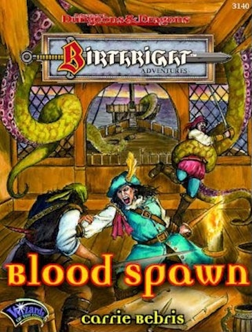

# Dispossessed - The

| Statistic | **Dispossessed, The** |
| --- | --- |
| **Activity Cycle:** | Any |
| **Alignment:** | Varies |
| **Armor Class:** | 0 |
| **Climate/Terrain:** | Shadow World |
| **Damage/Attack:** | 1d4+despair |
| **Diet:** | None |
| **Frequency:** | Uncommon |
| **Hit Dice:** | 4 |
| **Intelligence:** | Average (8-10) |
| **Magic Resistance:** | None |
| **Morale:** | Champion (15-16) |
| **Movement:** | 9 |
| **No. Appearing:** | 1d20 |
| **No. of Attacks:** | 1 |
| **Organization:** | Band |
| **Size:** | M (6' tall) |
| **Special Attacks:** | Depression, touch of despair |
| **Special Defenses:** | +1 or better weapon to hit |
| **THAC0:** | 17 |
| **Treasure:** | None |
| **XP Value:** | 975 |

The dispossessed are spirits of possession victims in the waking world. When their bodies are taken over by evil forces, their souls become trapped in the Shadow World. There they wander restlessly, seeking a way to regain their bodies � or someone else's.

The dispossessed look like noncorporeal versions of their former selves, with one notable exception: They carry about them an aura of perpetual, haunting sadness. Their pathos is so pronounced, in fact, that it can render the observer unable to act.

The dispossessed can use psychic energy to hold small- to medium-sized objects. They move and walk as they did in life, though at a slower pace.

The dispossessed form part of the Shadow World's native population. Visitors to that dark land are likely to encounter them more than once.

Though dispossessed spirits of evil alignment always attack when given the opportunity, good and neutral spirits can become sources of information or even allies (provided they don't spend too much time among the player characters � prolonged exposure to the dispossessed could render an entire party incapable of action).

**Combat:** Upon sighting a dispossessed spirit (of any alignment), observers must succeed at a saving throw vs. paralyzation or feel severe depression settle upon themselves. The will to act immediately drains from victims. They feel lethargic and apathetic toward both their companions and the encounter about to take place; in fact, they'd like nothing better than to curl up in a fetal position and go to sleep. Their movement rates are halved and all attacks and Dexterity-based maneuvers (such as thieves' skills) suffer a -3 or -25% penalty while any dispossessed spirit is within 100 yards of the victims.

Once the victim is no longer in proximity to the dispossessed, the penalty drops to -1 or -10% until the character can shake off the depression (4d6 hours plus 1 hour for every four hours of exposure).

The dispossessed retain whatever alignment they had in life. Evil spirits attack the living, hoping to take over their victims' bodies as their own were once stolen. Those convinced that their old body is among those in the party also attack. Their weapon is a touch of despair that, in addition to inflicting 1d4 points of damage, drains away the victim's will to live. When the total number of hits equals the victim's Constitution score, the character's life force leaves his or her body.

The dispossessed spirit instantaneously moves in; the victim's spirit now becomes a new member of the dispossessed.

Should an intended victim survive the possession attempt, the character's despair lingers for one day per hit (lifting gradually). *Remove fear* can shorten this period by one day per casting.

As the dispossessed are not undead, but rather the spirits of still-living bodies, they are immune to holy water, turning, and other forms of attack used only against undead.

Dispossessed spirits retain the ability to speak and communicate. Characters may engage one in conversation, ask questions of it, and so on, though they must roll a new saving throw each turn to avoid succumbing to debilitating depression.

The dispossessed are so desperate to return to their own bodies that they have a 60% chance of mistaking characters for their former selves. Should this happen, the dispossessed spirit focuses all its attention on the unfortunate character in an effort to get its body back.

Characters with low perception scores might see the dispossessed as ordinary, perfectly corporeal people. (*Bloodline:* None; *Blood Abilities*: None; *Perception/Seeming:* None/Slight)

**Habitat/Society:** Bewildered by the shock of having their bodies stolen and finding themselves in a new land of eternal twilight, the dispossessed tend to find others like themselves and wander in small bands in search of their old bodies.

Sometimes, a band will occupy an abandoned house, inn, or even a small village. There, they go through the motions of life, each action an echo of a task they once performed as whole beings.

**Ecology:** A dispossessed spirit can be put to rest only if restored to its original body or when its original body dies. Though some spirits try to inhabit the bodies of others, they find that doing so does not bring them the peace they expected and soon shuffle off the mortal coil.

---
## Discovery & Documentation

**Source Publication:** Blood Spawn: Creatures of Light and Shadow (1995)
**Campaign Setting:** Birthright
**Author(s):** Carrie A. Bebris

### Other Creatures Found in This Source Book
   * [[Blood_Hound|Blood Hound]]
   * [[Changeling_Cerilia|Changeling (Cerilia)]]
   * [[Cwn_Annwn|Cwn Annwn]]
