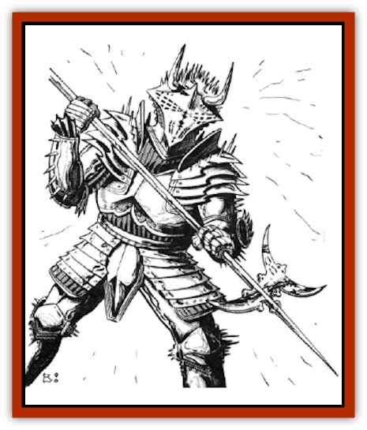

# Dizantar

| Statistic | **Dizantar** |
| --- | --- |
| **Activity Cycle:** | Any |
| **Alignment:** | Lawful evil |
| **Armor Class:** | -3 |
| **Climate/Terrain:** | Any space |
| **Damage/Attack:** | 7-16 (halberd) |
| **Diet:** | Unknown |
| **Frequency:** | Very rare |
| **Hit Dice:** | 8 |
| **Intelligence:** | Exceptional (15-16) |
| **Magic Resistance:** | 20% |
| **Morale:** | Fearless (20) |
| **Movement:** | 15 |
| **No. Appearing:** | 1 |
| **No. of Attacks:** | 1 |
| **Organization:** | Solitary |
| **Size:** | L (8' tall) |
| **Special Attacks:** | Spiked armor |
| **Special Defenses:** | Dimension door |
| **THAC0:** | 13 |
| **Treasure:** | Nil |
| **XP Value:** | 5,000 |

Dizantar are tall, armored humanoids that stand most of their time hunting down and killing [[Arcane|arcane]].

These creatures are always encountered in silvery, heavy plate mail of special construction with smooth, tightly fitting joints. The rest of the armor is covered with spikes and razor-sharp edges. No part of the body is left visible. Even the eye slits show only black, like the depths of wildspace. Despite the weight of this armor, dizantar move quickly, silently, and with great agility. Their voices are soft and whispery. They speak common, but most have their own language as well.

There is no recorded account of what a dizantar's body looks like. When the armor is opened, all that is found is smoking black ashes. Their extreme height and three fingered gauntlets lead most sages to the conclusion that they are not human.

**Combat:** The only weapon dizantar have ever been seen with is a ten-foot-long halberd with an unusually ornate head and a metal shaft. They wield it with a Strength of 18/00, giving them a +3 bonus to the attack roll and +6 damage bonus. This weapon can harm creatures that can be hit only by +1 magical weapons or better. Both the halberd and the armor glow when subjected to a *detect magic* spell.

If need be, a dizantar can use the spikes and edges on its armor to cause damage. Any punch inflicts 1d6 points of plumage from the spikes and edges. Anyone attempting to wrestle or grapple with a dizantar suffers 1d6 points of damage. Ropes and other bindings cast about a dizantar are severed in a single round. The armor also provides a 20% resistance to all forms of magic.

A dizantar can use the halberd to cast a glowing, magical line. The motion is similar to that of a fly-casting fisherman. If the attack roll is successful, the line is magically fixed to the victim. Only a *wish* spell can remove it. No damage is caused by the line. but the dizantar can follow the line to the victim anywhere within a crystal sphere. The line is severed by passing through the sphere wall or by any form of planar travel.

A dizantar can use only those miscellaneous magical items not specific to a player character class. It can do so only if the item is specifically needed for its quest. The item is discarded carelessly as soon as it is no longer useful. A dizantar can use a *dimension door* spell up to three times a day, but only in wildspace. It can detect invisible and see through illusions at all times.

**Habitat/Society:** Dizantar can be found anywhere in space or on any planet. The location and nature of their native crystal sphere is a mystery. They are at home in space for short periods of time, apparently protected by their armor. A dizantar will frequently commandeer a spelljamming ship to search out its victim. They do not build their own ships.

Dizantar are always found alone. They deal with weaker beings only if this serves their purposes. More often they take what they need, unaffected by the resulting death or destruction. They may work with more powerful creatures toward a common goal, but they prefer not to. Dizantar are cold, calculating, fearless, and not bothered by morals or ethics. Only two things motivate dizantar - revenge and hunting arcane. Dizantar kill arcane on sight. They spend most of their time hunting down members of this race and killing them. Fortunately, dizantar are far less numerous than the masters of the spelljamming helms. Occasionally dizantar are encountered on missions of vengeance against other creatures.

**Ecology:** If dizantar eat, they always make sure to do it out of sight of "lesser" creatures. The arcane fear them greatly. Strangely, the arcane refuse to talk much about dizantar. Any rumor of a dizantar in the area is cause for an arcane to vanish or immediately hire a squad of bodyguards.

---
## Discovery & Documentation

**Source Publication:** MC7 Spelljammer Appendix I (1990)
**Campaign Setting:** Advanced Dungeons & Dragons 2nd Edition
**Author(s):** various

### Other Creatures Found in This Source Book
   * [[Aartuk|Aartuk]]
   * [[Albari|Albari]]
   * [[Ancient_Mariner|Ancient Mariner]]
   * [[Argos|Argos]]
   * [[Beholder_Abomination_Astereater|Beholder (Abomination), Astereater]]
   * [[Blazozoid|Blazozoid]]
   * [[Chattur|Chattur]]
   * [[Chevall|Chevall]]
   * [[Clockwork_Horror|Clockwork Horror]]
   * [[Colossus|Colossus]]
   * [[Delphinid|Delphinid]]
   * [[Dog|Dog]]
   * [[Dog_Bog_Hound|Dog, Bog Hound]]
   * [[Esthetic|Esthetic]]
   * [[Focoid|Focoid]]
   * [[Fractine|Fractine]]
   * [[Giant_Spacesea|Giant, Spacesea]]
   * [[Golem_Furnace|Golem, Furnace]]
   * [[Golem_Radiant|Golem, Radiant]]
   * [[Gravislayer|Gravislayer]]
   * [[Grommam|Grommam]]
   * [[Hadozee|Hadozee]]
   * [[Hamster_Giant_Space|Hamster, Giant Space]]
   * [[Jammer_Leech|Jammer Leech]]
   * [[Lakshu|Lakshu]]
   * [[Lumineaux|Lumineaux]]
   * [[Lutum|Lutum]]
   * [[Mimic_Space|Mimic, Space]]
   * [[Misi|Misi]]
   * [[Moon_Rogue|Moon, Rogue]]
   * [[Mortiss|Mortiss]]
   * [[Murderoid|Murderoid]]
   * [[Nay-Churr|Nay-Churr]]
   * [[Phlog-Crawler|Phlog-Crawler]]
   * [[Plasman|Plasman]]
   * [[Plasmoid_DeGleash|Plasmoid, DeGleash]]
   * [[Plasmoid_DelNoric|Plasmoid, DelNoric]]
   * [[Plasmoid_General_Information|Plasmoid, General Information]]
   * [[Plasmoid_Ontalak|Plasmoid, Ontalak]]
   * [[Puffer|Puffer]]
   * [[Q'nidar|Q'nidar]]
   * [[Rastipede|Rastipede]]
   * [[Reigar|Reigar]]
   * [[Rock_Hopper|Rock Hopper]]
   * [[Slinker|Slinker]]
   * [[Spider_Asteroid|Spider, Asteroid]]
   * [[Spiritjam|Spiritjam]]
   * [[Survivor|Survivor]]
   * [[Syllix|Syllix]]
   * [[Symbiont_Power|Symbiont, Power]]
   * [[Vine_Infinity|Vine, Infinity]]
   * [[Wiggle|Wiggle]]
   * [[Wizshade|Wizshade]]
   * [[Wryback|Wryback]]
   * [[Zard|Zard]]
   * [[Zodar|Zodar]]
