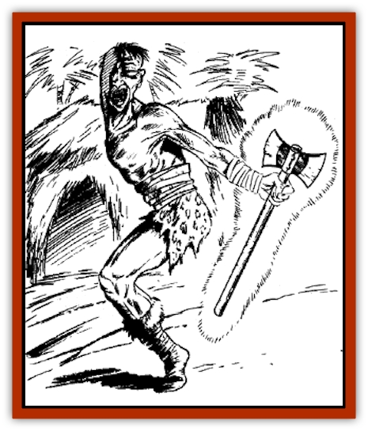

# Doc cu'o'c

| Statistic | **Doc cu'o'c** |
| --- | --- |
| **Activity Cycle:** | Night |
| **Alignment:** | Chaotic good |
| **Armor Class:** | -3 |
| **Climate/Terrain:** | Tropical, subtropical, and temperate plain, forest, hill, and mountain |
| **Damage/Attack:** | 1-8/1-8 + special |
| **Diet:** | Nil |
| **Frequency:** | Very rare |
| **Hit Dice:** | 10 |
| **Intelligence:** | Genius (17) |
| **Magic Resistance:** | 70% |
| **Morale:** | Champion (15) |
| **Movement:** | 24 |
| **No. Appearing:** | 1 |
| **No. of Attacks:** | 2 |
| **Organization:** | Solitary |
| **Size:** | M (5' tall) |
| **Special Attacks:** | See below |
| **Special Defenses:** | See below |
| **THAC0:** | 11 |
| **Treasure:** | G |
| **XP Value:** | 6,000 |

The doc cu'o'c is a greater spirit who serves as the protector of a given region, provided the locals remain sufficiently deferential.

The doc cu'o'c appears as the body of half a man, who stands on a single leg. Each may dress differently, but doc cu'o'cs usually wear the native garb of the region they protect. Likewise, their physical features resemble those of the local inhabitants, including such things as beards, moustaches, and braided hair. A doc cu'o'c always grips an axe in his hand. A soft golden light envelopes the tool, which otherwise resembles an ordinary woodsman's axe.

Doc cu'o'c are conversant in all languages of men.

**Combat:** Although it isn't aggressive by nature, a doc cu'o'c is a great enemy of evil spirits, particularly those who threaten its guarded region. It also is a skilled spellcaster, and can employ the following spells once per day: *cure disease*, *remove paralysis*, *cure blindness*, *oath*, and *remove curse*. It can cast *control weather* and *become astral* up to three times each day. It can *become invisible* at will, and can *see invisible* objects and spirits at all times.

The doc cu'o'c's most effective attacks come from its axe. Creatures struck by the axe suffer 1-8 hit points of damage. In addition, the weapon delivers a massive electrical shock, inflicting damage equal to the doc cu'o'c's current hit points. The victim is allowed a saving throw vs. spells; a successful save reduces the amount of electrical damage by half.

Doc cu'o'cs protect only their own regions. They are not above pointing out an equally suitable area for opponents to raid, even if that area is inhabited. If the spirit cannot encourage an opponent's withdrawal, or cannot frighten him away with *control weather*, a doc cu'o'c is most likely to charge the target and attack with its axe. With its low Armor Class and high resistance to magic (it can only be hit by weapons +3 or greater), the doc cu'o'c has little to fear from most opponents in melee. If a battle turns against the doc cu'o'c, it often *becomes invisible* to study its opponent. If the invisible spirit decides that defeating the opponent is unlikely, it will *become astral* and retreat to the safety of its lair on the Astral Plane.

**Habitat/Society:** A doc cu'o'c is drawn to an area when petitioned by the local inhabitants. Such an area may be as small as a single home or as large a modestly-sized village. The doc cu'o'c protects this area as long as the inhabitants conduct regular worship ceremonies and make small offerings. Appropriate offerings include food, handcrafted items, and treasure (doc cu'o'c are especially fond of coins and gems). If the locals shirk their worship services or neglect to make offerings, the offended spirit leaves the area, never again to return.

The doc cu'o'c's primary concern is the land it guards, not necessarily the inhabitants. Good fortune for the locals usually is only a side effect of the spirit's actions. A doc cu'o'c seldom, if ever, becomes directly involved in the affairs of the mortal world. For instance, a doc cu'o'c probably would ignore a request to provide food for a starving family, but might use control weather to provide sufficient rain for crops, thus ensuring a bountiful harvest.

A doc cu'o'c's lair is never found on the Prime Material Plane. Instead, the spirit creates a lair on the Astral Plane, usually in an isolated place that is unlikely to be disturbed by other life forms. A doc cu'o'c visits its lair only occasionally, most often to store the offerings from its worshippers, as well as any items obtained from vanquished evil spirits. If its lair is robbed, the doc cu'o'c returns to the Prime Material Plane, where it casts spells to wreak havoc over the area it protects. Once this is done, it leaves and never returns.

**Ecology:** The doc cu'o'c does not consume organic or inorganic substances for nourishment. Instead, it is refreshed and revitalized by the energies of the Astral Plane. A doc cu'o'c must spend at least one day per month in the Astral Plane to absorb these energies. If a month passes without a visit to the Astral Plane, the spirit creature loses 5% of its hit points per day (these lost hit points are fully recovered as soon as it spends a day in the Astral Plane).

---
## Discovery & Documentation

**Source Publication:** MC6 Kara-Tur Appendix (1990)
**Campaign Setting:** Kara-Tur (Forgotten Realms)
**Author(s):** Rick Swan

### Other Creatures Found in This Source Book
   * [[Bajang|Bajang]]
   * [[Bakemono|Bakemono]]
   * [[Bisan|Bisan]]
   * [[Buso|Buso]]
   * [[Carp_Giant|Carp, Giant]]
   * [[Centipede_Spirit|Centipede, Spirit]]
   * [[Chu-u|Chu-u]]
   * [[Con-tinh|Con-tinh]]
   * [[Duruch'i-lin|Duruch'i-lin]]
   * [[Flame_Spirit|Flame Spirit]]
   * [[Foo_Creature|Foo Creature]]
   * [[Gaki|Gaki]]
   * [[Gargantua|Gargantua]]
   * [[Goblin_Rat|Goblin Rat]]
   * [[Hai_Nu|Hai Nu]]
   * [[Hannya|Hannya]]
   * [[Hengeyokai|Hengeyokai]]
   * [[Hsing-sing|Hsing-sing]]
   * [[Hu_Hsien|Hu Hsien]]
   * [[Human_Kara-Tur|Human (Kara-Tur)]]
   * [[Ikiryo|Ikiryo]]
   * [[Jishin_Mushi|Jishin Mushi]]
   * [[Kala|Kala]]
   * [[Kaluk|Kaluk]]
   * [[Kappa|Kappa]]
   * [[Korobokuru|Korobokuru]]
   * [[Krakentua|Krakentua]]
   * [[Kuei|Kuei]]
   * [[Memedi|Memedi]]
   * [[Men-shen|Men-shen]]
   * [[Nat|Nat]]
   * [[Ningyo|Ningyo]]
   * [[Oni|Oni]]
   * [[P'oh|P'oh]]
   * [[P'oh_Gohei|P'oh, Gohei]]
   * [[Shan_Sao|Shan Sao]]
   * [[Shirokinukatsukami|Shirokinukatsukami]]
   * [[Spirit_Folk|Spirit Folk]]
   * [[Spirit_Nature|Spirit, Nature]]
   * [[Spirit_Stone|Spirit, Stone]]
   * [[Tako|Tako]]
   * [[Tengu|Tengu]]
   * [[Wang-Liang|Wang-Liang]]
   * [[Yuan-ti_Histachii|Yuan-ti, Histachii]]
   * [[Yuki-on-na|Yuki-on-na]]
