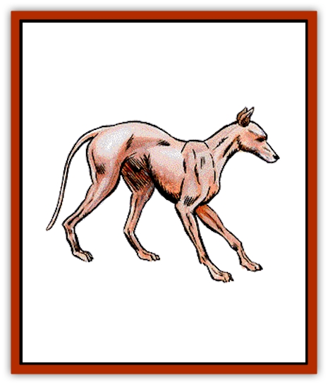

# Dog

| Statistic | **Blink Dog** | **Death Dog** | **War Dog** | **Wild Dog** |
| --- | --- | --- | --- | --- |
| **Activity Cycle:** | Any | Night | Any | Any |
| **Alignment:** | Lawful good | Neutral evil | Neutral | Neutral |
| **Armor Class:** | 5 | 7 | 6 | 7 |
| **Climate/Terrain:** | Temperate plains | Warm deserts and subterranean | Any | Any |
| **Damage/Attack:** | 1-6 | 1-10/1-10 | 2-8 (2d4) | 1-4 |
| **Diet:** | Omnivorous | Carnivorous | Omnivorous | Omnivorous |
| **Frequency:** | Rare | Very rare | Uncommon | Common |
| **Hit Dice:** | 4 | 2+1 | 2+2 | 1+1 |
| **Intelligence:** | Average (8-10) | Semi- (2-4) | Semi- (2-4) | Semi- (2-4) |
| **Magic Resistance:** | Nil | Nil | Nil | Nil |
| **Morale:** | Steady / (11-12) | Steady / (11-12) | Average / (8-10) | Unsteady / (5-7) |
| **Movement:** | 12 | 12 | 12 | 15 |
| **No. Appearing:** | 4-16 (4d4) | 5-50 (5d10) | Variable | 4-16 (4d4) |
| **No. of Attacks:** | 1 | 2 | 1 | 1 |
| **Organization:** | Pack | Pack | Solitary | Pack |
| **Size:** | M (4' long) | M (6' long) | M / (4-6' long) | S (3' long) |
| **Special Attacks:** | From the rear 75% of the time | Disease | Nil | Nil |
| **Special Defenses:** | Teleportation | Nil | Nil | Nil |
| **THAC0:** | 17 | 19 | 19 | 19 |
| **Treasure:** | (C) | Nil | Nil | Nil |
| **XP Value:** | 270 | 120 | 65 | 35 |

Smaller than [[Wolf|wolves]], the appearance of the wild dog varies from place to place. Most appear very wolf-like, while others seem to combine the looks of a wolf and a [[Jackal|jackal]].

**Combat:** Wild dogs fight as an organized pack. They favor small game, and attack men and human habitations only in times of great hunger. The bite of a wild dog inflicts 1-4 points of damage.

**Habitat/Society:** Wild dogs are found almost anywhere. They run in packs, and are led by the dominant male. The pack usually hunts a variety of game, even attacking deer or antelope. Pups are born in the spring. Wild dogs can be tamed if separated from their pack.

**Ecology:** Wild dogs are omnivores which usually thrive on a combination of hunting and foraging.

**War Dogs**

  Generally large mastiffs or wolfhounds, they have keen senses of smell and hearing, making them adept at detecting intruders. Most war dogs are not usually vicious, and will rarely attack without cause. The status of war dogs varies greatly; some are loyal and beloved pets, some are watch dogs, others are hunting dogs, and some are trained for battle.

**Blink Dogs**

  Blink dogs are yellowish brown canines which are stockier and more muscular than other wild dogs. They are intelligent and employ a limited form of teleportation when they hunt.

A blink dog attack is well organized. They will blink to and fro without any obvious pattern, using their powers to position themselves for an attack. Fully 75% of the time they are able to attack their targets from the rear. A dog will teleport on a roll of 7 or better on a 12-sided die. To determine where the dog appears, roll a 12-sided die: 1 = in front of opponent, 2 = shielded (or left) front flank, 3 = unshielded (or right) front flank, 4-12 = behind. When blinking, the dog will appear from 1 to 3 feet from its opponent and will immediately be able to attack.

Blinking is an innate power and the animal will never appear inside a space occupied by a solid object. If seriously threatened, the entire pack will blink out and not return.

Blink dogs are intelligent, and communicate in a complex language of barks, yaps, whines, and growls. They inhabit open plains and avoid human haunts. A lair will contain 3-12 (3d4) pups 50% of the time (1-2 hit dice, 1-2/1-3 hit points damage/attack). These puppies can be trained and are worth between 1,000 to 2,000 gold pieces.

**Death dog**

  Death dogs are large two-headed hounds which are distinguished by their penetrating double bark. Death dogs hunt in large packs.

Each head is independent, and a bite does 1-10 points of damage. Victims must save vs. poison or contract a rotting disease which will kill them in 4-24 (4d6) days. Only a cure disease spell can save them. A natural roll of 19 or 20 on their attack die means that a man-sized opponent is knocked prone and attacks at a -4 until able to rise to its feet again. There is an 85% chance that death dogs will attack humans on sight.

---
## Discovery & Documentation

**Source Publication:** MC7 Spelljammer Appendix I (1990)
**Campaign Setting:** Advanced Dungeons & Dragons 2nd Edition
**Author(s):** various

### Other Creatures Found in This Source Book
   * [[Aartuk|Aartuk]]
   * [[Albari|Albari]]
   * [[Ancient_Mariner|Ancient Mariner]]
   * [[Argos|Argos]]
   * [[Beholder_Abomination_Astereater|Beholder (Abomination), Astereater]]
   * [[Blazozoid|Blazozoid]]
   * [[Chattur|Chattur]]
   * [[Chevall|Chevall]]
   * [[Clockwork_Horror|Clockwork Horror]]
   * [[Colossus|Colossus]]
   * [[Delphinid|Delphinid]]
   * [[Dizantar|Dizantar]]
   * [[Dog_Bog_Hound|Dog, Bog Hound]]
   * [[Esthetic|Esthetic]]
   * [[Focoid|Focoid]]
   * [[Fractine|Fractine]]
   * [[Giant_Spacesea|Giant, Spacesea]]
   * [[Golem_Furnace|Golem, Furnace]]
   * [[Golem_Radiant|Golem, Radiant]]
   * [[Gravislayer|Gravislayer]]
   * [[Grommam|Grommam]]
   * [[Hadozee|Hadozee]]
   * [[Hamster_Giant_Space|Hamster, Giant Space]]
   * [[Jammer_Leech|Jammer Leech]]
   * [[Lakshu|Lakshu]]
   * [[Lumineaux|Lumineaux]]
   * [[Lutum|Lutum]]
   * [[Mimic_Space|Mimic, Space]]
   * [[Misi|Misi]]
   * [[Moon_Rogue|Moon, Rogue]]
   * [[Mortiss|Mortiss]]
   * [[Murderoid|Murderoid]]
   * [[Nay-Churr|Nay-Churr]]
   * [[Phlog-Crawler|Phlog-Crawler]]
   * [[Plasman|Plasman]]
   * [[Plasmoid_DeGleash|Plasmoid, DeGleash]]
   * [[Plasmoid_DelNoric|Plasmoid, DelNoric]]
   * [[Plasmoid_General_Information|Plasmoid, General Information]]
   * [[Plasmoid_Ontalak|Plasmoid, Ontalak]]
   * [[Puffer|Puffer]]
   * [[Q'nidar|Q'nidar]]
   * [[Rastipede|Rastipede]]
   * [[Reigar|Reigar]]
   * [[Rock_Hopper|Rock Hopper]]
   * [[Slinker|Slinker]]
   * [[Spider_Asteroid|Spider, Asteroid]]
   * [[Spiritjam|Spiritjam]]
   * [[Survivor|Survivor]]
   * [[Syllix|Syllix]]
   * [[Symbiont_Power|Symbiont, Power]]
   * [[Vine_Infinity|Vine, Infinity]]
   * [[Wiggle|Wiggle]]
   * [[Wizshade|Wizshade]]
   * [[Wryback|Wryback]]
   * [[Zard|Zard]]
   * [[Zodar|Zodar]]
