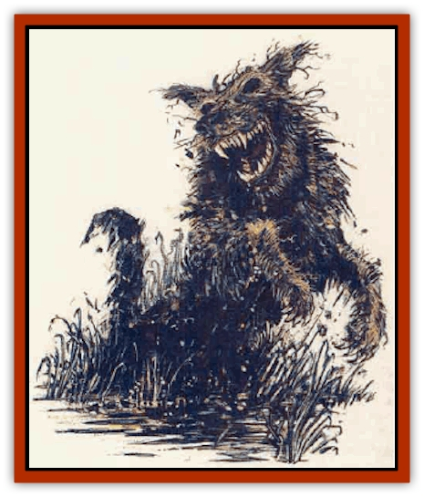

# Dog - Bog Hound

| Statistic | **Bog Hound** | **Moor Hound** |
| --- | --- | --- |
| **Activity Cycle:** | Night | Night |
| **Alignment:** | Neutral evil | Neutral evil |
| **Armor Class:** | 5 | 1 |
| **Climate/Terrain:** | Swamp | Swamp |
| **Damage/Attack:** | 1d4/1d4/1d4 | 1d6/1d6/1d8 |
| **Diet:** | Carnivorous | Carnivorous |
| **Frequency:** | Very rare | One per pack |
| **Hit Dice:** | 2+2 | 8 |
| **Intelligence:** | Semi- (3) | Very (12) |
| **Magic Resistance:** | Nil | 15% |
| **Morale:** | Champion (15) | Fearless (20) |
| **Movement:** | 15 | 18 |
| **No. Appearing:** | 2-20 | 1 |
| **No. of Attacks:** | 3 | 3 |
| **Organization:** | Pack | Pack leader |
| **Size:** | M (6' long) | L (7' long) |
| **Special Attacks:** | Nil | Nil |
| **Special Defenses:** | Nil | +1 or better weapon to hit |
| **THAC0:** | 19 | 13 |
| **Treasure:** | Nil | Nil |
| **XP Value:** | 65 | 3,000 |

Bog hounds are large [[Dog|dogs]], about the size of war dogs, created from a cursed bog. Sculpted of straw and mud, the hounds are given life by wicked magic or a curse. They are sometimes created by the exceptionally strong will of a creature that can shape life.

Their color is a muddy brown with splotches of yellow, and their most frightening feature is their lack of eyes; they have only empty black sockets.

Each pack of bog hounds is led by a moor hound, an individual creature of exceptional strength and power. As long this creature exists, the pack cannot be permanently destroyed.

**Combat:** When hunting, bog hounds set up an unearthly howling that only subsides when they close in. They attack by flanking their victims and closing from all sides at once. In combat, they act as ordinary hounds, unless their pack leader (the moor hound) or their master instructs them to perform another task. When slain, they return to their original materials, dissolving into scattered straw and mud as a gasp of vapor escapes from the bodies. (In some cases the power of the animating curse may form additional bog hound bodies over time, in other cases the master might construct more.)

The bog hounds are vulnerable to natural sunlight. If they are exposed to the sun, their supernabral essence evaporates like fog, and they become inanimate statues of straw and mud, trapped in the pose in which the light first caught them. These can be destroyed by the slightest touch; unless extreme care is taken they cannot be moved.

**Ecology:** The bog hound pack is created by a powerful curse or possibly by malevolent necromantic magic. While their diet is listed as carnivorous, in truth they need to eat nothing. When they attack, they savage and devour any living creature of flesh and bone that they hunt. They gain no sustenance from eating; they are simply supernaturally vicious.

**Moor Hound**

  Unlike the bog hounds, the moor bound is formed wholly of the vapors of the bog. It is a coal-black creature with flaming red eyes. Its jaws can easily fit around a full grown man's head, and are powerful enough to snap bone.

The moor hound can be hit only by magical weapons of at least +1 enchantment; however, it only seems to suffer real damage from them. It can be destroyed only after it has been exposed to sunlight; otherwise, once it has been reduced to 0 hit points or below the moor hound bounds of to regenerate. It always leaves a trail of blood that leads directly to a bog or pool of quicksand, but no further trace of the moor hound can be found until the next night, when it comes back fully regenerated.

If not exposed to sunlight, the moor hound cannot die. It can, however, be captured. If even the slightest beam of sunlight directly hits the moor hound, any apparent damage it took before exposure suddenly becomes real, perhaps slaying it outright. Further, the moor hound can then be hit by ordinary weapons and permanently killed, breaking the curse that gave it life. When the moor hound dies, a ghostly howling marks its passage into nothingness. All bog hounds of its pack immediately crumble into mud and straw as their howls answer and follow those of the pack leader.

---
## Discovery & Documentation

**Source Publication:** MC7 Spelljammer Appendix I (1990)
**Campaign Setting:** Advanced Dungeons & Dragons 2nd Edition
**Author(s):** various

### Other Creatures Found in This Source Book
   * [[Aartuk|Aartuk]]
   * [[Albari|Albari]]
   * [[Ancient_Mariner|Ancient Mariner]]
   * [[Argos|Argos]]
   * [[Beholder_Abomination_Astereater|Beholder (Abomination), Astereater]]
   * [[Blazozoid|Blazozoid]]
   * [[Chattur|Chattur]]
   * [[Chevall|Chevall]]
   * [[Clockwork_Horror|Clockwork Horror]]
   * [[Colossus|Colossus]]
   * [[Delphinid|Delphinid]]
   * [[Dizantar|Dizantar]]
   * [[Dog|Dog]]
   * [[Esthetic|Esthetic]]
   * [[Focoid|Focoid]]
   * [[Fractine|Fractine]]
   * [[Giant_Spacesea|Giant, Spacesea]]
   * [[Golem_Furnace|Golem, Furnace]]
   * [[Golem_Radiant|Golem, Radiant]]
   * [[Gravislayer|Gravislayer]]
   * [[Grommam|Grommam]]
   * [[Hadozee|Hadozee]]
   * [[Hamster_Giant_Space|Hamster, Giant Space]]
   * [[Jammer_Leech|Jammer Leech]]
   * [[Lakshu|Lakshu]]
   * [[Lumineaux|Lumineaux]]
   * [[Lutum|Lutum]]
   * [[Mimic_Space|Mimic, Space]]
   * [[Misi|Misi]]
   * [[Moon_Rogue|Moon, Rogue]]
   * [[Mortiss|Mortiss]]
   * [[Murderoid|Murderoid]]
   * [[Nay-Churr|Nay-Churr]]
   * [[Phlog-Crawler|Phlog-Crawler]]
   * [[Plasman|Plasman]]
   * [[Plasmoid_DeGleash|Plasmoid, DeGleash]]
   * [[Plasmoid_DelNoric|Plasmoid, DelNoric]]
   * [[Plasmoid_General_Information|Plasmoid, General Information]]
   * [[Plasmoid_Ontalak|Plasmoid, Ontalak]]
   * [[Puffer|Puffer]]
   * [[Q'nidar|Q'nidar]]
   * [[Rastipede|Rastipede]]
   * [[Reigar|Reigar]]
   * [[Rock_Hopper|Rock Hopper]]
   * [[Slinker|Slinker]]
   * [[Spider_Asteroid|Spider, Asteroid]]
   * [[Spiritjam|Spiritjam]]
   * [[Survivor|Survivor]]
   * [[Syllix|Syllix]]
   * [[Symbiont_Power|Symbiont, Power]]
   * [[Vine_Infinity|Vine, Infinity]]
   * [[Wiggle|Wiggle]]
   * [[Wizshade|Wizshade]]
   * [[Wryback|Wryback]]
   * [[Zard|Zard]]
   * [[Zodar|Zodar]]
