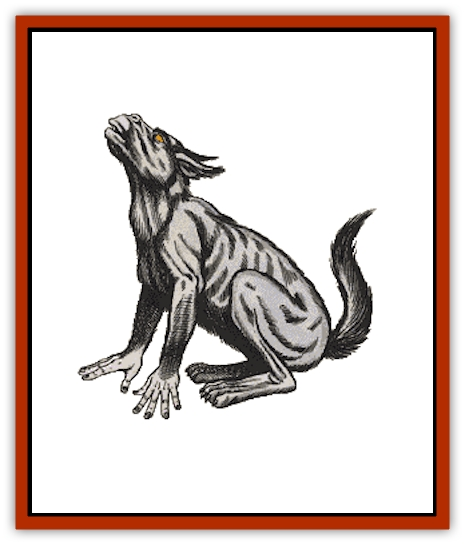

# Dog - Moon

| Statistic | **Dog, Moon** |
| --- | --- |
| **Activity Cycle:** | Any |
| **Alignment:** | Neutral good |
| **Armor Class:** | 0 |
| **Climate/Terrain:** | Elysium and Prime |
| **Damage/Attack:** | 3-12 |
| **Diet:** | Carnivore |
| **Frequency:** | Rare |
| **Hit Dice:** | 9+3 |
| **Intelligence:** | High to exceptional (13-16) |
| **Magic Resistance:** | 25% |
| **Morale:** | Fanatic (17-18) |
| **Movement:** | 30, bipedal 9 |
| **No. Appearing:** | 1 or 2-8 (see below) |
| **No. of Attacks:** | 1 |
| **Organization:** | Solitary or small pack (see below) |
| **Size:** | M (3' at shoulders) |
| **Special Attacks:** | Bay, howl |
| **Special Defenses:** | Shadowy hypnotic pattern, +2 or better weapons to hit |
| **THAC0:** | 11 |
| **Treasure:** | Nil |
| **XP Value:** | 9,000 |

Often mistaken for baneful monsters, moon dogs are native creatures of Elysium and champions of the causes of good. They often appear in the Prime Material plane to fight evil wherever it shows itself.

Moon dogs look very similar to large wolf hounds. Their strange heads are slightly human in appearance, giving the animals a very intelligent look. The creatures' forepaws are adaptable, giving the moon dogs the ability to travel bipedally or on all fours. They are dark colored animals, ranging from dark gray to deep black. Moon dogs have amber eyes.

Moon dogs speak their own language, and they can communicate with all [[Dog|canines]] and [[Wolf|lupines]] as well. They can speak common using a limited form of telepathy.

**Combat:** Woe to those who enter combat with a moon dog. These creatures of good are potent fighters and merciless against evil. Their powerful bite inflicts 3-12 points of damage.

Moon dogs prefer to attack with their keening howl. This *baying* is harmful to evil creatures only. Any evil creature within an 80 foot radius of a baying moon dog is affected as by a *fear* spell cast at 12th-level of magic use. Additional moon dogs baying have a cumulative effect. The *howling* will also cause 5-8 points of damage per round to evil creatures within 40 feet. In addition, the howling will cause intense physical pain to extra-planar creatures of evil alignment so much that they are 5% likely per moon dog howling to return to their plane. Moon dogs can *whine* to dispel illusions or *bark* to dispel evil, once per round.

The following spell-like powers (at 12th-level of use) are available to a moon dog one at a time, once per round, at will:

<ul><li>*change self*, 3 times per day</li><li>*cure disease*, by lick, 1 time per individual per day</li><li>*cure light wounds*, by lick, 1 time per individual per day</li><li>*dancing lights*</li><li>*darkness, 15' radius*</li><li>*detect evil*, always active</li><li>*detect invisibility*, always active</li><li>*detect magic*, always active</li><li>*detect snares & pits*, always active</li><li>*improved invisibility*</li><li>*light*</li><li>*mirror image*, 3 times per day</li><li>*non-detection*</li><li>*shades*, 1 time per day</li><li>*slow poison*, by lick, 1 time per individual per day</li><li>*wall of fog*</li></ul>Moon dogs can become ethereal and have the ability to travel in the ethereal and Astral plane at will. They have superior vision equal to double normal vision, including 60' infravision. Combined with an unusually keen sense of smell and hearing, this grants moon dogs the detection abilities listed above, plus the ability to detect all illusions. Association with a moon dog for one hour or more removes *charms* and acts as a *remove curse*.

When in shadowy light, a moon dog is able to move in such a way as to effectively create magic equal to a h*ypnotic pattern* of shadows. Only evil creatures will be affected. At the same time, each creature of good within the area will effectively gain a *protection from evil* and *remove fear* spell benefit. Moon dogs may not attack or perform any other action when weaving this pattern of shadows. It requires one full round to weave and extends to a range of 50 feet. The moon dog can *dispel magic*, but doing so will force it back to its own plane immediately.

Moon dogs may be damaged only by +2 or better magical weapons. They are never surprised (due to their keen senses) and cause opponents to subtract 3 from their surprise rolls. Moon dogs are immune to fear spells. They make all saving throws at a +2 bonus and takes half or quarter damage.

**Habitat/Society:** Moon dogs are native to the plane of Elysium. They are champions of good and will often travel about the upper planes and the Prime Material plane to challenge evil.

Moon dogs are friendly to all good and neutral races and those friendly to those races. They will not long associate with anyone because they are constantly on the move, hunting evil.

**Ecology:** Moon dogs will often communicate with communities of men, using telepathy, in order to locate trouble spots among them.

---
## Discovery & Documentation

**Source Publication:** MC8 Outer Planes Appendix (1990)
**Campaign Setting:** Planescape
**Author(s):** Timothy B. Brown, Jamie LaFountain

### Other Creatures Found in This Source Book
   * [[Aasimon_Agathinon|Aasimon, Agathinon]]
   * [[Aasimon_Deva|Aasimon, Deva]]
   * [[Aasimon_Light|Aasimon, Light]]
   * [[Aasimon_General_Information|Aasimon, General Information]]
   * [[Aasimon_Planetar|Aasimon, Planetar]]
   * [[Aasimon_Solar|Aasimon, Solar]]
   * [[Air_Sentinel|Air Sentinel]]
   * [[Animal_Lord|Animal Lord]]
   * [[Archon|Archon]]
   * [[Baatezu_Lesser_Abishai|Baatezu, Lesser, Abishai]]
   * [[Baatezu_Greater_Amnizu|Baatezu, Greater, Amnizu]]
   * [[Baatezu_Lesser_Barbazu|Baatezu, Lesser, Barbazu]]
   * [[Baatezu_Greater_Cornugon|Baatezu, Greater, Cornugon]]
   * [[Baatezu_Lesser_Erinyes|Baatezu, Lesser, Erinyes]]
   * [[Baatezu_General_Information|Baatezu, General Information]]
   * [[Baatezu_Greater_Gelugon|Baatezu, Greater, Gelugon]]
   * [[Baatezu_Lesser_Hamatula|Baatezu, Lesser, Hamatula]]
   * [[Baatezu_Lemure|Baatezu, Lemure]]
   * [[Baatezu_Least_Nupperibo|Baatezu, Least, Nupperibo]]
   * [[Baatezu_Lesser_Osyluth|Baatezu, Lesser, Osyluth]]
   * [[Baatezu_Greater_Pit_Fiend|Baatezu, Greater, Pit Fiend]]
   * [[Baatezu_Least_Spinagon|Baatezu, Least, Spinagon]]
   * [[Balaena|Balaena]]
   * [[Bariaur|Bariaur]]
   * [[Bebilith|Bebilith]]
   * [[Bodak|Bodak]]
   * [[Dragon_Adamantite|Dragon, Adamantite]]
   * [[Einheriar|Einheriar]]
   * [[Gehreleth|Gehreleth]]
   * [[Githyanki|Githyanki]]
   * [[Githzerai|Githzerai]]
   * [[Hordling|Hordling]]
   * [[Lammasu_Celestial|Lammasu, Celestial]]
   * [[Larva|Larva]]
   * [[Maelephant|Maelephant]]
   * [[Marut|Marut]]
   * [[Mediator|Mediator]]
   * [[Mortai|Mortai]]
   * [[Night_Hag|Night Hag]]
   * [[Nightmare|Nightmare]]
   * [[Noctral|Noctral]]
   * [[Per|Per]]
   * [[Phoenix|Phoenix]]
   * [[Slaad|Slaad]]
   * [[Tanar'ri_Greater_Babau|Tanar'ri, Greater, Babau]]
   * [[Tanar'ri_Greater_Chasme|Tanar'ri, Greater, Chasme]]
   * [[Tanar'ri_Greater_Nabassu|Tanar'ri, Greater, Nabassu]]
   * [[Tanar'ri_Least_Dretch|Tanar'ri, Least, Dretch]]
   * [[Tanar'ri_Least_Manes|Tanar'ri, Least, Manes]]
   * [[Tanar'ri_Least_Rutterkin|Tanar'ri, Least, Rutterkin]]
   * [[Tanar'ri_Lesser_Alu-Fiend|Tanar'ri, Lesser, Alu-Fiend]]
   * [[Tanar'ri_Lesser_Bar-Lgura|Tanar'ri, Lesser, Bar-Lgura]]
   * [[Tanar'ri_Lesser_Cambion|Tanar'ri, Lesser, Cambion]]
   * [[Tanar'ri_Lesser_Succubus|Tanar'ri, Lesser, Succubus]]
   * [[Tanar'ri_Guardian_Molydeus|Tanar'ri, Guardian, Molydeus]]
   * [[Tanar'ri_General_Information|Tanar'ri, General Information]]
   * [[Tanar'ri_True_Balor|Tanar'ri, True, Balor]]
   * [[Tanar'ri_True_Glabrezu|Tanar'ri, True, Glabrezu]]
   * [[Tanar'ri_True_Hezrou|Tanar'ri, True, Hezrou]]
   * [[Tanar'ri_True_Marilith|Tanar'ri, True, Marilith]]
   * [[Tanar'ri_True_Nalfeshnee|Tanar'ri, True, Nalfeshnee]]
   * [[Tanar'ri_True_Vrock|Tanar'ri, True, Vrock]]
   * [[Titan|Titan]]
   * [[Translator|Translator]]
   * [[T'uen-rin|T'uen-rin]]
   * [[Vaporighu|Vaporighu]]
   * [[Warden_Beast|Warden Beast]]
   * [[Yugoloth_Greater_Arcanaloth|Yugoloth, Greater, Arcanaloth]]
   * [[Yugoloth_Lesser_Dergoloth|Yugoloth, Lesser, Dergoloth]]
   * [[Yugoloth_Lesser_Hydroloth|Yugoloth, Lesser, Hydroloth]]
   * [[Yugoloth_General_Information|Yugoloth, General Information]]
   * [[Yugoloth_Lesser_Mezzoloth|Yugoloth, Lesser, Mezzoloth]]
   * [[Yugoloth_Greater_Nycaloth|Yugoloth, Greater, Nycaloth]]
   * [[Yugoloth_Lesser_Piscoloth|Yugoloth, Lesser, Piscoloth]]
   * [[Yugoloth_Greater_Ultroloth|Yugoloth, Greater, Ultroloth]]
   * [[Yugoloth_Lesser_Yagnoloth|Yugoloth, Lesser, Yagnoloth]]
   * [[Zoveri|Zoveri]]
