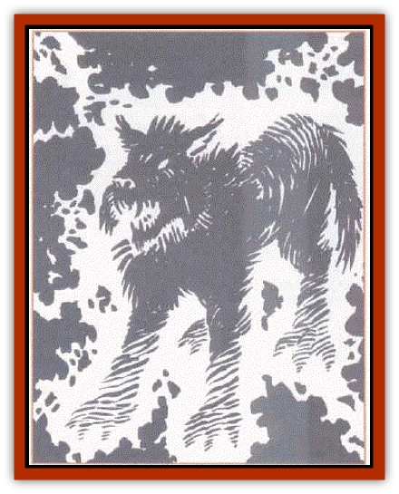

# Dog - Temporal

| Statistic | **Dog, Temporal** |
| --- | --- |
| **Activity Cycle:** | Any |
| **Alignment:** | Lawful neutral |
| **Armor Class:** | 3 |
| **Climate/Terrain:** | Demiplane of Time |
| **Damage/Attack:** | 1d8 |
| **Diet:** | Carnivorous |
| **Frequency:** | Uncommon |
| **Hit Dice:** | 4+1 |
| **Intelligence:** | Very (11-12) |
| **Magic Resistance:** | 10% |
| **Morale:** | Average (10) |
| **Movement:** | 18 |
| **No. Appearing:** | 1 (15%: 2-12) |
| **No. of Attacks:** | 1 |
| **Organization:** | Solitary or in packs |
| **Size:** | Medium (3-4' long) |
| **Special Attacks:** | Haste (see below) |
| **Special Defenses:** | Timeslip |
| **THAC0:** | 15 |
| **Treasure:** | Nil (W) |
| **XP Value:** | 375 |

Temporal dogs are a highly evolved form of [[Dog|blink dogs]] that make their home on the Demiplane of Time. It is impossible to tell whether the temporal abilities of these dogs are a difference engineered or bred by some ancient chronomancer or if the progression from blink dogs to temporal dogs was a case of natural evolution, but these canines do have a pleasant attitude toward wizards for some unknown reason.

Temporal dogs distinctly resemble their distant ancestors. They have short, yellow-brown hair, and they are stocky and muscular. They are slightly smaller than blink dogs, and they have apperently lost the power of teleportation, but they have developed other, more powerful abilities make up for that loss. They are another temporal creature that possesses the ability to slip to reality.

Temporal dogs communicate between themselves by complicated combinations of barks and growls, and they have a detailed knowledge of the layout of the surrounding timestream. Adventurers have taught these creatures to understand many languages, though they may feign ignorance so as to not have to deal too closely with strangers. A few of the friendlier ones can even bark out a close approximation of a dozen or so words.

**Combat:** Only a very hungry pack, or one that feels threatened, will attack adventurers. This deference to humans is a curiosity, but whatever the reason, it is not cowardice since these dogs are slightly more fierce than their ancestors. They have an ability to create *haste* (as if by *Artikus's melee manager*, not the *haste* spell). This gives them one extra attack per round, as well as the other bonuses, and the power can be used once per turn, the effect lasting for the turn's duration. They can also slip between the Demiplane of Time and reality, but in reality, they function as if 2 Hit Dice lower, and they lose their ability to *haste*, so they only do this to escape a threatening situation.

If a pack of temporal dogs loses one-third of its number or fails to bring down one person within five rounds, the dogs slip away. A solitary dog never attacks people - unless it is defending something - preferring to slip away if it feels at all threatened. Experience points are awarded if this creature stands and fights, or if the character can enlist its air for a period of greater than two weeks. Bribery or threats never hold a temporal dog this long. The character must prove worthy to the dogs loyalty within four days.

**Habitat/Society:** Temporal dogs prefer solitude over the pack, mostly due to the fact that there is sparse hunting on the Demiplane of Time. Whenever they are encountered, however, there is a 15% chance that they are running in a smaU pack (2d6) in order to take down a large creature that none of them could handle on their own.

Many characters have taken to feeding these creatures (and sometimes even offering them some sort of treasure) in order to gain their company for short periods. A friendly dog remains with the person or party for 14 days in the timestream. Fast as these creatures are, the group never has to worry ahout the temporal dogs slowing it down - quite the opposite, but the dogs do not seem to mind. The major benefit of having a temporal dog along on a trip is that the canine barks at any sort of unfriendly creature, warning companions of danger.

Temporal dogs make lairs within naturally occurring caves formed by event tangles in the lifelines, and it is here that they store their treasure and hide their precious pups. These dogs normally detect adventurers long before they reach a lair and draw them off in any way necessary. If a lair is discovered, there is a 10% chance for 2-8 pups and a 20% chance for other treasure to be there.

Pups can be raised to be loyal companions to a character, and their high intelligence makes them very useful or very troublesome, depending on how they are treated. The treasure could be anything of value, including magical weapons and armor, high quality merchandise, miscellaneous magic (including potions and scrolls), and of course gems and coins. Although the dogs have little need for this stuff, they know the value of trade. They acquire the material not by attacking passing travelers but by scouring the areas where battles between chronomancers and less friendly temporal creatures have been. Some predators care not for these items, so the dogs collect them for their own uses.

**Ecology:** Temporal dogs normally thrive on tempsynth, but packs sometimes go for a [[Temporal_Glider|temporal glider]] or [[Vortex_Spider|vortex spider]]. Hunger drives them to reality in search of food, hut only for short periods of time, Their frequency in reality is very rare.

---
## Discovery & Documentation

**Source Publication:** Monstrous Compendium, 1996 Annual, Volume 3 (1995)
**Campaign Setting:** Advanced Dungeons & Dragons 2nd Edition
**Author(s):** Jon Pickens

### Other Creatures Found in This Source Book
   * [[Alaghi|Alaghi]]
   * [[Alhoon|Alhoon]]
   * [[Aranea_Savage_Coast|Aranea (Savage Coast)]]
   * [[Arcane_Head|Arcane Head]]
   * [[Banedead|Banedead]]
   * [[Banelich|Banelich]]
   * [[Bat_Bonebat|Bat, Bonebat]]
   * [[Beetle|Beetle]]
   * [[Belgoi|Belgoi]]
   * [[Bladeling|Bladeling]]
   * [[Braxat|Braxat]]
   * [[Bunyip|Bunyip]]
   * [[Burbur|Burbur]]
   * [[Bvanen|Bvanen]]
   * [[Cat_Great_Snow_Tiger|Cat, Great, Snow Tiger]]
   * [[Chosen_One|Chosen One]]
   * [[Chronovoid|Chronovoid]]
   * [[Cildabrin|Cildabrin]]
   * [[Coffer_Corpse|Coffer Corpse]]
   * [[Disenchanter|Disenchanter]]
   * [[Dragon_Cerilia|Dragon (Cerilia)]]
   * [[Dragon_Ghost|Dragon, Ghost]]
   * [[Dragon_Lesser_Undead|Dragon, Lesser Undead]]
   * [[Dragon_Neutral_Amber|Dragon, Neutral, Amber]]
   * [[Dread_Warrior|Dread Warrior]]
   * [[Dreamweaver|Dreamweaver]]
   * [[Dream_Spawn_Greater_Ennui|Dream Spawn, Greater, Ennui]]
   * [[Dream_Spawn_Lesser_Morph|Dream Spawn, Lesser, Morph]]
   * [[Dwarf_Arctic|Dwarf, Arctic]]
   * [[Dwarf_Urdunnir|Dwarf, Urdunnir]]
   * [[Eel_Giant_Moray|Eel, Giant Moray]]
   * [[Elemental_Fire_Kin_Tome_Guardian|Elemental, Fire Kin, Tome Guardian]]
   * [[Elf_Rockseer|Elf, Rockseer]]
   * [[Ethyk|Ethyk]]
   * [[Faerie_Faerie_Fiddler|Faerie, Faerie Fiddler]]
   * [[Faerie_Petty_Bramble|Faerie, Petty, Bramble]]
   * [[Faerie_Petty_Gorse|Faerie, Petty, Gorse]]
   * [[Faerie_Petty|Faerie, Petty]]
   * [[Firenewt|Firenewt]]
   * [[Formian|Formian]]
   * [[Gargoyle_II|Gargoyle II]]
   * [[Giant_Cerilia|Giant (Cerilia)]]
   * [[Goblin_Cerilia|Goblin (Cerilia)]]
   * [[Golem_Magic|Golem, Magic]]
   * [[Golem_Shaboath|Golem, Shaboath]]
   * [[Hag_Bheur|Hag, Bheur]]
   * [[Hamadryad|Hamadryad]]
   * [[Hound_of_Ill-Omen|Hound of Ill-Omen]]
   * [[Human_Cerilia|Human (Cerilia)]]
   * [[Hybsil|Hybsil]]
   * [[Ibrandlin|Ibrandlin]]
   * [[Imp_Chaos|Imp, Chaos]]
   * [[Ixitxachitl_Ixzan|Ixitxachitl, Ixzan]]
   * [[Jabberwock|Jabberwock]]
   * [[Kyton|Kyton]]
   * [[Kyuss_Son_of|Kyuss, Son of]]
   * [[Lillend|Lillend]]
   * [[Life-Shaped_Creation_Guardian|Life-Shaped Creation, Guardian]]
   * [[Life-Shaped_Creation_Transport|Life-Shaped Creation, Transport]]
   * [[Lycanthrope_Werecrocodile|Lycanthrope, Werecrocodile]]
   * [[Lycanthrope_Werespider|Lycanthrope, Werespider]]
   * [[Magedoom|Magedoom]]
   * [[Manotaur|Manotaur]]
   * [[Mastiff_Shadow|Mastiff, Shadow]]
   * [[Meazel|Meazel]]
   * [[Mist_Scarlet_Dancer|Mist, Scarlet Dancer]]
   * [[Needleman|Needleman]]
   * [[Orc_Neo-Orog|Orc, Neo-Orog]]
   * [[Orc_Ondonti|Orc, Ondonti]]
   * [[Owlbear_II|Owlbear II]]
   * [[Pegataur|Pegataur]]
   * [[Phaerimm|Phaerimm]]
   * [[Reggelid|Reggelid]]
   * [[Render|Render]]
   * [[Saurial|Saurial]]
   * [[Scalamagdrion|Scalamagdrion]]
   * [[Sharn|Sharn]]
   * [[Snake_Messenger|Snake, Messenger]]
   * [[Spirit_Forest_Uthraki|Spirit, Forest, Uthraki]]
   * [[Spirit_Forest_Wood_Man|Spirit, Forest, Wood Man]]
   * [[Spirit_Ice_Orglash|Spirit, Ice, Orglash]]
   * [[Spirit_Rock_Thomil|Spirit, Rock, Thomil]]
   * [[Strider_Giant|Strider, Giant]]
   * [[Tembo|Tembo]]
   * [[Temporal_Glider|Temporal Glider]]
   * [[Temporal_Stalker|Temporal Stalker]]
   * [[Tether_Beast|Tether Beast]]
   * [[Thessalmonster|Thessalmonster]]
   * [[Time_Dimensional|Time Dimensional]]
   * [[Tomb_Tapper|Tomb Tapper]]
   * [[Undead_Dragon_Slayer|Undead Dragon Slayer]]
   * [[Unicorn_Black_Toril|Unicorn, Black (Toril)]]
   * [[Vaath|Vaath]]
   * [[Vortex_Spider|Vortex Spider]]
   * [[Weredragon|Weredragon]]
   * [[Zhentarim_Spirit|Zhentarim Spirit]]
