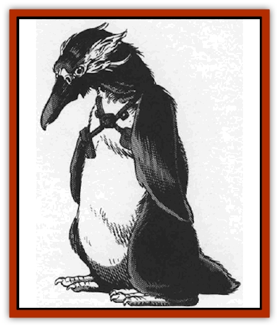

# Dohwar

| Statistic | **Dohwar** |
| --- | --- |
| **Activity Cycle:** | Any |
| **Alignment:** | Chaotic neutral |
| **Armor Class:** | 5 |
| **Climate/Terrain:** | Any |
| **Damage/Attack:** | 1d4 |
| **Diet:** | Omnivore |
| **Frequency:** | Common |
| **Hit Dice:** | 3 |
| **Intelligence:** | Average (10) |
| **Magic Resistance:** | Nil |
| **Morale:** | Irregular (7) |
| **Movement:** | 3, Sw 9 |
| **No. Appearing:** | 4-40 (90-180) |
| **No. of Attacks:** | 1 |
| **Organization:** | Cartel |
| **Size:** | S (4' tall) |
| **Special Attacks:** | Nil |
| **Special Defenses:** | Nil |
| **THAC0:** | 18 |
| **Treasure:** | H (Z) |
| **XP Value:** | 3 HD Salesman: 65 / 4 HD Merchant: 120 / 5 HD Protector: 175 / 6 HD Manager: 270 / 7 HD Executive Board Member: 420 / 9 HD President: 1,400 |

The dohwar are short, pudgy, flightless [[Bird|avians]] bearing a passing resemblance to penguins. They are shameless merchants, always looking for an opportunity to turn a profit. Since the [[Arcane|Arcane]] (otherwise knows as "Our Competitors") are considered the greatest merchants of wildspace, the dohwar try harder to displace them.

The average dohwar stands 4' tall. Black feathers cover most of its body, except for its chest, covered in white feathers. The dohwar has two wings that are useless for flight but have limited prehensile action, allowing it to grasp objects. Dohwar do not walk, they waddle. Their mode of dress is a garish mishmash of clashing clothes that would make an [[Aperusa|Aperusa]] blush. Amazingly, the dohwar have figured out that groundling civilizations may be disconcerted by their avian appearance. On these planets, the dohwar wear heavy hoods and cloaks and try to pass for short people.

Though the dohwar speak Common and their own tongue, they rely heavily on telepathic powers for communication among themselves. In fact, dohwar have pairings called "mergers", wherein two dohwar stay in mental rapport, even to the point of finishing each other's sentences. This drives other races crazy.

**Combat:** As a race, the dohwar are not fighters. They rely on others to do their fighting for them. Their philosophy towards combat is to tell their hired muscle, "Here's 500 more gold pieces. Keep attacking". Dohwar often hire [[Giff|Giff]] mercenaries.

The dohwar, with amazing foresight and awareness of harsh reality, know they cannot always depend on handy mercenaries. Thus they have Protectors, dohwars that are actually trained to fight. Protectors wield the "weega" a sword blade that fits over the dohwar's beak. This turns an otherwise ineffectual peck into a powerful sword thrust doing 1d6 damage to small and man-sized targets and 1d8 to larger victims.

Some protectors ride [[Space_Swine|space swine]], the winged pigs of the dohwar. The dohwar have even organized an elite air cavalry called the Deathsquealers. This cavalry is organized into squads of four Deathsquealer riders each. Besides the weega, riders carry light lances. Deathsquealers have the non-weapon proficiencies of land-based Riding, aerial Riding, Blindfighting, and Tumbling.

Only Protectors wear armor. They prefer bulky plate armor but carry no shields. The only drawback of the armor is its clumsiness; armored dohwar attack last in a combat round. Against all logic, even Deathsquealers wear this heavy, unwieldy armor. Fortunately, no similar suit exists for the space swine.

All dohwar have fangs, which they developed over the centuries to eat tough, exotic plants found on the many worlds of wildspace. These fangs, a last desperate defensive measure, do 1d2 damage.

The fangs are the only weapon that all non-protector dohwar have. Non-protector dohwar do not carry weapons nor wear armor.

**Habitat/Society:** Manager dohwar have either wizard or priest spells (50% chance each) and have reached 6th level. Managers cannot be specialist mages. Managers act as the spelljammers on merchant ships.

Executive Board members and Presidents have a similar spell arrangement. Use the dohwar's Hit Dice to determine its spellcasting level (e.g., a President casts spells as a 9th-level spellcaster). Spellcasters choose few combat spells and prefer defensive, divinatory, negotiation-enhancing, concealing. and especially healing spells. Dohwar hate pain.

There is one Merchant for every four dohwar encountered, one Manager for every 20, and one Executive Board member for every 40. For every five conventional dohwar encountered, there is one Protector. Rarely (5%) groups are composed entirely of Protectors. If more than eight Protectors are encountered, they are all Deathsquealers.

A "cartel" consists of 10d10 +80 dohwar, plus 10d4 x10 children. A cartel is run by a President, who is the final arbiter of all matters.

*Life-style:* Though the dohwar can live anywhere, they prefer arctic or sub-arctic climes near large bodies of water. They are monogamous and mate for life in a union called a "merger". The female lays 1d4 eggs ("new wares") annually. These mergers are telepathic; mates are in constant mental communication to an effective range of 10 miles. If one partner is slain, the other goes berserk, trying to kill everything in its path. The mental link takes one turn to forge and one round to break.

The dohwar's other mental power is *ESP* usable at will. A dohwar must rest one turn for every round that the power is used. Thus, if a dohwar activates its ESP for five turns of negotiations, it must spend live hours resting, using no mental ability. A dohwar can use mental powers for a maximum of two hours.

Dohwar eat fish, vegetables, and plankton. They are fond of strong drink, and alcohol does not intoxicate them. Sweets, on the other hand, are highly intoxicating; to a dohwar, one apple has the effect of strong beer, and a few tablespoons of honey or maple syrup get it blind drunk.

The dohwar worship powers associated with commerce, profits and wealth. The power's race or alignment is unimportant. Dohwar variously venerate Abbathor, the dwarven god of greed; the Realms' Waukeen, goddess of commerce; Krynn's Shinare, goddess of commerce; and Zilchus, Greyhawk's god of business and money. Though they love money, the dohwar are generous with religious contributions. Some speculate that they see such tithes as "cosmic investments", with the powers in return giving the dohwar a divine advantage in bargaining sessions.

*Personality:* Though the dohwar are chaotic neutral, this best describes their behavior to other races. Among themselves, they are surprisingly well organized and helpful. They feel (incorrectly) that the multiverse is out to get them, that everyone wants to see them go broke. Thus, despite their lust for wealth, they stick together and try not to sell each other short - at least not often.

The dohwar know few social skills, nor have they any interest in learning. They are obnoxious, brash, persistent, money grubbing merchants. Their standard way to do business is by pairing up against prospective customers and talking them into submission. Clients face a pair of fanged penguins who talk non-stop and finish each other's sentences. The merger recites a fast, lengthy list of goods for sale, interspersed with offers to purchase various objects on the client's person.

Dohwar wares are many and varied. Anything from the Player's Handbook may show up in a dohwar ship's hold, even things like wagons and small boats, as well as magical items, magical weapons, spell components, books, scrolled and potions. Gnomish inventions also clutter many a dohwar ship. There is an 80% chance to find any specific non-magical product on a dohwar ship. For magical items, consult the Treasure Type stats.

**Ecology:** The dohwar do not contribute to nor disrupt the ecological balance of wildspace.

There is a dohwar homeworld in the far reaches of wildspace, an arctic planet teeming with millions of dohwar, all wheeling and dealing. Thus far, no one has shown an interest in visiting or even learning its location.

---
## Discovery & Documentation

**Source Publication:** MC9 Spelljammer Appendix II (1991)
**Campaign Setting:** Planescape
**Author(s):** Scott Davis, Newton Ewell, John Terra

### Other Creatures Found in This Source Book
   * [[Alchemy_Plant|Alchemy Plant]]
   * [[Allura|Allura]]
   * [[Aperusa|Aperusa]]
   * [[Autognome|Autognome]]
   * [[Bionoid|Bionoid]]
   * [[Bloodsac|Bloodsac]]
   * [[Buzzjewel|Buzzjewel]]
   * [[Constellate|Constellate]]
   * [[Contemplator|Contemplator]]
   * [[Dragon_Moon|Dragon, Moon]]
   * [[Dragon_Stellar|Dragon, Stellar]]
   * [[Dragon_Sun|Dragon, Sun]]
   * [[Dreamslayer|Dreamslayer]]
   * [[Dweomerborn|Dweomerborn]]
   * [[Fal|Fal]]
   * [[Feesu|Feesu]]
   * [[Fire_Bat|Fire Bat]]
   * [[Firebird|Firebird]]
   * [[Firelich|Firelich]]
   * [[Flowfiend|Flowfiend]]
   * [[Gadabout|Gadabout]]
   * [[Gammaroid|Gammaroid]]
   * [[Gonn|Gonn]]
   * [[Gossamer|Gossamer]]
   * [[Grav|Grav]]
   * [[Great_Dreamer|Great Dreamer]]
   * [[Greatswan|Greatswan]]
   * [[Grell_Colonial|Grell, Colonial]]
   * [[Gullion|Gullion]]
   * [[Insectare|Insectare]]
   * [[Lhee|Lhee]]
   * [[Mercurial_Slime|Mercurial Slime]]
   * [[Meteorspawn|Meteorspawn]]
   * [[Monitor|Monitor]]
   * [[Owl_Space|Owl, Space]]
   * [[Pristatic|Pristatic]]
   * [[Scro|Scro]]
   * [[Selkie_Star|Selkie, Star]]
   * [[Silatic|Silatic]]
   * [[Skullbird|Skullbird]]
   * [[Sleek|Sleek]]
   * [[Sluk|Sluk]]
   * [[Space_Swine|Space Swine]]
   * [[Sphinx_Astro-|Sphinx, Astro-]]
   * [[Spirit_Warrior|Spirit Warrior]]
   * [[Starfly_Plant|Starfly Plant]]
   * [[Stargazer|Stargazer]]
   * [[Undead_Stellar|Undead, Stellar]]
   * [[Witchlight_Marauder|Witchlight Marauder]]
   * [[Xixchil|Xixchil]]
   * [[Yitsan|Yitsan]]
   * [[Zurchin|Zurchin]]
