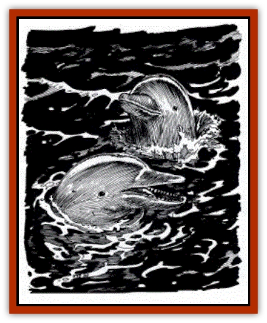

# Dolphin - Athas

| Statistic | **Dolphin (Athas)** |
| --- | --- |
| **Activity Cycle:** | Any |
| **Alignment:** | Any good |
| **Armor Class:** | 4 |
| **Climate/Terrain:** | Ocean (The Last Sea) |
| **Damage/Attack:** | 1d10 |
| **Diet:** | Carnivore |
| **Frequency:** | Uncommon |
| **Hit Dice:** | 3+3 |
| **Intelligence:** | Very (11-12) |
| **Magic Resistance:** | Nil |
| **Morale:** | Elite (13) |
| **Movement:** | Sw 30 |
| **No. Appearing:** | 1-10 |
| **No. of Attacks:** | 1 |
| **Organization:** | Pod |
| **Size:** | M (5-6' long) |
| **Special Attacks:** | Nil |
| **Special Defenses:** | Save as 5th-level fighter |
| **THAC0:** | 17 |
| **Treasure:** | Nil |
| **XP Value:** | 270 |

Just as on other worlds, [[Dolphin|dolphins]] on Athas are intelligent, seagoing mammals. But Athasian dolphins, however, do have a few unique differences. The skin of an Athasian dolphin is thicker than usual for other dolphins, and is entirely silvery white. The sun reflects brilliantly off its surface, keeping the dolphins cool during even the height of the day's heat. Few sights are more beautiful - or more rare - than a pod (school) of dolphins racing along the surface of the sea, arching in and out of the water in sparkling brilliance. The nose of an Athasian dolphin is a bit thicker and harder than that of a normal dolphin, a result of the species' constant war with Athasian sharks. A nose punch from an Athasian dolphin is potent.

Other than these differences, however, Athasian dolphins are much like other species. Their bodies are long, compact, and muscular. They have a large dorsal fin, a powerful tail, and a blowhole atop their heads. When near to one another, Athasian dolphins communicate via a series of high-pitched squeals, some of which are beyond the upper range of human hearing. When further apart, the dolphins use an innate telepathy to keep in constant contact.

**Combat:** While peaceful by nature, Athasian dolphins have grown to be more warlike than their ancestors, as a result of their ongoing war with the [[Shark_Athas|Athasian shark]] population. They generally attack other creatures only when threatened, but unless they are outnumbered at least two to one, dolphins will always attack sharks. Athasian dolphins fight as an organized unit, taking commands telepathically from a leader of their group. They are especially ferocious when protecting their young, doing anything necesssary - even sacrificing their own lives - to ensure the safety of the young. They make saving throws as 5th-level fighters.

In addition to their telepathic powers, all dolphins are psionic wild talents. They simply don't have the discipline for the formal study of full psionicists, but they use their natural mental abilities to fight for their pod.

**Habitat/Society:** Only a single dolphin species is found on Athas. Much of the knowledge about dolphin culture has been lost throughout the ages. The Athasian dolphins, appalled at the damage done to their precious ocean by younger races, have distanced themselves from other sentient creatures, whom they blamed for the despoilment of their shared environment.

Few Athasian dolphin survive, at least as far as is known. The survivors have vowed to carry on the great oral traditions of their people and act as a living legacy of those who have gone before them. Their telepathic abilities allow them to transmit memories to their progeny down through the generations.

**Ecology:** Athasian dolphins are both hunters and hunted. Their most typical foes are the Athasian sharks, although the ongoing conflict has only rarely broken into all-out war. Most times, the conflict remains clashes between small patrols that encounter each other more by happenstance than design.

Despite this conflict and other predators (such as the squidlike [[Squid_Squark|squark]]), the dolphin population thrives. They have generally refused to communicate with coastal races, beyond striking an implicit treaty of nonaggression. Thus, they are not often hunted by the humanoids, and in exchange, those somehow stranded in the middle of the sea might receive assistance from a friendly patrol of dolphins that will carry them back to the shore - if they're lucky enough to get there before the sharks do, of course.

On Athas, the dolphins cooperate a bit more readily with the [[Lizard_Man_Athas|Athasian lizard men]] population, although they only rarely talk to them about anything more than coordinating their defense efforts against the sharks. Still, upon a rare occasion, lizard men have even been seen riding on the backs of a group of dolphins, so as to travel quickly to a distant shore. The relationship is based on mutual respect, and the lizard men are careful not to abuse this privilege by using it overmuch.

A few human fishers have managed to strike up a friendship with these creatures, although the dolphins refuse to communicate with them telepathically in any but the most dire of times. Such rare people realize fully how lucky they are.

---
## Discovery & Documentation

**Source Publication:** Monstrous Compendium, 1997 Annual, Volume 4 (1995)
**Campaign Setting:** Advanced Dungeons & Dragons 2nd Edition
**Author(s):** Jon Pickens

### Other Creatures Found in This Source Book
   * [[Anemone_Giant_Sea|Anemone, Giant Sea]]
   * [[Asperii|Asperii]]
   * [[Bainligor|Bainligor]]
   * [[Beast_of_Chaos|Beast of Chaos]]
   * [[Blindheim|Blindheim]]
   * [[Bloodsipper_Far_Realm|Bloodsipper (Far Realm)]]
   * [[Bulette_Gohlbrorn|Bulette, Gohlbrorn]]
   * [[Child_of_the_Sea|Child of the Sea]]
   * [[Clockwork_Horror|Clockwork Horror]]
   * [[Clockwork_Swordsman|Clockwork Swordsman]]
   * [[Coral|Coral]]
   * [[Darklore|Darklore]]
   * [[Dharculus|Dharculus]]
   * [[Dragon_Neutral_Moonstone|Dragon, Neutral, Moonstone]]
   * [[Dragon_Prismatic|Dragon, Prismatic]]
   * [[Dream_Stalker|Dream Stalker]]
   * [[Dragon-kin_Albino_Wyrm|Dragon-kin, Albino Wyrm]]
   * [[Echyan|Echyan]]
   * [[Firestar|Firestar]]
   * [[Firetail|Firetail]]
   * [[Fish_Ascallion|Fish, Ascallion]]
   * [[Fish_Deep_Ocean|Fish, Deep Ocean]]
   * [[Fish_Tropical|Fish, Tropical]]
   * [[Fish_Vurgens|Fish, Vurgens]]
   * [[Fogwarden|Fogwarden]]
   * [[Fraal|Fraal]]
   * [[Giant_Crag|Giant, Crag]]
   * [[Gibberling_Brood|Gibberling, Brood]]
   * [[Glutton_Sea|Glutton, Sea]]
   * [[Golden_Ammonite|Golden Ammonite]]
   * [[Golem_Brass_Minotaur|Golem, Brass Minotaur]]
   * [[Golem_Gemstone|Golem, Gemstone]]
   * [[Golem_Maggot|Golem, Maggot]]
   * [[Groundling|Groundling]]
   * [[Hermit_Sea|Hermit, Sea]]
   * [[Hound_of_Law|Hound of Law]]
   * [[Human_Amazon|Human, Amazon]]
   * [[Human_Pygmy|Human, Pygmy]]
   * [[Inquisitor|Inquisitor]]
   * [[Kercpa|Kercpa]]
   * [[Kreel|Kreel]]
   * [[Lycanthrope_Lythari|Lycanthrope, Lythari]]
   * [[Mercurial|Mercurial]]
   * [[Mold_Chromatic|Mold, Chromatic]]
   * [[Mummy_Bog|Mummy, Bog]]
   * [[Neh-thalggu|Neh-thalggu]]
   * [[Nymph_Grain|Nymph, Grain]]
   * [[Nymph_Unseelie|Nymph, Unseelie]]
   * [[Octopus_Octo-Jelly|Octopus, Octo-Jelly]]
   * [[Puddingfish|Puddingfish]]
   * [[Sea_Demon|Sea Demon]]
   * [[Shade|Shade]]
   * [[Shadowrath|Shadowrath]]
   * [[Shark_Athas|Shark (Athas)]]
   * [[Siren_Ravenloft|Siren (Ravenloft)]]
   * [[Skeleton_Variant|Skeleton, Variant]]
   * [[Skyfish|Skyfish]]
   * [[Spectral_Scion|Spectral Scion]]
   * [[Spyder_Fiend|Spyder Fiend]]
   * [[Squid_Squark|Squid, Squark]]
   * [[Tanar'ri_Lesser_Uridezu|Tanar'ri, Lesser, Uridezu]]
   * [[Troll_Mutate|Troll Mutate]]
   * [[Vaati|Vaati]]
   * [[Vampire_Cerebral|Vampire, Cerebral]]
   * [[Varkha|Varkha]]
   * [[Wizshade|Wizshade]]
   * [[Worm_Lukhorn|Worm, Lukhorn]]
   * [[Wyste|Wyste]]
   * [[Yugoloth_Lesser_Gacholoth|Yugoloth, Lesser, Gacholoth]]
   * [[Zombie_Mud|Zombie, Mud]]
