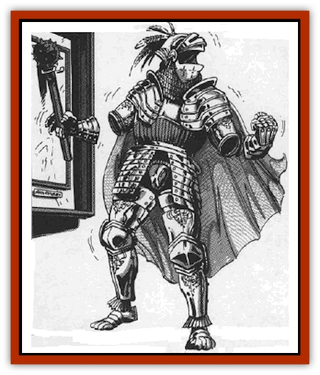
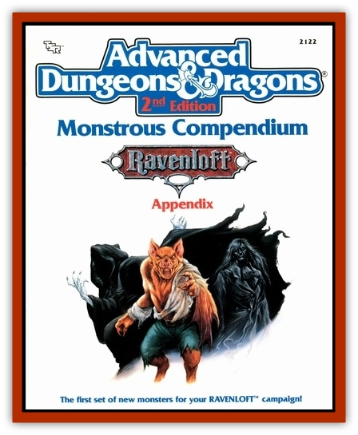

# Doom Guard

| Statistic | **Doom Guard** |
| --- | --- |
| **Activity Cycle:** | Any |
| **Alignment:** | Neutral |
| **Armor Class:** | 2 |
| **Climate/Terrain:** | Any castle or ruin |
| **Damage/Attack:** | 1d8 (by weapon) |
| **Diet:** | Nil |
| **Frequency:** | Rare |
| **Hit Dice:** | 5 |
| **Intelligence:** | Low (5-7) |
| **Magic Resistance:** | Nil |
| **Morale:** | Fearless (20) |
| **Movement:** | 9 |
| **No. Appearing:** | 1-6 |
| **No. of Attacks:** | 1 |
| **Organization:** | Solitary |
| **Size:** | M (6' tall) |
| **Special Attacks:** | Nil |
| **Special Defenses:** | See below |
| **THAC0:** | 15 |
| **Treasure:** | Nil |
| **XP Value:** | 2,000 |

Originally nothing more than a suit of armor, the doom guard is now an animated creature similar in nature to a [[Golem_General_Information|golem]]. Created by a series of arcane enchantments, these frightening automatons are often used as guards in the castles and towers of those who create them. Doom guards are found in both western and eastern (oriental) styles as well as a variety of others.

Doom guards never speak and, thus, have no language of their own. They are able to obey simple commands from their creator, but these are generally limited to one or two rudimentary concepts. Typical orders include "stay in this room and attack anyone but me who enters" or "kill anyone who opens this chest until I tell you otherwise".

**Combat:** The doom guard is an unsubtle and straightforward opponent. When their instructions call for them to engage in combat, they simply move toward their intended target and strike with their weapons. Subtle planning can often enable a party to outwit doom guards without having to battle them one-on-one. Most doom guards are armed with some manner of sword, axe, or bludgeon. In almost every case their blows with these weapons will inflict 1-8 (1d8) points of damage. In rare cases (about 1 in 10), they are equipped with heavier or lighter weapons (50% chance of either) and can inflict 1d10 or 1d6 points of damage respectively.

Doom guards are not undead, although they are often mistaken for creatures of this type. They cannot be turned or affected by spells that are intended for use against the living dead (*control undead*, etc.)

Spells such as *charm*, *hold*, *sleep*, or other mind affecting magics have no power over doom guards because of their mindless nature. Similarly, the fact that they are not true living beings makes them immune to spells that depend on biological function (*cause light wounds* or *cause blindness*, for example). For like reasons, poisons do not harm them.

Heat- and cold-based attacks inflict only half damage to doom guards, with successful saving throws (when applicable) indicating that no harm is done. Lightning- or electricity-based spells inflict full damage when used against these unnatural foes. A *transmute metal to wood* or *crystalbrittle* spell is instantly fatal to doom guards, transforming them and destroying the delicate balances of the spells that keep them animated.

**Habitat/Society:** Clearly, doom guards are not natural creatures and have no society. They dwell only in those places where they have been created and stationed and have no means of reproducing themselves.

**Ecology:** The creation of a doom guard is an interesting process, for it runs contrary to the idea of an "enchanted suit of armor". The reason for this is simply that the suit of armor is never actually subjected to a spell cast directly upon it. Rather, the doom guard is fashioned using an enchanted *anvil of darkness*, and it is this device that gives the creature its magical aura.

The first step in the creation of an *anvil of darkness* is the building of the anvil itself. The raw materials used in the creation of this object must be attained from the body of a slain [[Golem_I_Greater_Golem|iron golem]]. When the anvil is cast, it must have either a *scarab versus golems* (of any type) or a pristine, unread *manual of golems* set at its heart. Before the hot metal of the anvil cools, it must be enchanted by a powerful wizard. The first step in this enchantment is the weaving of an *enchant an item* spell over the anvil to make it ready for further wizardry. A *fabricate* spell is cast next, in order to give the anvil the creative essence that will be so important to it in later years. Subsequently, a *binding* spell is employed to capture the last essence of the spirit that once animated the anvil in its iron golem form. Finally, a *permanency* spell is used to bind these magics into a single, cohesive enchantment that will enable the anvil to carry out its function.

Once the *anvil of darkness* is created, it can be used by a skilled armorer to create one doom guard every 20 weeks. Once work on a specific doom guard is begun, the armorer must work at least 8 hours out of 24 on his creation. Work cannot be halted or delayed for any reason or the enchanting process fails.

---
## Discovery & Documentation

**Source Publication:** MC10 Ravenloft Appendix I (1989)
**Campaign Setting:** Planescape
**Author(s):** William W. Connors

### Other Creatures Found in This Source Book
   * [[Bastellus|Bastellus]]
   * [[Bat_Ravenloft|Bat (Ravenloft)]]
   * [[Bowlyn|Bowlyn]]
   * [[Broken_One|Broken One]]
   * [[Bussengeist|Bussengeist]]
   * [[Darkling|Darkling]]
   * [[Doppelganger_Plant|Doppelganger Plant]]
   * [[Elemental_Ravenloft|Elemental (Ravenloft)]]
   * [[Ermordenung|Ermordenung]]
   * [[Ghoul_Lord|Ghoul Lord]]
   * [[Goblyn|Goblyn]]
   * [[Golem_III|Golem III]]
   * [[Golem_IV|Golem IV]]
   * [[Golem_Ravenloft|Golem (Ravenloft)]]
   * [[Grim_Reaper|Grim Reaper]]
   * [[Human_Abber_Nomad|Human, Abber Nomad]]
   * [[Human_Ravenloft|Human (Ravenloft)]]
   * [[Imp_Assassin|Imp, Assassin]]
   * [[Impersonator|Impersonator]]
   * [[Lycanthrope_Werebat|Lycanthrope, Werebat]]
   * [[Lycanthrope_Wereraven|Lycanthrope, Wereraven]]
   * [[Mist_Horror|Mist Horror]]
   * [[Mummy_Greater|Mummy, Greater]]
   * [[Quevari|Quevari]]
   * [[Quickwood|Quickwood]]
   * [[Ravenkin|Ravenkin]]
   * [[Reaver|Reaver]]
   * [[Scarecrow_Ravenloft|Scarecrow (Ravenloft)]]
   * [[Shadow_Fiend|Shadow Fiend]]
   * [[Skeleton_Giant|Skeleton, Giant]]
   * [[Strahd's_Skeletal_Steed|Strahd's Skeletal Steed]]
   * [[Treant_Evil|Treant, Evil]]
   * [[Treant_Undead|Treant, Undead]]
   * [[Valpurgeist|Valpurgeist]]
   * [[Vampire_Dwarf|Vampire, Dwarf]]
   * [[Vampire_Elf|Vampire, Elf]]
   * [[Vampire_Gnome|Vampire, Gnome]]
   * [[Vampire_Halfling|Vampire, Halfling]]
   * [[Vampire_General_Information|Vampire, General Information]]
   * [[Vampire_Kender|Vampire, Kender]]
   * [[Vampyre|Vampyre]]
   * [[Widow_Red|Widow, Red]]
   * [[Wolfwere_Greater|Wolfwere, Greater]]
   * [[Zombie_Lord|Zombie Lord]]
