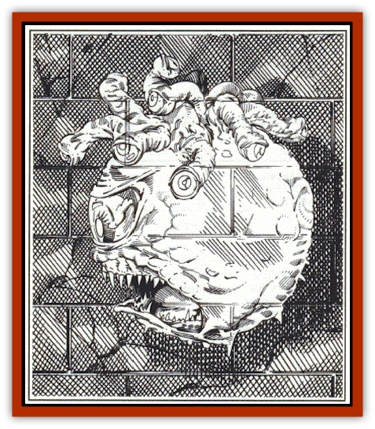

# Doomsphere - Ghost Beholder

| Statistic | **Doomsphere (Ghost Beholder)** |
| --- | --- |
| **Activity Cycle:** | Any |
| **Alignment:** | Lawful evil |
| **Armor Class:** | -1/1/6 |
| **Climate/Terrain:** | Any land |
| **Damage/Attack:** | 3d4 |
| **Diet:** | Nil |
| **Frequency:** | Very rare |
| **Hit Dice:** | 12 |
| **Intelligence:** | Exceptional (15-16) |
| **Magic Resistance:** | Special |
| **Morale:** | Fanatic (18) |
| **Movement:** | Fl 6 (A) |
| **No. Appearing:** | 1 |
| **No. of Attacks:** | 1 + 10 special |
| **Organization:** | Solitary |
| **Size:** | M (4'-6' diameter) |
| **Special Attacks:** | Eyestalk magic |
| **Special Defenses:** | Anti-magic ray |
| **THAC0:** | 9 |
| **Treasure:** | I,S,T |
| **XP Value:** | 16,000 |

A few beholders employ magical items or hired spellcasters to prepare against their own deaths. Their magical natures thwart such attempts, usually causing a wild magic explosion (treat as 1d4 simultaneous *wand of wonder* discharges) at a beholder's death - but a few enchantments are powerful and clever enough to prevent death, forcing the beholder into undeath. These beholders become doomspheres.

**Combat:** In battle, a doomsphere attacks with eyestalk powers and bite (its rending teeth changed to a chilling maw that saps both hit points and 1 point of Strength-unless a victim saves vs. death magic each time bitten). Doomspheres turn as "Special," and can be hit only by + 1 or better magic weapons, or by beings with magical powers or 6 or more Hit Dice. They are immune to *charm*, cold-based, *death* (and related), *disintegrate*, *electricity*, *enfeeblement*, *feeblemind*, *hold* (and related), insanity, and *sleep* spells. They are allowed two saving throws per round against magical attack (if only one attack comes, they get two chances to save.) Additional attacks in the same round aren't blocked; against them, a doomsphere has no magic resistance and no saving throw. A doomsphere's save vs. magic is 7 on a d20. Doomspheres never have psionic powers, but are allowed saves against all psionic attacks, of 9 on a d20.

A doomsphere cannot speak (though it can hear, read, and write). Its central eye retains the 90-degree arc anti-magic ray (all magic ceases to function in its conical area of effect, which extends outwards for 90'; spells cast within it, or passing through it, automatically fail) . The eyestalk powers of (1) *fear* (as a wand), and (2) slow(lasts 1d4 + 1 rounds) are also retained from life. The powers of the other eyes alter to 110' long, 4' diameter beams (the doomsphere must roll a successful attack to strike):

**3. Chill ray:** deals 2d6 damage (drains vitality rather than being cold-based; ineffective against undead; if victim saves vs. spell, only 1d6 damage is taken).

**4. Hold being:** Acts against one creature; effects last for 1d4 + 1 rounds, and work against undead. If victim saves, acts as *slow*.

**5. Enervation** As wizard spell; drains 1d4 levels, lasts 1d4 hours.

**6. Animate dead** As 12th-level wizard using wizard spell.

**7. Withering** Does 2d8 + 1 hp damage, and makes a limb shrivelled and useless for any purpose 4d4 turns.

**8. Boneshatter** This attack breaks some of the bones or chitin of a creature, dealing damage and reducing movement to half rate - flying creatures lose one Maneuverability Class rating per boneshatter attack that lands. The victim is allowed a saving throw to take only 2d6 damage. Creatures who fail their save take 3d6 damage on the first round, and a further 1d8 on the next round, as the broken bones do their own internal damage. This attack is ineffective against gaseous or insubstantial creatures.

**9. Flesh sear** Victim must save to avoid all effects except 1d4 hp loss. If save fails-, victim takes 3d8 damage as tissue is magically eaten away to bare bone somewhere on body. A system shock roll must be made, and victim must save vs. poison or senses are impaired for 3d8 turns by literal loss of face.

**10. undeath assault** Beam strikes single victim as an invisible ramming force. Victim takes 1d4 + 1 battering damage and must make a Strength check or fall down/be driven back, with forced saving throws for fragile worn or carried items.

**** The undead nature of a doomsphere makes its body harder to strike, but eyestalks (AC 1) are still easier to damage than the central body, and the eyes themselves even more vulnerable (AC 6). Directly striking the insubstantial mote of undeath that is an eye causes an instant eye-power discharge (if done by direct physical attack, attacker cannot avoid it, but is allowed whatever saving throw usually applies), but renders that eye functionless for 1d6 days. Smiting any eyestalk for more than 12 hp of damage causes the eye-power to cease for 5d6 turns.

**Habitat/Society:** Doomspheres avoid others of their own kind. Elminster has seen only one direct battle between doomspheres with conflicting aims; it ended in mutual destruction, amid a "spellstorm" of wild magic discharges.

**Ecology:** Doomspheres serve no master, eat nothing, and have as enemies only beings they choose to destroy, or who are foolish enough to attack them. They avoid wanton destruction, and often act to aid primitive tribes who worship them.

---
## Discovery & Documentation

**Source Publication:** The Ruins of Myth Drannor Box Set (1993)
**Campaign Setting:** Forgotten Realms
**Author(s):** Jeff Grubb, Ed Greenwood, Julia Martin, Karen S. Boomgarden, Arnie Sweikel, John Statema

### Other Creatures Found in This Source Book
   * [[Aratha_Killer_Beetle|Aratha (Killer Beetle)]]
   * [[Baelnorn|Baelnorn]]
   * [[Blazing_Bones|Blazing Bones]]
   * [[Dragon_Electrum|Dragon, Electrum]]
   * [[Dragon_Fang|Dragon, Fang]]
   * [[Dread|Dread]]
   * [[Feystag|Feystag]]
   * [[Lythlyx|Lythlyx]]
   * [[Magebane|Magebane]]
   * [[Metalmaster|Metalmaster]]
   * [[Naga_Bone|Naga, Bone]]
   * [[Ormyrr|Ormyrr]]
   * [[Windghost|Windghost]]
   * [[Xantravar|Xantravar]]
   * [[Xaver|Xaver]]
