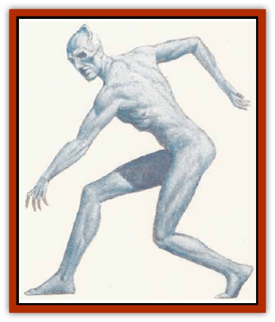

# Doppelganger - Greater

| Statistic | **Doppelganger, Greater** |
| --- | --- |
| **Activity Cycle:** | Any |
| **Alignment:** | K,L,M (G,U&times;3) |
| **Armor Class:** | 2 |
| **Climate/Terrain:** | Any |
| **Damage/Attack:** | 1d12/1d12 |
| **Diet:** | Omnivore |
| **Frequency:** | Very rare |
| **Hit Dice:** | 9 |
| **Intelligence:** | Exceptional to Genius (15-18) |
| **Magic Resistance:** | See below |
| **Morale:** | Fanatic (17-18) |
| **Movement:** | 12 |
| **No. Appearing:** | 14 |
| **No. of Attacks:** | 2 |
| **Organization:** | Solitary |
| **Size:** | M-L (varies) |
| **Special Attacks:** | See below |
| **Special Defenses:** | See below |
| **THAC0:** | 11 |
| **Treasure:** | Neutral evil |
| **XP Value:** | 4,000 |

Common [[Doppelganger|doppelgangers]] can easily mimic the forms of humans, demihumans, and humanoids, but their grearer cousins, sometimes  called "mirrorkin", in ancient texts, have augmented those abilities to the point of perfection, allowing these shapechangers to adopr the exact fnrms and identities of several humans or humanoids, switchmg between them at will.

Like its relarive, the greater doppelganger is a bipedal humanoid with a tough, hairless grav hide that maintains its toughness regardless of the disguise (granting a minimum AC of 2). The greater doppelganger is faster and more agile than a common doppelganger.

**Combat:** This monster can assume the shape of any humanoid creature between four and eight feet in height, just as a common doppelganger. Greater doppelgangers have full powers of *ESP* and *telepathy*, which allow them to peer deeper into the minds of intended victims, and assume forms that are disarming to their prey; once the victim is off-guard, the greater doppelganger takes its prey in its arms and stabs the victim in the back with its claws. Some of these shapechangers take care to shape their claws so thc wounds inflicted, which still deal the same damage, appear to be deep dagger or sword thrusts.

If the greater duppelganger ingests the brain of the prey, the doppleganger can absorb the entire mind and personality of the prey for later use.

Greater doppclgangers also have another advantage over their lesser relatives - enhanced intelligence and imagination. As a result, they can create totally unique face and body without imitation. This aids them in escaping into crowds, randomly shifting clothes and faces around each corner.

Greater doppelgangers are immune to *sleep*, *charm*, and *hold* spells. They are likewise immune to any magics that detect alignment. Disguised greater doppelgangers can only be revealed by use of the *true seeing* spell or equivalent; their mental and phvsical disguises are even able to fool most psionics.

Their saving throws are those of 18th-level fighters.

**Habitat/Society:** Greater doppelgangers tend to lead any collection of their kind with whom they live. Others live alone or replace those whose minds and personalities they have absorbed. While greater doppelgangcrs may ally with others, they generally refuse to be controlled or led by anyone or any creature other than one of their own.

The greater doppelganger can absorb the mind and personality of any person whose brain it has eaten. After this, the greater doppelganger can assume that person's form with 100% accuracy, complete with the person's memories, abilities, and alignment; these are active whenever the shapechanger takes that particular form. When the form is worn, the greater doppleganger has all of the victim's physical, mental, and magical abilities (though not priestly granted abilities, or spells above 2nd level, since these are bestowed); greater doppelgangers can even absorb the identities of paladins, though all healing and special abilities beyond fighting skills are lost. Greater doppelgangers can absorb up to eight separate and distinct identities; if they attempt to absorb more identities beyond that, there is a 50% chance that one of the creature's absorbed identities will be lost in favor of the new one.

If the doppelganger has to perform actions that run counter to its form's alignment, it must change form or be immediately forced into its base form for 1-10 rounds. In its base form, it has limited access to all the memories of its identities (use of known languages, general information); the greater doppelganger is incapable of manifesting one person's identity when in another person's form. Regardless of its form, a greater doppelganger can use magical items, provided it knows how they function.

**Ecology:** The greater doppelgangers are sophisticated and clever. With their abilities to permanently adopt certain identities, their plans and goals often go beyond simple hunting or larceny. They can often penetrate social and political power groups without arousing suspicion.

The bearing of offspring (a rare event) requires a greater doppleganger to remain in female form for the entire term, or the unborn offspring will die.

---
## Discovery & Documentation

**Source Publication:** City of Splendors (1994)
**Campaign Setting:** Forgotten Realms
**Author(s):** Ed Greenwood, Elain Cunningham

### Other Creatures Found in This Source Book
   * [[Curst|Curst]]
   * [[Duhlarkin|Duhlarkin]]
   * [[Gulguthhydra|Gulguthhydra]]
   * [[Hakeashar|Hakeashar]]
   * [[Leucrotta_Greater|Leucrotta, Greater]]
   * [[Lycanthrope_Wereshark|Lycanthrope, Wereshark]]
   * [[Nyth|Nyth]]
   * [[Ooze_Slime_Jelly_Ghaunadan|Ooze/Slime/Jelly, Ghaunadan]]
   * [[Palimpsest|Palimpsest]]
   * [[Peltast|Peltast]]
   * [[Raggamoffyn|Raggamoffyn]]
   * [[Shadowrath|Shadowrath]]
   * [[Snake_Sewerm|Snake, Sewerm]]
   * [[Watchspider|Watchspider]]
