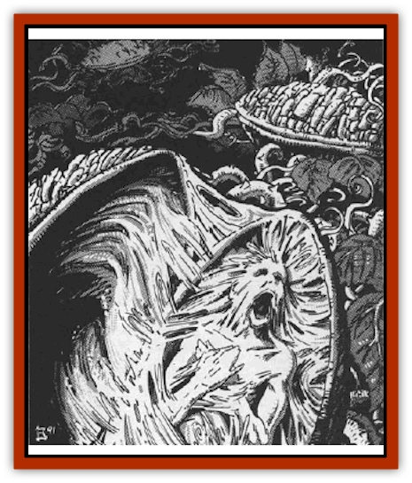

# Doppelganger Plant

| Statistic | **Doppelganger Plant** | **Podling** |
| --- | --- | --- |
| **Activity Cycle:** | Any | Any |
| **Alignment:** | Chaotic evil | Chaotic evil |
| **Armor Class:** | 10 (vines) or 6 (pods) | Varies |
| **Climate/Terrain:** | Any warm, temperate land | Any warm, temperate land |
| **Damage/Attack:** | Nil | Varies |
| **Diet:** | Special | Nil |
| **Frequency:** | Very rare | Very rare |
| **Hit Dice:** | 11 to 18 | Varies |
| **Intelligence:** | Genius (17-18) | Genius (17-18) |
| **Magic Resistance:** | Nil | Varies |
| **Morale:** | Fanatic (17-18) | Fanatic (17-18) |
| **Movement:** | Nil | Varies |
| **No. Appearing:** | 1 or 2 | 1-20 |
| **No. of Attacks:** | 1 | Varies |
| **Organization:** | Patch | Band |
| **Size:** | G (10' wide/hp) | M (6' tall) |
| **Special Attacks:** | Mind bondage | Varies |
| **Special Defenses:** | See below | Varies |
| **THAC0:** | Nil | Varies |
| **Treasure:** | Nil | Varies |
| **XP Value:** | 25,000 | Varies |

The origins of this horrific plant are utterly unknown, as is much important information about it. The reasons for this are numerous, but center around the difficulty of coming into contact with the creature to study it and living to record one's observations.

In appearance, the doppelganger plant looks much like any of a variety of melon-bearing crops. It spreads out in a tangle of vines and broad, glossy leaves. Scattered throughout its mass are a number (1 per Hit Die) of pods, each measuring between four and eight feet long. These pods are the source of the wicked creature's intelligence. They also serve as its main form of self defense as they are able to dominate the minds of others and make them serve the plant's will.

The doppelganger plant cannot communicate with those it does not control, but is able to instantly exchange information and instructions with those it has taken over. In this manner, the doppelganger plant knows and experiences all that its minions do and see.

**Combat:** The doppelganger plant itself is unable to attack or defend itself except with its unusual *mind bondage* power. Thus, in physical combat, it depends on its minions to fight for it.

Doppelganger plant patches are unusually resistant to fire and lightning, suffering only half damage from all flame- or electricity-based attacks. Cold-based attacks do normal damage, as do most other forms of magical attack. Weapons employed against the plant's vines and leaves inflict but 1 point of damage per successful attack roll, but those directed against the pods themselves inflict normal damage.

Only 20% of the creature's hit points are represented by the tangle of vines and leaves that makes up the majority of its mass. The remaining hit points are divided evenly between each of its pods. Destruction of all the hit points in the vines does not kill the plant, but gives it the appearance of being slain. Conversely, destruction of the pods without the elimination of the vines and leaves will not kill the plant either. Thus, many doppelganger plants that are left for dead eventually sprout up again, to reap their harvest of horror anew.

Once each round, the doppelganger plant can attempt to use its *mind bondage* power on any sleeping or unconscious creature within a 1 mile per Hit Die radius of its patch. The intended victim is located via mystical means and the plant need not be able to see its target; neither does the plant have to be aware of its victim's existence prior to the use of this power. Although this power may be employed any number of times per day, only one new slave may be obtained in a given 24 hour period. Thus, once the plant has taken control of another creature, it cannot dominate a second being for at least one full day.

The *mind bondage* power of the doppelganger plant acts much like a combined *trap the soul* and *domination* spell. Victims of the *mind bondage* attack are entitled to a saving throw vs. spells to avoid its effects. Success indicates that they have escaped the influence of the doppelganger plant but are aware that something evil has just tried to attack their minds. Elves and half-elves have the same resistance to this power that they do to *charm* spells as do all other races with similar defenses. Those who fail their saving throws become podlings (see below). Once a being becomes a podling, it can go anywhere (even crossing over to another plane or existence) and still be in instant contact with and under the absolute control of the plant that created it.

A podling is created when the life force of a being under *mind bondage* is drawn into one of the plant's pods, where it remains until that pod is destroyed. The number of hit points that a given pod has is determined as described above, and any pod that is destroyed will release the soul trapped within it. Freed spirits will attempt to return to their bodies. This can be done only if the body has not been slain or destroyed and requires the character in question to make a resurrection survival check. This counts toward the number of times a character can be resurrected and is handled in all ways as if it were an actual resurrection attempt. A successful return to the body leaves the character dazed and helpless for roughly one hour while he throws off the effects of the imprisonment.

**Habitat/Society:** Doppelganger plants are found only in warm, moist climates and generally appear after some form of prediction of doom (usually an inauspicious comet or meteor shower) has shown itself in the heavens. The connection between these two events has never been fully understood.

The doppelganger plant seems to feed upon its podlings and thus is constantly seeking new ones to enslave. Because there is no range restriction on the plant's power to control its minions, it will often send them abroad in an effort to lure more victims into its grasp. It is not unknown for whole towns to fall beneath the shroud of evil that one of these creatures spreads.

In cases where more than one plant is encountered, they will often cooperate. These highly intelligent creatures have never been known to turn against each other, despite their foul alignments. A pair of doppelganger plants working in concert will often use their agents in seemingly conflicting roles to keep potential victims off balance until they can be defeated.

Doppelganger plants have been know to allow some of their minions to be destroyed without true resistance. In much the same way that a masterful chess player will sacrifice a pawn to take a more valuable piece, the doppelganger plant will often arrange for one of its lesser minions to be lost in order to improve the position of one of its other puppets. ("Don't be silly, Derodd can't be a podling - she's the one who discovered that two of the town guards were acting under mind bondage, remember?")

**Ecology:** Doppelganger plants sustain themselves by drawing away the vital essences of their podlings (see below). They require nothing else (not even sunlight or water) to survive. Their appearance only in warm and temperate regions remains a mystery, but may be linked more to reasons of mental need.

The sap from a doppelganger plant's vines as well as the flesh from the inside of its pods have both proven to be useful in the creation of magical potions and devices that influence the minds of others in some way. In many cases, the latter material results in the creation of magical powers twice as great as those found in devices crafted with other materials. Thus, a *potion of human control* created with the heart of a doppelganger pod allows the imbiber to control a total of no less than 64 levels or Hit Dice worth of humans or demihumans.

**Podlings**

  These tragic creatures are the victims of a doppelganger plant's *mind bondage* spell. In addition to providing the plant with nourishment at the cost of their own life essences, podlings also act as the plant's eyes and hands. Although podlings are mentally dominated by the plants they serve, their actions are in no way stiff or unnatural. Any casual observer will almost certainly assume that there is nothing unusual about the podling.

A podling retains all knowledge and abilities it had in its previous existence, but now serves the needs of the doppelganger plant exclusively. It is no longer alive in the sense that it once was. Any basic medical check will reveal that there is no respiration (except as needed to speak or smell), no heart beat, and no response of the pupils to light. Similarly, podlings have no need (or desire) to eat, drink, or sleep. It is through these differences that they are most often found out when they move among men. However, the average person has only a 10% chance per hour spent with the podling of noticing anything amiss about it. Even then, only those who knew the individual before it was enslaved have a chance of detecting something specifically wrong. ("Derodd didn't want any chocolates? Strange, I've *never* known her to turn one down before.")

In addition, podlings usually weigh far less than they did when they were "alive". This factor can be accidentally or purposefully discovered by those with whom a podling comes into contact. Starting 24 hours after it has been placed under mind bondage by the doppelganger plant, a podling will begin to waste away. They will lose 1d4 hit points a day as the plant feeds upon their essences. This wasting occurs at the center of the body and gradually works its way outward with all manner of tissues, bones, and bodily fluids being consumed. When the podling finally dies from the feedings of its master, it will be nothing more than a hollow shell of flesh with some muscle tissue and subcutaneous fat. The creature gradually becomes lighter as more and more of its mass is absorbed by the plant. Thus, for every 25% of its hit points lost to the plant, the podling weighs 20% less than it did before its transformation. A 200 pound man would, therefore, be reduced to a shell weighing only 40 pounds (20% of its original weight) when it finally died.

Anyone fighting a podling with a slashing or piercing weapon has a 5% chance per hit point inflicted upon it of noticing that there is something unusual about the creature. Following that, there is a 10% chance per point of damage inflicted on subsequent rounds of discovering that the podling is partially hollowed out. If the attacker has no reason to suspect that this is the case, he will be forced to make a horror check as soon as the truth about the creature is uncovered. Any examination of the corpse of a podling who has been killed with such weapons will instantly reveal the nature of the beast.

When called upon to defend the doppelganger plant, the podling will not hesitate. It draws upon all of the knowledge and power it had prior to its transformation (including spells, special abilities, or familiarity with the enemy's tactics, weaknesses. and capabilities) to defeat the enemies of the plant. Thus, the actual statistics used for an individual podling will vary greatly. Most, however, are ordinary men, women, and demihumans who have fallen under the influence of the evil doppelganger plant.

Podlings will often lure unsuspecting victims within range of the plant's mind bondage spell. They will then attempt to knock the victims unconscious or convince them to sleep so that new podlings can be created.

---
## Discovery & Documentation

**Source Publication:** MC10 Ravenloft Appendix I (1989)
**Campaign Setting:** Planescape
**Author(s):** William W. Connors

### Other Creatures Found in This Source Book
   * [[Bastellus|Bastellus]]
   * [[Bat_Ravenloft|Bat (Ravenloft)]]
   * [[Bowlyn|Bowlyn]]
   * [[Broken_One|Broken One]]
   * [[Bussengeist|Bussengeist]]
   * [[Darkling|Darkling]]
   * [[Doom_Guard|Doom Guard]]
   * [[Elemental_Ravenloft|Elemental (Ravenloft)]]
   * [[Ermordenung|Ermordenung]]
   * [[Ghoul_Lord|Ghoul Lord]]
   * [[Goblyn|Goblyn]]
   * [[Golem_III|Golem III]]
   * [[Golem_IV|Golem IV]]
   * [[Golem_Ravenloft|Golem (Ravenloft)]]
   * [[Grim_Reaper|Grim Reaper]]
   * [[Human_Abber_Nomad|Human, Abber Nomad]]
   * [[Human_Ravenloft|Human (Ravenloft)]]
   * [[Imp_Assassin|Imp, Assassin]]
   * [[Impersonator|Impersonator]]
   * [[Lycanthrope_Werebat|Lycanthrope, Werebat]]
   * [[Lycanthrope_Wereraven|Lycanthrope, Wereraven]]
   * [[Mist_Horror|Mist Horror]]
   * [[Mummy_Greater|Mummy, Greater]]
   * [[Quevari|Quevari]]
   * [[Quickwood|Quickwood]]
   * [[Ravenkin|Ravenkin]]
   * [[Reaver|Reaver]]
   * [[Scarecrow_Ravenloft|Scarecrow (Ravenloft)]]
   * [[Shadow_Fiend|Shadow Fiend]]
   * [[Skeleton_Giant|Skeleton, Giant]]
   * [[Strahd's_Skeletal_Steed|Strahd's Skeletal Steed]]
   * [[Treant_Evil|Treant, Evil]]
   * [[Treant_Undead|Treant, Undead]]
   * [[Valpurgeist|Valpurgeist]]
   * [[Vampire_Dwarf|Vampire, Dwarf]]
   * [[Vampire_Elf|Vampire, Elf]]
   * [[Vampire_Gnome|Vampire, Gnome]]
   * [[Vampire_Halfling|Vampire, Halfling]]
   * [[Vampire_General_Information|Vampire, General Information]]
   * [[Vampire_Kender|Vampire, Kender]]
   * [[Vampyre|Vampyre]]
   * [[Widow_Red|Widow, Red]]
   * [[Wolfwere_Greater|Wolfwere, Greater]]
   * [[Zombie_Lord|Zombie Lord]]
