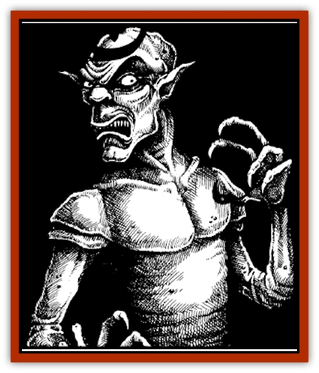

# Doppelganger - Ravenloft

| Statistic | **Doppelganger (Ravenloft)** |
| --- | --- |
| **Activity Cycle:** | Any |
| **Alignment:** | Neutral evil |
| **Armor Class:** | 5 |
| **Climate/Terrain:** | Any |
| **Damage/Attack:** | 1-12 (fist) or by weapon |
| **Diet:** | Omnivore |
| **Frequency:** | Rare |
| **Hit Dice:** | 5 |
| **Intelligence:** | High (13-14) |
| **Magic Resistance:** | See below |
| **Morale:** | Elite (13-14) |
| **Movement:** | 12 |
| **No. Appearing:** | 3-12 |
| **No. of Attacks:** | 1 |
| **Organization:** | Clan |
| **Size:** | M (5' tall) |
| **Special Attacks:** | Surprise |
| **Special Defenses:** | See below |
| **THAC0:** | 15 |
| **Treasure:** | E |
| **XP Value:** | 650 |

The Ravenloft [[Doppelganger|doppelganger]] is a master of mimicry that survives by taking the shapes of humans, demihumans, and humanoids.

In its natural form. the Ravenloft doppelganger is a bipedal sexless humanoid with a monstrous face. It has a hairless head, ash-gray complexion, and pointed ears that bend out from the head rather than lying against the skull. The space between the mouth and nose is far too large - several inches at least - while the eyes are too high up on the face. The skin is thick and folded (giving the doppelganger a natural Armor Class of 5), and the fingers and toes have no nails.

A doppelganger is rarely seen in its natural form, however; usually it is mimicking the form of another humanoid. When a doppelganger dies, it reverts to its true form. Sometimes (particularly if the doppelganger takes a long time to expire), it first shifts through one or two of the other forms it has mimicked recently before reverting at last to its true form.

**Combat:** This monster is able to assume the shape of any humanoid creature between 4 feet and 8 feet high. The doppelganger seeks out a solitary victim, makes the kill, then uses its mimicry ability to assume that creature's form. The doppelganger can then insinuate itself into a group, using its *ESP* ability to behave as others expect it to behave, thus lulling its future victims into believing the doppelganger is their companion.

A Ravenloft doppelganger is immune to *sleep* and *charm* spells. It rolls all saving throws as a 10th level fighter.

Unlike its weaker cousin (who is only 90% effective in its mimicry), the Ravenloft doppelganger can make its new shape authentic to the touch. Anyone touching a Ravenloft doppelganger in its new form will be unable to tell it from the real thing. The actual process of taking the victim's shape takes a full round to complete.

While the doppelganger can change its outer shape, it cannot alter its true nature. No matter what form it takes on, the doppelganger retains all of its original combat values and attributes. It could, for example. make itself look incredibly muscular, but it would in fact be no stronger.

Before it can mimic someone with any degree of accuracy, a doppelganger must get a good look at its target. (This usually means the doppelganger must approach to within 30 feet.) However, bad lighting can reduce this distance, and magic, such as a crystal ball, can increase the distance, as can certain items of mundane equipment, (It is amazing how much detail a spyglass can pick up.)

A Ravenloft doppelganger is able to alter the shape of any equipment it carries. However, this ability functions only between items of similar function and material. For example, the doppelganger could change a sword into an axe, or clothing into leather armor - even ragged clothing into an elegant gown. But it could *not* change normal clothes into plate mail.

While in its new form, the object functions normally. An axe changed into a sword, for example, does damage as a sword.Equipment and belongings are held in their new shape by the will of the doppelganger. If a doppelganger's clothing or equipment is separated from the creature by a distance of 5 feet or more, the objects revert to their true form.

The doppelganger knows full well the limitations of its mimicry. For this reason, it is rare to find a doppelganger that is not carrying a little bit of everything. The Ravenloft doppelganger usually wears normal clothes and carries a medium-sized metal weapon, small metal pieces such as daggers and tools, and wooden objects like figurines and lutes. (It never knows what it will have to imitate.) The doppelganger prefers, however, to use real items whenever possible. Victims will always be stripped of their belongings.

The doppelganger's *ESP* ability operates exactly like the spell. The only exception is that it can attempt to read a creature's mind as often as it wants. For the Dungeon Master, this means that there is normally no point in rolling saving throws for the PCs involved, since they are bound to fail sooner or later. Rolling a saving throw is necessary only in time-critical situations. The ability to read minds serves the doppelganger in preparing for the murder of a victim and in maintaining its mimicry after making the switch. Initially, it reads the minds of a group of characters to learn their habits and abilities. This gives the doppleganger an idea of who would make the best victim and when would be the best time to strike.

Before it actually kills its chosen victim, the doppelganger spends several days reading that person's mind to familiarize itself with the victim's personality and way of doing things. Once the doppelganger is in place, it uses its ESP ability to continually read the minds of the people around it. From their thoughts, the doppelganger learns to do exactly what they expect the person it is mimicking to do. In this way. the doppelganger is never surprised and rarely acts in a suspicious manner.

One of the trickier situations that a doppelganger must handle is skilled labor. The person that has been replaced doubtlessly had talents that the doppelganger is unable to imitate (spellcasting, high level thieving abilities, or special proficiencies, for example). The doppelganger uses its *ESP* to forewarn itself of these situations, attempting to weasel out of performing tasks that it is incapable of doing.

**Habitat/Society:** Doppelganger clans are structured hierarchically. There is a leader (usually the oldest doppelganger) and a pecking order that tends to place the youngest at the bottom. The age of a doppelganger can be determined only when it is in its true form. The more creases it has under its eyes, the older it is.

When planning an infiltration, the youngest doppelgangers get the most dangerous jobs and the lowest-ranking victims of any target group. The highest-ranking victim will be replaced by the head of the clan.

Because doppelgangers are asexual, they care little for distinctions based on gender. When mimicking a person of a particular gender, a doppelganger will often ignore or even rebel against the limitations placed on that gender by society, but will readily comply with these limitations for self-preservation.

The doppelganger's inability to imitate skills means that it will try to pick a victim whose daily life does not involve skilled labor or unique abilities. (Wizards are probably the most avoided class for doppelgangers.)

Unlike their weaker cousins. Ravenloft doppelgangers can learn certain very specific skills. They may learn any of the thieving skills up to the equivalent of a thief of 7th level. These skills can be used only when the doppelganger is in the form in which the skills were learned; they cannot be used in any of the doppelganger's other human shapes.

Although these skills allow a doppelganger to mimic a thief with ease, a doppelganger rarely picks a thief when looking for a victim to replace. Doppegangersl prefer to mimic law-abiding citizens.

Doppelgangers are both greedy and cowardly. They tend to favor rich targets but frivolously spend the wealth they embezzle. When confronted or in times of true danger, they flee. It is rare for a doppelganger to accept any significant risk once it has achieved a new shape.

Doppelgangers rarely work alone. Each doppelganger belongs to a small, tightly knit clan of three to twelve members and no children. Clan members work together to murder a victim and set one of their number up in that person's place. Once one doppelganger has insinuated itself into a new life, it can work from the inside to help its clan members claim other victims.

Usually doppelgangers work from the bottom up. (It is difficult to replace a wealthy noble without inside help.) First, the doppelgangers replace a guard or servant in the noble's home. From there, they take over a high-ranking servant such as the captain of the guard or the head butler. With the captain or butler replaced, they aim for a family member. When several doppelgangers are established inside the noble's estate, it is relatively easy to replace the noble himself.

**Ecology:** The single most limiting aspect of doppelganger ecology is that they cannot reproduce among themselves; they must mate with humanoids of other races to produce offspring. In its natural form, the doppelganger is sexless, but it can imitate a member of either sex.

Doppelganger genes are always dominant. A newborn child who has one doppelganger parent and one humanoid parent appears to be of the same race as its humanoid parent. It is indistinguishable from any other child of that race.

The child's doppelganger heritage is not revealed until it reaches puberty. Gradually, the child's appearance begins to change, shifting more and more toward that of the doppelganger's true form. When this begins to happen, a member of the doppleganger clan approaches the child and reveals the child's true nature.

Normally, it is the doppelganger parent who reveals this fact to the child (if it is still masquerading as the husband or wife of the humanoid parent). Because a dozen years or more elapse from the conception of the child until it is ready to be brought into the clan, sometimes the doppelganger parent's true nature will have been discovered. The doppelganger parent may have been driven away or destroyed by the time the child reaches puberty. In these cases, another member of the clan will attempt to make contact with the child when the time is right. However, this is not always possible.

If the child doppelganger is not taught about its true heritage, it is likely to be caught and killed.

---
## Discovery & Documentation

**Source Publication:** Ravenloft Appendix III (1991)
**Campaign Setting:** Ravenloft
**Author(s):** Kirk Botulla

### Other Creatures Found in This Source Book
   * [[Akikage|Akikage]]
   * [[Animator_Common|Animator, Common]]
   * [[Animator_Greater|Animator, Greater]]
   * [[Animator_Minor|Animator, Minor]]
   * [[Animator_General_Information|Animator, General Information]]
   * [[Bakhna_Rakhna|Bakhna Rakhna]]
   * [[Baobhan_Sith|Baobhan Sith]]
   * [[Beetle_Scarab|Beetle, Scarab]]
   * [[Boneless|Boneless]]
   * [[Boowray|Boowray]]
   * [[Bruja|Bruja]]
   * [[Carrionette|Carrionette]]
   * [[Carrion_Stalker|Carrion Stalker]]
   * [[Cat_Midnight|Cat, Midnight]]
   * [[Cat_Skeletal|Cat, Skeletal]]
   * [[Cloaker_Resplendent|Cloaker, Resplendent]]
   * [[Cloaker_Shadow|Cloaker, Shadow]]
   * [[Cloaker_Undead|Cloaker, Undead]]
   * [[Corpse_Candle|Corpse Candle]]
   * [[Death's_Head_Tree|Death's Head Tree]]
   * [[Familiar_Pseudo-|Familiar, Pseudo-]]
   * [[Familiar_Undead|Familiar, Undead]]
   * [[Feathered_Serpent|Feathered Serpent]]
   * [[Fenhound|Fenhound]]
   * [[Figurine_Ceramic|Figurine, Ceramic]]
   * [[Figurine_Crystal|Figurine, Crystal]]
   * [[Figurine_Ivory|Figurine, Ivory]]
   * [[Figurine_Obsidian|Figurine, Obsidian]]
   * [[Figurine_Porcelain|Figurine, Porcelain]]
   * [[Figurine_General_Information|Figurine, General Information]]
   * [[Fleas_of_Madness|Fleas of Madness]]
   * [[Furies|Furies]]
   * [[Geist|Geist]]
   * [[Ghost_Animal|Ghost, Animal]]
   * [[Golem_Flesh_Ravenloft|Golem, Flesh (Ravenloft)]]
   * [[Golem_Mist_Ravenloft|Golem, Mist (Ravenloft)]]
   * [[Golem_Wax_Ravenloft|Golem, Wax (Ravenloft)]]
   * [[Gremishka|Gremishka]]
   * [[Hag_Spectral|Hag, Spectral]]
   * [[Head_Hunter|Head Hunter]]
   * [[Hearth_Fiend|Hearth Fiend]]
   * [[Hebi-No-Onna|Hebi-No-Onna]]
   * [[Hound_Phantom|Hound, Phantom]]
   * [[Hound_Skeletal|Hound, Skeletal]]
   * [[Imp_Wishing|Imp, Wishing]]
   * [[Ivy_Crawling|Ivy, Crawling]]
   * [[Jack_Frost|Jack Frost]]
   * [[Jolly_Roger|Jolly Roger]]
   * [[Kizoku|Kizoku]]
   * [[Lashweed|Lashweed]]
   * [[Leech_Magical|Leech, Magical]]
   * [[Leech_Psionic|Leech, Psionic]]
   * [[Lich_Defiler|Lich, Defiler]]
   * [[Lich_Drow|Lich, Drow]]
   * [[Lich_Elemental|Lich, Elemental]]
   * [[Lich_Psionic|Lich, Psionic]]
   * [[Living_Tattoo|Living Tattoo]]
   * [[Lycanthrope_Loup-garou|Lycanthrope, Loup-garou]]
   * [[Lycanthrope_Werejackal|Lycanthrope, Werejackal]]
   * [[Lycanthrope_Werejaguar_Ravenloft|Lycanthrope, Werejaguar (Ravenloft)]]
   * [[Lycanthrope_Wereleopard|Lycanthrope, Wereleopard]]
   * [[Lycanthrope_Wereray|Lycanthrope, Wereray]]
   * [[Mist_Ferryman|Mist Ferryman]]
   * [[Moor_Man|Moor Man]]
   * [[Obedient|Obedient]]
   * [[Odem|Odem]]
   * [[Paka|Paka]]
   * [[Plant_Blood_Rose|Plant, Blood Rose]]
   * [[Plant_Fearweed|Plant, Fearweed]]
   * [[Radiant_Spirit|Radiant Spirit]]
   * [[Recluse|Recluse]]
   * [[Remnant_Aquatic|Remnant, Aquatic]]
   * [[Rushlight|Rushlight]]
   * [[Sea_Spawn_Master|Sea Spawn, Master]]
   * [[Sea_Spawn_Minion|Sea Spawn, Minion]]
   * [[Shadow_Asp|Shadow Asp]]
   * [[Shattered_Brethren|Shattered Brethren]]
   * [[Skeleton_Archer|Skeleton, Archer]]
   * [[Skeleton_Insectoid|Skeleton, Insectoid]]
   * [[Skin_Thief|Skin Thief]]
   * [[Spirit_Psionic|Spirit, Psionic]]
   * [[Strahd_Skeleton|Strahd Skeleton]]
   * [[Strahd_Zombie|Strahd Zombie]]
   * [[Unicorn_Shadow|Unicorn, Shadow]]
   * [[Vampire_Drow|Vampire, Drow]]
   * [[Vampire_Nosferatu|Vampire, Nosferatu]]
   * [[Vampire_Oriental|Vampire, Oriental]]
   * [[Virus_General_Information|Virus, General Information]]
   * [[Virus_I|Virus I]]
   * [[Virus_II|Virus II]]
   * [[Virus_III|Virus III]]
   * [[Vorlog|Vorlog]]
   * [[Will_O'Dawn|Will O'Dawn]]
   * [[Will_O'Deep|Will O'Deep]]
   * [[Will_O'Mist|Will O'Mist]]
   * [[Will_O'Sea|Will O'Sea]]
   * [[Zombie_Cannibal|Zombie, Cannibal]]
   * [[Zombie_Desert|Zombie, Desert]]
   * [[Zombie_Wolf|Zombie Wolf]]
   * [[Zombie_Fog|Zombie Fog]]
