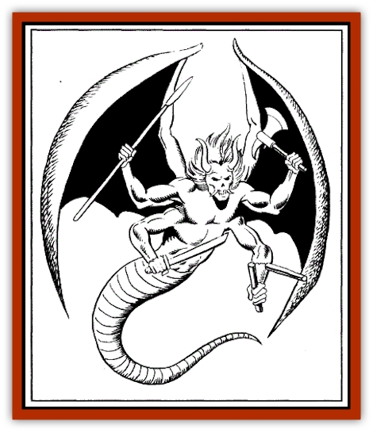

# Dowagu

| Statistic | **Dowagu** |
| --- | --- |
| **Activity Cycle:** | Night |
| **Alignment:** | Lawful Evil |
| **Armor Class:** | 3 (torso), 0 (tail), -2 (head) |
| **Climate/Terrain:** | Any |
| **Damage/Attack:** | by weapon (x4), 1d10 (tail) |
| **Diet:** | Strength Points |
| **Frequency:** | Very Rare |
| **Hit Dice:** | 12 (75 hp) |
| **Intelligence:** | Exceptional (16) |
| **Magic Resistance:** | 20% |
| **Morale:** | Fanatic (18) |
| **Movement:** | 18, Fl 36 (B) |
| **No. Appearing:** | Up to 6, but usually 1 |
| **No. of Attacks:** | 5 |
| **Organization:** | Small group |
| **Size:** | H (12' long) |
| **Special Attacks:** | <i>touch</i>, <i>fear</i> aura, spells |
| **Special Defenses:** | silence, dark, hit only in light |
| **THAC0:** | 9 |
| **Treasure:** | None |
| **XP Value:** | 14,000 |

The dowagu are the creations of the Raja [[Ambuchar_Devayam_Tan_Chin|Ambuchar Devayam]]. They have the lower bodies and tails of giant snakes, except that their tails are covered with a thick, layered hide. They have man-like torsos with four arms and huge leathery wings. Their faces are gaunt and grotesque, with long, curved horns rising from their foreheads and equally long, wicked tusks protruding from their upper jaws. The dowagu are completely black, with beady blue eyes resembling stars. Unless caught in the full light of the moon or a magical light source, they are rarely visible as more than a shadow.

**Combat:** Dowagu rarely fight, for they are usually working under strict orders from the Raja. When they do fight, however, they are true terrors, attacking simultaneously with four weapons (usually a scimitar, flail, axe and spear) and their powerful tail. Any being unfortunate enough to see a dowagu in full light must save vs. paralyzation or flee in *fear* for 1d12 rounds.

Creatures hit by the tail, or touching the dowagu with bare hands, must save vs. spells or take an additional 1d4 points of *chilling touch* damage and lose a point of Strength. If the victim fails a second save, this one vs. poison, the Strength loss is permanent. In addition, on a natural to-hit roll of 20, the dowagu entwines its tail about the victim. Entwined victims suffer no additional damage, but must save as if hit by the tall each round, or suffer the consequences as outlined above.

Defensively, the dowagu are always surrounded by a 5' sphere of *silence*. In addition, they can cause *darkness* (10') at will. If this is done at night and there is no direct source of light on the dowagu, treat the result as if it were *invisible*. Finally, the dowagu can be hit only if illuminated in the full effect of a magical light source, such as a *light* or *continual light* spell. Note that such spells cause no direct damage to the dowagu; they merely allow other weapons to inflict damage. If the dowagu is not illuminated, any attack directed against it simply passes through its body as if it were a shadow. They are subject to the full effects of the *prism of Kushk*, however, for it simultaneously provides a magical light source and makes an attack

Each day, a dowagu is able to cast up to four 1st level Wizard spells from the Illusion/Phantasm school as if it were a 10th-level Wizard

**Habitat/Society:** The dowagu are generally solitary creatures, answering solely to their master and creator, the Raja Ambuchar Devayam. Although they prefer to dwell in desolate, arid locations, they are at home in any environment.

They can mark any creature with the Stamp of Tan Chin. One of their major duties is to wander the world searching out victims upon which to place the dark tattoo. This stamp cannot be removed, even by a *wish* spell, and always shows through any attempt to cover it up. (Makeup wears off, scarves or hats fall off, spells fail inexplicably, etc.) Upon dying, persons marked with the stamp become undead and march to Solon to join the Raja's army. Usually, such victims become zombies, but especially powerful characters (9th level and above) become a more advanced form of undead, such as a [[Vampire_General_Information|vampire]], [[Wight|wight]], [[Banshee|groaning spirit]], etc. The only way to escape this fate is to avoid death or to destroy the Raja.

**Ecology:** The dowagu are magical constructs created by the Raja Ambuchar Devayam. There are only six of them, though the Raja will create a replacement if one is destroyed. To feed, the dowagu entwine a victim within the coils of their *chilling* tail and draw away his strength. They rarely stop until the victim is an empty husk.

---
## Discovery & Documentation

**Source Publication:** FRA3 Blood Charge (1990)
**Campaign Setting:** Forgotten Realms
**Author(s):** Troy Denning, Anne Brown, Paul Abrams

### Other Creatures Found in This Source Book
   * [[Ambuchar_Devayam_Tan_Chin|Ambuchar Devayam/Tan Chin]]
   * [[Sandiraksiva_The_Black_Courser|Sandiraksiva, The Black Courser]]
   * [[Gaumahavi_Greater_Purple_Dragon|Gaumahavi, Greater Purple Dragon]]
