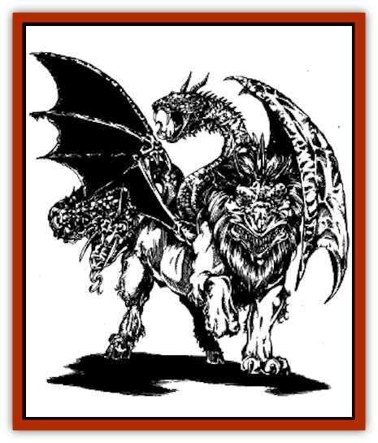

# Dracimera

| Statistic | **Dracimera** |
| --- | --- |
| **Activity Cycle:** | Any |
| **Alignment:** | Varies (see below) |
| **Armor Class:** | Varies (see below) |
| **Climate/Terrain:** | Any temperature to tropical |
| **Damage/Attack:** | 1d3/1d3/1d4/1d4/1d12/1d12 (claw/claw/horn/horn/bite/bite) |
| **Diet:** | Carnivore |
| **Frequency:** | Very rare |
| **Hit Dice:** | 12 |
| **Intelligence:** | Low (5-7) |
| **Magic Resistance:** | Nil |
| **Morale:** | Elite (13-14) |
| **Movement:** | 10, Fl 15 (E) |
| **No. Appearing:** | 1 |
| **No. of Attacks:** | 6 |
| **Organization:** | Solitary |
| **Size:** | L (5' tall at the shoulder) |
| **Special Attacks:** | Breath weapon |
| **Special Defenses:** | Immune to breath weapon of dragon parent and like attacks (spells, etc.) |
| **THAC0:** | 9 |
| **Treasure:** | Nil (F) |
| **XP Value:** | Varies (see below) |

The dracimera is the offspring of a [[Chimera|chimera]] and an evil [[Dragon_General_Information|dragon]]. It has a dragon head up front surrounded by a lion's mane (like the [[Mantidrake|mantidrake]]), a lizard head with two goat's horns growing from the middle of its back, and a dragon head and neck like that of its dragon parent growing where a lion's tail would be. The lizard head is bluegreen with the amber eyes and ocher horns of the chimera.

Wild dracimerae speak the language of their dragon parent, with some halting knowledge of the language of [[Dragon_Chromatic_Red|red dragons]] (provided their draconic parent is not a red dragon). Those dracimerae raised from birth by the Cult of the Dragon normally know common and the language of their dragon parent (though it is spoken with a slight human accent).

**Combat:** The dracimera is perhaps the deadliest of the known dragon hybrids. In physical combat, it attacks six times in a single round. It strikes with both forelegs (1d3 points of damage each), butts with both goat horns (1d4 points of damage each), and bites with its front and back dragon heads (1d12 points of damage each).

Its breath weapon is the same as that of its dragon parent, and the dracimera can use it six times per day. This weapon is divided up among the three heads, with each head able to use it twice per day. If one head does not use its "share", the other heads do not gain "extra" uses. Damage done by the dracimera's breath weapon is equal to the beast's normal hit point total. This damage does not vary as the beast is wounded or healed over time, and magical effects that artificially boost hit points do not make the breath weapon more powerful.

The dracimera is immune to attack forms that resemble its breath weapon (a [[Dragon_Chromatic_White|white-dragon]]-parented dracimera is immune to normal and magical cold, for instance). Finally, dracimerae do not suffer any additional damage or effects from weapons or items specifically designed to kill dragons. (A *sword* or an *arrow of dragon slaying* could not outright slay it. The dracimera would take all damage otherwise appropriate, however.)

| Dragon Parent | AL | AC | Breath Weapon | XP Value |
| --- | --- | --- | --- | --- |
| Black | CE | 1 | Jet of acid 5 feet wide, 60 feet long; victim takes half damage if successful save vs. breath weapon is made. | 9,000 |
| Blue | LE | 0 | Bolt of lightning 5 feet wide, 100 feet long; half damage if save is made. | 10,000 |
| Green | LE | 0 | Cloud of chlorine gas 50 feet long, 40 feet wide, and 30 feet high; half damage if save is made vs. breath weapon. | 10,000 |
| Red | CE | -3 | Cone of fire 5 feet at mouth, 90 feet long, 30 feet wide at cone's widest; half damage if save is made. | 10,000 |
| White | CE | 1 | Cone of frost 5 feet wide, 70 feet long, 25 feet wide at cone's widest; half damage if save is made vs. breath weapon. | 9,000 |
| Brown | NE | 2 | Jet of acid 5 feet wide, 60 feet long; victim takes half damage if successful save vs. breath weapon is made. | 9,000 |
| Yellow | CE | 0 | Blast of scorching air and sand 50 feet long, 40 feet wide, and 20 feet high; half damage if save is made vs. breath weapon. | 10,000 |

**Habitat/Society:** A wild dracimera lives in the same tropical regions as its chimera parent (and usually is the offspring of a black or red dragon). Such dracimerae are solitary creatures, coming together to mate only once in a single decade. A single young is born to a successful mating. Due to the small numbers of dracimerae in existence in the wild, most dracimerae are not born of dracimerae, but of a chimera and dragon pairing. Dracimerae live in the most remote and inaccessible regions of their hunting grounds, which cover at least 400 square miles. They hoard treasure much like their dragon ancestors, for much the same reasons.

Cult dracimerae are typically used as guards of important areas, treasure caches, secret passageways, or as powerful shock troops in Cult raids against some strong foe or caravan.

**Ecology:** The wild dracimera is an ferocious predator and tolerates no other large carnivores or omnivores in its territory. It attacks intruders on sight. Although it hunts an area of no more than 25 square miles in a day, a dracimera can fly up to 100 miles a day and still return to its lair by nightfall.

Unlike its chimera parent, the dracimera is a pure carnivore. However, it is generally not strapped for food due to this specialization, as its reptilian physiology enables it to go without eating for as long as a week. When it does find plenty of flesh, it gorges itself. Anything made of flesh and blood is fair game, particularly humans and humanoids, and the surprising number of giant artifacts in dracimera lairs is mute testament to dracimera combat power.

---
## Discovery & Documentation

**Source Publication:** FOR11 Cult of the Dragon (1990)
**Campaign Setting:** Advanced Dungeons & Dragons 2nd Edition
**Author(s):** Dale Donovan

### Other Creatures Found in This Source Book
   * [[Dracohydra|Dracohydra]]
   * [[Dracolich|Dracolich]]
   * [[Dragon_Ghost|Dragon, Ghost]]
   * [[Dragon_Lesser_Undead|Dragon, Lesser Undead]]
   * [[Dragon-kin|Dragon-kin]]
   * [[Mantidrake|Mantidrake]]
   * [[Ur-Histachii|Ur-Histachii]]
   * [[Wyvern_Drake|Wyvern Drake]]
