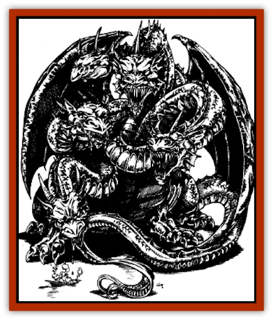
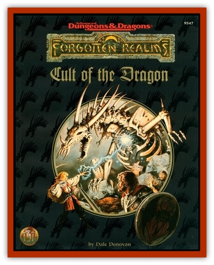

# Dracohydra

| Statistic | **Dracohydra** |
| --- | --- |
| **Activity Cycle:** | Night |
| **Alignment:** | Chaotic evil |
| **Armor Class:** | 2 (base) |
| **Climate/Terrain:** | Temperate/mountains or barrens |
| **Damage/Attack:** | 1d8 (claw)/1d8 (claw)/2d8 (bite, per head.at least 2 bites possible) |
| **Diet:** | Carnivore |
| **Frequency:** | Very rare |
| **Hit Dice:** | 12 (base) |
| **Intelligence:** | Low (5-7) |
| **Magic Resistance:** | Varies |
| **Morale:** | Steady (11-12) |
| **Movement:** | 6, Fl 21 (D) |
| **No. Appearing:** | 1 (1d4) |
| **No. of Attacks:** | 4 to 7  (depending on number of heads) + special |
| **Organization:** | Solitary |
| **Size:** | G (45' base) |
| **Special Attacks:** | See below |
| **Special Defenses:** | See below |
| **THAC0:** | 9 (base) |
| **Treasure:** | Special |
| **XP Value:** | Varies |

Dracohydras are hideous multiheaded winged monsters that combine the worst features of [[Dragon_General_Information|dragons]] and [[Hydra|hydras]]. Some sages believe they are ancient offshoots of the pre-dragons that have been hibernating for millions of years; others believe they are the next step in the evolution of dragons. Still others think that they are the result of tampering by supernatural beings, such as Tiamat the Chromatic Dragon or other deities. Cult members propose that they are the result of Sammaster's researches into draconic life. In order to better understand how draconic life forms existed, Sammaster created many draco-crossbreeds. Many of these are still in use by Cult cells today. The dracohydra is one such creature.

Dracohydras have been reported with two to five heads. Twenty-five percent of dracohydras have two heads, 50% have three heads, 15% have four heads, and 10% have five heads.The creatures are a muddy brown color, ranging to a lighter brown, almost a cream, on their bellies. Their eyes are red.Dracohydras speak their own tongue, a derivative of the language of evil dragons. Dracohydras can understand about half of what evil dragons say, and vice versa. Dracohydras know no other languages, but can be taught to understand common by Cult mages.

**Combat:** Dracohydras share the same attack routines as standard dragons (including special attacks such as the snatch, plummet, kick, wing buffet, tail slap, and stall described under "[[Dragon_General_Information|Dragon, General]]"). Each round, each of the creature's heads can either bite or use its breath weapon. Heads inflict 2d8 points of damage per bite. The creature's claw attacks inflicts 1d8 points of damage per claw.

A dracohydra's total hit points are divided as follows: Half the points are assigned to the body (including the wings), and the other half are split evenly between the heads. (For example, say that a three-headed dracohydra has a total of 72 hit points. Its body has 36 hit points, while each of its heads has 12.) When a dracohydra head has been reduced to 0 hit points, the head "dies" and becomes useless. As soon as all heads are destroyed or the body is reduced to 0 hit points, the dracohydra is dead.

In combat, 80% of successful frontal attacks against a dracohydra damage a head (random selection); only 20% hit the body. For foes attacking from the side, the odds are reversed: 80% of hits damage the body, while 20% hit a randomly selected head. Foes attacking from the rear always inflict damage to the body.

**Breath Weapon/Special Abilities:** Dracohydras spit sprays of concentrated acid similar to the breath weapon of a [[Dragon_Chromatic_Black|black dragon]]. The acid stream is 3 feet wide and extends 40 feet in a straight line from the creature's head. All creatures caught in this stream must roll successful saving throws vs. breath weapon for half damage.

Each head is able to use its breath weapon independently, dividing the total allowable damage between as many uses as the creature desires. This means that a five-headed great wyrm is an incredibly daunting foe, since each of its five heads can inflict 12d2+12 points of damage. Dracohydras use their special abilities at 8th level, plus their combat modifier. Dracohydras are born with an innate immunity to acid. As they age, they gain the following powers:

<ul><li>**Young adult:** *Wall of fog* twice per day.</li><li>**Adult:** *Darkness* three times per day</li><li>**Old:** *Stinking cloud* twice per day.</li><li>**Wyrm:** *Cloudkill* once per day</li></ul>**Habitat/Society:** Wild dracohydras are found in remote mountainous regions far from civilization. They prefer snow-covered peaks around which violent storms often play. Dracohydras are most like white dragons in their outlook: rapacious, selfish, and ferocious. Their low Intelligence makes it difficult for them to plan or think in an abstract manner, so their behavior is most often direct.

Basically, these beasts are bullies, killing any intruders into their territories even if they are not hungry at the moment. If faced by a strong foe that will not back down, they often run away. Conversely, they enjoy playing with a weaker foe before killing it. This easily manipulated predilection makes them excellent tools of the Cult for those cells "lucky" enough to have access to them. These cells most commonly use dracohydras as stationary guards of sites important to the Cult. These include secret passageways, treasure or magical item caches, or the ruling member.s (or members.) inner sanctum.

Dracohydras are by preference solitary, associating with others of their kind only to mate. Offspring remain with the parents only until they reach the young age category. They then either head out on their own or - rarely - challenge one of their parents for its hoard. Parents protect their offspring, but not at the cost of their own lives. Should it look as though continued defense might mean death, the parents flee. Any encounter with more than one dracohydra is with a mated pair with one or two offspring of age category hatchling (60%) or very young (40%).

Dracohydras hate all other dracoforms. If they think they can get away with it, they will attack other dracoforms on sight. Dracohydras also have no love for humans, demihumans, and humanoids. They sometimes enslave these smaller creatures, but the period of servitude never lasts long before the dracohydra gets hungry and eats its slaves. The Cult works hard to curb these tendencies in those dracohydras it makes use of, since having a dracohydra attack its members and other draconic and dracohybrid servants would be counterproductive. The same strategies of bribery, subterfuge, mental manipulation, and magical charming or domination that the Cult uses on its other servants are employed to good effect to keep its dracohydra "allies" in line.

**Ecology:** Like all draconic creatures, dracohydras can consume almost anything, including nonliving materials such as rocks or gems. They have a rapidly mounting, voracious hunger that they prefer to satisfy with fresh meat. This is the greatest hindrance to the Cult's use of these creatures. The dracohydra must be kept near a large food supply such as a herd of grazing animals or other large, easily tractable beings.

Like the [[Basilisk|dracolisk]], the dracohydra is a distinct species, not a variety of hybrid creature such as the [[Dracimera|dracimera]], [[Mantidrake|mantidrake]], or [[Wyvern_Drake|wyvern drake]]. (Its statistics remain stable for its species and do not vary according to its parentage.) The main enemies of dracohydras are [[Giant_Storm|storm giants]], [[Giant_Stone|stone giants]], and [[Dragon_Chromatic_Red|red dragons]] - who consider the flesh of the creatures' young to be a delicacy.

| Age | Body (in Feet) | Tail (in Feet) | AC | Breath | MR | Treasure | XP Value |
| --- | --- | --- | --- | --- | --- | --- | --- |
| 1 Hatchling | 5-14 | 2-6 | 5 | 1d2+1 | Nil | Nil | 1,400 |
| 2 Very young | 14-23 | 6-12 | 4 | 2d2+2 | Nil | Nil | 2,000 |
| 3 Young | 23-32 | 12-20 | 3 | 3d2+3 | Nil | Nil | 4,000 |
| 4 Juvenile | 32-42 | 20-30 | 2 | 4d2+4 | Nil | E | 7,000 |
| 5 Young adult | 42-52 | 30-40 | 1 | 5d2+5 | 5% | E,O,S | 9,000 |
| 6 Adult | 52-63 | 40-50 | 0 | 6d2+6 | 10% | E,O,S | 10,000 |
| 7 Mature adult | 63-74 | 50-60 | -1 | 7d2+7 | 15% | E,O,S | 11,000 |
| 8 Old | 74-85 | 60-70 | -2 | 8d2+8 | 20% | E,O,Sx2 | 13,000 |
| 9 Very old | 85-96 | 70-80 | -3 | 9d2+9 | 20% | E,O,Sx2 | 14,000 |
| 10 Venerable | 96-108 | 80-90 | -4 | 10d2+10 | 20% | E,O,Sx2 | 15,000 |
| 11 Wyrm | 108-120 | 90-100 | -5 | 11d2+11 | 20% | E,O,Sx3 | 16,000 |
| 12 Great Wyrm | 120-125 | 100-105 | -6 | 12d2+12 | 20% | E,O,Sx3 | 17,000 |

---
## Discovery & Documentation

**Source Publication:** FOR11 Cult of the Dragon (1990)
**Campaign Setting:** Advanced Dungeons & Dragons 2nd Edition
**Author(s):** Dale Donovan

### Other Creatures Found in This Source Book
   * [[Dracimera|Dracimera]]
   * [[Dracolich|Dracolich]]
   * [[Dragon_Ghost|Dragon, Ghost]]
   * [[Dragon_Lesser_Undead|Dragon, Lesser Undead]]
   * [[Dragon-kin|Dragon-kin]]
   * [[Mantidrake|Mantidrake]]
   * [[Ur-Histachii|Ur-Histachii]]
   * [[Wyvern_Drake|Wyvern Drake]]
