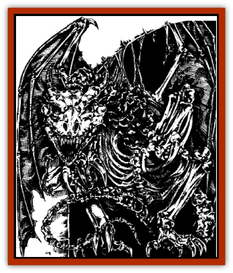

# Dracolich

| Statistic | **Dracolich** |
| --- | --- |
| **Activity Cycle:** | Night |
| **Alignment:** | Lawful evil, neutral evil, or chaotic evil (as per former dragon type; nonevil dragons become evil on transformation) |
| **Armor Class:** | As per former dragon type with an additional -2 bonus to AC |
| **Climate/Terrain:** | As per former dragon type |
| **Damage/Attack:** | As per former dragon type and age + 2d8 points of cold damage per successful attack + 2d6 rounds of paralysis (save vs. paralysis allowed) |
| **Diet:** | None required for sustenance, but as per former dragon type to refuel breath weapon |
| **Frequency:** | Very rare |
| **Hit Dice:** | As per former dragon type and age |
| **Intelligence:** | As per individual dragon |
| **Magic Resistance:** | As per former dragon type and age |
| **Morale:** | As per former dragon type until specific circumstances occur (see below), then Fearless (19-20) |
| **Movement:** | As per former dragon type and age |
| **No. Appearing:** | 1 |
| **No. of Attacks:** | As per former dragon type, typically 3 + special |
| **Organization:** | Solitary |
| **Size:** | As per individual dragon |
| **Special Attacks:** | Breath weapon, spell use, paralyzing gaze, undead control |
| **Special Defenses:** | Strengthened dragon fear aura; immune to <i>charm</i>, <i>sleep</i>, <i>enfeeblement</i>, <i>polymorph</i>, cold (magical or normal), electricity, <i>hold</i>, insanity, or <i>death</i> spells or symbols, poison, paralysis, and turning; no attack or damage roll bonuses allowed against them; injured only by magical attacks from 6th-level or greater wizards or by attacks from 6 or more HD monsters |
| **THAC0:** | As per former dragon type and age |
| **Treasure:** | B,H,S,T |
| **XP Value:** | As per individual dragon, plus 1,000 (both body and host must be destroyed) |

The dracolich is an undead creature resulting from the unnatural transformation of a [[Dragon_General_Information|dragon]]. The mysterious Cult of the Dragon practices the powerful magic necessary for the creation of the dracolich, though other practitioners are also rumored to exist.

A dracolich can be created from any of the evil or neutral dragon subspecies. An evil or neutral dracolich retains the physical appearance of its original body, except that its eyes appear as glowing points of light floating in shadowy eye sockets. Skeletal or semiskeletal dracoliches have been observed on occasion.

The senses of a dracolich are similar to those of its original form, and it can detect invisible objects or creatures (including those hidden in darkness or fog) within a 10-foot radius per age category and also possess a natural clairaudience ability while in its lair equal to a range of 20 feet per age category. A dracolich can speak, cast spells, and employ the breath weapon of its original form. It can cast each of its spells once per day and can use its breath weapon once every three combat rounds. A dracolich retains the memories and intelligence of its original form.

**Combat:** Dracoliches are immune to *charm*, *sleep*, *enfeeblement*, *polymorph*, cold (magical or normal), electricity, *hold*, insanity, or *death* spells or symbols. They cannot be poisoned, paralyzed, or turned by priests. They have the same magic resistance as their original forms, but only magical attacks from wizards of 6th level or higher or attacks from monsters of 6 or more Hit Dice can injure dracoliches.

The Armor Class of a dracolich is equal to the Armor Class of its original form bettered by -2 (for example, if the AC of the original form is -1, the AC of the dracolich is -3). Attacks on the dracolich, due to its magical nature, do not gain any attack or damage roll bonuses.

Initially, a dracolich has the same morale rating as its original form. However, after a dracolich is successful in its first battle, its morale rating permanently becomes Fearless (19 base). This assumes that the opponent or opponents involved in the battle had a Hit Dice total of at least 100% of the Hit Dice of the dracolich. (For instance, a 16-HD dracolich must defeat an opponent or opponents of at least 16 total HD in one battle to receive the morale increase.) Once a dracolich receives the morale increase, it becomes immune to magical fear as well.

The dracolich has a slightly stronger ability to cause fear in opponents than it did in its original form (a dragon's fear aura). Opponents must roll their saving throws vs. spell with a -1 penalty (in addition to any other relevant modifiers) to resist the dracolich.s fear aura. The gaze of the dracolich's glowing eyes can also paralyze creatures within 40 yards if they fail their saving throws. (Creatures of 6th level or 6 Hit Dice or higher gain a +3 bonus to their saving throws.) If a creature successfully saves against the paralyzing gaze of a dracolich, it is permanently immune to the gaze of that particular dracolich.

The attack routine of a dracolich is similar to that of its original form. For example, a dracolich that was originally a [[Dragon_Chromatic_Green|green dragon]] brings down a weak opponent with a series of physical attacks, but it stalks more formidable opponents, attacking at an opportune moment with its breath weapon and spells.

All physical attacks, such as clawing and biting, inflict the same damage as the dracolich's original form plus 2d8 points of chilling damage. A victim struck by a dracolich who fails a saving throw vs. paralyzation is paralyzed for 2d6 rounds. Immunity to cold damage, temporary or permanent, negates the chilling damage but not the paralyzation. Dracoliches cannot drain life levels.

All dracoliches can attempt *undead control* (as per the *potion of undead control*) once every three days on any variety of undead within 60 yards. The undead creatures' saving throws against this power suffer a -3 penalty. If the *undead control* is successful, it lasts for one turn only. While *undead control* is in use, the dracolich cannot use its spells. If the dracolich interrupts its *undead control* before it has been used for a full turn, the dracolich must still wait three days before the power can be used again.

If a dracolich or proto-dracolich is slain, its spirit immediately returns to its host (see below). If there is no corpse in range for it to possess, the spirit is trapped in the host until such a time - if ever - that a corpse becomes available.

A dracolich is difficult to destroy. It can be destroyed outright by a *power word, kill* or a similar spell. If its spirit is currently contained in its host, destroying the host when a suitable corpse in not within range effectively destroys the dracolich. Likewise, an active dracolich is unable to attempt further possessions if its host is destroyed. The fate of a disembodied dracolich spirit - that is, a spirit with no body and no host - is unknown, but it is presumed that it is drawn to the lower planes.

**Habitat/Society:** The creation of a dracolich is a complex process involving the transformation of an evil or neutral dragon by arcane magical forces, the most notorious practitioners of which are the members of the Cult of the Dragon. The process is usually a cooperative effort between the evil dragon and wizards and/or priests, but especially powerful wizards and priests have been known to coerce an evil dragon to undergo the transformation against its will. Priest versions of this procedure are similar to the wizardly version described here, but priests still need a wizard's assistance for certain aspects of the transformation process, while wizards never need a priest's aid - though it is sometimes welcomed. The church of Tiamat, in particular, is working to eliminate the requirements for wizardly assistance.

Any dragon is a possible candidate for transformation, although evil spell-casting dragons of old or older age are preferred. Once a candidate is secured, the wizards first prepare the dragon's host, an inanimate object that will hold the dragon's life force. The host must be a solid item of not less than 2,000 gp value resistant to decay (wood, for instance, is unsuitable). A gemstone is commonly used for a host, particularly ruby, pearl, carbuncle, jet, chalcedony, chrysocolla, citrine, epidote, moonbar, and morion (smoky quartz). The gemstone is often (though not always, by all means) set in the hilt of a sword or other weapon. The host is prepared by casting an *enchant an item* upon it and speaking the name of the evil dragon. The item may resist the spell by succeeding at a saving throw vs. spell as if it were an 11th-level wizard. If the spell is resisted, another item must be used for the host. If the spell is not resisted, the item can then function as a host. If desired, glassteel can be cast upon the host to protect it.

Next a special potion is prepared for the dragon to consume. The exact composition of the potion varies according to the age and type of the dragon, but it must contain precisely seven ingredients, among them a *potion of evil dragon control*, a *potion of invulnerability*, and the blood of a [[Vampire_General_Information|vampire]]. When the dragon consumes the potion, the results are determined as follows (roll percentile dice):

| Roll | Result |
| --- | --- |
| 01-10 | No effect. |
| 11-40 | Potion does not work. The dragon suffers 2d12 points of damage and is helpless with convulsions for 1d2 rounds. |
| 41-50 | Potion does not work. The dragon dies. A full wish is required to restore the dragon to life. A wish to transform the dragon into a dracolich results in another roll on this table. |
| 51-00 | Potion works. |

If the potion works, the dragon's spirit transfers to the host, regardless of the distance between the dragon's body and the host. A dim light within the host indicates the presence of the spirit. While contained in the host, the spirit cannot take any actions; it cannot be contacted nor attacked by magic. The spirit can remain in the host indefinitely.

Once the spirit is contained in the host, the host must be brought within 90 feet of a reptilian corpse.under no circumstances can the spirit possess a living body. The spirit's original body is ideal, but the corpse of any reptilian creature that died or was killed within the previous 30 days is suitable.

The wizard who originally prepared the host must touch the host, cast a *magic jar* spell while speaking the name of the dragon, then touch the corpse. The corpse must fail a saving throw vs. spell for the spirit to successfully possess it; if it saves, it will never accept the spirit. The following modifiers apply to the roll:

<ul><li>-10 if the corpse is the spirit's own former body (which can be dead for any length of time).</li><li>-4 if the corpse is of the same alignment as the dragon.</li><li>-4 if the corpse is that of a true dragon (any type).</li><li>-3 if the corpse is that of a [[Dragonet_Fire_Drake|firedrake]], [[Ice_Lizard|ice lizard]], [[Wyvern|wyvern]], or [[Lizard|fire lizard]].</li><li>-1 if the corpse is that of a [[Basilisk|dracolisk]], [[Dragonne|dragonne]], [[Dinosaur_I|dinosaur]], [[Snake|snake]], or other reptile.</li></ul>If the corpse accepts the spirit, it becomes animated by the spirit. If the animated corpse is the spirit's former body, it immediately becomes a dracolich; however, it will not regain the use of its voice and breath weapon for another seven days. (Note that it will not be able to cast spells with verbal components during this time.) At the end of seven days, the dracolich regains use of its voice and breath weapon.

If the animated corpse is not the spirit's former body, it immediately becomes a proto-dracolich. A proto-dracolich has the mind and memories of its original form but has the hit points and immunities to spells and priestly turning of a dracolich. A proto-dracolich can neither speak or cast spells; further, it cannot cause chilling damage, use a breath weapon, control undead, paralyze with its eyes, or cause fear as a dracolich. Its Strength, movement, and Armor Class are those of the possessed body.

To become a full dracolich, a proto-dracolich must devour 10% of its original body. Unless the body has been dispatched to another plane of existence, a proto-dracolich can always sense the presence of its original body regardless of the distance. A proto-dracolich tirelessly seeks out its original body to the exclusion of all other activities. If its original body has been burned, dismembered, or otherwise destroyed, the proto-dracolich need only devour the ashes or pieces equal to 10% of its original body mass. (Total destruction of the original body is only possible through the use of a *disintegrate* or similar spell; the body could be reconstructed with a *wish* or similar spell, so long as the spell is cast in the same plane as the disintegration.) If a proto-dracolich is unable to devour its original body, it is trapped in its current state until slain.

A proto-dracolich transforms into a full dracolich seven days days after its devours its original body. When the transformation is complete, the dracolich resembles its original body: It can now speak, cast spells, and employ the breath weapon of its original body in addition to having all the abilities of a dracolich.

The procedure for possessing a new corpse is the same as explained above, except the assistance of a wizard is no longer necessary since casting *magic jar* is required only for the first possession. If the spirit successfully repossesses its original body it once again becomes a full dracolich. If the spirit possesses a different body it becomes a proto-dracolich and must devour its former body to become a full dracolich.

A symbiotic relationship exists between a dracolich and the wizards and/or priests who create it. The group that creates the dracolich honors and aids its dracolich, as well as providing it with regular offerings of treasure items. In return, the dracolich defends its animating organization (or individual) against enemies and other threats, as well as assisting it in its members. various schemes. Like dragons, dracoliches are loners, but they take comfort in the knowledge that they have allies.

Dracoliches are always found in the same habitats as the dragons from which they were created. Dracoliches created from green dragons, for instance, are likely to be found in subtropical or temperate forests. Though they do not live with their creators, dracoliches' lairs are never more than a few miles away from them or at least one of their regular meeting places or refuges. Dracoliches prefer darkness and are usually encountered at night, in shadowy forests, or in underground labyrinths. Dracoliches continue to age just as dragons do, becoming more powerful as they enter new age categories.

**Ecology:** Dracoliches are never hungry, but they must eat in order to refuel their breath weapon. Like dragons, dracoliches can consume nearly anything, but prefer the food eaten by their original forms. (For instance, if a dracolich was originally a [[Dragon_Chromatic_Red|red dragon]], it prefers fresh meat.) The body of a destroyed dracolich crumbles into a foulsmelling powder with a few hours. This powder can be used by knowledgeable wizards as a component for creating *potions of undead control* and similar magical substances.

---
## Discovery & Documentation

**Source Publication:** Monstrous Manual (1995)
**Campaign Setting:** Advanced Dungeons & Dragons 2nd Edition
**Author(s):** Tim Beach

### Other Creatures Found in This Source Book
   * [[Aarakocra|Aarakocra]]
   * [[Aboleth|Aboleth]]
   * [[Ankheg|Ankheg]]
   * [[Arcane|Arcane]]
   * [[Argos|Argos]]
   * [[Aurumvorax|Aurumvorax]]
   * [[Baatezu_Lesser_Abishai|Baatezu, Lesser, Abishai]]
   * [[Baatezu_General_Information|Baatezu, General Information]]
   * [[Baatezu_Greater_Pit_Fiend|Baatezu, Greater, Pit Fiend]]
   * [[Banshee|Banshee]]
   * [[Basilisk|Basilisk]]
   * [[Bat|Bat]]
   * [[Bear|Bear]]
   * [[Beetle_Giant|Beetle, Giant]]
   * [[Behir|Behir]]
   * [[Beholder_and_Beholder-kin_I|Beholder and Beholder-kin I]]
   * [[Beholder_and_Beholder-kin_II|Beholder and Beholder-kin II]]
   * [[Bird|Bird]]
   * [[Brain_Mole|Brain Mole]]
   * [[Broken_One|Broken One]]
   * [[Brownie|Brownie]]
   * [[Bugbear|Bugbear]]
   * [[Bulette|Bulette]]
   * [[Bullywug|Bullywug]]
   * [[Carrion_Crawler|Carrion Crawler]]
   * [[Cat_Great|Cat, Great]]
   * [[Catoblepas|Catoblepas]]
   * [[Cat_Small|Cat, Small]]
   * [[Cave_Fisher|Cave Fisher]]
   * [[Centaur|Centaur]]
   * [[Centipede|Centipede]]
   * [[Chimera|Chimera]]
   * [[Cloaker|Cloaker]]
   * [[Cockatrice|Cockatrice]]
   * [[Couatl|Couatl]]
   * [[Crabman|Crabman]]
   * [[Crawling_Claw|Crawling Claw]]
   * [[Crocodile|Crocodile]]
   * [[Crustacean_Giant|Crustacean, Giant]]
   * [[Crypt_Thing|Crypt Thing]]
   * [[Death_Knight|Death Knight]]
   * [[Deepspawn|Deepspawn]]
   * [[Dinosaur_I|Dinosaur I]]
   * [[Displacer_Beast|Displacer Beast]]
   * [[Dog|Dog]]
   * [[Dog_Moon|Dog, Moon]]
   * [[Dolphin|Dolphin]]
   * [[Doppelganger|Doppelganger]]
   * [[Dragon_Brown|Dragon, Brown]]
   * [[Dragon_Chromatic_Black|Dragon, Chromatic, Black]]
   * [[Dragon_Chromatic_Blue|Dragon, Chromatic, Blue]]
   * [[Dragon_Chromatic_Green|Dragon, Chromatic, Green]]
   * [[Dragon_Cloud|Dragon, Cloud]]
   * [[Dragon_Chromatic_Red|Dragon, Chromatic, Red]]
   * [[Dragon_Chromatic_White|Dragon, Chromatic, White]]
   * [[Dragon_Deep|Dragon, Deep]]
   * [[Dragon_Gem_Amethyst|Dragon, Gem, Amethyst]]
   * [[Dragon_Gem_Crystal|Dragon, Gem, Crystal]]
   * [[Dragon_Gem_Emerald|Dragon, Gem, Emerald]]
   * [[Dragon_Gem_Sapphire|Dragon, Gem, Sapphire]]
   * [[Dragon_Gem_Topaz|Dragon, Gem, Topaz]]
   * [[Dragon_Metallic_Brass|Dragon, Metallic, Brass]]
   * [[Dragon_Metallic_Bronze|Dragon, Metallic, Bronze]]
   * [[Dragon_Metallic_Copper|Dragon, Metallic, Copper]]
   * [[Dragon_Mercury|Dragon, Mercury]]
   * [[Dragon_Metallic_Gold|Dragon, Metallic, Gold]]
   * [[Dragon_Mist|Dragon, Mist]]
   * [[Dragon_Metallic_Silver|Dragon, Metallic, Silver]]
   * [[Dragon_General_Information|Dragon, General Information]]
   * [[Dragon_Shadow|Dragon, Shadow]]
   * [[Dragon_Steel|Dragon, Steel]]
   * [[Dragon_Yellow|Dragon, Yellow]]
   * [[Dragonne|Dragonne]]
   * [[Dragon_Turtle|Dragon Turtle]]
   * [[Dragonet_Faerie_Dragon|Dragonet, Faerie Dragon]]
   * [[Dragonet_Fire_Drake|Dragonet, Fire Drake]]
   * [[Dragonet_Pseudodragon|Dragonet, Pseudodragon]]
   * [[Dryad|Dryad]]
   * [[Dwarf_Derro|Dwarf, Derro]]
   * [[Dwarf|Dwarf]]
   * [[Elemental_Athas_General_Information|Elemental (Athas), General Information]]
   * [[Elemental_Air_Kin|Elemental, Air Kin]]
   * [[Elemental_Earth_Kin|Elemental, Earth Kin]]
   * [[Elemental_Fire_Kin|Elemental, Fire Kin]]
   * [[Elemental_Water_Kin|Elemental, Water Kin]]
   * [[Elemental_of_Chaos_Air_Earth|Elemental of Chaos, Air/Earth]]
   * [[Elemental_of_Chaos_Fire_Water|Elemental of Chaos, Fire/Water]]
   * [[Elemental_Composite|Elemental, Composite]]
   * [[Elemental_Air_Earth|Elemental, Air/Earth]]
   * [[Elemental_Fire_Water|Elemental, Fire/Water]]
   * [[Elemental_General_Information|Elemental, General Information]]
   * [[Elephant|Elephant]]
   * [[Elf|Elf]]
   * [[Elf_Aquatic|Elf, Aquatic]]
   * [[Elf_Drow|Elf, Drow]]
   * [[Ettercap|Ettercap]]
   * [[Eyewing|Eyewing]]
   * [[Feyr|Feyr]]
   * [[Fish|Fish]]
   * [[Frog|Frog]]
   * [[Fungus|Fungus]]
   * [[Galeb_Duhr|Galeb Duhr]]
   * [[Gargantua|Gargantua]]
   * [[Gargoyle_I|Gargoyle I]]
   * [[Genie|Genie]]
   * [[Ghost|Ghost]]
   * [[Ghoul|Ghoul]]
   * [[Giant_Cloud|Giant, Cloud]]
   * [[Giant_Cyclops|Giant, Cyclops]]
   * [[Giant_Desert|Giant, Desert]]
   * [[Giant_Ettin|Giant, Ettin]]
   * [[Giant_Firbolg|Giant, Firbolg]]
   * [[Giant_Fire|Giant, Fire]]
   * [[Giant_Fog|Giant, Fog]]
   * [[Giant_Fomorian|Giant, Fomorian]]
   * [[Giant_Frost|Giant, Frost]]
   * [[Giant_Hill|Giant, Hill]]
   * [[Giant_Jungle|Giant, Jungle]]
   * [[Giant_Mountain|Giant, Mountain]]
   * [[Giant_Reef|Giant, Reef]]
   * [[Giant_Stone|Giant, Stone]]
   * [[Giant_Storm|Giant, Storm]]
   * [[Giant_Verbeeg|Giant, Verbeeg]]
   * [[Giant_Wood|Giant, Wood]]
   * [[Gibberling|Gibberling]]
   * [[Giff|Giff]]
   * [[Gith|Gith]]
   * [[Gith_Pirate_of|Gith, Pirate of]]
   * [[Githyanki|Githyanki]]
   * [[Githzerai|Githzerai]]
   * [[Gloomwing|Gloomwing]]
   * [[Gnoll|Gnoll]]
   * [[Gnome|Gnome]]
   * [[Gnome_Spriggan|Gnome, Spriggan]]
   * [[Goblin|Goblin]]
   * [[Golem_General_Information|Golem, General Information]]
   * [[Golem_I_Greater_Golem|Golem I (Greater Golem)]]
   * [[Golem_II_Lesser_Golem|Golem II (Lesser Golem)]]
   * [[Golem_III|Golem III]]
   * [[Golem_IV|Golem IV]]
   * [[Golem_V|Golem V]]
   * [[Golem_VI_Stone_Variants|Golem VI (Stone Variants)]]
   * [[Gorgon|Gorgon]]
   * [[Grell_Colonial|Grell, Colonial]]
   * [[Gremlin_Jermlaine|Gremlin, Jermlaine]]
   * [[Gremlin|Gremlin]]
   * [[Griffon|Griffon]]
   * [[Grimlock|Grimlock]]
   * [[Grippli|Grippli]]
   * [[Hag|Hag]]
   * [[Halfling|Halfling]]
   * [[Harpy|Harpy]]
   * [[Hatori|Hatori]]
   * [[Haunt|Haunt]]
   * [[Hell_Hound|Hell Hound]]
   * [[Heucuva|Heucuva]]
   * [[Hippocampus|Hippocampus]]
   * [[Hippogriff|Hippogriff]]
   * [[Hobgoblin|Hobgoblin]]
   * [[Homunculus|Homunculus]]
   * [[Hook_Horror|Hook Horror]]
   * [[Horse|Horse]]
   * [[Human|Human]]
   * [[Hydra|Hydra]]
   * [[Imp|Imp]]
   * [[Insect_Giant|Insect, Giant]]
   * [[Insect_Swarm|Insect Swarm]]
   * [[Intellect_Devourer|Intellect Devourer]]
   * [[Invisible_Stalker|Invisible Stalker]]
   * [[Ixitxachitl|Ixitxachitl]]
   * [[Jackalwere|Jackalwere]]
   * [[Kenku|Kenku]]
   * [[Ki-rin|Ki-rin]]
   * [[Kirre|Kirre]]
   * [[Kobold|Kobold]]
   * [[Kuo-Toa|Kuo-Toa]]
   * [[Lamia|Lamia]]
   * [[Lammasu|Lammasu]]
   * [[Leech|Leech]]
   * [[Leprechaun|Leprechaun]]
   * [[Leucrotta|Leucrotta]]
   * [[Lich|Lich]]
   * [[Living_Wall|Living Wall]]
   * [[Lizard|Lizard]]
   * [[Lizard_Man|Lizard Man]]
   * [[Locathah|Locathah]]
   * [[Lurker|Lurker]]
   * [[Lycanthrope_General_Information|Lycanthrope, General Information]]
   * [[Lycanthrope_Seawolf|Lycanthrope, Seawolf]]
   * [[Lycanthrope_Werebear|Lycanthrope, Werebear]]
   * [[Lycanthrope_Wereboar|Lycanthrope, Wereboar]]
   * [[Lycanthrope_Werebat|Lycanthrope, Werebat]]
   * [[Lycanthrope_Werefox|Lycanthrope, Werefox]]
   * [[Lycanthrope_Wererat|Lycanthrope, Wererat]]
   * [[Lycanthrope_Wereraven|Lycanthrope, Wereraven]]
   * [[Lycanthrope_Weretiger|Lycanthrope, Weretiger]]
   * [[Lycanthrope_Werewolf|Lycanthrope, Werewolf]]
   * [[Mammal|Mammal]]
   * [[Mammal_Giant|Mammal, Giant]]
   * [[Mammal_Herd_I|Mammal, Herd I]]
   * [[Mammal_Small|Mammal, Small]]
   * [[Manscorpion|Manscorpion]]
   * [[Manticore|Manticore]]
   * [[Medusa_Maedar|Medusa, Maedar]]
   * [[Medusa|Medusa]]
   * [[Mephit_General_Information|Mephit, General Information]]
   * [[Merman|Merman]]
   * [[Mimic|Mimic]]
   * [[Mind_Flayer|Mind Flayer]]
   * [[Minotaur|Minotaur]]
   * [[Mist_Crimson_Death|Mist, Crimson Death]]
   * [[Mist_Vampiric|Mist, Vampiric]]
   * [[Mold_I|Mold I]]
   * [[Moldman|Moldman]]
   * [[Mongrelman|Mongrelman]]
   * [[Morkoth|Morkoth]]
   * [[Muckdweller|Muckdweller]]
   * [[Mudman|Mudman]]
   * [[Mummy_Greater|Mummy, Greater]]
   * [[Mummy|Mummy]]
   * [[Myconid|Myconid]]
   * [[Naga|Naga]]
   * [[Naga_Dark|Naga, Dark]]
   * [[Neogi|Neogi]]
   * [[Nightmare|Nightmare]]
   * [[Nymph|Nymph]]
   * [[Octopus_Giant|Octopus, Giant]]
   * [[Ogre|Ogre]]
   * [[Ogre_Half-|Ogre, Half-]]
   * [[Ooze_Slime_Jelly_I|Ooze/Slime/Jelly I]]
   * [[Ooze_Slime_Jelly_II|Ooze/Slime/Jelly II]]
   * [[Ooze_Slime_Jelly_Slithering_Tracker|Ooze/Slime/Jelly, Slithering Tracker]]
   * [[Orc|Orc]]
   * [[Otyugh|Otyugh]]
   * [[Owlbear_I|Owlbear I]]
   * [[Pegasus|Pegasus]]
   * [[Peryton|Peryton]]
   * [[Phantom|Phantom]]
   * [[Phoenix|Phoenix]]
   * [[Piercer|Piercer]]
   * [[Plant_Dangerous_I|Plant, Dangerous I]]
   * [[Plant_Intelligent|Plant, Intelligent]]
   * [[Poltergeist|Poltergeist]]
   * [[Pudding_Deadly|Pudding, Deadly]]
   * [[Quaggoth|Quaggoth]]
   * [[Rakshasa|Rakshasa]]
   * [[Rat|Rat]]
   * [[Rat_Osquip|Rat, Osquip]]
   * [[Remorhaz|Remorhaz]]
   * [[Revenant|Revenant]]
   * [[Roc|Roc]]
   * [[Roper|Roper]]
   * [[Rust_Monster|Rust Monster]]
   * [[Sahuagin|Sahuagin]]
   * [[Satyr|Satyr]]
   * [[Scorpion|Scorpion]]
   * [[Sea_Lion|Sea Lion]]
   * [[Selkie|Selkie]]
   * [[Shadow|Shadow]]
   * [[Shedu|Shedu]]
   * [[Sirine|Sirine]]
   * [[Skeleton|Skeleton]]
   * [[Skeleton_Giant|Skeleton, Giant]]
   * [[Skeleton_Warrior|Skeleton, Warrior]]
   * [[Slaad|Slaad]]
   * [[Slug_Giant|Slug, Giant]]
   * [[Snake|Snake]]
   * [[Snake_Winged|Snake, Winged]]
   * [[Spectre|Spectre]]
   * [[Sphinx|Sphinx]]
   * [[Spider|Spider]]
   * [[Sprite|Sprite]]
   * [[Squid_Giant|Squid, Giant]]
   * [[Stirge|Stirge]]
   * [[Su-Monster|Su-Monster]]
   * [[Swanmay|Swanmay]]
   * [[Tabaxi|Tabaxi]]
   * [[Tako|Tako]]
   * [[Tanar'ri_True_Balor|Tanar'ri, True, Balor]]
   * [[Tanar'ri_True_Marilith|Tanar'ri, True, Marilith]]
   * [[Tarrasque|Tarrasque]]
   * [[Tasloi|Tasloi]]
   * [[Thought_Eater|Thought Eater]]
   * [[Thri-kreen|Thri-kreen]]
   * [[Titan|Titan]]
   * [[Toad_Giant|Toad, Giant]]
   * [[Treant|Treant]]
   * [[Triton|Triton]]
   * [[Troglodyte|Troglodyte]]
   * [[Troll|Troll]]
   * [[Umber_Hulk|Umber Hulk]]
   * [[Unicorn|Unicorn]]
   * [[Urchin|Urchin]]
   * [[Vampire|Vampire]]
   * [[Wemic|Wemic]]
   * [[Whale|Whale]]
   * [[Wight|Wight]]
   * [[Will_O'Wisp|Will O'Wisp]]
   * [[Wolf|Wolf]]
   * [[Wolfwere|Wolfwere]]
   * [[Worm|Worm]]
   * [[Wraith|Wraith]]
   * [[Wyvern|Wyvern]]
   * [[Xorn|Xorn]]
   * [[Yeti|Yeti]]
   * [[Yuan-ti_Histachii|Yuan-ti, Histachii]]
   * [[Yuan-ti|Yuan-ti]]
   * [[Yugoloth_Guardian|Yugoloth, Guardian]]
   * [[Zaratan|Zaratan]]
   * [[Zombie|Zombie]]
