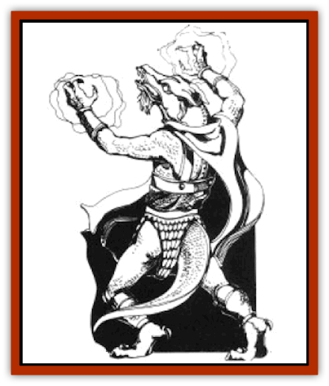

# Draconian - Aurak

| Statistic | **Draconian, Aurak** |
| --- | --- |
| **Activity Cycle:** | Any |
| **Alignment:** | Lawful evil |
| **Armor Class:** | 0 |
| **Climate/Terrain:** | Any, except water |
| **Damage/Attack:** | 3-10 (&times;2) or spell |
| **Diet:** | Special |
| **Frequency:** | Rare |
| **Hit Dice:** | 8 |
| **Intelligence:** | Exceptional (15-16) |
| **Magic Resistance:** | 30% |
| **Morale:** | Champion (15) |
| **Movement:** | 15 |
| **No. Appearing:** | 1-2 |
| **No. of Attacks:** | 2 or 1 |
| **Organization:** | Solitary |
| **Size:** | M (7' tall) |
| **Special Attacks:** | Spells and breath |
| **Special Defenses:** | +4 bonus to saves |
| **THAC0:** | 13 |
| **Treasure:** | K,L,N,V |
| **XP Value:** | 6,000 |

Derived from the eggs of [[Dragon_Metallic_Gold|gold dragons]], Auraks are the most powerful and devious of the [[Draconian_General_Information|draconians]]. Soft-spoken and coldblooded, no act of violence is too extreme for an Aurak.

Auraks are seven-foot-tall, sinewy draconians with short tails and golden scales. Small spines grow from the backs of their heads. They have long, sharp teeth and bulging eyes that are either blood red, green, or black. Their bodies emit a noxious sulphur odor, detectable from several yards away. They wear few clothes, aside from the occasional belt or cape. Auraks are the only wingless draconians.

**Combat:** Auraks experience the agony of their victims as an alphysical pleasure. But they are not impulsive fighters - they strike only after careful planning has minimized all of the risks. Auraks have several natural defenses to frustrate their opponents. They can become *invisible* at will until they attack. They can *polymorph* into any animal their size, three times per day. They can also *change self* three times per day to perfectly imitate any human or humanoid they have ever seen; this effect lasts for 2d6+6 rounds. The heightened senses of Auraks give them infravision to 60 feet, and the ability to detect *hidden* and *invisible* creatures within 40 feet. Auraks can also see through all illusions.

Though Auraks cannot fly, they move as fast as other draconians on the ground. They also have the ability to cast a *dimension door* spell three times per day at a range of 60 yards.

Auraks have three modes of attack. First, they can generate an energy blast from each hand, causing 1d8+2 points of damage at targets up to 60 yards away. When using their *change self* ability, they appear to be using a weapon appropriate to the character they are copying, but they are actually attacking with energy blasts. Second, they can exhale a noxious sulphur cloud five feet in diameter three times per day. Victims caught in the cloud suffer 2d10 points of damage and are blinded for 1d4 rounds (a successful saving throw means half damage and no blindness). Third, Auraks can attack with claws and fangs (1d4/1d4/1d6), though such attacks are seldom used.

Once per day, Auraks can cast two wizard spells of 1st to 4th level. Preferred spells include *enlarge*, *shocking grasp*, *ESP*, *stinking cloud*, *blink*, *lightning bolt*, *fire shield*, and *wall of fire*.

Auraks gain a +4 bonus to all saving throws.

An Aurak's most insidious power is that of mind control. Once per day, it can mind control one creature of equal or fewer Hit Dice for 2d6 rounds. This ability enables the caster to control the actions of the victim as if it were its own body. The victim can avoid the effects of this ability by rolling a successful saving throw vs. spell. If an Aurak concentrates for a full turn, taking no other actions, it can use its suggestion ability; there is no limit to the number of times an Aurak can use this ability.

When an Aurak reaches 0 hit points, it does not die, but instead surrounds itself with green flames and enters a fighting frenzy (+2 bonus to attack and damage rolls). Anyone coming within three feet of the flames suffers 1d6 points of damage, unless a saving throw vs. petrification is successful. Six rounds later, or when the Aurak reaches -20 hit points, it transforms into a spinning ball of lightning, striking once per round as a 13-HD monster to cause 2d6 points of damage. Three rounds later, it explodes, stunning all within ten feet for 1d4 rounds (2d4 rounds if underwater), Those within ten feet also suffer 3d6 points of damage (no saving throw). Items within the range of the explosion must roll successful saving throws vs. crushing blow or be destroyed.

**Habitat/Society:** Because of their superior strength and exceptional abilities, Auraks are easily adaptable to all environments, though they prefer secluded areas. Auraks live alone or in pairs; larger groups of Auraks are never encountered. Auraks collect treasures as souvenirs of their kills; the value of treasure has little meaning for most Auraks.

**Ecology:** Auraks have an almost compulsive need to kill; most intelligent races, including other draconians, have learned to avoid them. There are no limits to what an Aurak will eat, though they prefer pearls and small gems. Auraks will consume alcohol, but they are less interested in strong drink than other draconians.

---
## Discovery & Documentation

**Source Publication:** MC4 Dragonlance Appendix (w/binder #2) (1989)
**Campaign Setting:** Dragonlance
**Author(s):** Rick Swan

### Other Creatures Found in This Source Book
   * [[Anemone_Giant_Sea|Anemone, Giant Sea]]
   * [[Bear_Ice|Bear, Ice]]
   * [[Beast_Undead|Beast, Undead]]
   * [[Bird_Krynn|Bird (Krynn)]]
   * [[Disir|Disir]]
   * [[Draconian_Baaz|Draconian, Baaz]]
   * [[Draconian_Bozak|Draconian, Bozak]]
   * [[Draconian_Kapak|Draconian, Kapak]]
   * [[Draconian_General_Information|Draconian, General Information]]
   * [[Draconian_Sivak|Draconian, Sivak]]
   * [[Draconian_Proto-_Traag|Draconian, Proto-, Traag]]
   * [[Dragon_Amphi|Dragon, Amphi]]
   * [[Dragon_Astral|Dragon, Astral]]
   * [[Dragon_Kodragon|Dragon, Kodragon]]
   * [[Dragon_Krynn_Othlorx_General_Information|Dragon (Krynn), Othlorx, General Information]]
   * [[Dragon_Krynn_General_Information|Dragon (Krynn), General Information]]
   * [[Dragon_Sea|Dragon, Sea]]
   * [[Dreamshadow|Dreamshadow]]
   * [[Dreamwraith|Dreamwraith]]
   * [[Dwarf_Daergar|Dwarf, Daergar]]
   * [[Dwarf_Hill_Neidar|Dwarf, Hill, Neidar]]
   * [[Dwarf_Mountain_Hylar|Dwarf, Mountain, Hylar]]
   * [[Dwarf_Theiwar|Dwarf, Theiwar]]
   * [[Dwarf_Zakhar|Dwarf, Zakhar]]
   * [[Elf_Half-|Elf, Half-]]
   * [[Elf_High_Qualinesti|Elf, High, Qualinesti]]
   * [[Elf_High_Silvanesti|Elf, High, Silvanesti]]
   * [[Elf_Sea_Dargonesti|Elf, Sea, Dargonesti]]
   * [[Elf_Sea_Dimernesti|Elf, Sea, Dimernesti]]
   * [[Elf_Wild_Kagonesti|Elf, Wild, Kagonesti]]
   * [[Eyewing|Eyewing]]
   * [[Fetch|Fetch]]
   * [[Fire_Minion|Fire Minion]]
   * [[Fireshadow|Fireshadow]]
   * [[Gnome_Tinker|Gnome, Tinker]]
   * [[Gurik_Cha'ahl|Gurik Cha'ahl]]
   * [[Haunt_Knight|Haunt, Knight]]
   * [[Horax|Horax]]
   * [[Human_Krynn|Human (Krynn)]]
   * [[Imp_Blood_Sea|Imp, Blood Sea]]
   * [[Kalothagh|Kalothagh]]
   * [[Kani_Doll|Kani Doll]]
   * [[Kender|Kender]]
   * [[Kyrie|Kyrie]]
   * [[Lizard_Man_Krynn|Lizard Man (Krynn)]]
   * [[Minotaur_Krynn|Minotaur, Krynn]]
   * [[Ogre_High|Ogre, High]]
   * [[Ogre_Krynn|Ogre (Krynn)]]
   * [[Phaethon|Phaethon]]
   * [[Saqualaminoi|Saqualaminoi]]
   * [[Shadowperson|Shadowperson]]
   * [[Shimmerweed|Shimmerweed]]
   * [[Skrit|Skrit]]
   * [[Spectral_Minion|Spectral Minion]]
   * [[Spider_Krynn|Spider (Krynn)]]
   * [[Stag|Stag]]
   * [[Tayling|Tayling]]
   * [[Thanoi|Thanoi]]
   * [[Tylor|Tylor]]
   * [[Wichtlin|Wichtlin]]
   * [[Wyndlass|Wyndlass]]
   * [[Yaggol|Yaggol]]
