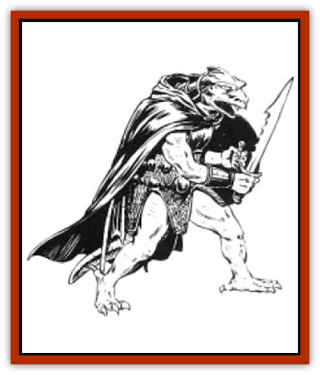

# Draconian - Baaz

| Statistic | **Draconian, Baaz** |
| --- | --- |
| **Activity Cycle:** | Any |
| **Alignment:** | Lawful or chaotic evil |
| **Armor Class:** | 4 |
| **Climate/Terrain:** | Any, but usually tropical and temperate/Forest, plain, and urban |
| **Damage/Attack:** | 1-4/1-4 or by weapon |
| **Diet:** | Special |
| **Frequency:** | Uncommon |
| **Hit Dice:** | 2 |
| **Intelligence:** | Average (8-10) |
| **Magic Resistance:** | 20% |
| **Morale:** | Elite (13) |
| **Movement:** | 6, Run 15 (this movement rate applies when the draconian is running on all fours, flapping its wings), Glide 18 |
| **No. Appearing:** | 2-20 |
| **No. of Attacks:** | 2 or 1 |
| **Organization:** | Band |
| **Size:** | M (5½' tall) |
| **Special Attacks:** | Nil |
| **Special Defenses:** | Nil |
| **THAC0:** | 19 |
| **Treasure:** | M,Q, (D,I,T) |
| **XP Value:** | 175 |

Baaz are the smallest and most plentiful [[Draconian_General_Information|draconians]]. Derived from the eggs of [[Dragon_Metallic_Brass|brass dragons]], they were the first draconians to appear on Krynn.

Baaz have mottled scales in various shades of bronze and dark green. Their eyes are blood red, and they have slightly stooped shoulders. Their fangs are somewhat shorter than those of other draconian races.

Baaz so enjoyed the regal dress of the Dragonarmies that many of them continue to wear it today. Leather collars and breastplates studded with iron are common, as are layered metal leggings. Since this apparel is poorly kept, it is primarily for decoration, offering little in the way of protection.

Baaz are often encountered in disguise. They conceal their wings under long dark robes and hide their features with large hoods and masks. Such outfits enable them to pass through civilized lands unnoticed.

At the bottom of the draconian social order, Baaz tend to be chaotic in nature and self-serving when they can get away with it. During the War of the Lance, they served as common foot soldiers and were routinely assigned the most dangerous and least appealing duties. Their superior officers, along with members other draconian races, made no effort to conceal their contempt for the Baaz, humiliating them at every opportunity. The Baaz deeply resented this treatment, a feeling that still lingers.

**Combat:** Baaz are cruel and sadistic fighters, especially when drunk. They can attack twice in a round with their sharp claws; they can also use their fangs instead of one of the claw attacks (the bite also causes 1d4 points of damage), but they prefer their claws. Baaz use short swords, daggers, and other easily concealed weapons; when concealment is not important, they use long swords and spears. They fight viciously and brutally, aiming their attacks at their opponents. heads and eyes. Alcohol has no significant affect on their ability to fight; if anything, it makes them all the more vicious. If alcohol is available, Baaz always drink before fighting. Drunken Baaz always fight to the death.

If possible, Baaz attempt to ambush their victims by dressing in masks and heavy robes, passing themselves off as harmless humanoids. When their victims are off-guard, the Baaz leader draws his weapon and attacks, screaming for his comrades to do the same. While fighting in their robes, Baaz are limited to a movement rate of 6. After combat is initiated, a Baaz can tear off its robe instead of attacking.

When a Baaz reaches 0 hit points, it turns into a stone statue. The person who struck the death blow must roll a successtul Dexterity Check with a -3 penalty or his weapon is stuck in the statue. The statue crumbles to dust within 1d4 rounds, freeing the weapon. The weapons and armor of the Baaz remain behind after it turns to dust.

**Habitat/Society:** Bands of Baaz lair in abandoned buildings of all kinds. Because of their talents in disguising themselves, they sometimes live unnoticed in abandoned buildings in the center of human settlements. Baaz have a particular affinity for deserted inns and taverns.

Baaz live lawless, disorderly lives, utterly lacking in self-discipline. They regularly engage in drunken raids and random acts of vandalism. Baaz love treasure of all kinds, but they particularly covet brass dragon eggs, believing that the eggs can one day be corrupted to create more Baaz. The magical techniques to create new draconians are hopelessly beyond the meager abilities of the Baaz, but they continue to accumulate the precious eggs, just in case.

**Ecology:** Because the Baaz were responsible for more human deaths during the War of the Lance than any other draconian race, humans hunt them mercilessly. Since the end of the war, the Baaz have won grudging acceptance from other draconians, but relations are strained; the Baaz and the Kapaks, for instance, remain bitter enemies.

Baaz can eat virtually anything, including minerals, carrion, and human flesh. They love alcohol, and even the smallest amounts turn them into raging, boastful brutes.

---
## Discovery & Documentation

**Source Publication:** MC4 Dragonlance Appendix (w/binder #2) (1989)
**Campaign Setting:** Dragonlance
**Author(s):** Rick Swan

### Other Creatures Found in This Source Book
   * [[Anemone_Giant_Sea|Anemone, Giant Sea]]
   * [[Bear_Ice|Bear, Ice]]
   * [[Beast_Undead|Beast, Undead]]
   * [[Bird_Krynn|Bird (Krynn)]]
   * [[Disir|Disir]]
   * [[Draconian_Aurak|Draconian, Aurak]]
   * [[Draconian_Bozak|Draconian, Bozak]]
   * [[Draconian_Kapak|Draconian, Kapak]]
   * [[Draconian_General_Information|Draconian, General Information]]
   * [[Draconian_Sivak|Draconian, Sivak]]
   * [[Draconian_Proto-_Traag|Draconian, Proto-, Traag]]
   * [[Dragon_Amphi|Dragon, Amphi]]
   * [[Dragon_Astral|Dragon, Astral]]
   * [[Dragon_Kodragon|Dragon, Kodragon]]
   * [[Dragon_Krynn_Othlorx_General_Information|Dragon (Krynn), Othlorx, General Information]]
   * [[Dragon_Krynn_General_Information|Dragon (Krynn), General Information]]
   * [[Dragon_Sea|Dragon, Sea]]
   * [[Dreamshadow|Dreamshadow]]
   * [[Dreamwraith|Dreamwraith]]
   * [[Dwarf_Daergar|Dwarf, Daergar]]
   * [[Dwarf_Hill_Neidar|Dwarf, Hill, Neidar]]
   * [[Dwarf_Mountain_Hylar|Dwarf, Mountain, Hylar]]
   * [[Dwarf_Theiwar|Dwarf, Theiwar]]
   * [[Dwarf_Zakhar|Dwarf, Zakhar]]
   * [[Elf_Half-|Elf, Half-]]
   * [[Elf_High_Qualinesti|Elf, High, Qualinesti]]
   * [[Elf_High_Silvanesti|Elf, High, Silvanesti]]
   * [[Elf_Sea_Dargonesti|Elf, Sea, Dargonesti]]
   * [[Elf_Sea_Dimernesti|Elf, Sea, Dimernesti]]
   * [[Elf_Wild_Kagonesti|Elf, Wild, Kagonesti]]
   * [[Eyewing|Eyewing]]
   * [[Fetch|Fetch]]
   * [[Fire_Minion|Fire Minion]]
   * [[Fireshadow|Fireshadow]]
   * [[Gnome_Tinker|Gnome, Tinker]]
   * [[Gurik_Cha'ahl|Gurik Cha'ahl]]
   * [[Haunt_Knight|Haunt, Knight]]
   * [[Horax|Horax]]
   * [[Human_Krynn|Human (Krynn)]]
   * [[Imp_Blood_Sea|Imp, Blood Sea]]
   * [[Kalothagh|Kalothagh]]
   * [[Kani_Doll|Kani Doll]]
   * [[Kender|Kender]]
   * [[Kyrie|Kyrie]]
   * [[Lizard_Man_Krynn|Lizard Man (Krynn)]]
   * [[Minotaur_Krynn|Minotaur, Krynn]]
   * [[Ogre_High|Ogre, High]]
   * [[Ogre_Krynn|Ogre (Krynn)]]
   * [[Phaethon|Phaethon]]
   * [[Saqualaminoi|Saqualaminoi]]
   * [[Shadowperson|Shadowperson]]
   * [[Shimmerweed|Shimmerweed]]
   * [[Skrit|Skrit]]
   * [[Spectral_Minion|Spectral Minion]]
   * [[Spider_Krynn|Spider (Krynn)]]
   * [[Stag|Stag]]
   * [[Tayling|Tayling]]
   * [[Thanoi|Thanoi]]
   * [[Tylor|Tylor]]
   * [[Wichtlin|Wichtlin]]
   * [[Wyndlass|Wyndlass]]
   * [[Yaggol|Yaggol]]
