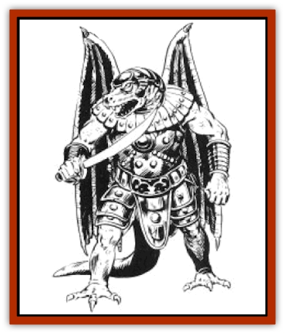

# Draconian - Bozak

| Statistic | **Draconian, Bozak** |
| --- | --- |
| **Activity Cycle:** | Any |
| **Alignment:** | Lawful evil |
| **Armor Class:** | 2 |
| **Climate/Terrain:** | Any, but usually tropical, subtropical, and temperate/Forest |
| **Damage/Attack:** | 1-4/1-4 or by weapon |
| **Diet:** | Special |
| **Frequency:** | Uncommon |
| **Hit Dice:** | 4 |
| **Intelligence:** | Highly (13-14) |
| **Magic Resistance:** | 20% |
| **Morale:** | Elite (13) |
| **Movement:** | 6, Run 15 (this movement rate applies when the draconian is running on all fours, flapping its wings), Glide 18, Fl 6 (E) |
| **No. Appearing:** | 2-20 |
| **No. of Attacks:** | 2 or 1 |
| **Organization:** | Band |
| **Size:** | M (6'+ tall) |
| **Special Attacks:** | Spells |
| **Special Defenses:** | +2 bonus to saves |
| **THAC0:** | 17 |
| **Treasure:** | Q&times;2, (U) |
| **XP Value:** | 1,400 |

Bozaks are magic-using [[Draconian_General_Information|draconians]] derived from the eggs of [[Dragon_Metallic_Bronze|bronze dragons]]. They are quick-witted, shrewd, and ruthless. Bozaks are just over six feet tall and are covered with bronze-colored scales. They have dull yellow eyes and gray teeth.

Though Bozaks eschew armor, since it limits their maneuverability, they often wear helmets, light breastplates, and leather arm and leg bands for body decoration.

Bozak wings are the most versatile of any draconian race. Aside from the [[Draconian_Kapak|Kapak]], the Bozak is the only draconian that can actually fly, albeit only for a single round (because flight requires a great effort, its movement rate in the air is 6). Not only can it glide like other winged draconians, it can sustain the glide indefinitely in a strong wind. On cold days, Bozaks spread their wings to increase exposure to the sunlight. On warm days, they slowly flap their wings to generate cooling breezes. When Bozaks are anxious or lost in thought, their wings twitch and vibrate.

Bozaks are intensely spiritual, devoted to the worship of Takhisis, the Queen of Darkness. They conduct elaborate ceremonies in her honor.

**Combat:** Bozaks are cautious and devious fighters. When possible, they strike from a distance with spells or missile weapons, then charge for melee attacks. A favorite tactic of Bozaks is to charge a victim on all fours, flapping their wings and hissing while clutching swords or other weapons between their teeth. So disconcerting is this sight that the victims are often too startled to take action before the Bozaks are on them.

Bozaks never show mercy once they attack. However, they do not destroy an opponent if they believe their cause can be advanced by sparing the life.

Like [[Draconian_Baaz|Baaz]], Bozaks can make two claw attacks per round, or one claw attack and a bite attack (the bite causes 1d4 points of damage). Favored weapons of the Bozaks are short swords, daggers, or any other weapon that they can carry in their mouths while running. Most Bozaks carry a long bow in addition to a melee weapon.

Bozaks are magic wielders and can cast spells as 4th-level wizards. Among their preferred spells are *burning hands*, *enlarge*, *magic missile*, *shocking grasp*, *invisibility*, *stinking cloud*, and *web*.

Bozaks gain a +2 bonus to all saving throws.

When a Bozak reaches 0 hit points, its scaly flesh shrivels and crumbles from its bones in a cloud of dust; this process takes one round. In the next round, the bones explode, causing 1d6 points of damage to all within ten feet (no saving throw).

**Habitat/Society:** Bozaks prefer to live in secluded forests where they can conduct their religious ceremonies undisturbed. Unlike other draconians, Bozaks construct their own lairs, usually small huts of wood and stone with flat roots, wooden doors, and small openings in the walls for windows. They use large rocks and tree stumps for furniture, and line the floors with soft layers of weeds and twigs.

A Bozak band usually contains 2d10 members, but bands larger than six are rarely encountered. The strongest Bozak serves as the band's leader. In addition to making all the decisions for the band, the leader conducts their religious ceremonies.

Most Bozak lairs have a simple shrine to Takhisis where the band conducts regular services. A typical shrine is a crude idol in the shape of a dragon made of stones and small trees lashed together with vines. The idol, seldom more than a few feet tall, is centered in an open held where all of the vegetation has been scorched black. A circle of charred bones surrounds the shrine. It is here the Bozaks offer prayers to Takhisis and conduct their rituals in her honor.

Bozaks prefer gems and jewelry to all other treasure, and often decorate their shrines with them.

**Ecology:** Though utterly convinced of their superiority, Bozaks feign friendship with other draconian races if it serves their purposes (the gullible Baaz are often exploited by the Bozaks in this way). Bozaks frequently raid human settlements for prisoners. Their diet consists mainly of vegetable matter, carrion, and small mammals.

---
## Discovery & Documentation

**Source Publication:** MC4 Dragonlance Appendix (w/binder #2) (1989)
**Campaign Setting:** Dragonlance
**Author(s):** Rick Swan

### Other Creatures Found in This Source Book
   * [[Anemone_Giant_Sea|Anemone, Giant Sea]]
   * [[Bear_Ice|Bear, Ice]]
   * [[Beast_Undead|Beast, Undead]]
   * [[Bird_Krynn|Bird (Krynn)]]
   * [[Disir|Disir]]
   * [[Draconian_Aurak|Draconian, Aurak]]
   * [[Draconian_Baaz|Draconian, Baaz]]
   * [[Draconian_Kapak|Draconian, Kapak]]
   * [[Draconian_General_Information|Draconian, General Information]]
   * [[Draconian_Sivak|Draconian, Sivak]]
   * [[Draconian_Proto-_Traag|Draconian, Proto-, Traag]]
   * [[Dragon_Amphi|Dragon, Amphi]]
   * [[Dragon_Astral|Dragon, Astral]]
   * [[Dragon_Kodragon|Dragon, Kodragon]]
   * [[Dragon_Krynn_Othlorx_General_Information|Dragon (Krynn), Othlorx, General Information]]
   * [[Dragon_Krynn_General_Information|Dragon (Krynn), General Information]]
   * [[Dragon_Sea|Dragon, Sea]]
   * [[Dreamshadow|Dreamshadow]]
   * [[Dreamwraith|Dreamwraith]]
   * [[Dwarf_Daergar|Dwarf, Daergar]]
   * [[Dwarf_Hill_Neidar|Dwarf, Hill, Neidar]]
   * [[Dwarf_Mountain_Hylar|Dwarf, Mountain, Hylar]]
   * [[Dwarf_Theiwar|Dwarf, Theiwar]]
   * [[Dwarf_Zakhar|Dwarf, Zakhar]]
   * [[Elf_Half-|Elf, Half-]]
   * [[Elf_High_Qualinesti|Elf, High, Qualinesti]]
   * [[Elf_High_Silvanesti|Elf, High, Silvanesti]]
   * [[Elf_Sea_Dargonesti|Elf, Sea, Dargonesti]]
   * [[Elf_Sea_Dimernesti|Elf, Sea, Dimernesti]]
   * [[Elf_Wild_Kagonesti|Elf, Wild, Kagonesti]]
   * [[Eyewing|Eyewing]]
   * [[Fetch|Fetch]]
   * [[Fire_Minion|Fire Minion]]
   * [[Fireshadow|Fireshadow]]
   * [[Gnome_Tinker|Gnome, Tinker]]
   * [[Gurik_Cha'ahl|Gurik Cha'ahl]]
   * [[Haunt_Knight|Haunt, Knight]]
   * [[Horax|Horax]]
   * [[Human_Krynn|Human (Krynn)]]
   * [[Imp_Blood_Sea|Imp, Blood Sea]]
   * [[Kalothagh|Kalothagh]]
   * [[Kani_Doll|Kani Doll]]
   * [[Kender|Kender]]
   * [[Kyrie|Kyrie]]
   * [[Lizard_Man_Krynn|Lizard Man (Krynn)]]
   * [[Minotaur_Krynn|Minotaur, Krynn]]
   * [[Ogre_High|Ogre, High]]
   * [[Ogre_Krynn|Ogre (Krynn)]]
   * [[Phaethon|Phaethon]]
   * [[Saqualaminoi|Saqualaminoi]]
   * [[Shadowperson|Shadowperson]]
   * [[Shimmerweed|Shimmerweed]]
   * [[Skrit|Skrit]]
   * [[Spectral_Minion|Spectral Minion]]
   * [[Spider_Krynn|Spider (Krynn)]]
   * [[Stag|Stag]]
   * [[Tayling|Tayling]]
   * [[Thanoi|Thanoi]]
   * [[Tylor|Tylor]]
   * [[Wichtlin|Wichtlin]]
   * [[Wyndlass|Wyndlass]]
   * [[Yaggol|Yaggol]]
