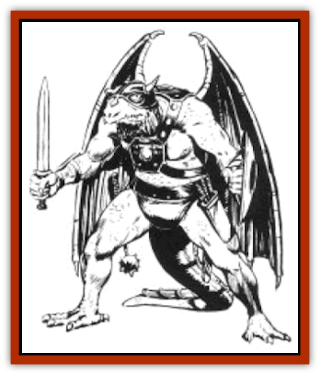

# Draconian - Kapak

| Statistic | **Draconian, Kapak** |
| --- | --- |
| **Activity Cycle:** | Any |
| **Alignment:** | Lawful evil |
| **Armor Class:** | 4 |
| **Climate/Terrain:** | Any, but usually tropical, subtropical, and temperate/Forest and mountain |
| **Damage/Attack:** | 1-4 |
| **Diet:** | Carnivore |
| **Frequency:** | Uncommon |
| **Hit Dice:** | 3 |
| **Intelligence:** | Average (8-10) |
| **Magic Resistance:** | 20% |
| **Morale:** | Elite (13) |
| **Movement:** | 6, Run 15 (this movement rate applies when the draconian is running on all fours, flapping its wings), Glide 18 |
| **No. Appearing:** | 2-20 |
| **No. of Attacks:** | 1 |
| **Organization:** | Band |
| **Size:** | M (6' tall) |
| **Special Attacks:** | Poison |
| **Special Defenses:** | Nil |
| **THAC0:** | 17 |
| **Treasure:** | K,L,M, (I,Y) |
| **XP Value:** | 650 |

Kapaks are a race of venomous [[Draconian_General_Information|draconians]] known for their stealth. They are derived from [[Dragon_Metallic_Copper|copper dragon]] eggs.

Kapaks average six feet tall and have sleek torsos and long limbs. Their scales are dull copper tinged with green, their eyes are orange or dark brown. They have short manes of dark brown or blonde hair hanging from either side of their mouths. Soft pads line the bottoms of their feet, enabling them to move silently. They speak in a soft, high-pitched whine.

The most exotic physical feature of the Kapaks are the poison glands located under their tongues that continuously secrete a venomous spittle. The glands are magical in nature, and are capable of producing a virtually limitless amount of the thick, yellowish venom.

Kapaks avoid any style of clothing that might draw attention to themselves.

**Combat:** Though their intelligence is limited, Kapaks are superb fighters, fiendishly clever in their ability to catch victims offguard and take advantage of opponents' weaknesses. Kapaks rarely attack unless their opponents are at some sort of disadvantage. Because of their cunning, Kapaks make excellent assassins.

Most (70%) Kapaks have the following abilities: move silently (base chance of 15%), hide in shadows (base chance of 10%), and find/remove traps (base chance of base chance of 20%). A few (10%) have these abilities at a higher level. To determine the level of the more skilled Kapaks, roll 1d6 and multiply the result by 5; this gives the percentage increase (above the base) in each skill. (For instance, a roll of 4 indicates a 20% increase over the listed chances.)

Kapaks can bite for 1d4 points of damage, but they prefer to use weapons such as short swords, daggers, slings, bows, maces, and broad swords. Kapaks often lick their weapons before engaging in combat to coat them with venom. Victims bitten by a Kapak or struck by a venom-coated weapon must roll a successful saving throw vs. poison or become paralyzed for 2d6 turns. The poison evaporates from a weapon in three rounds; it takes a Kapak one full round to poison a weapon again after the previous coating has evaporated (they can do this even while engaged in melee).

Kapak frequently wear leather or scale mail armor. Leather armor reduces their AC to 2, while scale mail reduces it to 1. If a shield is carried, the AC is reduced by another point. Because of their strength, wearing armor does not significantly reduce the Kapaks' ability to move.

When a Kapak reaches 0 hit points, its body instantly dissolves into a ten-foot-wide pool of acid. All within the pool suffer 1d8 points of damage per round from the acid (no saving throw). The acid evaporates in 1d6 rounds. All items possessed by the dissolved Kapak, including treasure and magical items, are rendered useless by the acid.

**Habitat/Society:** Kapaks are not builders. Kapak bands occupy abandoned buildings throughout Krynn, primarily in mountain ranges near civilized regions. Towers and castles are favorite Kapak strongholds.

Kapaks seldom have formal leaders, making most decisions by consensus. When disagreements cannot be resolved, a Kapak is just as likely to leave the group as he is to fight for the acceptance of his opinion. Kapaks have great respect for [[Draconian_Aurak|Auraks]], and often allow them to serve as their leaders.

A Kapak band has a common treasure cache; individuals seldom keep more than a few coins for themselves. When a Kapak leaves the band, he takes his share of the group's treasure with him, using it to buy his way into a new band.

**Ecology:** Kapaks are larger than [[Draconian_Baaz|Baaz]] and often bully and abuse their smaller cousins. Consequently, the Baaz hate the Kapaks as much as they do any non-dracoman race. Violent confrontations are common between Baaz and Kapaks. Aside from the Baaz, the Kapaks maintain good relations with other evil races, often hiring themselves out as mercenaries and assassins. Hundreds of Kapaks survived the War of the Lance, and they continue to serve in the remaining Dragonarmies that exist throughout central Ansalon.

Kapaks are strictly carnivorous. Because of their extremely high metabolisms, Kapaks must devour at least 20 pounds of meat per day. They eat fish, wild game, and defeated opponents.

---
## Discovery & Documentation

**Source Publication:** MC4 Dragonlance Appendix (w/binder #2) (1989)
**Campaign Setting:** Dragonlance
**Author(s):** Rick Swan

### Other Creatures Found in This Source Book
   * [[Anemone_Giant_Sea|Anemone, Giant Sea]]
   * [[Bear_Ice|Bear, Ice]]
   * [[Beast_Undead|Beast, Undead]]
   * [[Bird_Krynn|Bird (Krynn)]]
   * [[Disir|Disir]]
   * [[Draconian_Aurak|Draconian, Aurak]]
   * [[Draconian_Baaz|Draconian, Baaz]]
   * [[Draconian_Bozak|Draconian, Bozak]]
   * [[Draconian_General_Information|Draconian, General Information]]
   * [[Draconian_Sivak|Draconian, Sivak]]
   * [[Draconian_Proto-_Traag|Draconian, Proto-, Traag]]
   * [[Dragon_Amphi|Dragon, Amphi]]
   * [[Dragon_Astral|Dragon, Astral]]
   * [[Dragon_Kodragon|Dragon, Kodragon]]
   * [[Dragon_Krynn_Othlorx_General_Information|Dragon (Krynn), Othlorx, General Information]]
   * [[Dragon_Krynn_General_Information|Dragon (Krynn), General Information]]
   * [[Dragon_Sea|Dragon, Sea]]
   * [[Dreamshadow|Dreamshadow]]
   * [[Dreamwraith|Dreamwraith]]
   * [[Dwarf_Daergar|Dwarf, Daergar]]
   * [[Dwarf_Hill_Neidar|Dwarf, Hill, Neidar]]
   * [[Dwarf_Mountain_Hylar|Dwarf, Mountain, Hylar]]
   * [[Dwarf_Theiwar|Dwarf, Theiwar]]
   * [[Dwarf_Zakhar|Dwarf, Zakhar]]
   * [[Elf_Half-|Elf, Half-]]
   * [[Elf_High_Qualinesti|Elf, High, Qualinesti]]
   * [[Elf_High_Silvanesti|Elf, High, Silvanesti]]
   * [[Elf_Sea_Dargonesti|Elf, Sea, Dargonesti]]
   * [[Elf_Sea_Dimernesti|Elf, Sea, Dimernesti]]
   * [[Elf_Wild_Kagonesti|Elf, Wild, Kagonesti]]
   * [[Eyewing|Eyewing]]
   * [[Fetch|Fetch]]
   * [[Fire_Minion|Fire Minion]]
   * [[Fireshadow|Fireshadow]]
   * [[Gnome_Tinker|Gnome, Tinker]]
   * [[Gurik_Cha'ahl|Gurik Cha'ahl]]
   * [[Haunt_Knight|Haunt, Knight]]
   * [[Horax|Horax]]
   * [[Human_Krynn|Human (Krynn)]]
   * [[Imp_Blood_Sea|Imp, Blood Sea]]
   * [[Kalothagh|Kalothagh]]
   * [[Kani_Doll|Kani Doll]]
   * [[Kender|Kender]]
   * [[Kyrie|Kyrie]]
   * [[Lizard_Man_Krynn|Lizard Man (Krynn)]]
   * [[Minotaur_Krynn|Minotaur, Krynn]]
   * [[Ogre_High|Ogre, High]]
   * [[Ogre_Krynn|Ogre (Krynn)]]
   * [[Phaethon|Phaethon]]
   * [[Saqualaminoi|Saqualaminoi]]
   * [[Shadowperson|Shadowperson]]
   * [[Shimmerweed|Shimmerweed]]
   * [[Skrit|Skrit]]
   * [[Spectral_Minion|Spectral Minion]]
   * [[Spider_Krynn|Spider (Krynn)]]
   * [[Stag|Stag]]
   * [[Tayling|Tayling]]
   * [[Thanoi|Thanoi]]
   * [[Tylor|Tylor]]
   * [[Wichtlin|Wichtlin]]
   * [[Wyndlass|Wyndlass]]
   * [[Yaggol|Yaggol]]
