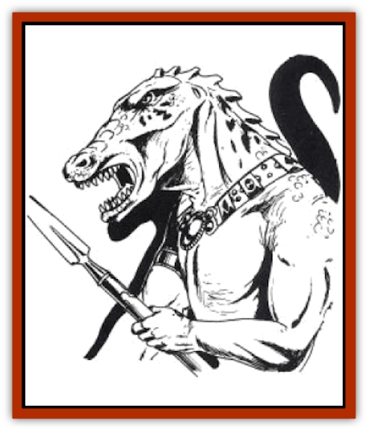

# Draconian - Proto - Traag

| Statistic | **Draconian, Proto-, Traag** |
| --- | --- |
| **Activity Cycle:** | Night |
| **Alignment:** | Chaotic evil |
| **Armor Class:** | 4 |
| **Climate/Terrain:** | Temperate plain or forest |
| **Damage/Attack:** | 1d6/1d6 or by weapon |
| **Diet:** | Carnivore |
| **Frequency:** | Very rare |
| **Hit Dice:** | 3 |
| **Intelligence:** | Low (5-7) |
| **Magic Resistance:** | Nil |
| **Morale:** | Special |
| **Movement:** | 6 |
| **No. Appearing:** | 2d6 |
| **No. of Attacks:** | 2 or 1 |
| **Organization:** | Tribal |
| **Size:** | M (5-6' tall) |
| **Special Attacks:** | None |
| **Special Defenses:** | None |
| **THAC0:** | 17 |
| **Treasure:** | None |
| **XP Value:** | 120 / Chieftain 175 |

The traag draconians are among the first failed attempts to create [[Draconian_General_Information|draconians]], a precursor of the more successful [[Draconian_Baaz|baaz]]. While not overly tall, they are emaciated and gangly. They have sharp taloned hands, and crocodile-like snouts. Their bodies are covered with rough scales of a metallic brass color, a link to their heritage.

**Combat:** Traag draconians are fierce fighters, adept with either weapons or their natural talons. At the same time, they are not naturally courageous, being extremely conscious, even paranoid, of their own weaknesses and numbers. They do not attack unless the odds are in their favor, either through numbers, the element of surprise or clever strategies, or if they have been forced into battle. Thus, their initial morale is only 8.

Once the battle is joined, however, the traag become maniacally fearless. A blood-lust seizes them and they no longer need to check morale for the duration of the fight. They will fight without regard for losses and gain a +1 on all saving throws vs. spells that cause fear (*scare*, *fear*, etc.). This effect only comes into play when the combat is actually joined. Since the traag don't use missile weapons, this is when hand-to-hand combat is conducted.

In combat, the traag often disdain the use of weapons and fight with their claws, which are effective enough. They use weapons when there is some advantage to be gained from using the weapon-attack mode, reach, or other special use.

Upon death, the traag bubble and rot away in a single round, leaving only a slimy puddle behind.

**Habitat/Society:** The traag were one of the first products of the lords' attempts to pervert the eggs of the good dragons to create draconians. (At least, they were one of the first experiments to survive.) For a time, since they lived and were good fighters (when they fought), the lords considered them a success and bred large numbers of them.

Over time, however, the traag began to develop a number of undesirable traits that ultimately made them unsuitable for use in the dragon armies. Most obvious of these is their noteworthy cowardice. Even this alone would not have been sufficient, but coupled with a very low birth rate (each [[Dragon_Metallic_Brass|brass dragon]] egg yielded only a few viable traag) and a tendency to suddenly go berserk, attacking anything or anyone, made the traag a failure. Not wanting to waste time slaughtering them by the thousands, the evil lords simply disposed of their error in the lands of Aurim.

The traag have formed themselves into small tribal bands. Each tribe is led by a chieftain (5 HD, THAC0 15, Dmg 1d8/1d8). These bands of 1d100 + 50 traag live mostly in the deserted villages and cities of ancient Aurim. The more numerous and powerful [[Hobgoblin|hobgoblins]] have made the plains unsafe for their habitation, so the traag have for tified and trapped the ruins as a protection against their powerful neighbors. The old streets are honeycombed with hidden sally ports, rockfalls, dead ends, and concealed ways.

The villages are normally organized in a similar manner. At the center of the rums is the tribal headquarters. There are always at least two paths to this and sometimes more. Fanning out from the center are different encampments, or "divislons" as the traag call them. Each division has 1d20 + 10 members. These divisions have varying responsibilities, usually assigned the duty of guarding a specific post or hunting in a given territory.

Because the traag are created, they have only one sex (male for lack of a better name). There are no young or dependents. All members of the tribe are warriors - they are more completely mobilized than any other group in Taladas. This has led them to increasing dominance in Aurim.

**Ecology:** Although carnivorous, the traag are often reduced to scavenging. Unwilling to hunt for great lengths of time on the plains, they are almost universally under-nourished. It's not surprising then that they will eat virtually anything (even hobgoblin) that is put in front of them.

---
## Discovery & Documentation

**Source Publication:** MC4 Dragonlance Appendix (w/binder #2) (1989)
**Campaign Setting:** Dragonlance
**Author(s):** Rick Swan

### Other Creatures Found in This Source Book
   * [[Anemone_Giant_Sea|Anemone, Giant Sea]]
   * [[Bear_Ice|Bear, Ice]]
   * [[Beast_Undead|Beast, Undead]]
   * [[Bird_Krynn|Bird (Krynn)]]
   * [[Disir|Disir]]
   * [[Draconian_Aurak|Draconian, Aurak]]
   * [[Draconian_Baaz|Draconian, Baaz]]
   * [[Draconian_Bozak|Draconian, Bozak]]
   * [[Draconian_Kapak|Draconian, Kapak]]
   * [[Draconian_General_Information|Draconian, General Information]]
   * [[Draconian_Sivak|Draconian, Sivak]]
   * [[Dragon_Amphi|Dragon, Amphi]]
   * [[Dragon_Astral|Dragon, Astral]]
   * [[Dragon_Kodragon|Dragon, Kodragon]]
   * [[Dragon_Krynn_Othlorx_General_Information|Dragon (Krynn), Othlorx, General Information]]
   * [[Dragon_Krynn_General_Information|Dragon (Krynn), General Information]]
   * [[Dragon_Sea|Dragon, Sea]]
   * [[Dreamshadow|Dreamshadow]]
   * [[Dreamwraith|Dreamwraith]]
   * [[Dwarf_Daergar|Dwarf, Daergar]]
   * [[Dwarf_Hill_Neidar|Dwarf, Hill, Neidar]]
   * [[Dwarf_Mountain_Hylar|Dwarf, Mountain, Hylar]]
   * [[Dwarf_Theiwar|Dwarf, Theiwar]]
   * [[Dwarf_Zakhar|Dwarf, Zakhar]]
   * [[Elf_Half-|Elf, Half-]]
   * [[Elf_High_Qualinesti|Elf, High, Qualinesti]]
   * [[Elf_High_Silvanesti|Elf, High, Silvanesti]]
   * [[Elf_Sea_Dargonesti|Elf, Sea, Dargonesti]]
   * [[Elf_Sea_Dimernesti|Elf, Sea, Dimernesti]]
   * [[Elf_Wild_Kagonesti|Elf, Wild, Kagonesti]]
   * [[Eyewing|Eyewing]]
   * [[Fetch|Fetch]]
   * [[Fire_Minion|Fire Minion]]
   * [[Fireshadow|Fireshadow]]
   * [[Gnome_Tinker|Gnome, Tinker]]
   * [[Gurik_Cha'ahl|Gurik Cha'ahl]]
   * [[Haunt_Knight|Haunt, Knight]]
   * [[Horax|Horax]]
   * [[Human_Krynn|Human (Krynn)]]
   * [[Imp_Blood_Sea|Imp, Blood Sea]]
   * [[Kalothagh|Kalothagh]]
   * [[Kani_Doll|Kani Doll]]
   * [[Kender|Kender]]
   * [[Kyrie|Kyrie]]
   * [[Lizard_Man_Krynn|Lizard Man (Krynn)]]
   * [[Minotaur_Krynn|Minotaur, Krynn]]
   * [[Ogre_High|Ogre, High]]
   * [[Ogre_Krynn|Ogre (Krynn)]]
   * [[Phaethon|Phaethon]]
   * [[Saqualaminoi|Saqualaminoi]]
   * [[Shadowperson|Shadowperson]]
   * [[Shimmerweed|Shimmerweed]]
   * [[Skrit|Skrit]]
   * [[Spectral_Minion|Spectral Minion]]
   * [[Spider_Krynn|Spider (Krynn)]]
   * [[Stag|Stag]]
   * [[Tayling|Tayling]]
   * [[Thanoi|Thanoi]]
   * [[Tylor|Tylor]]
   * [[Wichtlin|Wichtlin]]
   * [[Wyndlass|Wyndlass]]
   * [[Yaggol|Yaggol]]
