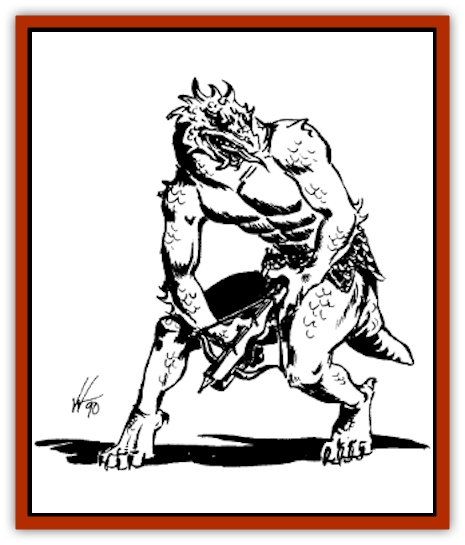
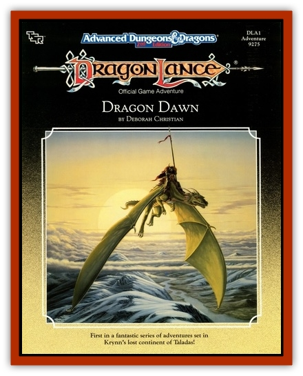

# Draconian - Sesk

| Statistic | **Draconian, Sesk** |
| --- | --- |
| **Activity Cycle:** | Day |
| **Alignment:** | Neutral evil |
| **Armor Class:** | 6 |
| **Climate/Terrain:** | Temperate plain or forest |
| **Damage/Attack:** | 1d4/1d4 (claw/claw) or by weapon |
| **Diet:** | Carnivore |
| **Frequency:** | Very Rare |
| **Hit Dice:** | 2 |
| **Intelligence:** | Average (8-11) |
| **Magic Resistance:** | Nil |
| **Morale:** |  |
| **Movement:** | 9 |
| **No. Appearing:** | 2d6 |
| **No. of Attacks:** | 2 or 1 |
| **Organization:** | Tribal |
| **Size:** | M (4-5' tall) |
| **Special Attacks:** | +1 to hit with claws |
| **Special Defenses:** | None |
| **THAC0:** | 18 |
| **Treasure:** | None |
| **XP Value:** | 100 / Chieftain: 150 |

The sesk are remnants of the early experiments to create [[Draconian_General_Information|draconians]]. Somewhat shorter than the average draconian, they stand with a hunched posture as if favoring a cramped limb. Their bodies are twisted and appear to be out of proportion to their general build. A reptilian jaw and brow, vestigial tail, and silverhued scales hint at the origin of these malformed draconians.

**Combat:** Sesk draconians are poor fighters, hampered not so much by will as by the physical limitations of their misshapen bodies. When combat is inevitable, they prefer to attack from ambush or places of concealment, employing missile weapons that give them an advantage while keeping them out of melee range. Crossbows are forgiving of the sesk's lack of dexterity, and are the weapon favored by these draconians. In close quarters they use the short sword, which does not require much brute strength.

The sesk avoid combat whenever possible, relying on cunning and treachery to achieve their ends instead. They are accomplished builders of snares and traps, and prefer to catch their prey with stealth rather than an outright attack.

If forced into battle they are competent fighters, but do not do combat with the bloodthirstiness of some other draconians. If close pressed, the sesk drop their weapons and resort to the use of claws. This is a reaction of panic, for their claws are less useful than many weapons; nevertheless, a sesk forced to fight with its natural weaponry gains +1 to hit for the fervor of its defense.

When slain, the sesk appear to shrink in upon themselves, dehydrating and turning to fine silvery dust in a single round.

**Habitat/Society:** The sesk were one of the experiments in draconian creation that the evil lords abandoned early on. Created from the eggs of [[Dragon_Metallic_Silver|silver dragons]], their masters found the sesk were smarter than the average draconian, with a cleverness and cunning far beyond that of their peers. Yet their bodies were oddly twisted, as if silver dragon blood rebelled at this unwonted usage. The sesk were incapable of fighting as well as the evil lords had hoped, and proved far too creative and questioning of authority to swiftly and unquestionably follow orders.

Since these twisted vessels were patently unsuitable for their ends, the evil lords abandoned their experiment and banished the sesk to the wilderness of the Conquered Lands. The sesk migrated eastward until the peoples of the Steamwall region prevented their further advance. There the sesk have curried favor with the [[Hurdu|hurdu]], living in ruins shunned by those lizard men, and aiding them in their battles with the [[Hobgoblin|hobgoblins]] who vie with the hurdu for dominance in the foothills.

Sesk live in villages organized loosely along tribal lines, near and sometimes among the hurdu clans with whom they closely associate. Each tribe numbers from 20-80 sesk (2d4 x 10), and is led by a chieftain (4 HD, THAC0 16, Dmg 1d6/1d6).

**Ecology:** The carnivorous sesk successfully trap most of what they eat. They often trade foodstuffs with the hurdu, but when ranging away from home are self-sufficient in the wilderness. As long as it is freshly killed, they are not picky about the flesh they eat, and will consume anything from field mice to humans when hungry. When fed until full, a sesk can then go for the space of a few days without eating.

The sesk preference for trapping and catching their food compels them to set up snares and wait at least a day for them to capture food. For this reason, sesk move into an area, stay for one or more days collecting food, then travel without stopping while fueled by their bodies' reserves.

When generating statistics for significant sesk, these draconians are -1 STR, -1 DEX, and +2 INT. Sesk have the Set Snares proficiency.

---
## Discovery & Documentation

**Source Publication:** DLA1 Dragon Dawn (1985)
**Campaign Setting:** Dragonlance
**Author(s):** Deborah Christian

### Other Creatures Found in This Source Book
   * [[Hurdu|Hurdu]]
