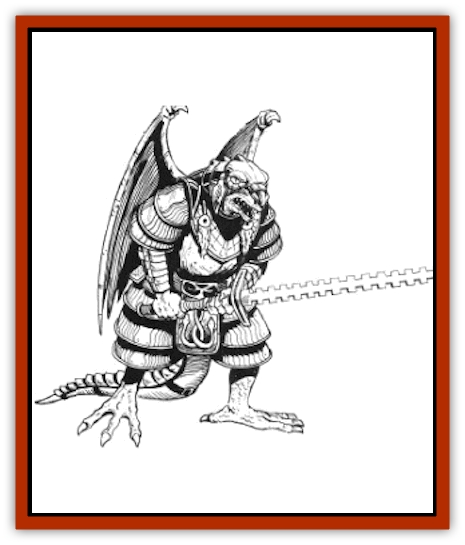

# Draconian - Sivak

| Statistic | **Draconian, Sivak** |
| --- | --- |
| **Activity Cycle:** | Any |
| **Alignment:** | Neutral evil |
| **Armor Class:** | 1 |
| **Climate/Terrain:** | Any, but usually tropical, subtropical, and temperate/Mountain and hill |
| **Damage/Attack:** | 1-6/1-6/2-12 or by weapon |
| **Diet:** | Special |
| **Frequency:** | Uncommon |
| **Hit Dice:** | 6 |
| **Intelligence:** | Highly (13-14) |
| **Magic Resistance:** | 20% |
| **Morale:** | Elite (14) |
| **Movement:** | 6, Run 15 (this movement rate applies when the draconian is running on all fours, flapping its wings), Glide 18, Fl 24 (C) |
| **No. Appearing:** | 2-20 |
| **No. of Attacks:** | 3 or 1 |
| **Organization:** | Band |
| **Size:** | L (9' tall) |
| **Special Attacks:** | None |
| **Special Defenses:** | +2 bonus to saves |
| **THAC0:** | 15 |
| **Treasure:** | Q,½V, (Z) |
| **XP Value:** | 2,000 |

Sivaks are savage, shapechanging draconians that are derived from the eggs of [[Dragon_Metallic_Silver|silver dragons]]. They are among the most powerful draconians, second only to [[Draconian_Aurak|Auraks]].

Sivaks have gleaming sliver scales and black eyes. Topping nine feet in height, they are the largest draconian race. They emit a mild odor that smells ilke hot metal and smoke. Sivaks seldom wear armor, but they sometimes wear flowing capes and decorative metal bands around their arms, legs, necks, and tails.

Sivaks can run and glide like most other draconian races, but they are unique in their ability to fly. They are extremely agile in the air, as maneuverable as [[Dragon_General_Information|dragons]] and nearly as fast.

**Combat:** Like most draconians, Sivaks relish the suffering of their victims; but Sivaks are particularly nasty, no victim is too small or too weak to be victimized by a Sivaks. Sivaks work especially well in teams defending one another against unexpected attacks and surrounding opponents to assault them from all sides. Sivaks do not fight carelessly. Unless ordered by a strong leader, they do not go into battle when the odds are stacked against them, nor do they venture into an area where an ambush is possible. They refuse to fight to the death, flying to safety if a battle turns against them.

The Sivaks' movement flexibility gives them an important tactical advantage. They can race forward on all fours, silently glide from a height, or attack from the air. Many opponents are unfamiliar with the existence of flying draconians, glving the Sivaks the additional advantage of surprise - for instance, a Sivak charging on all fours can suddenly take to the air and swoop at its opponent from behind.

Sivaks are also powerful shapechangers. When a Sivak slays a humanoid of its size or smaller, it can take the form of the victim. It does not gain the memories, experiences, or spell use of its victim and, like all draconians, it contniues to radiate magic, but its appearance and voice are exact matches to those of the victim. A Sivak can remain in this new form as long as it wishes. A Sivak can change back to its normal form at any time. but cannot shapechange again until it kills another victim.

Sivaks use their shapechanging ability to explore or spy in lands hostile to draconians. A shapechanged Sivak can penetrate deep into a enemy stronghold, or it can secretly observe humanoid enemies. A shapechanged Sivak can kidnap an opponent, destroy him, then shapechange to the form of this victim.

Sivaks attack with both claws for 1d6 points of damdge each and with their long, heavy tails for 2d6 points of damage (the tails can strike opponents on any side). They also use a variety of weapons, including long swords, two-handed swords, battle axes, and spears. A favorite weapon is a Sivak-designed sword with barbed notches on each edge: this weapon causes 1d10 points of damage. Sivaks also use magical weapons whenever available.

Sivaks gain a +2 bonus to all saving throws.

What happens to a Sivak when it reaches 0 hit points depends on the size of its slayer. If the slayer was a humanoid the same size as or smaller than the Sivak, the slain Sivak shapechanges into the form of its slayer. It remains in its death shape for three days, after which time it decomposes into black soot. It the slayer was not a humanoid or if it was a humanoid larger than the Sivak, the Sivak immediately bursts into flame upon reaching 0 hp, causing 2d4 points of damage to all within ten feet (no saving throw).

**Habitat/Society:** Sivak bands usually can be found in secluded mountain caves. Sivaks are not particularly ambitious. They make decisions by consensus and spend most of their time waylaying travelers. They enjoy all types of gambling, wagering money, food, alcohol, or prisoners on endless card and dice games. They welcome any opportunity to steal magical items and are also fond of gems and jewelry.

**Ecology:** Sivaks are distrustful of other draconian races and generally avoid them. They sometimes ally with a powerful Aurak leader or join with a [[Draconian_Kapak|Kapak]] band for some recreational slaughter of the [[Draconian_Baaz|Baaz]]. Sivaks are tend of strong drink, but like the Baaz, alcohol has no significant effect on their ability to fight. Sivaks eat virtually anything, and have a special fondness for elven flesh.

---
## Discovery & Documentation

**Source Publication:** MC4 Dragonlance Appendix (w/binder #2) (1989)
**Campaign Setting:** Dragonlance
**Author(s):** Rick Swan

### Other Creatures Found in This Source Book
   * [[Anemone_Giant_Sea|Anemone, Giant Sea]]
   * [[Bear_Ice|Bear, Ice]]
   * [[Beast_Undead|Beast, Undead]]
   * [[Bird_Krynn|Bird (Krynn)]]
   * [[Disir|Disir]]
   * [[Draconian_Aurak|Draconian, Aurak]]
   * [[Draconian_Baaz|Draconian, Baaz]]
   * [[Draconian_Bozak|Draconian, Bozak]]
   * [[Draconian_Kapak|Draconian, Kapak]]
   * [[Draconian_General_Information|Draconian, General Information]]
   * [[Draconian_Proto-_Traag|Draconian, Proto-, Traag]]
   * [[Dragon_Amphi|Dragon, Amphi]]
   * [[Dragon_Astral|Dragon, Astral]]
   * [[Dragon_Kodragon|Dragon, Kodragon]]
   * [[Dragon_Krynn_Othlorx_General_Information|Dragon (Krynn), Othlorx, General Information]]
   * [[Dragon_Krynn_General_Information|Dragon (Krynn), General Information]]
   * [[Dragon_Sea|Dragon, Sea]]
   * [[Dreamshadow|Dreamshadow]]
   * [[Dreamwraith|Dreamwraith]]
   * [[Dwarf_Daergar|Dwarf, Daergar]]
   * [[Dwarf_Hill_Neidar|Dwarf, Hill, Neidar]]
   * [[Dwarf_Mountain_Hylar|Dwarf, Mountain, Hylar]]
   * [[Dwarf_Theiwar|Dwarf, Theiwar]]
   * [[Dwarf_Zakhar|Dwarf, Zakhar]]
   * [[Elf_Half-|Elf, Half-]]
   * [[Elf_High_Qualinesti|Elf, High, Qualinesti]]
   * [[Elf_High_Silvanesti|Elf, High, Silvanesti]]
   * [[Elf_Sea_Dargonesti|Elf, Sea, Dargonesti]]
   * [[Elf_Sea_Dimernesti|Elf, Sea, Dimernesti]]
   * [[Elf_Wild_Kagonesti|Elf, Wild, Kagonesti]]
   * [[Eyewing|Eyewing]]
   * [[Fetch|Fetch]]
   * [[Fire_Minion|Fire Minion]]
   * [[Fireshadow|Fireshadow]]
   * [[Gnome_Tinker|Gnome, Tinker]]
   * [[Gurik_Cha'ahl|Gurik Cha'ahl]]
   * [[Haunt_Knight|Haunt, Knight]]
   * [[Horax|Horax]]
   * [[Human_Krynn|Human (Krynn)]]
   * [[Imp_Blood_Sea|Imp, Blood Sea]]
   * [[Kalothagh|Kalothagh]]
   * [[Kani_Doll|Kani Doll]]
   * [[Kender|Kender]]
   * [[Kyrie|Kyrie]]
   * [[Lizard_Man_Krynn|Lizard Man (Krynn)]]
   * [[Minotaur_Krynn|Minotaur, Krynn]]
   * [[Ogre_High|Ogre, High]]
   * [[Ogre_Krynn|Ogre (Krynn)]]
   * [[Phaethon|Phaethon]]
   * [[Saqualaminoi|Saqualaminoi]]
   * [[Shadowperson|Shadowperson]]
   * [[Shimmerweed|Shimmerweed]]
   * [[Skrit|Skrit]]
   * [[Spectral_Minion|Spectral Minion]]
   * [[Spider_Krynn|Spider (Krynn)]]
   * [[Stag|Stag]]
   * [[Tayling|Tayling]]
   * [[Thanoi|Thanoi]]
   * [[Tylor|Tylor]]
   * [[Wichtlin|Wichtlin]]
   * [[Wyndlass|Wyndlass]]
   * [[Yaggol|Yaggol]]
