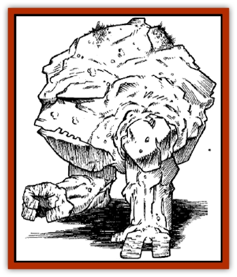

# Dragger

| Statistic | **Dragger** |
| --- | --- |
| **Activity Cycle:** | Any |
| **Alignment:** | Neutral |
| **Armor Class:** | 0 |
| **Climate/Terrain:** | Any (caverns or subterranean) |
| **Damage/Attack:** | 3d4 per round (digestive juices) |
| **Diet:** | Omnivorous |
| **Frequency:** | Rare |
| **Hit Dice:** | 2-6 |
| **Intelligence:** | Low (5) |
| **Magic Resistance:** | Nil |
| **Morale:** | Fearless (20) |
| **Movement:** | 12, burrow 9 |
| **No. Appearing:** | 1d6 |
| **No. of Attacks:** | 1 |
| **Organization:** | Solitary |
| **Size:** | L (8-12' in diameter) |
| **Special Attacks:** | Swallow whole |
| **Special Defenses:** | Immune to most spells, half-damage from edged and piercing weapons |
| **THAC0:** | 19 (2 HD) / 17 (3-4 HD) / 15 (5-6 HD) |
| **Treasure:** | Q |
| **XP Value:** | 2 Hit Dice: 975 / 3 Hit Dice: 1,400 / 4 Hit Dice: 2,000 / 5 Hit Dice: 3,000 / 6 Hit Dice: 4,000 |

Draggers are usually encountered in natural caverns, though many are to be found in the underways of Ravens Bluff, where they have been the doom of more than a few smugglers down the years. Like their cousins the [[Galeb_Duhr|galeb duhr]], draggers resemble boulders, with a single pair of appendages acting as both hands and feet and with huge mouths that seem mere fissures in rock when closed. Draggers are natives of the Plane of Elemental Earth and are able to propel themselves through stone.

**Combat:** A dragger typically "floats" in a section of floor, camouflaging itself through its ability to create *hallucinatory terrain* at will in a ten-foot-square area centered on itself. Anything stepping upon the hidden dragger risks being swallowed by the creature's gaping maw (such a target is considered to be AC 10, exclusive of Dexterity bonuses). If the initial attack fails, the dragger will submerge beneath the ground to a place of safety, returning to the same spot 2d4 turns later. Should the attack succeed, the dragger's target will have one or more appendages (usually feet) trapped in the creature's jaws. On the following round, the dragger will momentarily loosen its grip as it attempts to swallow the victim. A successful saving throw vs. paralyzation indicates that the prey manages to wriggle free at this time; each being helping the victim adds a +1 bonus to the roll. Should the save be unsuccessful, the prey is sucked into the dragger's gullet. On the next round, the dragger sinks into the ground to enjoy its meal safe from harm.

Should the creature be slain before it withdraws, captured prey can be freed in 14 rounds but suffers 3d4 hit points of damage per round from the dragger's corrosive digestive juices. Draggers can digest virtually anything except gems (their treasure, if any, consists of gems carried by previously swallowed victims).

Draggers can be struck by any sort of weapon, although edged and piercing weapons do only half damage. Spells don't affect draggers, except as follows: *magic missile* inflicts normal damage; *move earth* causes the dragger to immediately depart for 14 turns, first releasing any prey not already swallowed; *stone to flesh* lowers a dragger's Armor Class to 10 for the spell duration, immobilizing the creature if it is submerged in stone at the time (if only partially submerged, it can force itself out of the stone in 1 round at the cost of 2d4+2 hit points abrasion damage); *stone shape* can be used to force a dragger's jaws through one involuntary movement and then hold it in the new position for the spell duration (in other words, to either hold the jaws shut or to force the dragger to open wide and disgorge a swallowed victim); and *transmute rock to mud* fully heals the creature (they otherwise heal 1 lost hit point per day, as many other creatures do).

**Habitat/Society:** Draggers are solitary, sexless hunters. When they reach an unstable size (i.e., above 6 HD) through diligent devouring, they split to form two to four smaller (2 HD) draggers, expelling all previously ingested gems in the process. The new individuals may stay together for a time but as they grow they move apart to find their own hunting grounds. They have no social interaction but never fight each other; if two draggers encounter each other in an area heavily trafficked by prey they may feed side by side for a time, but otherwise they'll always instinctively move apart. Draggers have been known to go dormant for long periods of time, hiding inside solid rock and ignoring food nearby; no good reasons for this behavior has yet been offered.

**Ecology:** Draggers are carnivores, eating all manner of birds, reptiles, and mammals. They ignore most plants, devouring only ambulatory sorts, but avidly swallow fungi. They otherwise place no value judgments on food: edible is edible, and a dragger won't choose a larger or more formidable meal over a lesser (or vice versa). Regardless of the size of prey it eats, a dragger will try to devour prey only once every three hours or so, ignoring other possible targets after one try (successful or not). They are capable of going months if not years between meals.

---
## Discovery & Documentation

**Source Publication:** The City of Ravens Bluff (1998)
**Campaign Setting:** Forgotten Realms
**Author(s):** Ed Greenwood

### Other Creatures Found in This Source Book
   * [[Dragon_Eormennoth|Dragon, Eormennoth]]
   * [[Hag_Sea_Greater|Hag, Sea, Greater]]
   * [[Raven_Greater|Raven, Greater]]
