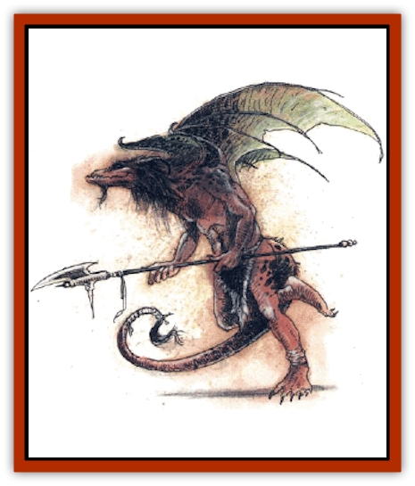

# Dragon-kin

| Statistic | **Cult of the Dragon** | **Tribal** |
| --- | --- | --- |
| **Activity Cycle:** | See below | Any |
| **Alignment:** | Chaotic evil | Chaotic evil |
| **Armor Class:** | 3 | 3 |
| **Climate/Terrain:** | Any land | Any land |
| **Damage/Attack:** | 1d6/1d6 or by weapon plus 2d8 with rear-claw rake / when airborne | 1d6/1d6 or by weapon |
| **Diet:** | Omnivore | Omnivore |
| **Frequency:** | Very rare | Very rare |
| **Hit Dice:** | 7 | 7 |
| **Intelligence:** | Average (8-10) | Average (8-10) |
| **Magic Resistance:** | Nil | Nil |
| **Morale:** | Fanatic (17-18) | Champion (15-16) |
| **Movement:** | 6,Fl 15 (B) | 6, Fl 15 (B) |
| **No. Appearing:** | 2d8 | 2d8 |
| **No. of Attacks:** | 2 or 1 (2 or 3 when airborne) | 2 or 1 |
| **Organization:** | Tribe | Tribe |
| **Size:** | L (7-9' long including tail) | L (7-9' long including tail) |
| **Special Attacks:** | Nil | Nil |
| **Special Defenses:** | Nil | Nil |
| **THAC0:** | 13 | 13 |
| **Treasure:** | V | See below |
| **XP Value:** | 2,000 | 1,400 |

These creatures are rumored to be very distant cousins of [[Dragon_General_Information|dragons]]. Most dragon-kin live wild, and this type is known as tribal dragon-kin. The Cult of the Dragon has managed to gain (or regain) control over a few dragon-kin tribes; it has been allowed to impose more discipline on dragon-kin society in exchange for teaching Cult dragon-kin additional combat skills and keeping key members of these tribes in power through judicious gifts of magical items.

Dragon-kin have developed bipedal humanoid characteristics, but they still possess a dragonlike face and wings, claws, a tail, horns, and a sort of mane/beard that certain dragons have. Their coloration ranges from a dark yellow ocher to a reddish brown with darker spots or bands. Most have green wings that lighten to gold or yellow, though some have wings that match their body coloration. All are covered in scales that are larger and rougher over their backs and tails, but more supple, though still tough, across their torsos and limbs. Their head horns are swept back and small, and function decoratively (and perhaps defensively to protect their skulls), not offensively.

Dragon-kin speak their own sibilant language (a corrupt dialect of Auld Wyrmish) and can speak a rough form of common as well.

**Combat:** When they expect combat, tribal dragon-kin take to the air so they can have the upper hand. They remain airborne as long as possible, then swoop down to rake their targets with their foreclaws.

All dragon-kin can *detect magic* at will, and tribal dragon-kin target beings carrying magical items over others, as their overriding instinct is to acquire these items. When a tribal dragon-kin notices a magical item, it tries to take it away from its holder and flee with it to its lair. If the dragon-kin makes a successful attack roll against the item (treat an item as AC 10, with bonuses [or penalties] to its Armor Class equal to any magical bonuses it has plus the holder.s Dexterity bonuses), it seizes the item. A contest of Strength then commences between the dragon-kin and the item's owner. The first of the two to fail a Strength check (consider the dragon-kin to have a Str 13) loses his or her grip on the item. At the best opportunity, the dragon-kin then absconds with the item. Half of the time, it does not return to the fight, remaining in its cave instead to admire its newfound acquisition.

If forced to bring combat to the ground, all dragon-kin move in and use their claws or weapons, such as spears or pole arms, which they favor. Tribal dragon-kin are easily distracted by magical items, especially if one of them becomes "separated" from its owner. However, when forced to fight on the ground, they are not as likely to flee from combat if they can wrest a magical item from its owner. Unless they can do so without fear of retaliation, they will stay and resolve the combat. They are smart enough to guard against back attacks and never, under any circumstance, allow themselves to be attacked from such a disadvantageous position if it can possibly be avoided.

Tribal dragon-kin never use their captured magical items in combat for fear of losing them. This is viewed as their biggest disadvantage, for they are forced instead to rely on mundane weapons or their claws. This, unfortunately for the dragon-kin, makes them easy targets for those with experience in fighting aerial creatures. Cult dragon-kin, however, use any magical items suitable for combat in combat, especially those that have been given to them by their Cult allies.

Cult dragon-kin also feel the pull of magical items, but their training allows them to overcome their acquisitive instincts in favor of their mission. However, if they feel they can justify seizing a magical item in pursuit of whatever duty they have been assigned, they do so without hesitation using the above procedure. Unless the item is a simple weapon they can immediately use (such as a spear, pole arm, or sword), they keep the item and continue the fight.

When airborne, Cult dragon-kin attack with both their foreclaws and also rake with their back claws. The rear-claw attack is a single rake with both rear claws that inflicts 2d8 points of damage on a successful hit. Cult dragon-kin have also been trained to use missile weapons such as bows or javelins while aloft.

**Habitat/Society:** Dragon-kin normally live in a tribal setting. Their leader is determined by combat and ownership of the most powerful magical items. Any leader defeated in combat, but not killed, is eliminated and replaced by the tribe.

If an adventuring party should happen into a dragon-kin den, its members will find half of the residents left to protect what is theirs. If these are defeated, there are 1d2 nonpermanent magical items (for example, potions) per resident dragon-kin. There is a cumulative 10% chance per resident that a permanent magical item is in the batch. Hence, a lair of six has a 60% chance of containing a permanent item, and there is always at least one permanent item in a lair of 10 or more.

Dragon-kin are often found in the service of a powerful Cult dragon or mage. Unless magically compelled, most dragon-kin refuse to serve a [[Dracolich|dracolich]]. Regardless of their master (if any), dragon-kin retain their dragon-kin urge to collect magical treasure. This very likely is the reason many tribes agree to work with Cult members, who offer them all sorts of (mostly worthless) magical treasure.

Cult dragon-kin are allowed by their Cult masters to keep quite a few of the magical items they acquire so long as they turn their acquisitions over to the Cult to be examined first. Any seized magical items the Cult deems it necessary to keep are paid for through gifts of nonpermanent magical items (such as potions), simple weapons the Cult feels present its forces with a tactical advantage, and magical gewgaws that look impressive but are actually the recipients of such spells as *Nystul's magical aura*.

**Ecology:** Tribal dragon-kin are a blight on any area's ecology. They have no regard for others and simply take what they want. They have no natural predators, although there is a large bounty for them in any place that has known their depredations. They eat nearly anything that can be chewed, although they prefer meat, especially that of sentient beings, since they like to torment their food.

Unlike their larger cousins, tribal dragon-kin have no love of conventional treasure. If a hoard has no magic, they are not interested in it. Tribal dragon-kin simply leave coins and nonmagical items where they lie. There is a 50% chance that tribal dragon-kin will attack a party if it is not carrying magical items. They always attack those who carry such items.

Cult dragon-kin are more disciplined and are fierce fighters for the Cult cause. They obey their Cult masters willingly for the promise of wealth and magic. They have learned to value mundane wealth somewhat for the occasional items or services of use that it can buy. Cult dragon-kin eat only meat except in extreme circumstances. Aside from sentient species, who the Cult is trying to discourage them from preying on (it attracts too much attention), they seem to prefer the taste of deer, pheasants, other wild game, and goats.

---
## Discovery & Documentation

**Source Publication:** Monstrous Compendium, 1994 Annual, Volume 1 (1995)
**Campaign Setting:** Advanced Dungeons & Dragons 2nd Edition
**Author(s):** David Wise

### Other Creatures Found in This Source Book
   * [[Abyss_Ant|Abyss Ant]]
   * [[Achaierai|Achaierai]]
   * [[Afanc|Afanc]]
   * [[Al-Jahar|Al-Jahar]]
   * [[Baelnorn|Baelnorn]]
   * [[Baneguard|Baneguard]]
   * [[Banelar|Banelar]]
   * [[Bird_Talking|Bird, Talking]]
   * [[Blazing_Bones|Blazing Bones]]
   * [[Campestri|Campestri]]
   * [[Caniquine|Caniquine]]
   * [[Cat_Winged|Cat, Winged]]
   * [[Crypt_Servant|Crypt Servant]]
   * [[Death's_Head_Tree|Death's Head Tree]]
   * [[Dog_Saluqi|Dog, Saluqi]]
   * [[Dragon_Electrum|Dragon, Electrum]]
   * [[Dragon_Fang|Dragon, Fang]]
   * [[Dragon_Linnorm_Corpse_Tearer|Dragon, Linnorm, Corpse Tearer]]
   * [[Dragon_Linnorm_Dread|Dragon, Linnorm, Dread]]
   * [[Dragon_Linnorm_Flame|Dragon, Linnorm, Flame]]
   * [[Dragon_Linnorm_Forest|Dragon, Linnorm, Forest]]
   * [[Dragon_Linnorm_Frost|Dragon, Linnorm, Frost]]
   * [[Dragon_Linnorm_Gray|Dragon, Linnorm, Gray]]
   * [[Dragon_Linnorm_Land|Dragon, Linnorm, Land]]
   * [[Dragon_Linnorm_Midgard|Dragon, Linnorm, Midgard]]
   * [[Dragon_Linnorm_Rain|Dragon, Linnorm, Rain]]
   * [[Dragon_Linnorm_Sea|Dragon, Linnorm, Sea]]
   * [[Dragon_Neutral_Jacinth|Dragon, Neutral, Jacinth]]
   * [[Dragon_Neutral_Jade|Dragon, Neutral, Jade]]
   * [[Dragon_Neutral_Pearl|Dragon, Neutral, Pearl]]
   * [[Dread|Dread]]
   * [[Elemental_Earth_Kin_Chrysmal|Elemental, Earth Kin, Chrysmal]]
   * [[Elemental_Earth_Kin_Earth_Weird|Elemental, Earth Kin, Earth Weird]]
   * [[Elemental_Fire_Kin_Azer|Elemental, Fire Kin, Azer]]
   * [[Elemental_Sandman|Elemental, Sandman]]
   * [[Elemental_Wind_Walker|Elemental, Wind Walker]]
   * [[Elemental_Vermin|Elemental Vermin]]
   * [[Feystag|Feystag]]
   * [[Flame_Skull|Flame Skull]]
   * [[Foulwing|Foulwing]]
   * [[Gambado|Gambado]]
   * [[Garbug|Garbug]]
   * [[Genie_Tasked_Administrator|Genie, Tasked, Administrator]]
   * [[Genie_Tasked_Deceiver|Genie, Tasked, Deceiver]]
   * [[Genie_Tasked_Harim_Servant|Genie, Tasked, Harim Servant]]
   * [[Genie_Tasked_Messenger|Genie, Tasked, Messenger]]
   * [[Genie_Tasked_Miner|Genie, Tasked, Miner]]
   * [[Genie_Tasked_Oathbinder|Genie, Tasked, Oathbinder]]
   * [[Gibbering_Mouther|Gibbering Mouther]]
   * [[Gnasher|Gnasher]]
   * [[Gnasher_Winged|Gnasher, Winged]]
   * [[Golem_Brain|Golem, Brain]]
   * [[Golem_Hammer|Golem, Hammer]]
   * [[Golem_Metagolem|Golem, Metagolem]]
   * [[Golem_Spiderstone|Golem, Spiderstone]]
   * [[Gorynych|Gorynych]]
   * [[Greelox|Greelox]]
   * [[Helmed_Horror|Helmed Horror]]
   * [[Jarbo|Jarbo]]
   * [[Laraken|Laraken]]
   * [[Lich_Psionic|Lich, Psionic]]
   * [[Living_Steel|Living Steel]]
   * [[Lock_Lurker|Lock Lurker]]
   * [[Loxo|Loxo]]
   * [[Lycanthrope_Loup_de_Noir|Lycanthrope, Loup de Noir]]
   * [[Lycanthrope_Werebadger|Lycanthrope, Werebadger]]
   * [[Lycanthrope_Werejaguar|Lycanthrope, Werejaguar]]
   * [[Lythlyx|Lythlyx]]
   * [[Magebane|Magebane]]
   * [[Marrashi|Marrashi]]
   * [[Metalmaster|Metalmaster]]
   * [[Mimic_House_Hunter|Mimic, House Hunter]]
   * [[Naga_Bone|Naga, Bone]]
   * [[Nautilus_Giant|Nautilus, Giant]]
   * [[Nightshade_Toril|Nightshade (Toril)]]
   * [[Nishruu|Nishruu]]
   * [[Noran|Noran]]
   * [[Opinicus|Opinicus]]
   * [[Ormyrr|Ormyrr]]
   * [[Parasite|Parasite]]
   * [[Pasari-Niml|Pasari-Niml]]
   * [[Plant_Vampire_Moss|Plant, Vampire Moss]]
   * [[Pteraman|Pteraman]]
   * [[Rautym|Rautym]]
   * [[Shadeling|Shadeling]]
   * [[Skum|Skum]]
   * [[Snake_Giant_Cobra|Snake, Giant Cobra]]
   * [[Snake_Stone|Snake, Stone]]
   * [[Spectral_Wizard|Spectral Wizard]]
   * [[Spell_Weaver|Spell Weaver]]
   * [[Spider_Brain|Spider, Brain]]
   * [[Suwyze|Suwyze]]
   * [[Tatalla|Tatalla]]
   * [[Tick_Heart|Tick, Heart]]
   * [[Tree_Dark|Tree, Dark]]
   * [[Tree_Singing|Tree, Singing]]
   * [[Tressym|Tressym]]
   * [[Troll_Snow|Troll, Snow]]
   * [[Tuyewera|Tuyewera]]
   * [[Ulitharid|Ulitharid]]
   * [[Undead_Dwarf|Undead Dwarf]]
   * [[Undead_Lake_Monster|Undead Lake Monster]]
   * [[Whipsting|Whipsting]]
   * [[Windghost|Windghost]]
   * [[Wolf_Dread|Wolf, Dread]]
   * [[Wolf_Stone|Wolf, Stone]]
   * [[Wolf_Vampiric|Wolf, Vampiric]]
   * [[Wraith_Shimmering|Wraith, Shimmering]]
   * [[Xantravar|Xantravar]]
   * [[Xaver|Xaver]]
