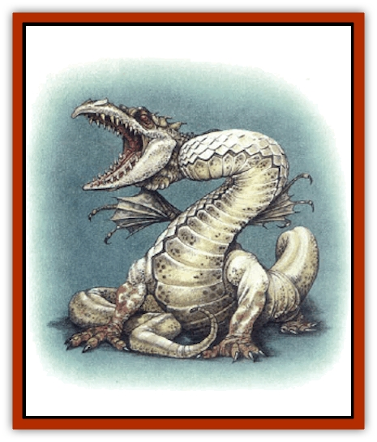

# Dragon-kin - Albino Wyrm

| Statistic | **Dragon-kin, Albino Wyrm** |
| --- | --- |
| **Activity Cycle:** | Any |
| **Alignment:** | Neutral evil |
| **Armor Class:** | 4 base |
| **Climate/Terrain:** | Underdark |
| **Damage/Attack:** | 1d4/1d4/6d6 |
| **Diet:** | Carnivore |
| **Frequency:** | Rare |
| **Hit Dice:** | 7 base |
| **Intelligence:** | High (13-14) |
| **Magic Resistance:** | Varies |
| **Morale:** | Average (8-10) |
| **Movement:** | 15, Br 3 |
| **No. Appearing:** | 1-3 |
| **No. of Attacks:** | 3 |
| **Organization:** | Solitary |
| **Size:** | Varies |
| **Special Attacks:** | Breath weapon, swallow whole, tail |
| **Special Defenses:** | Immune to cold |
| **THAC0:** | 13 base |
| **Treasure:** | I,U (Nil) |
| **XP Value:** | Varies |

These gaunt, sinewy, wingless creatures are thought to be the descendants of [[Dragon_General_Information|dragons]] that long ago became trapped in the darkness of the caverns deep underground. Their difficulty in finding prey in the Underdark has made them small, flightless predators who rely on stealth to strike and take down prey. They are found only in the deepest depths of the Underdark.

The albino wyrm has red eyes, mottled white scales, and brownish claws. Its wings are semi-transparent and have a span of about 3 to 8 feet.

If, indeed, this species is an offshoot of dragonkind, then the albino wyrms have fallen far; most are barely sane, barely able to express a coherent thought, despite their Intelligence.

**Combat:** Albino wyrms have very weak claws, useful largely for burrowing, and a very powerful bite; they can also constrict their prey with their prehensile tails. The tail attack can pick up any smaller creature that is behind the wyrm and crush it for 1d8 points of damage per round. Armor must make a saving throw vs. normal blow each round of constriction or be destroyed.

The wyrm's small - almost transparent - wings (reminiscent of [[Remorhaz|remorharz]] wings) are used only in courtship or threat displays. They confer no advantage in combat and cannot lift the creature into the air.

While its wings have faded into uselessness, the albino wyrm's jaws have expanded, allowing it to swallow its prey whole on any roll of 4 or more than the number required to hit, or a natural 20. Swallowed creatures make all attacks at -4 and cannot effectively use any large or bludgeoning weapon. If the swallowed creature needs to breathe, it falls unconscious in 1-4 rounds from lack of air.

When attacking with its breath weapon, the albino wyrm makes a distinctive rattling hiss the moment before loosing its chilling breath. The breath weapon inflicts damage as shown; it also destroys (generally by shattering) objects that fail an item saving throw vs. cold.

No spell-using albino wyrms have been recorded, nor do they seem to have innate magical abilities.

**Habitat/Society:** Albino wyrms progress along the same age categories as other dragons, but few survive past the *young adult* age category (5). Unlike dragons, albino wyrms do not collect treasure that they cannot carry; the need to hunt outweighs the need to gather baubles into a lair. However, albino wyrms are intelligent enough to recognize and use magical treasures, and may wear jewelry on their wingtips, claws, and tails.

Several [[Elf_Drow|drow]] houses are rumored to keep albino wyrms asguardians. However, albino wyrms are difficult to tame or train; their predatory instincts are not easily turned to any useful purpose.

**Ecology:** The albino wyrms have few natural enemies and voracious appetites. Their constant need for food keeps them on the prowl. Albino wyrms are nearly always encountered in motion, and are thought to sleep no more than 5% of the time.

[[Dragon_Deep|Deep dragons]] consider albino wyrms despicable and worthy only of destruction. The two species fight whenever they meet, with the deep dragons emerging victorious in all but a handful of cases.

| Age | Body Lgt. (') | Tail Lgt. (') | AC | Breath Weapon | MR | Treas. Type | XP Value |
| --- | --- | --- | --- | --- | --- | --- | --- |
| 1 Hatchling | 2-5 | 1-4 | 4 | 1d8+2 | Nil | Nil | 1,400 |
| 2 Very young | 5-10 | 4-8 | 2 | 2d8+3 | Nil | Nil | 3,000 |
| 3 Young | 10-14 | 8-12 | 0 | 3d8+4 | Nil | U | 6,000 |
| 4 Juvenile | 14-22 | 12-16 | -1 | 4d8+5 | Nil | I,U | 8,000 |
| 5 Young adult | 22-28 | 16-25 | -2 | 5d8+6 | Nil | I,U | 11,000 |
| 6 Adult | 28-40 | 25-36 | -3 | 6d8+7 | 10% | I,U | 13,000 |
| 7 Mature adult | 40-55 | 36-50 | -4 | 7d8+8 | 15% | I,U | 15,000 |
| 8 Old | 55-66 | 50-58 | -5 | 8d8+10 | 20% | I,U | 16,000 |
| 9 Very old | 66-80 | 58-70 | -6 | 10d8+12 | 25% | I,Ux2 | 18,000 |
| 10 Venerable | 80-89 | 70-77 | -8 | 12d8+14 | 35% | I,Ux2 | 19,000 |
| 11 Wyrm | 89-96 | 77-90 | -10 | 14d8+16 | 45% | Ix2,Ux3,W | 20,000 |
| 12 Great Wyrm | 96-110 | 90-120 | -13 | 18d8+20 | 60% | Ix3,Ux4,V,Wx2 | 22,000 |

---
## Discovery & Documentation

**Source Publication:** Monstrous Compendium, 1997 Annual, Volume 4 (1995)
**Campaign Setting:** Advanced Dungeons & Dragons 2nd Edition
**Author(s):** Jon Pickens

### Other Creatures Found in This Source Book
   * [[Anemone_Giant_Sea|Anemone, Giant Sea]]
   * [[Asperii|Asperii]]
   * [[Bainligor|Bainligor]]
   * [[Beast_of_Chaos|Beast of Chaos]]
   * [[Blindheim|Blindheim]]
   * [[Bloodsipper_Far_Realm|Bloodsipper (Far Realm)]]
   * [[Bulette_Gohlbrorn|Bulette, Gohlbrorn]]
   * [[Child_of_the_Sea|Child of the Sea]]
   * [[Clockwork_Horror|Clockwork Horror]]
   * [[Clockwork_Swordsman|Clockwork Swordsman]]
   * [[Coral|Coral]]
   * [[Darklore|Darklore]]
   * [[Dharculus|Dharculus]]
   * [[Dolphin_Athas|Dolphin (Athas)]]
   * [[Dragon_Neutral_Moonstone|Dragon, Neutral, Moonstone]]
   * [[Dragon_Prismatic|Dragon, Prismatic]]
   * [[Dream_Stalker|Dream Stalker]]
   * [[Echyan|Echyan]]
   * [[Firestar|Firestar]]
   * [[Firetail|Firetail]]
   * [[Fish_Ascallion|Fish, Ascallion]]
   * [[Fish_Deep_Ocean|Fish, Deep Ocean]]
   * [[Fish_Tropical|Fish, Tropical]]
   * [[Fish_Vurgens|Fish, Vurgens]]
   * [[Fogwarden|Fogwarden]]
   * [[Fraal|Fraal]]
   * [[Giant_Crag|Giant, Crag]]
   * [[Gibberling_Brood|Gibberling, Brood]]
   * [[Glutton_Sea|Glutton, Sea]]
   * [[Golden_Ammonite|Golden Ammonite]]
   * [[Golem_Brass_Minotaur|Golem, Brass Minotaur]]
   * [[Golem_Gemstone|Golem, Gemstone]]
   * [[Golem_Maggot|Golem, Maggot]]
   * [[Groundling|Groundling]]
   * [[Hermit_Sea|Hermit, Sea]]
   * [[Hound_of_Law|Hound of Law]]
   * [[Human_Amazon|Human, Amazon]]
   * [[Human_Pygmy|Human, Pygmy]]
   * [[Inquisitor|Inquisitor]]
   * [[Kercpa|Kercpa]]
   * [[Kreel|Kreel]]
   * [[Lycanthrope_Lythari|Lycanthrope, Lythari]]
   * [[Mercurial|Mercurial]]
   * [[Mold_Chromatic|Mold, Chromatic]]
   * [[Mummy_Bog|Mummy, Bog]]
   * [[Neh-thalggu|Neh-thalggu]]
   * [[Nymph_Grain|Nymph, Grain]]
   * [[Nymph_Unseelie|Nymph, Unseelie]]
   * [[Octopus_Octo-Jelly|Octopus, Octo-Jelly]]
   * [[Puddingfish|Puddingfish]]
   * [[Sea_Demon|Sea Demon]]
   * [[Shade|Shade]]
   * [[Shadowrath|Shadowrath]]
   * [[Shark_Athas|Shark (Athas)]]
   * [[Siren_Ravenloft|Siren (Ravenloft)]]
   * [[Skeleton_Variant|Skeleton, Variant]]
   * [[Skyfish|Skyfish]]
   * [[Spectral_Scion|Spectral Scion]]
   * [[Spyder_Fiend|Spyder Fiend]]
   * [[Squid_Squark|Squid, Squark]]
   * [[Tanar'ri_Lesser_Uridezu|Tanar'ri, Lesser, Uridezu]]
   * [[Troll_Mutate|Troll Mutate]]
   * [[Vaati|Vaati]]
   * [[Vampire_Cerebral|Vampire, Cerebral]]
   * [[Varkha|Varkha]]
   * [[Wizshade|Wizshade]]
   * [[Worm_Lukhorn|Worm, Lukhorn]]
   * [[Wyste|Wyste]]
   * [[Yugoloth_Lesser_Gacholoth|Yugoloth, Lesser, Gacholoth]]
   * [[Zombie_Mud|Zombie, Mud]]
