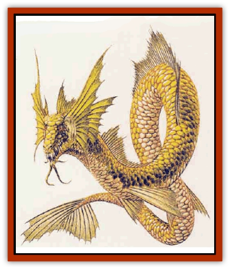

# Dragon-kin - Sea Wyrm

| Statistic | **Dragon-kin, Sea Wyrm** |
| --- | --- |
| **Activity Cycle:** | Any |
| **Alignment:** | Chaotic neutral |
| **Armor Class:** | 5 |
| **Climate/Terrain:** | Tropical and subtropical seas |
| **Damage/Attack:** | 2d6 (bite) or 3d8 (constriction) |
| **Diet:** | Omnivore |
| **Frequency:** | Rare |
| **Hit Dice:** | Young (7-8 HD) / Adolescent (9-10 HD) / Adult (11-12 HD) / Ancient (13-14 HD) |
| **Intelligence:** | Low (5-7) |
| **Magic Resistance:** | Nil |
| **Morale:** | Champion (15-16) |
| **Movement:** | 9, Sw 18 |
| **No. Appearing:** | 1-3 |
| **No. of Attacks:** | 1 |
| **Organization:** | Solitary |
| **Size:** | L (up to 12' long) if 7-10 HD / H (12'-25' long) if 11-14 HD |
| **Special Attacks:** | Breath weapon (sleep 3d8 rds), swallow (if adult or ancient) |
| **Special Defenses:** | Nil |
| **THAC0:** | 7-8 HD: 13 / 9-10 HD: 11 / 11-12 HD: 9 / 13-14 HD: 7 |
| **Treasure:** | Nil (R&times;2) |
| **XP Value:** | 7-8 HD: 1,400 / 9-16 HD: 2,000 / 11-12 HD: 3,000 / 13-14 HD: 4,000 |

Sea wyrms are elongated legless and wingless sea [[Dragon_General_Information|dragons]] found in tropical and subtropical seas. Probably one of the sources for the tales of legendary sea serpents, these lazy creatures rarely attack anyone or anythmg not intrudlng on their territory. They are usually serene and majestic, often venturing quite close to land if left undisturbed. Occasionally, a family of sea wyrms will be seen traveling together by sailors who venture into deeper seas.

**Combat:** Sea wyrms grow larger, but not particularly stronger, as they age; thus, the bite and constriction of a *young* sea wyrm are just as damaging as that of its elders. Though they are normally nonaggressive, sea wyrms will attack ships or creatures who invade what they consider to be their territory. All sea wyrms can bite for 2d6 points of damage and constrict for 3d8 points. If attacking a ship, every 10 points of constriction damage acts as 1 hull point against the vessel. If the ship is smaller than the sea wyrm, the wyrm can completely encircle the entire vessel, roll it over, and drag it beneath the waves. Because of this, they are greatly feared by fishermen and others who usually have smaller boats.

*Adult* and *ancient* sea wyrm have other attacks as well. If they make a bite attack and score 5 more than they need to hit, they have swallowed their prey whole. The victim takes normal damage (2d6) fmm the bite and an additional 2d6 paints of damage per round thereafter from stomach acids. The usual methods may be employed to escape from the creature's stomach.

At any time an *adult* or *ancient* sea wyrm may choose to forgo its normal attack and use its breath weapon instead. This is a cone of sleep gas 5 feet wide at the base, 30 feet wide at the far end, and reaching 30 feet. Those caught in the cone must save vs. breath weapon or fall asleep for 3 to 24 (3d8) rounds. The wyrm can use this attack only once per day.

**Habitat/Society:** Sea wyrms lair in underwater caves or in remote caves on islands. They can breathe equally well in air or water and move about on land by slithering like a snake. They eat just about anything but are particularly fond of fish and fruit. They have been known to slither around a fruit tree and constrict it in an attempt to get at fruit which is beyond their normal reach.

Sea wyrms live in small family groups until the hatchlings are old enough to forage for themselves. When three are found together, they are always a mated pair and a hatchling. Two sea wyrms found together are always a mated pair, as they mate for life. The female produces one egg at a time, which is jealously guarded by both until the young sea wyrm hatches.

If captured as hatchlings, sea wyrms make loyal and affectionate pets for sea peoples such as [[Merman|merfolk]], [[Triton|tritons]], or [[Elemental_Water_Kin|nereids]], willing to fight to the death to defend their companions.

**Ecology:** Sea wyrms claim undersea or island caves for their lairs and defend the territory around it up to about two miles. They range up to thirty miles from home to feed. Though they produce no useful by-products, there is a growing market in sea wyrm eggs among traders who wish to raise a mobile guard to defend their ships while at sea. Some merchants deal in sea wyrm skins, which bring 1,000 to 3,000 gp.

---
## Discovery & Documentation

**Source Publication:** Monstrous Compendium, 1995 Annual, Volume 2 (1995)
**Campaign Setting:** Advanced Dungeons & Dragons 2nd Edition
**Author(s):** Jon Pickens

### Other Creatures Found in This Source Book
   * [[Aboleth_Savant|Aboleth, Savant]]
   * [[Addazahr|Addazahr]]
   * [[Amiq_Rasol|Amiq Rasol]]
   * [[Arch-Shadow|Arch-Shadow]]
   * [[Automaton_Scaladar|Automaton, Scaladar]]
   * [[Automaton_Trobriand's|Automaton, Trobriand's]]
   * [[Bat_Sporebat|Bat, Sporebat]]
   * [[Beetle_Dragon|Beetle, Dragon]]
   * [[Bi-nou|Bi-nou]]
   * [[Boggle|Boggle]]
   * [[Brownie_Dobie|Brownie, Dobie]]
   * [[Brownie_Quickling|Brownie, Quickling]]
   * [[Cat_Crypt|Cat, Crypt]]
   * [[Cat_Great_Cath_Shee|Cat, Great, Cath Shee]]
   * [[Centaur-kin_Dorvesh|Centaur-kin, Dorvesh]]
   * [[Centaur-kin_Gnoat|Centaur-kin, Gnoat]]
   * [[Centaur-kin_Ha'pony|Centaur-kin, Ha'pony]]
   * [[Centaur-kin_Zebranaur|Centaur-kin, Zebranaur]]
   * [[Chronolily|Chronolily]]
   * [[Curst|Curst]]
   * [[Darktentacles|Darktentacles]]
   * [[Dinosaur_Aquatic|Dinosaur, Aquatic]]
   * [[Dinosaur_II|Dinosaur II]]
   * [[Dinosaur_III|Dinosaur III]]
   * [[Doppelganger_Greater|Doppelganger, Greater]]
   * [[Dragon_Brine|Dragon, Brine]]
   * [[Dragon_Half-|Dragon, Half-]]
   * [[Dwarf_Wild|Dwarf, Wild]]
   * [[Ekimmu|Ekimmu]]
   * [[Elemental_Nature|Elemental, Nature]]
   * [[Elf_Winged|Elf, Winged]]
   * [[Fish_Great_Glacier|Fish (Great Glacier)]]
   * [[Fish_Subterranean|Fish, Subterranean]]
   * [[Fish_Toril|Fish (Toril)]]
   * [[Flareater|Flareater]]
   * [[Flumph|Flumph]]
   * [[Froghemoth|Froghemoth]]
   * [[Ghost_Casurua|Ghost, Casurua]]
   * [[Ghost_Ker|Ghost, Ker]]
   * [[Ghul|Ghul]]
   * [[Ghul-Kin|Ghul-Kin]]
   * [[Giant_Half-giant|Giant, Half-giant]]
   * [[Golem_Burning_Man|Golem, Burning Man]]
   * [[Golem_Phantom_Flyer|Golem, Phantom Flyer]]
   * [[Gulguthhydra|Gulguthhydra]]
   * [[Hakeashar|Hakeashar]]
   * [[Horse_Moon-|Horse, Moon-]]
   * [[Human_Dragonslayer|Human, Dragonslayer]]
   * [[Human_Vistana|Human, Vistana]]
   * [[Jellyfish_Giant|Jellyfish, Giant]]
   * [[Kalin|Kalin]]
   * [[Kholiathra|Kholiathra]]
   * [[Laerti|Laerti]]
   * [[Leucrotta_Greater|Leucrotta, Greater]]
   * [[Lich_Suel|Lich, Suel]]
   * [[Lurker_Shadow|Lurker, Shadow]]
   * [[Lycanthrope_Werepanther|Lycanthrope, Werepanther]]
   * [[Lycanthrope_Wereshark|Lycanthrope, Wereshark]]
   * [[Mammal_Herd_II|Mammal, Herd II]]
   * [[Marl|Marl]]
   * [[Meenlock|Meenlock]]
   * [[Mimic_Greater|Mimic, Greater]]
   * [[Mold_II|Mold II]]
   * [[Mummy_Creature|Mummy, Creature]]
   * [[Nyth|Nyth]]
   * [[Ooze_Slime_Jelly_Ghaunadan|Ooze/Slime/Jelly, Ghaunadan]]
   * [[Palimpsest|Palimpsest]]
   * [[Peltast|Peltast]]
   * [[Plant_Dangerous_II|Plant, Dangerous II]]
   * [[Pleistocene_Animal|Pleistocene Animal]]
   * [[Pudding_Subterranean|Pudding, Subterranean]]
   * [[Raggamoffyn|Raggamoffyn]]
   * [[Snake_Serpent|Snake, Serpent]]
   * [[Snake_Serpent_Vine|Snake, Serpent Vine]]
   * [[Sphinx_Draco-|Sphinx, Draco-]]
   * [[Sprite_Seelie_Faerie|Sprite, Seelie Faerie]]
   * [[Sprite_Unseelie_Faerie|Sprite, Unseelie Faerie]]
   * [[Squealer|Squealer]]
   * [[Turtle_Giant|Turtle, Giant]]
   * [[Umpleby|Umpleby]]
   * [[Vizier's_Turban|Vizier's Turban]]
   * [[Wall_Walker|Wall Walker]]
   * [[Webbird|Webbird]]
   * [[Yak-Man|Yak-Man]]
   * [[Zorbo|Zorbo]]
