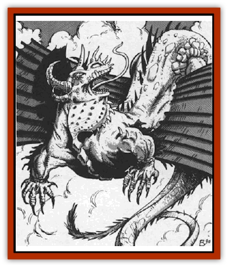

# Dragon - Adamantite

| Statistic | **Dragon, Adamantite** |
| --- | --- |
| **Activity Cycle:** | Any |
| **Alignment:** | Neutral good |
| **Armor Class:** | -10 |
| **Climate/Terrain:** | Twin Paradises (Bytopia) |
| **Damage/Attack:** | 1-12/1-12/6-48 (6d8) |
| **Diet:** | Carnivore |
| **Frequency:** | Very rare |
| **Hit Dice:** | 21 (base) |
| **Intelligence:** | Genius (17-18) |
| **Magic Resistance:** | See below |
| **Morale:** | Fearless (19-20) |
| **Movement:** | 15, Fl 42 (C) |
| **No. Appearing:** | 1 |
| **No. of Attacks:** | 3 + special |
| **Organization:** | Solitary |
| **Size:** | G (54' base) |
| **Special Attacks:** | See below |
| **Special Defenses:** | +1 or better weapons to hit |
| **THAC0:** | 5 (base) |
| **Treasure:** | Special |
| **XP Value:** | See below |

Adamantite [[Dragon_General_Information|dragons]] are perhaps the mightiest of dragonkind. They are the epitome of good, sacrificing whatever is necessary for the common good of intelligent creatures everywhere.

These other-planar creatures are strange among dragonkind, since they are born with their shining coats of adamantite fully developed (explaining their very low armor class even when *hatchlings*). This mighty coat is a shining silver color that reflects light in brilliant, scintillating beams and rainbows - refreshing to those who can bask in its goodness, painful to those who hide in the shadows of evil.

Adamantite dragons speak their own tongue and the language of all good dragons. By their *juvenile* years (age category 4), they will speak common. By the time they are *adults* (age category 6), they are 50% likely to speak any language of dragonkind.

**Combat:** Due to the adamantine dragons' strong taste for physical battle, they may use the extra attack forms of dragons (wing buffet, foot stomp, etc) one age category earlier than other dragons.

**Breath Weapon/Special Abilities:** An adamantite dragon has two breath weapons, one of which can only be used at certain times. The common form of breath weapon is a cone of flame 110' long, 10' wide at the dragon's mouth, and 45' wide at the end. This is a magical flame and will ignite even nonflammable materials.

The adamantite dragon's second breath weapon projects an area of *time stop*. It has the same dimensions as the cone of flame. Anyone caught in the area must save vs. spells or be affected as if by a *time stop* spell cast at 20th level of magic use. This breath weapon may only be used on the dragon's home plane (Twin Paradises), when the dragons are defending the plane, and even then only one time per day.

Adamantite dragons may use these spell-like abilities:

*polymorph self*, 3 times per day, permanent, may revert to dragon form without restriction; *magic missile*, (*adults* and older), five missiles per round; *blink*, (*mature adults* and older).

Due to their extra-planar nature, all adamantite dragons are immune to nonmagical weapons.

**Habitat/Society:** The adamantite dragons are the sell-appointed guardians of the Twin Paradises. These great creatures are extremely powerful and will come to the aid of any intelligent creature. It should be noted, however, that they are unconcerned with law or chaos, but only the protection of sentient lifeforms.

**Ecology:** Adamantite dragons have little place in the ecosystem of the Twin Paradises. They can, however, be avaricious hunters with huge appetites. Adamantite dragons have no moral objection to hunting unintelligent lifeforms for food.

| Age | Body Lgt. (') | Tail Lgt. (') | AC | Breath Weapon | Spells W/P | MR | Treas. Type | XP Value |
| --- | --- | --- | --- | --- | --- | --- | --- | --- |
| 1 Hatchling | 7-19 | 6-16 | -10 | 4d12+1 | Nil | Nil | Nil | 19,000 |
| 2 Very young | 19-31 | 16-28 | -10 | 6d12+2 | Nil | Nil | Nil | 21,000 |
| 3 Young | 31-43 | 28-38 | -10 | 8d12+3 | 1 | Nil | I,T | 24,000 |
| 4 Juvenile | 43-55 | 38-50 | -10 | 10d12+4 | 2 | 40% | B,R,T | 30,000 |
| 5 Young adult | 55-67 | 50-60 | -10 | 12d12+5 | 2 2/1 | 45% | B,R,T | 35,000 |
| 6 Adult | 67-80 | 60-70 | -10 | 14d12+6 | 2 2 2/2 | 50% | B,C,T | 39,500 |
| 7 Mature adult | 80-93 | 70-84 | -10 | 16d12+7 | 2 2 2 2/2 2 | 55% | B,C,Tx2 | 49,000 |
| 8 Old | 93-106 | 84-95 | -10 | 18d12+8 | 2 2 2 2 2/2 2 2 | 60% | B,C,I,Tx2 | 58,000 |
| 9 Very old | 106-120 | 95-108 | -10 | 20d12+9 | 2 2 2 2 2 2/2 2 2 2 | 65% | B,C,I,Tx3 | 70,000 |
| 10 Venerable | 120-134 | 108-120 | -10 | 22d12+10 | 2 2 2 2 2 2 2/2 2 2 2 2 | 70% | D,I,Tx3 | 83,000 |
| 11 Wyrm | 134-148 | 120-133 | -10 | 24d12+11 | 2 2 2 2 2 2 2 2/2 2 2 2 2 2 | 75% | Dx2,I,Tx3 | 93,000 |
| 12 Great Wyrm | 148-162 | 133-146 | -10 | 26d12+12 | 3 3 3 3 2 2 2 2 1/3 3 3 3 2 2 1 | 80% | Dx2,E,I,Tx3 | 110,000 |

---
## Discovery & Documentation

**Source Publication:** MC8 Outer Planes Appendix (1990)
**Campaign Setting:** Planescape
**Author(s):** Timothy B. Brown, Jamie LaFountain

### Other Creatures Found in This Source Book
   * [[Aasimon_Agathinon|Aasimon, Agathinon]]
   * [[Aasimon_Deva|Aasimon, Deva]]
   * [[Aasimon_Light|Aasimon, Light]]
   * [[Aasimon_General_Information|Aasimon, General Information]]
   * [[Aasimon_Planetar|Aasimon, Planetar]]
   * [[Aasimon_Solar|Aasimon, Solar]]
   * [[Air_Sentinel|Air Sentinel]]
   * [[Animal_Lord|Animal Lord]]
   * [[Archon|Archon]]
   * [[Baatezu_Lesser_Abishai|Baatezu, Lesser, Abishai]]
   * [[Baatezu_Greater_Amnizu|Baatezu, Greater, Amnizu]]
   * [[Baatezu_Lesser_Barbazu|Baatezu, Lesser, Barbazu]]
   * [[Baatezu_Greater_Cornugon|Baatezu, Greater, Cornugon]]
   * [[Baatezu_Lesser_Erinyes|Baatezu, Lesser, Erinyes]]
   * [[Baatezu_General_Information|Baatezu, General Information]]
   * [[Baatezu_Greater_Gelugon|Baatezu, Greater, Gelugon]]
   * [[Baatezu_Lesser_Hamatula|Baatezu, Lesser, Hamatula]]
   * [[Baatezu_Lemure|Baatezu, Lemure]]
   * [[Baatezu_Least_Nupperibo|Baatezu, Least, Nupperibo]]
   * [[Baatezu_Lesser_Osyluth|Baatezu, Lesser, Osyluth]]
   * [[Baatezu_Greater_Pit_Fiend|Baatezu, Greater, Pit Fiend]]
   * [[Baatezu_Least_Spinagon|Baatezu, Least, Spinagon]]
   * [[Balaena|Balaena]]
   * [[Bariaur|Bariaur]]
   * [[Bebilith|Bebilith]]
   * [[Bodak|Bodak]]
   * [[Dog_Moon|Dog, Moon]]
   * [[Einheriar|Einheriar]]
   * [[Gehreleth|Gehreleth]]
   * [[Githyanki|Githyanki]]
   * [[Githzerai|Githzerai]]
   * [[Hordling|Hordling]]
   * [[Lammasu_Celestial|Lammasu, Celestial]]
   * [[Larva|Larva]]
   * [[Maelephant|Maelephant]]
   * [[Marut|Marut]]
   * [[Mediator|Mediator]]
   * [[Mortai|Mortai]]
   * [[Night_Hag|Night Hag]]
   * [[Nightmare|Nightmare]]
   * [[Noctral|Noctral]]
   * [[Per|Per]]
   * [[Phoenix|Phoenix]]
   * [[Slaad|Slaad]]
   * [[Tanar'ri_Greater_Babau|Tanar'ri, Greater, Babau]]
   * [[Tanar'ri_Greater_Chasme|Tanar'ri, Greater, Chasme]]
   * [[Tanar'ri_Greater_Nabassu|Tanar'ri, Greater, Nabassu]]
   * [[Tanar'ri_Least_Dretch|Tanar'ri, Least, Dretch]]
   * [[Tanar'ri_Least_Manes|Tanar'ri, Least, Manes]]
   * [[Tanar'ri_Least_Rutterkin|Tanar'ri, Least, Rutterkin]]
   * [[Tanar'ri_Lesser_Alu-Fiend|Tanar'ri, Lesser, Alu-Fiend]]
   * [[Tanar'ri_Lesser_Bar-Lgura|Tanar'ri, Lesser, Bar-Lgura]]
   * [[Tanar'ri_Lesser_Cambion|Tanar'ri, Lesser, Cambion]]
   * [[Tanar'ri_Lesser_Succubus|Tanar'ri, Lesser, Succubus]]
   * [[Tanar'ri_Guardian_Molydeus|Tanar'ri, Guardian, Molydeus]]
   * [[Tanar'ri_General_Information|Tanar'ri, General Information]]
   * [[Tanar'ri_True_Balor|Tanar'ri, True, Balor]]
   * [[Tanar'ri_True_Glabrezu|Tanar'ri, True, Glabrezu]]
   * [[Tanar'ri_True_Hezrou|Tanar'ri, True, Hezrou]]
   * [[Tanar'ri_True_Marilith|Tanar'ri, True, Marilith]]
   * [[Tanar'ri_True_Nalfeshnee|Tanar'ri, True, Nalfeshnee]]
   * [[Tanar'ri_True_Vrock|Tanar'ri, True, Vrock]]
   * [[Titan|Titan]]
   * [[Translator|Translator]]
   * [[T'uen-rin|T'uen-rin]]
   * [[Vaporighu|Vaporighu]]
   * [[Warden_Beast|Warden Beast]]
   * [[Yugoloth_Greater_Arcanaloth|Yugoloth, Greater, Arcanaloth]]
   * [[Yugoloth_Lesser_Dergoloth|Yugoloth, Lesser, Dergoloth]]
   * [[Yugoloth_Lesser_Hydroloth|Yugoloth, Lesser, Hydroloth]]
   * [[Yugoloth_General_Information|Yugoloth, General Information]]
   * [[Yugoloth_Lesser_Mezzoloth|Yugoloth, Lesser, Mezzoloth]]
   * [[Yugoloth_Greater_Nycaloth|Yugoloth, Greater, Nycaloth]]
   * [[Yugoloth_Lesser_Piscoloth|Yugoloth, Lesser, Piscoloth]]
   * [[Yugoloth_Greater_Ultroloth|Yugoloth, Greater, Ultroloth]]
   * [[Yugoloth_Lesser_Yagnoloth|Yugoloth, Lesser, Yagnoloth]]
   * [[Zoveri|Zoveri]]
