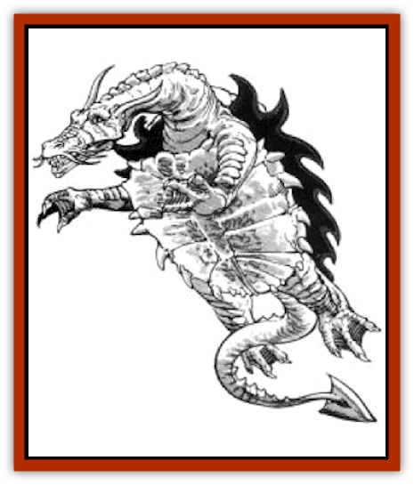

# Dragon - Amphi

| Statistic | **Dragon, Amphi** |
| --- | --- |
| **Activity Cycle:** | Any |
| **Alignment:** | Neutral evil |
| **Armor Class:** | 3 (base) |
| **Climate/Terrain:** | Tropical, subtropical and temperate/Ocean |
| **Damage/Attack:** | 1-8/1-8/2-20 |
| **Diet:** | Special |
| **Frequency:** | Rare |
| **Hit Dice:** | 9 (base) |
| **Intelligence:** | Very (11-12) |
| **Magic Resistance:** | Varies |
| **Morale:** | Champion (16) |
| **Movement:** | 6, SW 24 |
| **No. Appearing:** | 1-4 |
| **No. of Attacks:** | 3 + special |
| **Organization:** | Solitary |
| **Size:** | H (25' base length) |
| **Special Attacks:** | Tongue, breath weapon, and magical abilities |
| **Special Defenses:** | Varies |
| **THAC0:** | 11 (at 9 HD) |
| **Treasure:** | Special |
| **XP Value:** | Varies |

A unique crossbreed between a [[Dragon_Chromatic_Green|green dragon]] and a [[Dragon_Sea|sea dragon]], the amphi [[Dragon_General_Information|dragon]] is one of the most cruel and repulsive denizens of the ocean, sharing the green dragons' hatred of all good-aligned creatures.

Though it has the smooth and flexible, deep green scales of a green dragon, the amphi dragon more closely resembles a giant toad with tiny, vestigial wings and webbed feet. Bony ridges surround its beady black eyes, and yellow warts cover its body. When encountered on land, the rotten egg odor of the amphi dragon is detectable as much as 100 yards away.

Amphi dragons speak their own tongue, as well as the tongue common to all evil dragons. Additionally, amphi dragons can communicate with any human or demihuman race.

**Combat:** The amphi dragon cannot fly, and it moves only awkwardly on land. However, on land it can leap a horizontal distance of 18 feet or a vertical distance of six feet once every other round. It cannot move on the round following a leap.

The amphi dragon generally avoids the land, however, preferring to nestle itself in the mud of the ocean floor and wait for victims. It attacks with little or no provocation, and creatures of any size are potential victims. It uses its breath weapon first, then closes for fore claw and bite attacks. It attempts tongue strikes (see below) at solitary opponents, particularly ones smaller than itself. The amphi dragon may intentionally prolong its attacks to savor the death throes of a doomed victim.

**Breath Weapon/Special Abilities:** An amphi dragon's breath weapon is a stream of acid 60 feet long and three feet wide. Damage caused by the breath weapon varies with the dragon's age. Victims caught in the blast must roll saving throws vs. breath weapon, with success indicating half damage. The breath weapon is equally effective underwater and in the open air and can be used once every three combat rounds.

From birth, the amphi dragon can breathe both water and air. It can change the color of its skin to match the surroundings. If it remains stationary while camouflaged, it is undetectable 80% of the time.

The amphi dragon's warts continually ooze acid. Each time a character attacks the dragon in melee, he must roll a Dexterity check. If he fails, he suffers 1d6 points of damage.

The amphi dragon can attempt a tongue strike, up to a distance of two feet times its age category, to capture a victim. If the amphi dragon succeeds in an attack roll against AC 10, the victim is stuck to its tongue and is pulled to its mouth at the end of the round. If the tongue suffers 12 or more points of damage, the amphi dragon releases its prey. Otherwise, the victim is automatically bitten in each subsequent round. When the victim is reduced to 0 hit points, the amphi dragon swallows it on the next round.

As they age, amphi dragons gain the following additional abilities, useable once per day:

*Adult: detect magic*, *Old: suggestion* *Wyrm: darkness, 15' radius*.

**Habitat/Society:** Too lazy to construct elaborate lairs, amphi dragons live in sunken ships or empty underwater caves. They are shunned by all other ocean-swelling creatures, including other amphi dragons. Female amphi dragons abandon their newborns within a few days after birth, and only about 25% survive.

**Ecology:** Amphi dragons eat virtually anything, but they prefer live prey, especially [[Elf_Sea_Dargonesti|Dargonesti]] and [[Elf_Sea_Dimernesti|Dimernesti]] (sea elves). They scavenge refuse from the ocean floor and also eat algae, seaweed, fish, and minerals.

| Age | Body Lgt. (') | AC | Breath Weapon | MR | Treas. Type | XP Value |
| --- | --- | --- | --- | --- | --- | --- |
| 1 Hatchling | 4-7 | 6 | 1d6+1 | Nil | Nil | 1,400 |
| 2 Very young | 7-11 | 5 | 2d6+2 | Nil | Nil | 2,000 |
| 3 Young | 11-19 | 4 | 3d6+3 | Nil | Nil | 3,000 |
| 4 Juvenile | 19-27 | 3 | 4d6+4 | Nil | ½F | 4,000 |
| 5 Young adult | 27-36 | 2 | 5d6+5 | 10% | F | 7,000 |
| 6 Adult | 36-45 | 1 | 6d6+6 | 15% | F | 8,000 |
| 7 Mature adult | 45-54 | 0 | 7d6+7 | 20% | F | 10,000 |
| 8 Old | 54-63 | -1 | 8d6+8 | 25% | Fx2 | 11,000 |
| 9 Very old | 63-72 | -2 | 9d6+9 | 30% | Fx2 | 12,000 |
| 10 Venerable | 72-81 | -3 | 10d6+10 | 35% | Fx2 | 13,000 |
| 11 Wyrm | 81-90 | -4 | 11d6+11 | 40% | Fx3 | 14,000 |
| 12 Great Wyrm | 90-102 | -5 | 12d6+12 | 45% | Fx3 | 15,000 |

---
## Discovery & Documentation

**Source Publication:** MC4 Dragonlance Appendix (w/binder #2) (1989)
**Campaign Setting:** Dragonlance
**Author(s):** Rick Swan

### Other Creatures Found in This Source Book
   * [[Anemone_Giant_Sea|Anemone, Giant Sea]]
   * [[Bear_Ice|Bear, Ice]]
   * [[Beast_Undead|Beast, Undead]]
   * [[Bird_Krynn|Bird (Krynn)]]
   * [[Disir|Disir]]
   * [[Draconian_Aurak|Draconian, Aurak]]
   * [[Draconian_Baaz|Draconian, Baaz]]
   * [[Draconian_Bozak|Draconian, Bozak]]
   * [[Draconian_Kapak|Draconian, Kapak]]
   * [[Draconian_General_Information|Draconian, General Information]]
   * [[Draconian_Sivak|Draconian, Sivak]]
   * [[Draconian_Proto-_Traag|Draconian, Proto-, Traag]]
   * [[Dragon_Astral|Dragon, Astral]]
   * [[Dragon_Kodragon|Dragon, Kodragon]]
   * [[Dragon_Krynn_Othlorx_General_Information|Dragon (Krynn), Othlorx, General Information]]
   * [[Dragon_Krynn_General_Information|Dragon (Krynn), General Information]]
   * [[Dragon_Sea|Dragon, Sea]]
   * [[Dreamshadow|Dreamshadow]]
   * [[Dreamwraith|Dreamwraith]]
   * [[Dwarf_Daergar|Dwarf, Daergar]]
   * [[Dwarf_Hill_Neidar|Dwarf, Hill, Neidar]]
   * [[Dwarf_Mountain_Hylar|Dwarf, Mountain, Hylar]]
   * [[Dwarf_Theiwar|Dwarf, Theiwar]]
   * [[Dwarf_Zakhar|Dwarf, Zakhar]]
   * [[Elf_Half-|Elf, Half-]]
   * [[Elf_High_Qualinesti|Elf, High, Qualinesti]]
   * [[Elf_High_Silvanesti|Elf, High, Silvanesti]]
   * [[Elf_Sea_Dargonesti|Elf, Sea, Dargonesti]]
   * [[Elf_Sea_Dimernesti|Elf, Sea, Dimernesti]]
   * [[Elf_Wild_Kagonesti|Elf, Wild, Kagonesti]]
   * [[Eyewing|Eyewing]]
   * [[Fetch|Fetch]]
   * [[Fire_Minion|Fire Minion]]
   * [[Fireshadow|Fireshadow]]
   * [[Gnome_Tinker|Gnome, Tinker]]
   * [[Gurik_Cha'ahl|Gurik Cha'ahl]]
   * [[Haunt_Knight|Haunt, Knight]]
   * [[Horax|Horax]]
   * [[Human_Krynn|Human (Krynn)]]
   * [[Imp_Blood_Sea|Imp, Blood Sea]]
   * [[Kalothagh|Kalothagh]]
   * [[Kani_Doll|Kani Doll]]
   * [[Kender|Kender]]
   * [[Kyrie|Kyrie]]
   * [[Lizard_Man_Krynn|Lizard Man (Krynn)]]
   * [[Minotaur_Krynn|Minotaur, Krynn]]
   * [[Ogre_High|Ogre, High]]
   * [[Ogre_Krynn|Ogre (Krynn)]]
   * [[Phaethon|Phaethon]]
   * [[Saqualaminoi|Saqualaminoi]]
   * [[Shadowperson|Shadowperson]]
   * [[Shimmerweed|Shimmerweed]]
   * [[Skrit|Skrit]]
   * [[Spectral_Minion|Spectral Minion]]
   * [[Spider_Krynn|Spider (Krynn)]]
   * [[Stag|Stag]]
   * [[Tayling|Tayling]]
   * [[Thanoi|Thanoi]]
   * [[Tylor|Tylor]]
   * [[Wichtlin|Wichtlin]]
   * [[Wyndlass|Wyndlass]]
   * [[Yaggol|Yaggol]]
