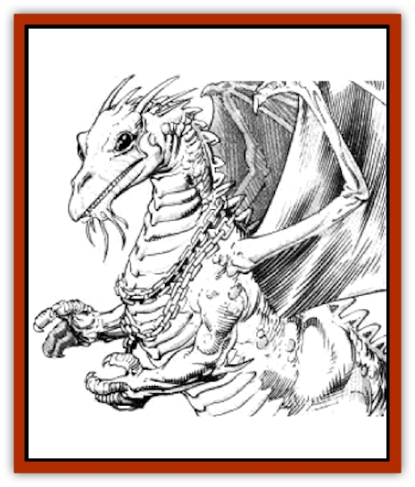

# Dragon - Astral

| Statistic | **Mated pair*** | **Unmated** |
| --- | --- | --- |
| **Activity Cycle:** | Any | Any |
| **Alignment:** | Neutral | Neutral |
| **Armor Class:** | -5 | 5 |
| **Climate/Terrain:** | The Abyss | The Abyss |
| **Damage/Attack:** | 3-60(&times;4)/1-100(&times;2) | 1-4/1-4/2-12 |
| **Diet:** | Any liquid | Any liquid |
| **Frequency:** | Very rare | Very rare |
| **Hit Dice:** | 35 | 3 |
| **Intelligence:** | Godlike (21+) | Genius (17-18) |
| **Magic Resistance:** | 95% | Nil |
| **Morale:** | Fanatic (17) | Steady (12) |
| **Movement:** | 15, F1 48 (B) | 6, F1 18 (C) |
| **No. Appearing:** | 2 (1 pair) | 1 |
| **No. of Attacks:** | 6 | 3 |
| **Organization:** | Pair | Solitary |
| **Size:** | G (50' long each) | M (5' long) |
| **Special Attacks:** | Spells | Nil |
| **Special Defenses:** | Immortal, spells | Immortal |
| **THAC0:** | 5 | 17 |
| **Treasure:** | Nil | Nil |
| **XP Value:** | 40,000 | 1,400 |

* These statistics apply to mated astral dragons when considered as a pair, not as individuals. See text for details.

  "Astral dragon" is a general term for a race of ancient golden [[Dragon_General_Information|dragons]] to whom all [[Dragon_Krynn_General_Information|dragons of Krynn]] can trace a common ancestry. The immortal astral dragons are the personification of neutrality in dragons.

Among the first dragons ever created by the gods were two astral dragons named Deion and Procene. These dragons were directcd to give birth to a race of dragons that the gods would adopt as their own. Selected newborns were taken from their parents and transformed to reflect the personalties and philosophies of the gods who adopted them. Thus were created early archetypes of [[Dragon_Chromatic_Black|black]], [[Dragon_Chromatic_Red|red]], [[Dragon_Metallic_Gold|gold]], [[Dragon_Metallic_Silver|silver]], and other dragons. Deion and Procene remained neutral; in exchange for their offspring, the gods pledged to leave them alone.

When the couple grew weary of the constant tension between the good and evil dragons, they appealed to the gods to be relieved of their obligations on Krynn. The gods granted their wish, and relocated them to an alternate plane of existence in the Abyss. In time, Deion and Procene gave birth to new generations of neutral dragons.

An unmated astral dragon is dull yellow in color and about five feet long with human hands and long, slim fingers. It has huge black eyes. and its scales are covered with fine blond fur. Though a *hatchling* is slightly less formidable (AC 4, HD 2), an astral dragon does not progress through the various age categories as do other dragons; its statistics do not change significantly until it becomes part of a mated pair.

When an astral dragon finds a suitable mate, the couple appeals to the gods of neutrality to sanction their union. If approval is granted, the mated astral dragons undergo a remarkable transformation. To symbolize the union, the gods create a 100-foot golden chain, each end of which encircles the mates' necks to link them for all eternity. The mates grow to a length of 50 feet and become enveloped in a permanent aura of golden light. Their intelligence and abilities increase to god-like levels.

Thereafter, the couple lives, fights, works, and plays as a unit. If the chain is broken and the mates are separated by a distance of at least 100 yards for 30 days, they will revert to their original, weaker forms; however, it requires the power of a *wish* spell or its equivalent to break the chain.

Astral dragons speak their own tongue as well as the languages of good and evil dragons. All astral dragons have the ability to communicate with any intelligent creature.

**Combat:** Unmated astral dragons are incapable of performing snatch, kick, wing buffet, or tail slap attacks. Though they have the special senses of a dragon (as per the *very young* age category), they do not radiate fear. They can defend themselves with their claws and teeth, but they are sluggish combatants, always attempting to flee instead of engaging in melee. They are essentially immortal, as they instantly recover all lost hit points. However, they can be destroyed by *power word, kill*, *wish*, or similar spells.

Mated astral dragons attack as a unit. Though capable of performing snatch, kick, wing buffet, and tail slap attacks, as well as vicious attacks with their teeth and claws, they prefer to use spells to frighten away their enemies.

Mated astral dragons gain the abilities of a 35th-level cleric. They have the special senses of a dragon (as per the *great wyrm* age category). They radiate fear in a radius of 50 feet (-4 penalty to saving throw) and have a bonus of +12 to their attack and damage rolls. Like unmated astral dragons, they are essentially immortal, instantly recovering all lost hit points; nothing less than the power of a *wish*, *power word, kill*, or similar spells can destroy them.

**Habitat/Society:** Astral dragons live in immense keeps of black crystal built for them by the gods. They rarely leave their keeps and never voluntarily leave the Abyss. A mated pair must petition the gods for permission to give birth, a request seldom granted in order to limit the population. Upon reaching the age of five, a young astral dragon is dispatched from his parents' keep to fend for himself. Astral dragons have no interest in treasure.

**Ecology:** Astral dragons consume only liquids. Any liquid will do - mercury is a nourishing to them as water. They have no natural enemies.

---
## Discovery & Documentation

**Source Publication:** MC4 Dragonlance Appendix (w/binder #2) (1989)
**Campaign Setting:** Dragonlance
**Author(s):** Rick Swan

### Other Creatures Found in This Source Book
   * [[Anemone_Giant_Sea|Anemone, Giant Sea]]
   * [[Bear_Ice|Bear, Ice]]
   * [[Beast_Undead|Beast, Undead]]
   * [[Bird_Krynn|Bird (Krynn)]]
   * [[Disir|Disir]]
   * [[Draconian_Aurak|Draconian, Aurak]]
   * [[Draconian_Baaz|Draconian, Baaz]]
   * [[Draconian_Bozak|Draconian, Bozak]]
   * [[Draconian_Kapak|Draconian, Kapak]]
   * [[Draconian_General_Information|Draconian, General Information]]
   * [[Draconian_Sivak|Draconian, Sivak]]
   * [[Draconian_Proto-_Traag|Draconian, Proto-, Traag]]
   * [[Dragon_Amphi|Dragon, Amphi]]
   * [[Dragon_Kodragon|Dragon, Kodragon]]
   * [[Dragon_Krynn_Othlorx_General_Information|Dragon (Krynn), Othlorx, General Information]]
   * [[Dragon_Krynn_General_Information|Dragon (Krynn), General Information]]
   * [[Dragon_Sea|Dragon, Sea]]
   * [[Dreamshadow|Dreamshadow]]
   * [[Dreamwraith|Dreamwraith]]
   * [[Dwarf_Daergar|Dwarf, Daergar]]
   * [[Dwarf_Hill_Neidar|Dwarf, Hill, Neidar]]
   * [[Dwarf_Mountain_Hylar|Dwarf, Mountain, Hylar]]
   * [[Dwarf_Theiwar|Dwarf, Theiwar]]
   * [[Dwarf_Zakhar|Dwarf, Zakhar]]
   * [[Elf_Half-|Elf, Half-]]
   * [[Elf_High_Qualinesti|Elf, High, Qualinesti]]
   * [[Elf_High_Silvanesti|Elf, High, Silvanesti]]
   * [[Elf_Sea_Dargonesti|Elf, Sea, Dargonesti]]
   * [[Elf_Sea_Dimernesti|Elf, Sea, Dimernesti]]
   * [[Elf_Wild_Kagonesti|Elf, Wild, Kagonesti]]
   * [[Eyewing|Eyewing]]
   * [[Fetch|Fetch]]
   * [[Fire_Minion|Fire Minion]]
   * [[Fireshadow|Fireshadow]]
   * [[Gnome_Tinker|Gnome, Tinker]]
   * [[Gurik_Cha'ahl|Gurik Cha'ahl]]
   * [[Haunt_Knight|Haunt, Knight]]
   * [[Horax|Horax]]
   * [[Human_Krynn|Human (Krynn)]]
   * [[Imp_Blood_Sea|Imp, Blood Sea]]
   * [[Kalothagh|Kalothagh]]
   * [[Kani_Doll|Kani Doll]]
   * [[Kender|Kender]]
   * [[Kyrie|Kyrie]]
   * [[Lizard_Man_Krynn|Lizard Man (Krynn)]]
   * [[Minotaur_Krynn|Minotaur, Krynn]]
   * [[Ogre_High|Ogre, High]]
   * [[Ogre_Krynn|Ogre (Krynn)]]
   * [[Phaethon|Phaethon]]
   * [[Saqualaminoi|Saqualaminoi]]
   * [[Shadowperson|Shadowperson]]
   * [[Shimmerweed|Shimmerweed]]
   * [[Skrit|Skrit]]
   * [[Spectral_Minion|Spectral Minion]]
   * [[Spider_Krynn|Spider (Krynn)]]
   * [[Stag|Stag]]
   * [[Tayling|Tayling]]
   * [[Thanoi|Thanoi]]
   * [[Tylor|Tylor]]
   * [[Wichtlin|Wichtlin]]
   * [[Wyndlass|Wyndlass]]
   * [[Yaggol|Yaggol]]
