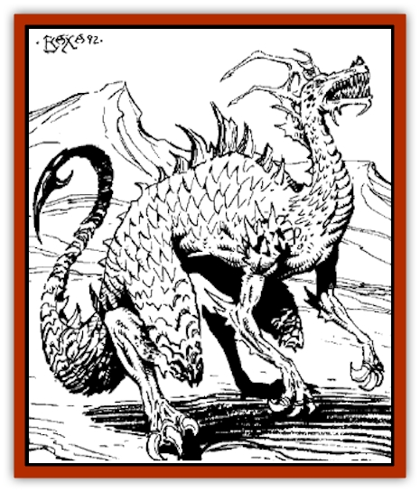

# Dragon - Athas

| Statistic | **Dragon (Athas)** |
| --- | --- |
| **Activity Cycle:** | Any |
| **Alignment:** | Varies |
| **Armor Class:** | Varies |
| **Climate/Terrain:** | Any |
| **Damage/Attack:** | Varies |
| **Diet:** | Omnivore |
| **Frequency:** | Very Rare |
| **Hit Dice:** | Varies |
| **Intelligence:** | High to Supra-genius (13-20) |
| **Magic Resistance:** | Varies |
| **Morale:** | Fanatic (17-18) |
| **Movement:** | Varies |
| **No. Appearing:** | 1 |
| **No. of Attacks:** | Varies |
| **Organization:** | Solitary |
| **Size:** | Varies |
| **Special Attacks:** | See below |
| **Special Defenses:** | See below |
| **THAC0:** | Varies |
| **Treasure:** | Varies |
| **XP Value:** | Varies |

Extremely powerful (20th-level) human and half-elven defiler/psionicists can progress to even greater power if they choose to transform themselves into [[Dragon_General_Information|dragon]] form. To begin the transformation, the would-be dragon casts a *dragon metamorphosis* spell. This potent incantation is the first use a dragon makes of *psionic enchantment*. Most aspiring dragons lock themselves away and perform their metamorphoses in secret.

After the spell is successfully cast, the dragon drastically changes in both his powers and his physical appearance. Each stage of the metamorphosis is extremely painful. The exact appearance of the dragon differs with the level attained by the defiler, but the defiler will gradually grow in height and weight, take on reptilian features, and, eventually, lose all trace of its humanity. When the metamorphosis is complete, the dragon will be roughly 40 feet long and weigh 50,000 pounds (25 tons), with massive wings and almost impenetrable scales.

Once a character becomes a dragon, he gains certain benefits instantly. Dragons are immune to the effects of time. They no longer age and will never die of "natural causes". Also, a dragon gains the ability to understand and speak any language - this innate ability functions like a *tongues* spell. This is a side effect of the psionic enchantment they employ to transform themselves.

**Combat:** The exact combat abilities of a dragon differ as it grows in size and power. This information is presented on a chart at the end of this entry, but a brief overview of the creature.s general abilities is provided here.

As a dragon advances, it retains all psionic powers it had previously and gains more. With every level advancement, the dragon gains one additional science and one additional discipline. He also gains psionic strength points for every level advancement just as described in the *Complete Psionics Handbook*.

In order to employ the devastating power of *psionic enchantment*, each dragon employs an obsidian orb as a focus. The orb itself is not magical, but is essentially a material component that is required for each psionic enchantment the dragon employs. A dragon can create any number of obsidian orbs and leave them in various places. Rarely is a dragon without an orb. However, before reaching a new level, the dragon must swallow all existing activated orbs as part of the material component for the *dragon metamorphosis* spell. Lack of an orb does not interfere with the dragon's ability to cast spells below 10th level or with psionic ability.

As dragons become more powerful, they can employ their deadly claws in combat. Even at their most rudimentary stage of development, these talons are extremely deadly. Also, the dragon eventually develops a savage set of teeth with powerful jaws, giving it a horrible bite attack. When its tail grows long enough, it becomes a sweeping bludgeon. Finally, the dragon gains a devastating breath weapon, a cone of superheated sand 5' wide at its base, 50' long, and 100' in diameter at the far end.

A dragon's hide and scales become harder and more invulnerable at each stage of metamorphosis. This is reflected by a sharp improvement in Armor Class, a resistance to non-magical weapons, and overall magic resistance.

These magical items presented in the *Dungeon Master's Guide* can affect character dragons:

*Potion of Dragon Control*: If such a potion fruit is found in a Dark Sun campaign, it works against any dragon. Control lasts for 5d4 rounds.

*Scroll of Protection - Dragon Breath*: The scroll functions just as described in the *DMG*.

*Sword +2, Dragon Slayer*: In Dark Sun campaigns, this sword functions against any dragon, regardless of its level.

<b class="bk">Spells:** From *Tome of Magic*, two spells specifically concern dragons. *Dragonbane* functions just as described in that volume. *Age dragon* has no effect on Dark Sun dragons because they are effectively immortal.

**Habitat/Society:** Having attained 20th level, human and half-elven defiler/psionicists can choose to undergo a bizarre and painful metamorphosis from human to dragon. Once begun, the metamorphosis cannot be stopped except by the character's death.

All sorcerer-kings of the Seven Cities are at least 21st-level dragons. Though the monarchs have pursued these powers for many centuries, they are only becoming dimly aware that a similar process can also occur with especially powerful preservers (see [[Avangion|Avangion]]). Many are still skeptical.

From the 25th through 29th levels, the ascending dragon goes through a terrible rampaging period, brought on by the incredible pain that wracks its body during these final stages. No longer man but not yet a dragon, its need to end the process drives it nearly mad. Its original reason is superseded by an indomitable lust for destruction. The dragon destroys vegetation and animals that do not directly serve its quest for power and advancement.

**Ecology:** Defilers who have earned sufficient experience points to advance to the next stage must successfully cast the *dragon metamorphosis* spell. Once cast, the defiler's physical form mutates drastically, becoming less human and more dragon.

The exact material components, preparation time, and casting time differ depending on the level the defiler is about to achieve. The spells are grouped by level into low, middle, high, and final metamorphosis.

*Low (21st, 22nd, and 23rd level):* The defiler is merely beginning the metamorphosis. The preparation for casting at these levels requires access to ancient documents, tablets, and scrolls that have never been studied by another defiler. Such materials must be studied for at least eight hours every day for an entire year. The material components must include vast riches (at least 10,000 gp worth of jewels, gems, coins, or artistic treasures), a huge structure where the transformation might take place, and no fewer than 1,000 Hit Dice of living creatures for the life-leeching process. The riches vanish and the living creatures are slain one heartbeat after the defiler begins casting. The spell is cast from the deep interior of the structure where the caster will actually transform. No other beings may be present at the instant of casting.

*Middle (24th, 25th, and 26th level):* The preparation time extends to two years. During this time, the caster visits a powerful creature on an elemental plane for three days of every 15. The material components include fewer riches (at least 5,000 gp) but more living creatures (no fewer than 2.000 Hit Dice). A new structure must be built, which can be used for all three middle level transformations.

*High (27th, 28th, and 29th level):* The high levels of dragon metamorphosis must take place on either an elemental or the astral plane. No structure or riches are required, but the caster must travel to the plane of choice with no fewer than 200 Hit Dice of living creatures from the Prime Material plane. The living creatures must be no fewer than 10 Hit Dice each and must willingly travel to the plane and participate (i.e., die) in the casting. Casting time is 24 hours, and at least three powerful beings from that plane must cooperate for that time.

*Final (30th level):* This stage requires no preparation time and but a single material component; the slain body of a good creature defeated in single combat. The victim must be intelligent, have at least 20 Hit Dice, and be capable of casting 9th-level wizard spells or 7th-level priest spells. The spell must be cast over the fallen victim within one hour of the defeat; the casting time is one turn.

**The Dragon of Tyr**

  The [[Dragon_of_Tyr|Dragon of Tyr]] is a completely metamorphosized dragon of 30th level. The great dragon is a ferocious animal with tremendous psionic powers. Because no contenders have challenged the authority of the great dragon in many centuries, common tradition has held that there is only one dragon.

However, because the Tyr region is actually only a small part of a much larger world, there are probably other dragons in distant realms. Whether the great dragon is aware of other distant dragons, only it knows for certain.

## Dragon Ability Charts

| Lvl | HD* | AC | THAC0 | Claws | Bite | Breath | Tail | Move | MR |
| --- | --- | --- | --- | --- | --- | --- | --- | --- | --- |
| 21 | 30+10 | ? | 11 | Nil | Nil | Nil | Nil | ? | Nil |
| 22 | 35+10 | ? | 10 | Nil | Nil | Nil | Nil | ? | Nil |
| 23 | 38+10 | ? | 9 | Nil | Nil | Nil | Nil | ? | Nil |
| 24 | 40+10 | 4 | 8 | 2d10 | Nil | Nil | Nil | 15 | Nil |
| 25 | 42+10 | 01 | 7 | 2d10 | 4d12 | Nil | Nil | 15 | Nil |
| 26 | 45+10 | -21 | 5 | 2d10+5 | 4d12 | Nil | Nil | 15a | Nil |
| 27 | 48+10 | -41 | 3 | 2d10+5 | 4d12 | 10d12 | Nil | 15a | Nil |
| 28 | 52+10 | -62 | 1 | 2d10+10 | 4d12 | 10dl2 | 5d10 | 15a | 20% |
| 29 | 56+10 | -82 | -1 | 2d10+10 | 4d12 | 20d12 | 5d10 | 15b | 40% |
| 30 | 61+10 | -102 | -3 | 2d10+15 | 4d12 | 25d12 | 5d10 | 15c | 80% |

* dragons use 4-sided Hit Dice
1 can be hit only by +1 or better magical weapons
2 can be hit only by +2 or better magical weapons
a now has a "jumping" movement rate of 5 (should be 6)
b now has a "flying" movement rate of 18 (C)
c now has a "flying" movement rate of 45 (A)
*Note:* Regardless of level, a dragon saves as a 21 + level wizard.

|  | Spells Available |
| --- | --- |
| Level | 1 | 2 | 3 | 4 | 5 | 6 | 7 | 8 | 9 | 10 |
| --- | --- | --- | --- | --- | --- | --- | --- | --- | --- | --- |
| 20 | 5 | 5 | 5 | 5 | 5 | 4 | 3 | 3 | 2 | 1 |
| 21 | 5 | 5 | 5 | 5 | 5 | 4 | 4 | 4 | 2 | 1 |
| 22 | 5 | 5 | 5 | 5 | 5 | 5 | 4 | 4 | 3 | 1 |
| 23 | 5 | 5 | 5 | 5 | 5 | 5 | 5 | 5 | 3 | 2 |
| 24 | 5 | 5 | 5 | 5 | 5 | 5 | 5 | 5 | 4 | 2 |
| 25 | 5 | 5 | 5 | 5 | 5 | 5 | 5 | 5 | 5 | 2 |
| 26 | 6 | 6 | 6 | 6 | 5 | 5 | 5 | 5 | 5 | 3 |
| 27 | 6 | 6 | 6 | 6 | 6 | 6 | 6 | 5 | 5 | 3 |
| 28 | 6 | 6 | 6 | 6 | 6 | 6 | 6 | 6 | 6 | 3 |
| 29 | 7 | 7 | 7 | 7 | 6 | 6 | 6 | 6 | 6 | 4 |
| 30 | 7 | 7 | 7 | 7 | 7 | 7 | 7 | 6 | 6 | 4 |

---
## Discovery & Documentation

**Source Publication:** Dragon Kings (hardback) (1992)
**Campaign Setting:** Dark Sun
**Author(s):** Timothy B. Brown

### Other Creatures Found in This Source Book
   * [[Avangion|Avangion]]
   * [[Elemental_Athas_Clerical|Elemental (Athas), Clerical]]
