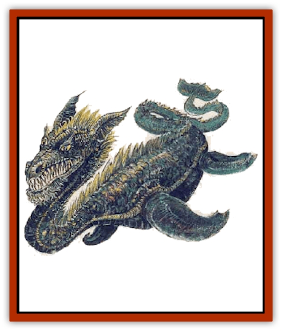

# Dragon - Brine

| Statistic | **Dragon, Brine** |
| --- | --- |
| **Activity Cycle:** | Any |
| **Alignment:** | Chaotic neutral |
| **Armor Class:** | 2 (base) |
| **Climate/Terrain:** | Any/Ocean |
| **Damage/Attack:** | 4-40 |
| **Diet:** | Omnivore |
| **Frequency:** | Very rare |
| **Hit Dice:** | 11 (base) |
| **Intelligence:** | Low (5-7) |
| **Magic Resistance:** | Varies |
| **Morale:** | Champion (15) |
| **Movement:** | Sw 9 |
| **No. Appearing:** | 1 (2-5) |
| **No. of Attacks:** | 1 + special |
| **Organization:** | Solitary |
| **Size:** | H (26' base) |
| **Special Attacks:** | Breath weapon and magical abilities |
| **Special Defenses:** | Varies |
| **THAC0:** | 9 (base) |
| **Treasure:** | Special |
| **XP Value:** | Varies |

Brine [[Dragon_General_Information|dragons]] are bizarre mutations that may have been created by Erestem as an experiment. These great beasts claim remote ancestry to [[Dragon_Chromatic_Black|black dragons]], but such a claim is difficult to believe, considering the complete lack of resemblance between the two dragon races.

The only complete ocean-going dragon, these beasts cannot fly or walk on land. Brine dragons do not enjoy even breaking the sea's surface, but they can sometimes be persuaded to do so if given the proper incentive, such as a boat load of juicy humans.

These massive creatures have bodies much like [[Dinosaur_Aquatic|plesiosauri]], but with draconian heads. They have flippers where other dragons have claws. To compensate for this, brine dragons have oversized teeth that make them appear as if they are smiling all the time. The grin is not a friendly one.

The hide of the brine dragon is rough and mottled, with many ridges and crags. The scales are irregular and do not fit together very well. Huge clumps of salt dot the body of the brine dragon, some clumps so old that they are discolored by the dragon's bodily secretions and are no longer able to be dissolved in the water.

**Combat:** Though they cannot walk or fly, brine dragons are good swimmers. Though their unwieldy bulks would seem to take away from the creatures. swimming ability, brine dragons can move through the oceans without causing so much as a ripple. As a result, opponents suffer a -1 penalty to their surprise rolls. On the other hand, the dragons themselves are acutely aware of disturbances in the current, and are surprised only on a 1 in 10 chance.

Though brine dragons lack claws, their bite causes terrible damage and can create huge gouges in large marine creatures, such as [[Whale|whales]] or [[Dragon_Amphi|amphidragons]].

Brine dragons attack with little or no provocation. On the other hand, they sometimes hold off from attacking even in circumstances where combat would be expected. Being very capricious and unpredictable by nature, it is difficult to tell just what a brine dragon will do at any given time. They are the embodiment of chaos.

**Breath Weapon/Special Abilities:** The brine dragon can breathe a salt and alkaline-based spray that functions like acid. This breath is in the form of a cloud that is 90 feet long, 45 feet wide, and 45 feet high. Creatures successfully saving vs. breath weapon suffer half damage. The brine dragon can employ this breath weapon once every three rounds. The breath weapon can be used underwater or at a target in the air, with no change in its effectiveness.

Brine dragons are immune to poisons and acids. They cannot breathe air.

As a brine dragon ages, it gains the following abilities, each usable three times a day:

*Adult: Melf's acid arrow*; *Old: Stinking cloud*; *Wyrm: Fear*; *Great Wyrm: Cloudkill*

Should the alkaline breath weapon of a brine dragon somehow mix with the acid-based breath weapon of a black dragon, the breaths would neutralize each other, creating a volume of water equivalent to the volumes of both breath weapons.

Since a black dragon breathes sulfuric acid, a volume of sulphur is also created, equivalent to one pound per age category of the black dragon.

The other effect of the mix is that a large amount of heat from the chemical reaction is generated. Thus, the newly created water is scalding hot. Any unfortunate caught in the area where the two breaths mingle suffers 12d4+12 points of damage (successful saving throw [with a -2 penalty] vs. breath weapon cuts the damage in half).

It should be noted that [[Gnome|gnomes]] would be very interested in any news of such an occurrence. The gnomes have been trying for centuries to get a brine and black dragon together for the sake of research, the only result being a lot of dead gnomes and no cooperative dragons. Enterprising PCs may make some money on the experience if they are shrewd enough.

**Habitat/Society:** Brine dragons are best described as violent, aquatic anarchists with nihilistic tendencies. They have no system of rulership, no leader, no society of any sort. The Sea Witch Sagarassi has long since given up trying to recruit any brine dragons for her causes, since the beasts are just as likely to breathe on her troops as on any enemy.

The beasts make their lairs out of coral and rock formations, using their caustic breath to create a convenient cave. Brine dragons hoard wealth only when they feel like it.

Each brine dragon stakes out its turf, which can vary day to day from 100 yards to ten miles. Its cave remains the only point of fixed interest.

When a brine dragon lays its eggs, the mother usually stays around and raises the hatchlings, though sometimes the father stays and does the job instead. Other times, both parents stay and raise the hatchlings, or both parents leave and let the eggs fend for themselves. Sometimes the parents get hungry and just eat the eggs or young.

This extremely random way of raising children keeps the number of brine dragons at low levels.

**Ecology:** Brine dragons get their name from their love of salt. The dragons eat salt and also absorb it into their systems through osmosis as they swim the oceans. Often, brine dragons can be found in salt marshes that exist in coastal areas.

Black dragons are hated by the brine dragons. A brine dragon would certainly not attempt to eat a black dragon, for despite their lack of intelligence, the brines have an instinctive knowledge of what would happen if the acidic meat of a black dragon wound up inside their alkaline system.

In essence, brine dragons will eat anything. They are distinguished among marine life as one of the few species that will actually eat undead.

| Age | Body Lgt. (') | AC | Breath Weapon | MR | Treas. Type | XP Value |
| --- | --- | --- | --- | --- | --- | --- |
| 1 Hatchling | 5-8 | 5 | 1d4+1 | Nil | Nil | 1,400 |
| 2 Very young | 8-12 | 4 | 2d4+2 | Nil | Nil | 2,000 |
| 3 Young | 12-20 | 3 | 3d4+3 | Nil | Nil | 3,000 |
| 4 Juvenile | 20-29 | 2 | 4d4+4 | Nil | ½F | 4,000 |
| 5 Young adult | 29-38 | 1 | 5d4+5 | 10% | F | 7,000 |
| 6 Adult | 38-47 | 0 | 6d4+6 | 15% | F | 8,000 |
| 7 Mature adult | 47-56 | -1 | 7d4+7 | 20% | F | 10,000 |
| 8 Old | 56-65 | -2 | 8d4+8 | 25% | F,G | 12,000 |
| 9 Very old | 65-74 | -3 | 9d4+9 | 30% | F,G | 13,000 |
| 10 Venerable | 74-83 | -4 | 10d4+10 | 35% | F,G,H | 15,000 |
| 11 Wyrm | 83-92 | -5 | 11d4+11 | 40% | F,G,H | 16,000 |
| 12 Great Wyrm | 92-102 | -6 | 12d4+12 | 45% | F,G,H | 17,000 |

---
## Discovery & Documentation

**Source Publication:** Monstrous Compendium, 1995 Annual, Volume 2 (1995)
**Campaign Setting:** Advanced Dungeons & Dragons 2nd Edition
**Author(s):** Jon Pickens

### Other Creatures Found in This Source Book
   * [[Aboleth_Savant|Aboleth, Savant]]
   * [[Addazahr|Addazahr]]
   * [[Amiq_Rasol|Amiq Rasol]]
   * [[Arch-Shadow|Arch-Shadow]]
   * [[Automaton_Scaladar|Automaton, Scaladar]]
   * [[Automaton_Trobriand's|Automaton, Trobriand's]]
   * [[Bat_Sporebat|Bat, Sporebat]]
   * [[Beetle_Dragon|Beetle, Dragon]]
   * [[Bi-nou|Bi-nou]]
   * [[Boggle|Boggle]]
   * [[Brownie_Dobie|Brownie, Dobie]]
   * [[Brownie_Quickling|Brownie, Quickling]]
   * [[Cat_Crypt|Cat, Crypt]]
   * [[Cat_Great_Cath_Shee|Cat, Great, Cath Shee]]
   * [[Centaur-kin_Dorvesh|Centaur-kin, Dorvesh]]
   * [[Centaur-kin_Gnoat|Centaur-kin, Gnoat]]
   * [[Centaur-kin_Ha'pony|Centaur-kin, Ha'pony]]
   * [[Centaur-kin_Zebranaur|Centaur-kin, Zebranaur]]
   * [[Chronolily|Chronolily]]
   * [[Curst|Curst]]
   * [[Darktentacles|Darktentacles]]
   * [[Dinosaur_Aquatic|Dinosaur, Aquatic]]
   * [[Dinosaur_II|Dinosaur II]]
   * [[Dinosaur_III|Dinosaur III]]
   * [[Doppelganger_Greater|Doppelganger, Greater]]
   * [[Dragon_Half-|Dragon, Half-]]
   * [[Dragon-kin_Sea_Wyrm|Dragon-kin, Sea Wyrm]]
   * [[Dwarf_Wild|Dwarf, Wild]]
   * [[Ekimmu|Ekimmu]]
   * [[Elemental_Nature|Elemental, Nature]]
   * [[Elf_Winged|Elf, Winged]]
   * [[Fish_Great_Glacier|Fish (Great Glacier)]]
   * [[Fish_Subterranean|Fish, Subterranean]]
   * [[Fish_Toril|Fish (Toril)]]
   * [[Flareater|Flareater]]
   * [[Flumph|Flumph]]
   * [[Froghemoth|Froghemoth]]
   * [[Ghost_Casurua|Ghost, Casurua]]
   * [[Ghost_Ker|Ghost, Ker]]
   * [[Ghul|Ghul]]
   * [[Ghul-Kin|Ghul-Kin]]
   * [[Giant_Half-giant|Giant, Half-giant]]
   * [[Golem_Burning_Man|Golem, Burning Man]]
   * [[Golem_Phantom_Flyer|Golem, Phantom Flyer]]
   * [[Gulguthhydra|Gulguthhydra]]
   * [[Hakeashar|Hakeashar]]
   * [[Horse_Moon-|Horse, Moon-]]
   * [[Human_Dragonslayer|Human, Dragonslayer]]
   * [[Human_Vistana|Human, Vistana]]
   * [[Jellyfish_Giant|Jellyfish, Giant]]
   * [[Kalin|Kalin]]
   * [[Kholiathra|Kholiathra]]
   * [[Laerti|Laerti]]
   * [[Leucrotta_Greater|Leucrotta, Greater]]
   * [[Lich_Suel|Lich, Suel]]
   * [[Lurker_Shadow|Lurker, Shadow]]
   * [[Lycanthrope_Werepanther|Lycanthrope, Werepanther]]
   * [[Lycanthrope_Wereshark|Lycanthrope, Wereshark]]
   * [[Mammal_Herd_II|Mammal, Herd II]]
   * [[Marl|Marl]]
   * [[Meenlock|Meenlock]]
   * [[Mimic_Greater|Mimic, Greater]]
   * [[Mold_II|Mold II]]
   * [[Mummy_Creature|Mummy, Creature]]
   * [[Nyth|Nyth]]
   * [[Ooze_Slime_Jelly_Ghaunadan|Ooze/Slime/Jelly, Ghaunadan]]
   * [[Palimpsest|Palimpsest]]
   * [[Peltast|Peltast]]
   * [[Plant_Dangerous_II|Plant, Dangerous II]]
   * [[Pleistocene_Animal|Pleistocene Animal]]
   * [[Pudding_Subterranean|Pudding, Subterranean]]
   * [[Raggamoffyn|Raggamoffyn]]
   * [[Snake_Serpent|Snake, Serpent]]
   * [[Snake_Serpent_Vine|Snake, Serpent Vine]]
   * [[Sphinx_Draco-|Sphinx, Draco-]]
   * [[Sprite_Seelie_Faerie|Sprite, Seelie Faerie]]
   * [[Sprite_Unseelie_Faerie|Sprite, Unseelie Faerie]]
   * [[Squealer|Squealer]]
   * [[Turtle_Giant|Turtle, Giant]]
   * [[Umpleby|Umpleby]]
   * [[Vizier's_Turban|Vizier's Turban]]
   * [[Wall_Walker|Wall Walker]]
   * [[Webbird|Webbird]]
   * [[Yak-Man|Yak-Man]]
   * [[Zorbo|Zorbo]]
