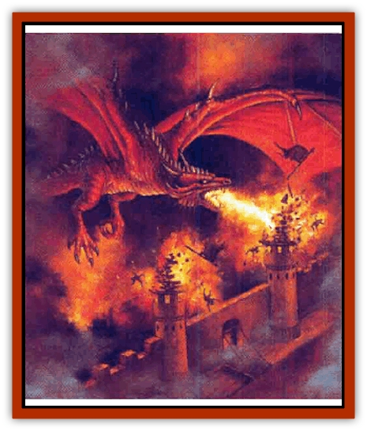

# Dragon - Cerilia

| Statistic | **Dragon (Cerilia)** |
| --- | --- |
| **Activity Cycle:** | Any |
| **Alignment:** | Any neutral |
| **Armor Class:** | 0 or better |
| **Climate/Terrain:** | Mountains |
| **Damage/Attack:** | 1d10/1d10/2d12 |
| **Diet:** | Carnivore |
| **Frequency:** | Very rare |
| **Hit Dice:** | 15 (base) |
| **Intelligence:** | Exceptional (15-16) |
| **Magic Resistance:** | Variable |
| **Morale:** | Fanatic (17-18) |
| **Movement:** | 9, F124 (C) |
| **No. Appearing:** | 1 |
| **No. of Attacks:** | 3 + special |
| **Organization:** | Solitary |
| **Size:** | G (40' base) |
| **Special Attacks:** | Breath weapon, spells |
| **Special Defenses:** | See below |
| **THAC0:** | 6 (base) |
| **Treasure:** | (H, S, T) |
| **XP Value:** | 22,000 (base) |

The [[Dragon_General_Information|dragons]] of Cerilia are an ancient race, predating even elves and dwarves. They once existed in great numbers, but now only a handful live in the Drachenaur Mountains and in lands far across the sea. While they are extremely intelligent and preserve knowledge and lore older than mankind, the dragons greatly dislike being troubled by intruders, and view any nondragons are dangerous vermin to be exterminated if they venture too close to a dragon's lair.

All Cerilian dragons are members of a single species, unlike dragons on most other worlds. They are long, serpentine creatures with short legs and a pair of great, leathery wings. Their bellies are protected by thick folds of leathery skin; iron-hard scales protect the upper surfaces of their bodies and limbs. They range in color from a reddish rust-brown to an iron gray and their bellies are usually paler than their scales. Dragons speak their own tongue and about 50% also speak dwarvish or elvish. They haven't bothered to learn the language of any younger races.

**Combat:** Most dragons don't care for physical encounters and prefer to use intimidation, spells, breath weapon, and other abilities before engaging in melee. All Cerilian dragons radiate *fear* in a 50-yard radius. In addition, any creature that meets the gaze of a dragon must make a successful saving throw vs. spell with a -4 penalty or be *paralyzed* in terror for 2d4 turns. If the dragon wishes to spend an entire round concentrating on a victim who has met its gaze, it can use the powers of *feeblemind*, *geas*, or *suggestion* on the victim with no saving throw.

The breath weapon of a Cerilian dragon is a stream of acid and fire. It affects a line up to 60 feet long and 5 feet wide. The dragon can breathe once per six melee rounds.

The table lists modifiers, based on age, for the dragon's base Hit Dice, Armor Class, breath weapon, magic resistance, and combat abilities. The combat modifier is a bonus to all attacks *and* damage for the dragon's physical attacks. If it enters physical combat the dragon strikes with its forepaws and bites.

*Dragon Magic:* All Cerilian dragons are powerful spellcasters, equivalent to wizard of 9th ot 16th level (1d8+8), However, they are able to use spells only from the schools of abjuration, alteration, conjuration, summpning, and divination. Victims of dragon magic suffer a saving throw penalty equal to the dragon's Armor Class modifier due to its age; thus a victim of a wyrm's spell suffers a -3 penalty to the saving throw.

**Habitat/Society:** No young dragons are known to exist on Cerilia; all Cerilian dragons fall into the age categories of *old*, *very old*, *venerable*, *wyrm*, and *great wyrm*.

Dragons have memories of many things forgotten by other races. Each dragon is the equivalent of a sage in several areas of magical, natural or extraplanar lore. Some dragons have been known to share their knowledge with mortal supplicants, but as as rule, dragon lore comes couched in riddles and mystery.

**Ecology:** Dragons are a vanishing race. Once they warred incessantly among themselves, but for the last few millenia they have avoided fighting each other. As the dragons grow older, they spend more time sleeping; they typically nap for twenty to thirty years at a time.

When a dragon awakes, its first thought is food. Evil dragons won't hesitate to raid nearby human and demihuman settlements, but good dragons usually limit themselves to wild game.

| Age Category | Hit Die Modifier | Combat Modifier | Armor Class | Breath Weapon | Magic Resist. | XP Value |
| --- | --- | --- | --- | --- | --- | --- |
| Old | +4 HD | +8 | 0 | 12d6+12 | 35% | 22,000 |
| Very Old | +5 HD | +9 | -1 | 14d6+14 | 40% | 24,000 |
| Venerable | +6 HD | +10 | -2 | 16d6+16 | 45% | 26,000 |
| Wyrm | +7 HD | +11 | -3 | 18d6+18 | 50% | 28,000 |
| Great Wyrm | +8 HD | +12 | -4 | 20d6+20 | 60% | 30,000 |

---
## Discovery & Documentation

**Source Publication:** Monstrous Compendium, 1996 Annual, Volume 3 (1995)
**Campaign Setting:** Advanced Dungeons & Dragons 2nd Edition
**Author(s):** Jon Pickens

### Other Creatures Found in This Source Book
   * [[Alaghi|Alaghi]]
   * [[Alhoon|Alhoon]]
   * [[Aranea_Savage_Coast|Aranea (Savage Coast)]]
   * [[Arcane_Head|Arcane Head]]
   * [[Banedead|Banedead]]
   * [[Banelich|Banelich]]
   * [[Bat_Bonebat|Bat, Bonebat]]
   * [[Beetle|Beetle]]
   * [[Belgoi|Belgoi]]
   * [[Bladeling|Bladeling]]
   * [[Braxat|Braxat]]
   * [[Bunyip|Bunyip]]
   * [[Burbur|Burbur]]
   * [[Bvanen|Bvanen]]
   * [[Cat_Great_Snow_Tiger|Cat, Great, Snow Tiger]]
   * [[Chosen_One|Chosen One]]
   * [[Chronovoid|Chronovoid]]
   * [[Cildabrin|Cildabrin]]
   * [[Coffer_Corpse|Coffer Corpse]]
   * [[Disenchanter|Disenchanter]]
   * [[Dog_Temporal|Dog, Temporal]]
   * [[Dragon_Ghost|Dragon, Ghost]]
   * [[Dragon_Lesser_Undead|Dragon, Lesser Undead]]
   * [[Dragon_Neutral_Amber|Dragon, Neutral, Amber]]
   * [[Dread_Warrior|Dread Warrior]]
   * [[Dreamweaver|Dreamweaver]]
   * [[Dream_Spawn_Greater_Ennui|Dream Spawn, Greater, Ennui]]
   * [[Dream_Spawn_Lesser_Morph|Dream Spawn, Lesser, Morph]]
   * [[Dwarf_Arctic|Dwarf, Arctic]]
   * [[Dwarf_Urdunnir|Dwarf, Urdunnir]]
   * [[Eel_Giant_Moray|Eel, Giant Moray]]
   * [[Elemental_Fire_Kin_Tome_Guardian|Elemental, Fire Kin, Tome Guardian]]
   * [[Elf_Rockseer|Elf, Rockseer]]
   * [[Ethyk|Ethyk]]
   * [[Faerie_Faerie_Fiddler|Faerie, Faerie Fiddler]]
   * [[Faerie_Petty_Bramble|Faerie, Petty, Bramble]]
   * [[Faerie_Petty_Gorse|Faerie, Petty, Gorse]]
   * [[Faerie_Petty|Faerie, Petty]]
   * [[Firenewt|Firenewt]]
   * [[Formian|Formian]]
   * [[Gargoyle_II|Gargoyle II]]
   * [[Giant_Cerilia|Giant (Cerilia)]]
   * [[Goblin_Cerilia|Goblin (Cerilia)]]
   * [[Golem_Magic|Golem, Magic]]
   * [[Golem_Shaboath|Golem, Shaboath]]
   * [[Hag_Bheur|Hag, Bheur]]
   * [[Hamadryad|Hamadryad]]
   * [[Hound_of_Ill-Omen|Hound of Ill-Omen]]
   * [[Human_Cerilia|Human (Cerilia)]]
   * [[Hybsil|Hybsil]]
   * [[Ibrandlin|Ibrandlin]]
   * [[Imp_Chaos|Imp, Chaos]]
   * [[Ixitxachitl_Ixzan|Ixitxachitl, Ixzan]]
   * [[Jabberwock|Jabberwock]]
   * [[Kyton|Kyton]]
   * [[Kyuss_Son_of|Kyuss, Son of]]
   * [[Lillend|Lillend]]
   * [[Life-Shaped_Creation_Guardian|Life-Shaped Creation, Guardian]]
   * [[Life-Shaped_Creation_Transport|Life-Shaped Creation, Transport]]
   * [[Lycanthrope_Werecrocodile|Lycanthrope, Werecrocodile]]
   * [[Lycanthrope_Werespider|Lycanthrope, Werespider]]
   * [[Magedoom|Magedoom]]
   * [[Manotaur|Manotaur]]
   * [[Mastiff_Shadow|Mastiff, Shadow]]
   * [[Meazel|Meazel]]
   * [[Mist_Scarlet_Dancer|Mist, Scarlet Dancer]]
   * [[Needleman|Needleman]]
   * [[Orc_Neo-Orog|Orc, Neo-Orog]]
   * [[Orc_Ondonti|Orc, Ondonti]]
   * [[Owlbear_II|Owlbear II]]
   * [[Pegataur|Pegataur]]
   * [[Phaerimm|Phaerimm]]
   * [[Reggelid|Reggelid]]
   * [[Render|Render]]
   * [[Saurial|Saurial]]
   * [[Scalamagdrion|Scalamagdrion]]
   * [[Sharn|Sharn]]
   * [[Snake_Messenger|Snake, Messenger]]
   * [[Spirit_Forest_Uthraki|Spirit, Forest, Uthraki]]
   * [[Spirit_Forest_Wood_Man|Spirit, Forest, Wood Man]]
   * [[Spirit_Ice_Orglash|Spirit, Ice, Orglash]]
   * [[Spirit_Rock_Thomil|Spirit, Rock, Thomil]]
   * [[Strider_Giant|Strider, Giant]]
   * [[Tembo|Tembo]]
   * [[Temporal_Glider|Temporal Glider]]
   * [[Temporal_Stalker|Temporal Stalker]]
   * [[Tether_Beast|Tether Beast]]
   * [[Thessalmonster|Thessalmonster]]
   * [[Time_Dimensional|Time Dimensional]]
   * [[Tomb_Tapper|Tomb Tapper]]
   * [[Undead_Dragon_Slayer|Undead Dragon Slayer]]
   * [[Unicorn_Black_Toril|Unicorn, Black (Toril)]]
   * [[Vaath|Vaath]]
   * [[Vortex_Spider|Vortex Spider]]
   * [[Weredragon|Weredragon]]
   * [[Zhentarim_Spirit|Zhentarim Spirit]]
