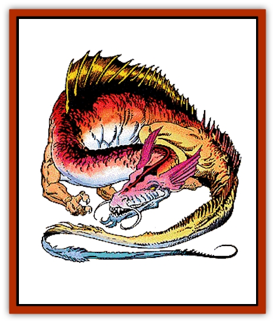

# Dragon - Cloud

| Statistic | **Dragon, Cloud** |
| --- | --- |
| **Activity Cycle:** | Any |
| **Alignment:** | Neutral |
| **Armor Class:** | 0 (base) |
| **Climate/Terrain:** | Tropical, subtropical, temperature/Clouds, mountains |
| **Damage/Attack:** | 1-10/1-10/3-36 |
| **Diet:** | Special |
| **Frequency:** | Very rare |
| **Hit Dice:** | 14 (base) |
| **Intelligence:** | Genius (17-18) |
| **Magic Resistance:** | Varies |
| **Morale:** | Fanatic (17) |
| **Movement:** | 6, Fl 39 (C), Jp 3 |
| **No. Appearing:** | 1 (2-5) |
| **No. of Attacks:** | 3 + special |
| **Organization:** | Solitary or clan |
| **Size:** | G (66' base) |
| **Special Attacks:** | Special |
| **Special Defenses:** | Varies |
| **THAC0:** | 7 |
| **Treasure:** | Special |
| **XP Value:** | Varies |

Cloud [[Dragon_General_Information|dragons]] are reclusive creatures that dislike intrusions. They rarely converse, but if persuaded to do so they tend to be taciturn and aloof. They have no respect whatsoever for creatures that cannot fly without assistance from spells or devices.

At birth, cloud dragons have silver-white scales tinged with red at the edges. As they grow, the red spreads and lightens to sunset orange. At the *mature adult* stage and above, the red-orange color deepens to red gold and almost entirely replaces the silver.

Cloud dragons speak their own tongue and a tongue common to all neutral dragons. Also 17% of *hatchling* cloud dragons can speak with any intelligent creature. The chance to possess this ability increases 5% per age category.

**Combat:** Cloud dragons are as likely to avoid combat (by assuming cloud form) as they are to attack. When attacking, they use their breath weapon to scatter foes, then cast solid fog and use their manipulation abilities to blind and disorient their foes. When very angry, they conjure storms with *control weather* spells, then they *call lightning*. They like to use *stinking cloud* and *control winds* spells against flying opponents.

**Breath Weapon/Special Abilities:** A cloud dragon's breath weapon is an icy blast of air that is 140 feet long, 30 feet high, and 30 feet wide. Creatures caught in the blast suffer damage from cold and flying ice crystals. Furthermore, all creatures three size classes or more smaller than the dragon are blown head over heels for 2d12 feet, plus 3 feet per age category of the dragon. Characters who can grab solid objects won't be carried away unless they fail Strength checks; creatures with claws, suction cups, etc., can avoid the effect if they have a suitable surface to cling to.

A cloud dragon casts its spells and uses its magical abilities at 6th level plus its combat modifier.

Cloud dragons are immune to cold.

They can assume (or leave) a cohesive, cloud-like form at will, once per round. In this form, they are 75% unlikely to be distinguished from normal clouds; when in cloud form, their Armor Class improves by -3 and their magic resistance increases by 15%. Cloud dragons can use their spells and innate abilities while in cloud form, but they cannot attack physically or use their breath weapon. In cloud form, cloud dragons fly at a speed of 12 (MC: A). As they age, cloud dragons gain the following additional powers:

*Very young: solid fog* twice a day; *Young: stinking cloud* twice a day; *Juvenile: create water* twice a day (affects a maximum of three cubic yards [81 cubic feet]); *Adult: obscurement* three times a day. *Mature adult: call lightning* twice a day; *Old: weather summoning* twice a day. *Very old: control weather* twice a day. *Ancient: control winds* twice a day.

**Habitat/Society:** Cloud dragons lair in magical cloud islands where there is at least a small, solid floor laying eggs and storing treasure. Very rarely, they occupy cloud-shrouded mountain peaks.

Cloud dragons are solitary 95% of the time. If more than one is encountered it is a single parent with offspring.

**Ecology:** Like all dragons, cloud dragons can eat just about anything. They seem to subsist primarily on rain water, hailstones, and the occasional bit of silver.

Because they inhabit in similar territories, cloud dragons come into conflict with [[Dragon_Metallic_Silver|silver dragons]]. Despite their higher intelligence, cloud dragons usually lose confrontation because of the silver dragons' secondary breath weapons and ability to muster allies.

| Age | Body Lgt. (') | Tail Lgt. (') | AC | Breath Weapon | Spells W/P | MR | Treas. Type | XP Value |
| --- | --- | --- | --- | --- | --- | --- | --- | --- |
| 1 Hatchling | 11-24 | 4-8 | 3 | 2d6+2 | Nil | Nil | Nil | 3,000 |
| 2 Very young | 24-41 | 8-16 | 2 | 3d6+4 | Nil | Nil | Nil | 6,000 |
| 3 Young | 41-58 | 16-22 | 1 | 4d6+6 | Nil | Nil | Nil | 8,000 |
| 4 Juvenile | 58-71 | 22-29 | 0 | 5d6+8 | 1 | Nil | ½R,T | 11,000 |
| 5 Young adult | 71-87 | 29-37 | -1 | 6d6+10 | 1 1 | 25% | R,T | 13,000 |
| 6 Adult | 87-102 | 37-44 | -2 | 7d6+12 | 2 1 | 30% | R,T | 14,000 |
| 7 Mature adult | 102-117 | 44-51 | -3 | 8d6+14 | 2 2 | 35% | R,T | 15,000 |
| 8 Old | 117-132 | 51-59 | -4 | 9d6+16 | 3 2/1 | 40% | R,T,X,Z | 17,000 |
| 9 Very old | 132-148 | 59-66 | -5 | 10d6+18 | 3 3/1 1 | 45% | R,T,X,Z | 18,000 |
| 10 Venerable | 148-165 | 66-74 | -6 | 11d6+20 | 4 3/2 1 | 50% | R,T,X,Z | 19,000 |
| 11 Wyrm | 165-184 | 74-82 | -7 | 12d6+22 | 4 4/2 2 | 55% | R,T,X,Zx2 | 20,000 |
| 12 Great Wyrm | 184-203 | 82-92 | -8 | 13d6+24 | 5 4/3 2 | 60% | R,T,X,Zx2 | 21,000 |

---
## Discovery & Documentation

**Source Publication:** MC5 Greyhawk Appendix (1989)
**Campaign Setting:** Advanced Dungeons & Dragons 2nd Edition
**Author(s):** Grant Boucher, William W. Connors, Steve Gilbert, Bruce Nesmith, Chris Mortika, Skip Williams

### Other Creatures Found in This Source Book
   * [[Aspis|Aspis]]
   * [[Beastman|Beastman]]
   * [[Bonesnapper|Bonesnapper]]
   * [[Booka|Booka]]
   * [[Brownie_Buckawn|Brownie, Buckawn]]
   * [[Brownie_Quickling|Brownie, Quickling]]
   * [[Crystalmist|Crystalmist]]
   * [[Dragon_Oerth_Greyhawk|Dragon (Oerth), Greyhawk]]
   * [[Dragonfly_Giant|Dragonfly, Giant]]
   * [[Dragonnel|Dragonnel]]
   * [[Elf_Grugach|Elf, Grugach]]
   * [[Elf_Valley|Elf, Valley]]
   * [[Golem_Necrophidius|Golem, Necrophidius]]
   * [[Grell_Wild|Grell, Wild]]
   * [[Grung|Grung]]
   * [[Hobgoblin_Norker|Hobgoblin, Norker]]
   * [[Hook_Horror|Hook Horror]]
   * [[Horgar|Horgar]]
   * [[Hound_Yeth|Hound, Yeth]]
   * [[Iguana_Giant|Iguana, Giant]]
   * [[Ingundi|Ingundi]]
   * [[Kech|Kech]]
   * [[Kyuss_Son_of|Kyuss, Son of]]
   * [[Mite|Mite]]
   * [[Needleman|Needleman]]
   * [[Plant_Carnivorous_Oerth|Plant, Carnivorous (Oerth)]]
   * [[Plant_Carnivorous_Vampire_Cactus|Plant, Carnivorous, Vampire Cactus]]
   * [[Plasmoid_General_Information|Plasmoid, General Information]]
   * [[Rat_Oerth|Rat (Oerth)]]
   * [[Raven_Crow|Raven/Crow]]
   * [[Scarecrow|Scarecrow]]
   * [[Shadow_Slow|Shadow, Slow]]
   * [[Skulk|Skulk]]
   * [[Snail|Snail]]
   * [[Sprite|Sprite]]
   * [[Taer|Taer]]
   * [[Tentamort|Tentamort]]
   * [[Turtle_Giant|Turtle, Giant]]
   * [[Tyrg|Tyrg]]
   * [[Wolf_Mist|Wolf, Mist]]
   * [[Wraith_Oerth|Wraith (Oerth)]]
   * [[Zygom|Zygom]]
