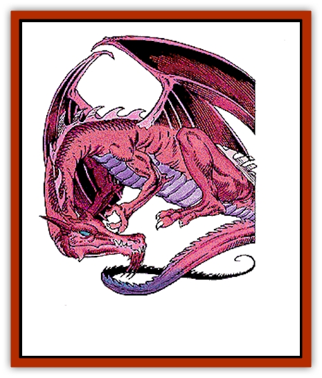

# Dragon - Deep

| Statistic | **Dragon, Deep** |
| --- | --- |
| **Activity Cycle:** | Any |
| **Alignment:** | Chaotic evil |
| **Armor Class:** | 0 (base) |
| **Climate/Terrain:** | Hill and mountain caverns, subterranean |
| **Damage/Attack:** | 3-12/3-12/3-24 |
| **Diet:** | Carnivorous |
| **Frequency:** | Rare |
| **Hit Dice:** | 14 (base) |
| **Intelligence:** | Exceptional (15-16) |
| **Magic Resistance:** | Variable |
| **Morale:** | Fanatic (17-18) |
| **Movement:** | 12, Fl 30 (C), Br 6, Sw 9 |
| **No. Appearing:** | 1 (2-5) |
| **No. of Attacks:** | 3 + special |
| **Organization:** | Solitary or clan |
| **Size:** | H (24' base) |
| **Special Attacks:** | See below |
| **Special Defenses:** | Variable |
| **THAC0:** | 7 (base) |
| **Treasure:** | Special |
| **XP Value:** | Variable |

Deep [[Dragon_General_Information|dragons]] are little known on the surface world. They are the hunters of the Underdark. Cunning and patient, they place their survival, followed by their joy of hunting, above all else. Deep dragons carefully amass and hide treasure in various caches, guarded with traps and magic. They are able to use most magical items, and will retain those they seize for personal use.

Deep dragons are an iridescent, eye-catching maroon when they hatch. Soft-scaled, and unable to change form, they keep to their birth-lair until they have mastered both of their other forms - a giant winged worm or snakes and a human (or [[Elf_Drow|drow]]) form.

**Combat:** Deep dragons burrow and fight with their powerful, stone-rending claws. They love to fight and hunt prey through the lightless caverns of the Underdark, employing their varrious forms. In snake form, they are AC 6, MV 9, Fl 4(D), Sw 11, losing claw attacks, but gaining a constriction attack (attack roll required, inflicts 3d8 points of damage per round, hampers movement, spellcasting, and causes -1 on attack rolls and a 1-point AC penalty).

In human form, a deep dragon is AC 10, MV 12, Sw 12, and does damage by spell or weapon type. Armor can be worn, but it is always destroyed (doing the dragon 2d4 damage in the process) in any transformation of shape. A deep dragon can alter the size, shape, hue and features of its bipedal form to resemble a human, elf (surface or drow), half-elf, half-orc, orc, hobgoblin, dwarf, duergar, or any similar creature of like size. It can do this well enough to always be taken for a being of such a race, but is only 66% likely to copy a specific being well enough to be mistaken for that individual.

Deep dragons are wary in battle and approach, but find spell and claw-to-hand combat well-nigh irresistible. They will avoid obvious traps, ambushes, and open combat with magically-strong, numerous opponents trying to find them, but delight in stalking prey, pouncing on creatures without warning, and using their spells to bury opponents under rockfalls, or smiting with destructive spells.

**Breath weapon/special abilities:** A deep dragon's breath weapon is a cone of flesh-corrosive gas 50 feet long, 40 feet wide, and 30 feet high. Creatures in the cloud can save vs. breath weapon for half damage (if they have dry, exposed skin, they save against the flesh-eating gas at -2). Cloth, metal, and wood are not affected. Leather is treated as dry, exposed skin.

Deep dragons cast spells at 9th level, adjusted by their combat modifiers. They are born with *infravision*, *true seeing*, and unerring *detect magic* abilities, and immunities to *charm*, *sleep*, and *hold* magic. Deep dragons are immune to extremes of heat and cold (-3 on each die of damage taken, to a minimum of 1 hp per die).

As deep dragons age, they gain the following additional powers:

*Very young:* assume *snakeform* 3 times/day.  
*Young:* assume *bipedal* or *"human" form* 3 times/day.  
*Juvenile:* gain one additional form change (each form) per day, gain ability to *regenerate* 1d4 hp everyturn.  
*Adult:* *regenerate* ability stengthens, to 1d4 hp every 6 rounds. Gains ability of *free action* at will.  
*Mature adult:* *regenerate* ability increases, to 1d4 hp every 4 rounds; Gains ability to *levitate* 3 times/day. (usable in combination with *free action*). 
*Old:* gains the ability to *transmute rock to mud* and use *telekinesis* 3 times/day  
*Very old:* gains the ability to *move earth* 3 times/day  
*Venerable:* gains the ability to *passwall* twice per day, and *disintegrate* (non-living matter only, but can be used on undead or the clothing and gear worn and carried by a living being) twiice per day.  
*Wyrm:* gains an additional use/day of powers gained since "Old" age to date, also the ability *stone shape* 2 times/day, and use *tongues* once/day  
*Great wyrm*: the power to use *repulsion* 3 times/day is gained, affecting undead and all living creatures except other true dragons. One additional use/day of *stone shape* and *tongues* is also gained. 

**Habitat/Society:** Deep dragons roam the Underdark. They are great explorers, and even venture (particularly when they are young adults) up and about the surface world from time to time - particularly to regain stolen treasure, take revenge on foes, and to seize or steal magic

Otherwise, deep dragons are found in trapped, well-defended lairs in the Underdark. They often use their powers to reach caverns inaccessible to most creatures (including themselves in full-size dragon form), and to fashion physical, monstrous (transplanting harmful [[Fungus|fungi]] and similar creatures), and magical traps to defend them. Deep dragons often work with drow, as guardians that the drow feed regularly with slaves, captives, and drow who have earned the death penalty

**Ecology:** Deep dragons have been known to eat almost anything, but they particularly prize the flesh of clams, fish, [[Kuo-Toa|kuo-toa]], and [[Aboleth|aboleth]]. They view [[Cloaker|cloakers]] and [[Mind_Flayer|mind flayers]] as dangerous rivals in the Underdark. Deep dragons avoid confrontations with other dragons and never fight or steal from others of their own kind.

DMs are reminded to consult <a href="/catalog/add2_01/2102">Volume One of the *Monstrous Compendium*</a> when using this monster; the powers and characteristics generally shared by [[Dragon_General_Information|dragons]] (see 2-page "Dragons" general entry) apply to Deep Dragons.

| Age | Body Lgt. (') | Tail Lgt. (') | AC | Breath Weapon | Spells W/P | MR | Treas. Type | XP Value |
| --- | --- | --- | --- | --- | --- | --- | --- | --- |
| 1 Hatchling | 1-5 | 1-4 | 3 | 2d8+1 | Nil | Nil | Nil | 2,000 |
| 2 Very young | 5-14 | 4-12 | 2 | 4d8+2 | Nil | Nil | Nil | 3,000 |
| 3 Young | 14-23 | 12-21 | 1 | 6d8+3 | Nil | Nil | Nil | 4,000 |
| 4 Juvenile | 23-32 | 21-28 | 0 | 8d8+4 | 1 | Nil | H,Q | 6,000 |
| 5 Young adult | 32-41 | 28-36 | -1 | 10d8+5 | 2 | 25% | H,Qx2,E | 8,000 |
| 6 Adult | 41-50 | 36-45 | -2 | 12d8+6 | 2 1 | 30% | H,Qx3,E,S | 10,000 |
| 7 Mature adult | 50-59 | 45-54 | -3 | 14d8+7 | 3 2 | 35% | Hx2,Qx4,E,S | 12,000 |
| 8 Old | 59-68 | 54-62 | -4 | 16d8+8 | 4 2 1/1 | 40% | Hx2,Qx4,E,S,T | 15,000 |
| 9 Very old | 68-77 | 62-70 | -5 | 18d8+9 | 4 2 2/2 | 45% | Hx3,Qx5,E,S,T | 16,000 |
| 10 Venerable | 77-86 | 70-78 | -6 | 20d8+10 | 4 3 2 1/2 1 | 50% | Hx3,Q,E,S,T,U | 17,000 |
| 11 Wyrm | 86-95 | 78-85 | -7 | 22d8+11 | 4 3 3 2/3 2 | 55% | Hx3,Q,E,S,T,U,V | 18,000 |
| 12 Great Wyrm | 95-104 | 85-94 | -8 | 24d8+12 | 4 3 3 2 1/3 3 1 | 60% | H,Q,E,S,T,U,V,X,Z | 19,000 |

---
## Discovery & Documentation

**Source Publication:** MC11 Forgotten Realms Appendix II (1991)
**Campaign Setting:** Advanced Dungeons & Dragons 2nd Edition
**Author(s):** Tim Beach, Tim Brown, William W. Connors, Dale Donovan, Ed Greenwood, Jeff Grubb, Bruce Heard, Slade Henson, Rob King, Colin McComb, Roger E. Moore, Bruce Nesmith, Jon Pickens, Jean Rabe, Dori Watry, Skip Williams

### Other Creatures Found in This Source Book
   * [[Alaghi|Alaghi]]
   * [[Alguduir|Alguduir]]
   * [[Beguiler|Beguiler]]
   * [[Bird_Toril|Bird (Toril)]]
   * [[Cantobele|Cantobele]]
   * [[Carapace|Carapace]]
   * [[Cat_Toril|Cat (Toril)]]
   * [[Chitine|Chitine]]
   * [[Cildabrin|Cildabrin]]
   * [[Dimensional_Warper|Dimensional Warper]]
   * [[Fachan_Toril|Fachan (Toril)]]
   * [[Fael|Fael]]
   * [[Feyr|Feyr]]
   * [[Firetail|Firetail]]
   * [[Frost|Frost]]
   * [[Gaund|Gaund]]
   * [[Gloomwing|Gloomwing]]
   * [[Golden_Ammonite|Golden Ammonite]]
   * [[Golem_Lightning|Golem, Lightning]]
   * [[Hamadryad|Hamadryad]]
   * [[Harrier|Harrier]]
   * [[Harrla|Harrla]]
   * [[Haun|Haun]]
   * [[Haundar|Haundar]]
   * [[Hendar|Hendar]]
   * [[Inquisitor|Inquisitor]]
   * [[Lhiannan_Shee|Lhiannan Shee]]
   * [[Loxo|Loxo]]
   * [[Manni|Manni]]
   * [[Manscorpion|Manscorpion]]
   * [[Mara|Mara]]
   * [[Morin|Morin]]
   * [[Naga_Dark|Naga, Dark]]
   * [[Orpsu|Orpsu]]
   * [[Plant_Carnivorous_Black_Willow|Plant, Carnivorous, Black Willow]]
   * [[Plant_Carnivorous_Toril|Plant, Carnivorous (Toril)]]
   * [[Plant_Dangerous_I|Plant, Dangerous I]]
   * [[Ring-Worm|Ring-Worm]]
   * [[Rohch|Rohch]]
   * [[Sand_Cat|Sand Cat]]
   * [[Saurial|Saurial]]
   * [[Sha'az|Sha'az]]
   * [[Silver_Dog|Silver Dog]]
   * [[Simpathetic|Simpathetic]]
   * [[Skuz|Skuz]]
   * [[Spider_Monkey|Spider, Monkey]]
   * [[Tren|Tren]]
