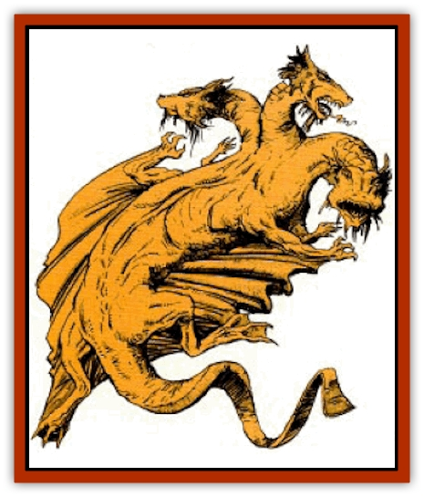
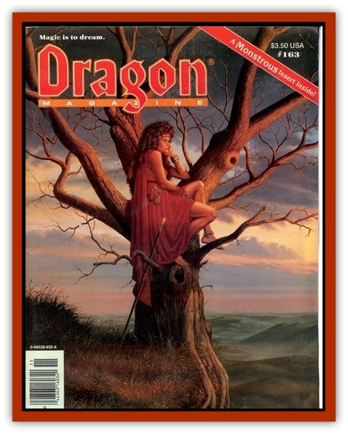

# Dragon - Dzalmaus

| Statistic | **Dragon, Dzalmaus** |
| --- | --- |
| **Activity Cycle:** | Day |
| **Alignment:** | Chaotic evil |
| **Armor Class:** | Special |
| **Climate/Terrain:** | Steppe |
| **Damage/Attack:** | 1-6/1-6/3-18 (&times;3) |
| **Diet:** | Carnivore |
| **Frequency:** | Very rare |
| **Hit Dice:** | 8 (Base) |
| **Intelligence:** | Very (11-12) |
| **Magic Resistance:** | Varies |
| **Morale:** | Elite (16 base) |
| **Movement:** | 6, Fl 30 |
| **No. Appearing:** | 1-2 |
| **No. of Attacks:** | 5 + special |
| **Organization:** | Solitary |
| **Size:** | G (30' base) |
| **Special Attacks:** | Breath weapon |
| **Special Defenses:** | Varies |
| **THAC0:** | 13 (Base) |
| **Treasure:** | Nil |
| **XP Value:** | Special |

The dzalmaus is a dreaded species of [[Dragon_General_Information|dragon]], feared as much for its appetite as its great size. Unlike other dragons, it is not the least bit sociable, not even to others of its kind. As a consequence, it roams dusty grasslands, following the movements of its prey, humans.

Unlike other dragons, the dzalmaus is not a brightly creature with glistening scales. It is particularly drab in coloration. The dzalmaus is sand-brown colored to light yellow across its back. Its body is flatter and without the back ridges common to many dragons. The neck branches into three heads, each broad, with the eyes high on the skull. For its huge size, the dzalmaus is able to conceal its body in the tall grasses of the steppe amazingly well.

**Combat:** The dzalmaus is a constant predator, stalking its prey across the grasslands or swooping down from the air. It then strikes with its three heads, quickly rending the victim apart. It uses its other attacks (claws, tails, and wings) only for self defense, never for hunting.

The dzalmaus can bite up to three different targets in a single round, provided all are within the front 180 degree arc of the creature. Its necks, while flexible, are not so bendable that it can reach behind itself.

**Breath Weapon/Special Abilities:** Dzalmauses of adult age or greater possess a fearsome breath weapon. They are able to project a cone of vampiric life-draining 60 feet long, 1 foot wide at the mouth, and 20 feet wide at the base. All creatures within the area of the cone must make a saving throw vs. breath weapon or be drained one energy level. Hit points, spells, and combat ability are lost immediately. The life-draining of older dragons is powerful enough to lower its victim's chance of making a successful saving throw.

Levels drained by the dzalmaus are added to its own in the form of additional hit dice, one die for each level drained. The additional hit dice do not alter the THAC0, damage, age, or size of the creature. Once it has drained levels equal to its hit dice, the creature cannot use it breath weapon until the drained energy dissipates. Damage suffered by the dzalmaus is taken from these hit points first.

Fortunately, the energy drain is not permanent. Those drained regain their levels 1-4 hours after the attack. Hit points, combat ability, and spells known are returned to normal, unless, of course, the character was slain. Memorized spells that were lost are not regained, however. At the same time, the dzalmaus loses the additional hit dice it had gained. It also regains the use of its breath weapon.

The dzalmaus has a strong will. It is immune to all *charm* and mind control spells. In addition, the dzalmaus develops a minor magic resistance as it grows older. It can speak the languages of the steppe people, in addition to the dragon tongue.

**Habitat/Society:** Although intelligent, the dzalmaus is a solitary and savage creature. It prefers to have little contact with other dragons, especially those not of its own kind. The dzalmaus makes no known lair and does not collect treasure. Instead it roams the steppe, following the movements of the human nomads.

The dzalmaus only mates as is necessary. The female raises the young on her own. At this time, the mother makes a concealed nest, usually in the tall grass or a small stand of trees. Bold hunters will search for these nests, hoping to steal the infants away while the mother is out hunting. Such thefts invariably cause the mother dzalmaus to go on a rampage, at which point the thief had best be far away.

**Ecology:** The dzalmaus lives on a diet of meat, with horseflesh most common, followed by humans. In times of famine, it will eat whatever is available.

Fortunately for its kind, the dzalmaus does not create any useful by-products. The young can be sold as exotic rarities for 5,000 to 10,000 gp.

| Age | Body Lgt. | Tail Lgt. | AC | Breath Weapon* | Spells | MR | XP Value |
| --- | --- | --- | --- | --- | --- | --- | --- |
| 1 | 3-5 | 2-3 | 7 | Nil | Nil | Nil | 420 |
| 2 | 5-15 | 4-12 | 6 | Nil | Nil | Nil | 975 |
| 3 | 15-22 | 13-18 | 5 | Nil | Nil | Nil | 2,000 |
| 4 | 22-31 | 19-24 | 4 | Nil | Nil | Nil | 3,000 |
| 5 | 31-40 | 25-33 | 3 | Nil | Nil | 5% | 6,000 |
| 6 | 41-52 | 34-43 | 2 | 0 | Nil | 10% | 9,000 |
| 7 | 53-63 | 44-53 | 1 | -1 | Nil | 15% | 10,000 |
| 8 | 64-75 | 54-63 | 0 | -2 | Nil | 20% | 12,000 |
| 9 | 76-87 | 64-73 | -1 | -3 | Nil | 25% | 13,000 |
| 10 | 88-99 | 74-83 | -2 | -4 | Nil | 30% | 14,000 |
| 11 | 100-111 | 84-93 | -3 | -5 | Nil | 35% | 15,000 |
| 12 | 112-123 | 94-103 | -4 | -6 | Nil | 40% | 16,000 |

---
## Discovery & Documentation

**Source Publication:** Dragon163 (1990)
**Campaign Setting:** Dragon Magazine
**Author(s):** 

### Other Creatures Found in This Source Book
   * [[Manni|Manni]]
   * [[Morin|Morin]]
   * [[Sand_Cat|Sand Cat]]
   * [[Spell_Weaver|Spell Weaver]]
