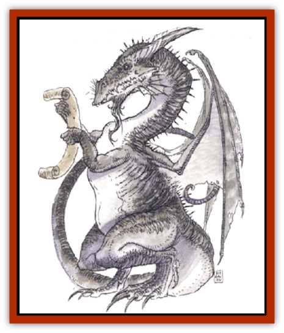

# Dragon - Electrum

| Statistic | **Dragon, Electrum** |
| --- | --- |
| **Activity Cycle:** | Any |
| **Alignment:** | Neutral good |
| **Armor Class:** | 2 (base) |
| **Climate/Terrain:** | Mountains or barrens |
| **Damage/Attack:** | 1d4(&times;2)/3d8 |
| **Diet:** | Omnivore |
| **Frequency:** | Rare |
| **Hit Dice:** | 9 (base) |
| **Intelligence:** | Exceptional (15-16) |
| **Magic Resistance:** | See below |
| **Morale:** | Fearless (19 base) |
| **Movement:** | 12, Fl 24 (C), Jp 2 |
| **No. Appearing:** | 1 |
| **No. of Attacks:** | 3 + special |
| **Organization:** | Solitary |
| **Size:** | G (36' base) |
| **Special Attacks:** | See below |
| **Special Defenses:** | See below |
| **THAC0:** | 11 (base) |
| **Treasure:** | See below |
| **XP Value:** | See below |

Electrum [[Dragon_General_Information|dragons]] are peaceful and philosophical in nature, but become deadly, alert, and deliberate fighters when aroused. They dwell alone in lairs of stone (abondoned buildings, mountains, caverns), but they often welcome visitors because they enjoy trading, bargaining, and philosophical debate. They hoard things of beauty rather than monetary wealth.

**Combat:** In battle, electrum dragons prefer to use their spells and breath weapon from a distance. They are wise generals, anticipating the strategies of foes. In melee they typically attack with two foreclaws and a bite. They can pounce from aloft to strike with all four claws, but they prefer to swoop and slash with their foreclaws as they pass, dragging their hindquarters and tail to buffet a foe for 2d6 points of battering damage.

An electrum dragon's breath weapon is a cone of unique gas, 40 feet long by 30 feet in diameter (5 feet across at the dragon's mouth). It causes *enfeeblement* (as the spell *ray of enfeeblement* for one turn and/or *confusion* (as the spell) for nine rounds (all victims save twice - once to avoid each effect).

An electrum dragon casts spells and uses magical abilities at a level equal to 10 plus its age category value. At birth they can *detect magic* and *read magic*. They also save vs. all spells cast specifically at them with a +1 bonus to the roll. As they age, they gain the following additional powers:

*Young: identify* by touch (no debilitating effects) at will; *Juvenile: locate object* once per day; *Adult: dispel magic* three times per day; *Old: telekinesis* twice per day; *Wyrm: project image* once per day; *Great wyrm: heal* (self or another, by touch) once per day.

**Habitat/Society:** Electrum dragons spend much time in thought, often perched on mountain peaks, as immobile as statues. They are curious and like to watch unnoticed the activities of creatures that dwell around them. Much of their time is spent seeking out things of beauty or practicing magic (for they find beauty in the use of magic itself).

Electrum dragons mate about once per century, parting after a short time (typically spent trading spells and playfully darting and rolling about the sky together). A year after mating, the female produces 1d4 rubbery, foot-long eggs. She leaves them untended; the eggs are fertile 75% of the time and hatch 2d12 days after they are laid.

**Ecology:** Electrum dragons eat lichens, scrub bushes, and graze treetops for tender young leaves. They also eat all manner of fish, fowl, and meat, especially enjoying the flesh of [[Wyvern|wyverns]] and [[Griffon|griffons]].

Some electrums have invented new spells and have sold or given them to humans and elves. In some places, electrum dragons are worshiped by primitive tribes or respected as Sages.

| Age | Body Lgt. (') | Tail Lgt. (') | AC | Breath Weapon | Spells W or P | MR | Treas. Type | XP Value |
| --- | --- | --- | --- | --- | --- | --- | --- | --- |
| 1 Hatchling | 3-6 | 3-6 | 5 | Nil | Nil | Nil | 2,000 |
| 2 Very young | 6-12 | 6-12 | 4 | Nil | Nil | Nil | 3,000 |
| 3 Young | 12-20 | 12-22 | 3 | Nil | Nil | Nil | 4,000 |
| 4 Juvenile | 20-32 | 22-36 | 2 | 1 | 10% | Q | 7,000 |
| 5 Young adult | 32-38 | 36-42 | 1 | 1 1 | 15% | U | 8,000 |
| 6 Adult | 38-44 | 42-48 | 0 | 2 1 1 | 20% | Q,U | 11,000 |
| 7 Mature adult | 44-50 | 48-56 | -1 | 2 2 2 | 25% | Qx2,Ux2 | 12,000 |
| 8 Old | 50-56 | 56-62 | -2 | 3 2 2 1 | 30% | Qx3,Ux4 | 13,000 |
| 9 Very old | 56-62 | 62-68 | -3 | 3 3 2 2 | 35% | L,Qx3,Ux6,S | 14,000 |
| 10 Venerable | 62-66 | 68-72 | -4 | 3 3 3 2 1 | 40% | L,Qx4.Ux7,S,V | 15,000 |
| 11 Wyrm | 66-68 | 72-76 | -5 | 3 3 3 2 2 1 | 50% | Lx2,Qx4,Ux8.S,V | 16,000 |
| 12 Great Wyrm | 68-72 | 76-80 | -6 | 3 3 3 3 2 2 1 | 70% | Lx3,Qx5,Ux9,S,V | 17,000 |

---
## Discovery & Documentation

**Source Publication:** Monstrous Compendium, 1994 Annual, Volume 1 (1995)
**Campaign Setting:** Advanced Dungeons & Dragons 2nd Edition
**Author(s):** David Wise

### Other Creatures Found in This Source Book
   * [[Abyss_Ant|Abyss Ant]]
   * [[Achaierai|Achaierai]]
   * [[Afanc|Afanc]]
   * [[Al-Jahar|Al-Jahar]]
   * [[Baelnorn|Baelnorn]]
   * [[Baneguard|Baneguard]]
   * [[Banelar|Banelar]]
   * [[Bird_Talking|Bird, Talking]]
   * [[Blazing_Bones|Blazing Bones]]
   * [[Campestri|Campestri]]
   * [[Caniquine|Caniquine]]
   * [[Cat_Winged|Cat, Winged]]
   * [[Crypt_Servant|Crypt Servant]]
   * [[Death's_Head_Tree|Death's Head Tree]]
   * [[Dog_Saluqi|Dog, Saluqi]]
   * [[Dragon_Fang|Dragon, Fang]]
   * [[Dragon_Linnorm_Corpse_Tearer|Dragon, Linnorm, Corpse Tearer]]
   * [[Dragon_Linnorm_Dread|Dragon, Linnorm, Dread]]
   * [[Dragon_Linnorm_Flame|Dragon, Linnorm, Flame]]
   * [[Dragon_Linnorm_Forest|Dragon, Linnorm, Forest]]
   * [[Dragon_Linnorm_Frost|Dragon, Linnorm, Frost]]
   * [[Dragon_Linnorm_Gray|Dragon, Linnorm, Gray]]
   * [[Dragon_Linnorm_Land|Dragon, Linnorm, Land]]
   * [[Dragon_Linnorm_Midgard|Dragon, Linnorm, Midgard]]
   * [[Dragon_Linnorm_Rain|Dragon, Linnorm, Rain]]
   * [[Dragon_Linnorm_Sea|Dragon, Linnorm, Sea]]
   * [[Dragon_Neutral_Jacinth|Dragon, Neutral, Jacinth]]
   * [[Dragon_Neutral_Jade|Dragon, Neutral, Jade]]
   * [[Dragon_Neutral_Pearl|Dragon, Neutral, Pearl]]
   * [[Dread|Dread]]
   * [[Dragon-kin|Dragon-kin]]
   * [[Elemental_Earth_Kin_Chrysmal|Elemental, Earth Kin, Chrysmal]]
   * [[Elemental_Earth_Kin_Earth_Weird|Elemental, Earth Kin, Earth Weird]]
   * [[Elemental_Fire_Kin_Azer|Elemental, Fire Kin, Azer]]
   * [[Elemental_Sandman|Elemental, Sandman]]
   * [[Elemental_Wind_Walker|Elemental, Wind Walker]]
   * [[Elemental_Vermin|Elemental Vermin]]
   * [[Feystag|Feystag]]
   * [[Flame_Skull|Flame Skull]]
   * [[Foulwing|Foulwing]]
   * [[Gambado|Gambado]]
   * [[Garbug|Garbug]]
   * [[Genie_Tasked_Administrator|Genie, Tasked, Administrator]]
   * [[Genie_Tasked_Deceiver|Genie, Tasked, Deceiver]]
   * [[Genie_Tasked_Harim_Servant|Genie, Tasked, Harim Servant]]
   * [[Genie_Tasked_Messenger|Genie, Tasked, Messenger]]
   * [[Genie_Tasked_Miner|Genie, Tasked, Miner]]
   * [[Genie_Tasked_Oathbinder|Genie, Tasked, Oathbinder]]
   * [[Gibbering_Mouther|Gibbering Mouther]]
   * [[Gnasher|Gnasher]]
   * [[Gnasher_Winged|Gnasher, Winged]]
   * [[Golem_Brain|Golem, Brain]]
   * [[Golem_Hammer|Golem, Hammer]]
   * [[Golem_Metagolem|Golem, Metagolem]]
   * [[Golem_Spiderstone|Golem, Spiderstone]]
   * [[Gorynych|Gorynych]]
   * [[Greelox|Greelox]]
   * [[Helmed_Horror|Helmed Horror]]
   * [[Jarbo|Jarbo]]
   * [[Laraken|Laraken]]
   * [[Lich_Psionic|Lich, Psionic]]
   * [[Living_Steel|Living Steel]]
   * [[Lock_Lurker|Lock Lurker]]
   * [[Loxo|Loxo]]
   * [[Lycanthrope_Loup_de_Noir|Lycanthrope, Loup de Noir]]
   * [[Lycanthrope_Werebadger|Lycanthrope, Werebadger]]
   * [[Lycanthrope_Werejaguar|Lycanthrope, Werejaguar]]
   * [[Lythlyx|Lythlyx]]
   * [[Magebane|Magebane]]
   * [[Marrashi|Marrashi]]
   * [[Metalmaster|Metalmaster]]
   * [[Mimic_House_Hunter|Mimic, House Hunter]]
   * [[Naga_Bone|Naga, Bone]]
   * [[Nautilus_Giant|Nautilus, Giant]]
   * [[Nightshade_Toril|Nightshade (Toril)]]
   * [[Nishruu|Nishruu]]
   * [[Noran|Noran]]
   * [[Opinicus|Opinicus]]
   * [[Ormyrr|Ormyrr]]
   * [[Parasite|Parasite]]
   * [[Pasari-Niml|Pasari-Niml]]
   * [[Plant_Vampire_Moss|Plant, Vampire Moss]]
   * [[Pteraman|Pteraman]]
   * [[Rautym|Rautym]]
   * [[Shadeling|Shadeling]]
   * [[Skum|Skum]]
   * [[Snake_Giant_Cobra|Snake, Giant Cobra]]
   * [[Snake_Stone|Snake, Stone]]
   * [[Spectral_Wizard|Spectral Wizard]]
   * [[Spell_Weaver|Spell Weaver]]
   * [[Spider_Brain|Spider, Brain]]
   * [[Suwyze|Suwyze]]
   * [[Tatalla|Tatalla]]
   * [[Tick_Heart|Tick, Heart]]
   * [[Tree_Dark|Tree, Dark]]
   * [[Tree_Singing|Tree, Singing]]
   * [[Tressym|Tressym]]
   * [[Troll_Snow|Troll, Snow]]
   * [[Tuyewera|Tuyewera]]
   * [[Ulitharid|Ulitharid]]
   * [[Undead_Dwarf|Undead Dwarf]]
   * [[Undead_Lake_Monster|Undead Lake Monster]]
   * [[Whipsting|Whipsting]]
   * [[Windghost|Windghost]]
   * [[Wolf_Dread|Wolf, Dread]]
   * [[Wolf_Stone|Wolf, Stone]]
   * [[Wolf_Vampiric|Wolf, Vampiric]]
   * [[Wraith_Shimmering|Wraith, Shimmering]]
   * [[Xantravar|Xantravar]]
   * [[Xaver|Xaver]]
