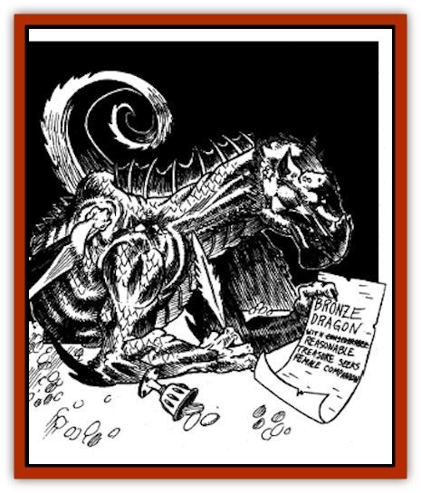

# Dragon - Eormennoth

| Statistic | **Dragon, Eormennoth** |
| --- | --- |
| **Activity Cycle:** | Any |
| **Alignment:** | Lawful good |
| **Armor Class:** | -6 |
| **Climate/Terrain:** | The treasury vault beneath Ravens Bluff |
| **Damage/Attack:** | 1d8+8/1d8+8/4d6+8 (claw/claw/bite) |
| **Diet:** | Almost anything (prefers seafood and pearls) |
| **Frequency:** | Unique individual |
| **Hit Dice:** | 18 |
| **Intelligence:** | Exceptional (16) |
| **Magic Resistance:** | 35% |
| **Morale:** | Fanatic (17) |
| **Movement:** | 9, fly 30 (C), swim 12 |
| **No. Appearing:** | 1 |
| **No. of Attacks:** | 3 |
| **Organization:** | Solitary at present but still looking |
| **Size:** | G (78' body plus 70' tail) |
| **Special Attacks:** | Tail slap (2d8+16 plus stun), kick (1d8+8 plus knockdown), wing buffet (1d8+8/1d8+8 plus knockdown), breath weapon (lightning stroke 100 feet long), fear aura (30-yard radius), <i>weather summoning</i>, spells |
| **Special Defenses:** | <i>ESP</i>, <i>polymorph self</i> (thrice per day), breath weapon (repulsion cloud 20 feet long, 30 feet wide, & 30 feet high), immune to electricity, <i>wall of fog</i> (once per day), sense intruder in lair (80-foot range), spells |
| **THAC0:** | 0 |
| **Treasure:** | H,S,T&times;2 |
| **XP Value:** | 20,000 |

Few citizens know Ravens Bluff has a resident dragon, but the chief guard of the city treasury (and occupant of the vaults) is the [[Dragon_Metallic_Bronze|bronze dragon]] Eormennoth (Old Male Bronze; standard dragon abilities for his type and age include *create food and water*, *speak with animals*, *water breathing*, and *airy water* as well as the powers listed above; carries ready the wizard spells *charm person*, *ventriloquism*, *invisibility*, *magic mouth*, *sepia snake sigil* and the priest spell *command*, all of which he can cast at 16th level of ability). This vigilant guardian raises the alarm over any unauthorized withdrawals - that is, any which are not accompanied by a certified writ specifying the amount down to the last coin. Eormennoth has been on duty for over fifty years, preventing "shrinkage" of treasury funds through both outright thefts and illicit borrowings by city officials (it's the Regent of the Exchequer's job to prevent misappropriations once monies leave this room).

 Eormennoth (whose name means "immense treasure" in the tongue of his kind) began his local career as a ravager of pirates and was used in that capacity by the then-newly-installed Lord Mayor O'Kane. For decades he's been the guardian of the vault, having been originally promised a rather generous rate of pay of ten gold pieces a day by the Lord Treasurer of that day, who reckoned that a payment deferred until after he left office was someone else's problem. While that may not sound like much to anyone with thousands of coins at his or her command, Eormennoth is patient. Every day the dragon diligently counts out his share and moves it to his side of the vault. As the years have gone by, his stack has grown to impressive dimensions (over 180,000 gp) while the city's pile has visibly diminished. Vernon Condor, the current Regent of the Exchequer, has estimated that the share Eormennoth has claimed will eventually bankrupt the city. He suggested some time back to Mayor O'Kane that they "re-negotiate" the dragon's contract to include "room and board" as well as imposing a one-time "dragon tax" amounting to at least 50% of Eormennoth's share should he decide to leave a city so suddenly inhospitable. O'Kane, for his part, prepared for the negotiations by procuring a *cube of force* and a *long sword, +2 dragonslayer* (LN-aligned and attuned to bronze dragons, dealing triple damage and having a +4 combat bonus against them) in case the dragon decided to exact payment in the form of property damage or otherwise kicked at the proffered settlement.

Fortunately, perhaps, the matter never came to a crisis; although Eormennoth was (falsely) announced dead some years ago, the war and other disasters distracted O'Kane until the mayoral mantle passed to Lady Amber Lynn Thoden, who has not yet had leisure to deal with such pending but low-priority concerns. Eormennoth, for his part, remains blissfully unaware that anyone finds anything wrong with his scrupulous guardianship of the vault. He's always been curious about the lives and deeds of the entertaining humans of the city and loves to listen to gossip. Since his opportunities for interesting talk are limited in the vault, he sometimes slips away for a bit. He loves the smells, sights, and sounds of the sea, both in dragon form and *polymorphed* into the shape of a ship's cat hanging around the docks. He also enjoys watching people, and any idle person or animal in Ravens Bluff (particularly within sight of the water) might just be a dragon in disguise. Over the years, as his trust in the city administration has grown, he's felt increasingly comfortable about leaving the main vault where he customarily lies at his ease and "taking the air" or going for a quick swim.

Some of these flights have been his first extended jaunts away from Ravens Bluff in half a century. Eormennoth has decided it's time to raise a family, and although female bronze dragons have proven rarer in the lands around than he'd thought they would be, he is a wyrm of looks, sophistication, and treasure. As word of his availability spreads, the city may well soon be invaded by a dozen or more female bronze dragons of all ages, vying for the attention of the "Wyrm In The Vault". When Eormennoth chooses a bride, the civic government will face a real monetary crisis. Like most dragons his age, the guardian of the treasury will soon become irritated by his mate's constant hints that she deserves - nay, needs - more treasure. Once their eggs are laid, he may well persuade her to depart - with a suitable division of their joint property, of course, plus a generous gift  money that "the Vulture" regards as the rightful property of the government.

Moreover, when the eggs hatch, Eormennoth will have successors. The problem that so many generations of Ravenaar officials hoped would eventually just "go away" will magnify when the post of vault-guardian becomes a hereditary one. As a good father, the incumbent guardian will of course gift each of his offspring with some coins as "seed money" to begin their own hoards. Moreover, young dragons of any type will defend themselves if attacked, overreact if frightened, and generally be rambunctious in the extreme, placing the property and citizens of the city at risk for a long, long time. And any large-scale battle with dragons may attract the attention of other, less benevolent wyrms - or anyone else who sees an opportunity to take advantage of mayhem and destruction to plunder or launch attacks on Ravens Bluff. The often-humiliated pirates, for instance, who'd like nothing more than a chance for revenge on the city and its great winged warrior&hellip;

---
## Discovery & Documentation

**Source Publication:** The City of Ravens Bluff (1998)
**Campaign Setting:** Forgotten Realms
**Author(s):** Ed Greenwood

### Other Creatures Found in This Source Book
   * [[Dragger|Dragger]]
   * [[Hag_Sea_Greater|Hag, Sea, Greater]]
   * [[Raven_Greater|Raven, Greater]]
