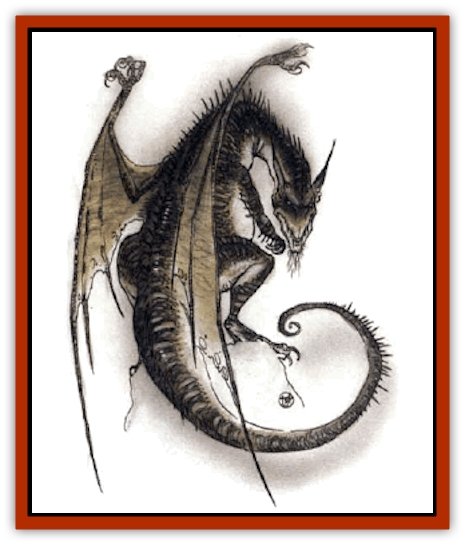

# Dragon - Fang

| Statistic | **Dragon, Fang** |
| --- | --- |
| **Activity Cycle:** | Any |
| **Alignment:** | Chaotic neutral |
| **Armor Class:** | 1 (base) |
| **Climate/Terrain:** | Mountains or barrens |
| **Damage/Attack:** | 2d4(&times;2)/2d8/3d6 |
| **Diet:** | Carnivore |
| **Frequency:** | Very rare |
| **Hit Dice:** | 11 (base) |
| **Intelligence:** | Average to very (8-12) |
| **Magic Resistance:** | See below |
| **Morale:** | Fanatic (17 base) |
| **Movement:** | 12, Fl 22 (D), Jp 9 |
| **No. Appearing:** | 1 |
| **No. of Attacks:** | 4 |
| **Organization:** | Solitary |
| **Size:** | G (36' base) |
| **Special Attacks:** | See below |
| **Special Defenses:** | See below |
| **THAC0:** | 9 (base) |
| **Treasure:** | In lair only; see below |
| **XP Value:** | See below |

Fang [[Dragon_General_Information|dragons]] are greedy, rapacious, and cunning creatures. Their bodies are armored with bony plates that rise into projecting spurs at limb joints and end in long, forked tails tipped with a pair of scythelike bone blades. They fly poorly, but can rise with a single clap of their wings to lunge forward. Their body plates are a mottled gray and brown, their wings are small but muscled, and their eyes tend to be glittering red or orange (other hues are known). Fang dragons' heads are adorned with many small horns or spikes.

**Combat:** These dragons have poor magical ability, but they have mastered physical combat. They rake with their claws and slash with their tails for damage, and have an 80% chance to knock down a medium- or smaller-sized victim. Those knocked aside must make a successful Strength check to avoid falling (saving throws for fragile carried items apply) and a successful Constitution check to avoid being stunned for the following round. Also, the victim of any successful claw attack must makt a successful Dexterity check to avoid suffering 1d4 additional damage from the dragon's body spurs. These attacks are used to clear aside incidental foes and/or pin the main intended victim, whom the dragon then bites.

Fang dragons have excellent vocal control and are able to mimic human voices very effectively as well as use spell scrolls and verbally triggered magical items crafted by humans. They have four small, feeble underclaws that can carry treasure or wield rings, wands, rods, or weapons of dagger size or smaller. They can even perform spellcasting gestures.

**Special Abilities:** A fang dragon has no breath weapon, but its bite permanently drains hit points if the victim fails to save vs. Breath weapon; drained hit ponts are *gained* by the dragon. (If the dragon is slain within two rounds per experience level of the drained victim, and the victim ingests or comes into skin contact with some of the dragon's gore or cranial fluids, the stolen hit points are regained.) This dragon casts spells and uses magic at a level equal to 8 plus its combat modifier.

At birth, fang dragons can *detect magic* and *read magic*. They also save vs. all spells cast specifically at them with a +1 bonus. As they age, they gain the following additional powers:

*Young: shield* twice per day; *Juvenile: dispel magic* once per day; *Adult: spell turning* once per day; *Old: telekinesis* twice per day; Wyrm: regenerate (self only) 1 hp per four rounds.

**Habitat/Society:** Fang dragons prefer to seek food far from their lairs, which they typically wall up with huge boulders to keep out intruders in their absence. They speak snippets of many languages and will bargain to avoid hopeless or hard battles. They never attack others of their own kind, and they mate once every 60 years or so, parting after a single night

**Ecology:** Fang dragons eat all manner of fresh meat, especially enjoying the flesh of intelligent mammals. Their fangs (powdered) and their cranial fluids are valued in the making of *swords +2, nine lives stealer* and similar magical items. [[Dragon_Chromatic_Red|Red]] and fang dragons have an instinctive dislike for each other.

| Age | Body Lgt. (') | Tail Lgt. (') | AC | Bite Drain (hp) | Spells W or P | MR | Treas. Type | XP Value |
| --- | --- | --- | --- | --- | --- | --- | --- | --- |
| 1 Hatchling | 3-6 | 3-6 | 4 | 2d4+1 | Nil | Nil | Nil | 1,400 |
| 2 Very young | 6-12 | 6-12 | 3 | 4d4+2 | Nil | Nil | Nil | 2,000 |
| 3 Young | 12-20 | 12-22 | 2 | 6d4+3 | Nil | Nil | Nil | 3,000 |
| 4 Juvenile | 20-32 | 22-36 | 1 | 8d4+4 | Nil | 10% | R | 5,000 |
| 5 Young adult | 32-38 | 36-40 | 0 | 10d4+5 | 1 | 15% | R,S | 7,000 |
| 6 Adult | 38-42 | 40-44 | -1 | 12d4+6 | 1 1 | 20% | R,S,T | 8,000 |
| 7 Mature adult | 42-46 | 44-48 | -2 | 14d4+7 | 2 1 | 25% | Q,R,S,T | 9,000 |
| 8 Old | 46-56 | 48-62 | -3 | 16d4+8 | 2 2 1 | 30% | Q,R,S,T,U | 11,000 |
| 9 Very old | 56-62 | 62-68 | -4 | 18d4+9 | 2 2 2 | 35% | A,B,S,T,Z | 12,000 |
| 10 Venerable | 62-66 | 68-72 | -5 | 20d4+10 | 2 2 2 1 | 40% | A,B,Vx6,Z | 13,000 |
| 11 Wyrm | 66-68 | 72-76 | -6 | 22d4+11 | 2 2 2 2 | 50% | A,Bx2,Vx8,Z | 15,000 |
| 12 Great Wyrm | 68-72 | 76-80 | -7 | 24d4+12 | 2 2 2 2 1 | 70% | A,Bx4,Vx9,Z | 16,000 |

---
## Discovery & Documentation

**Source Publication:** Monstrous Compendium, 1994 Annual, Volume 1 (1995)
**Campaign Setting:** Advanced Dungeons & Dragons 2nd Edition
**Author(s):** David Wise

### Other Creatures Found in This Source Book
   * [[Abyss_Ant|Abyss Ant]]
   * [[Achaierai|Achaierai]]
   * [[Afanc|Afanc]]
   * [[Al-Jahar|Al-Jahar]]
   * [[Baelnorn|Baelnorn]]
   * [[Baneguard|Baneguard]]
   * [[Banelar|Banelar]]
   * [[Bird_Talking|Bird, Talking]]
   * [[Blazing_Bones|Blazing Bones]]
   * [[Campestri|Campestri]]
   * [[Caniquine|Caniquine]]
   * [[Cat_Winged|Cat, Winged]]
   * [[Crypt_Servant|Crypt Servant]]
   * [[Death's_Head_Tree|Death's Head Tree]]
   * [[Dog_Saluqi|Dog, Saluqi]]
   * [[Dragon_Electrum|Dragon, Electrum]]
   * [[Dragon_Linnorm_Corpse_Tearer|Dragon, Linnorm, Corpse Tearer]]
   * [[Dragon_Linnorm_Dread|Dragon, Linnorm, Dread]]
   * [[Dragon_Linnorm_Flame|Dragon, Linnorm, Flame]]
   * [[Dragon_Linnorm_Forest|Dragon, Linnorm, Forest]]
   * [[Dragon_Linnorm_Frost|Dragon, Linnorm, Frost]]
   * [[Dragon_Linnorm_Gray|Dragon, Linnorm, Gray]]
   * [[Dragon_Linnorm_Land|Dragon, Linnorm, Land]]
   * [[Dragon_Linnorm_Midgard|Dragon, Linnorm, Midgard]]
   * [[Dragon_Linnorm_Rain|Dragon, Linnorm, Rain]]
   * [[Dragon_Linnorm_Sea|Dragon, Linnorm, Sea]]
   * [[Dragon_Neutral_Jacinth|Dragon, Neutral, Jacinth]]
   * [[Dragon_Neutral_Jade|Dragon, Neutral, Jade]]
   * [[Dragon_Neutral_Pearl|Dragon, Neutral, Pearl]]
   * [[Dread|Dread]]
   * [[Dragon-kin|Dragon-kin]]
   * [[Elemental_Earth_Kin_Chrysmal|Elemental, Earth Kin, Chrysmal]]
   * [[Elemental_Earth_Kin_Earth_Weird|Elemental, Earth Kin, Earth Weird]]
   * [[Elemental_Fire_Kin_Azer|Elemental, Fire Kin, Azer]]
   * [[Elemental_Sandman|Elemental, Sandman]]
   * [[Elemental_Wind_Walker|Elemental, Wind Walker]]
   * [[Elemental_Vermin|Elemental Vermin]]
   * [[Feystag|Feystag]]
   * [[Flame_Skull|Flame Skull]]
   * [[Foulwing|Foulwing]]
   * [[Gambado|Gambado]]
   * [[Garbug|Garbug]]
   * [[Genie_Tasked_Administrator|Genie, Tasked, Administrator]]
   * [[Genie_Tasked_Deceiver|Genie, Tasked, Deceiver]]
   * [[Genie_Tasked_Harim_Servant|Genie, Tasked, Harim Servant]]
   * [[Genie_Tasked_Messenger|Genie, Tasked, Messenger]]
   * [[Genie_Tasked_Miner|Genie, Tasked, Miner]]
   * [[Genie_Tasked_Oathbinder|Genie, Tasked, Oathbinder]]
   * [[Gibbering_Mouther|Gibbering Mouther]]
   * [[Gnasher|Gnasher]]
   * [[Gnasher_Winged|Gnasher, Winged]]
   * [[Golem_Brain|Golem, Brain]]
   * [[Golem_Hammer|Golem, Hammer]]
   * [[Golem_Metagolem|Golem, Metagolem]]
   * [[Golem_Spiderstone|Golem, Spiderstone]]
   * [[Gorynych|Gorynych]]
   * [[Greelox|Greelox]]
   * [[Helmed_Horror|Helmed Horror]]
   * [[Jarbo|Jarbo]]
   * [[Laraken|Laraken]]
   * [[Lich_Psionic|Lich, Psionic]]
   * [[Living_Steel|Living Steel]]
   * [[Lock_Lurker|Lock Lurker]]
   * [[Loxo|Loxo]]
   * [[Lycanthrope_Loup_de_Noir|Lycanthrope, Loup de Noir]]
   * [[Lycanthrope_Werebadger|Lycanthrope, Werebadger]]
   * [[Lycanthrope_Werejaguar|Lycanthrope, Werejaguar]]
   * [[Lythlyx|Lythlyx]]
   * [[Magebane|Magebane]]
   * [[Marrashi|Marrashi]]
   * [[Metalmaster|Metalmaster]]
   * [[Mimic_House_Hunter|Mimic, House Hunter]]
   * [[Naga_Bone|Naga, Bone]]
   * [[Nautilus_Giant|Nautilus, Giant]]
   * [[Nightshade_Toril|Nightshade (Toril)]]
   * [[Nishruu|Nishruu]]
   * [[Noran|Noran]]
   * [[Opinicus|Opinicus]]
   * [[Ormyrr|Ormyrr]]
   * [[Parasite|Parasite]]
   * [[Pasari-Niml|Pasari-Niml]]
   * [[Plant_Vampire_Moss|Plant, Vampire Moss]]
   * [[Pteraman|Pteraman]]
   * [[Rautym|Rautym]]
   * [[Shadeling|Shadeling]]
   * [[Skum|Skum]]
   * [[Snake_Giant_Cobra|Snake, Giant Cobra]]
   * [[Snake_Stone|Snake, Stone]]
   * [[Spectral_Wizard|Spectral Wizard]]
   * [[Spell_Weaver|Spell Weaver]]
   * [[Spider_Brain|Spider, Brain]]
   * [[Suwyze|Suwyze]]
   * [[Tatalla|Tatalla]]
   * [[Tick_Heart|Tick, Heart]]
   * [[Tree_Dark|Tree, Dark]]
   * [[Tree_Singing|Tree, Singing]]
   * [[Tressym|Tressym]]
   * [[Troll_Snow|Troll, Snow]]
   * [[Tuyewera|Tuyewera]]
   * [[Ulitharid|Ulitharid]]
   * [[Undead_Dwarf|Undead Dwarf]]
   * [[Undead_Lake_Monster|Undead Lake Monster]]
   * [[Whipsting|Whipsting]]
   * [[Windghost|Windghost]]
   * [[Wolf_Dread|Wolf, Dread]]
   * [[Wolf_Stone|Wolf, Stone]]
   * [[Wolf_Vampiric|Wolf, Vampiric]]
   * [[Wraith_Shimmering|Wraith, Shimmering]]
   * [[Xantravar|Xantravar]]
   * [[Xaver|Xaver]]
