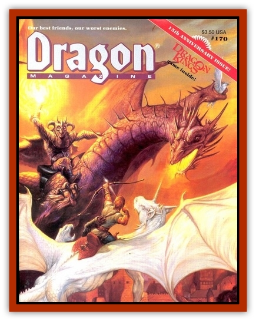

# Dragon - Ferrous - Chromium

| Statistic | **Dragon, Ferrous, Chromium** |
| --- | --- |
| **Activity Cycle:** | Any |
| **Alignment:** | Chaotic evil |
| **Armor Class:** | -2 (base) |
| **Climate/Terrain:** | Arctic/Plains, hills, mountains, subterranean |
| **Damage/Attack:** | 2-9/2-9/3-30 |
| **Diet:** | See below |
| **Frequency:** | Very rare |
| **Hit Dice:** | 14 (base) |
| **Intelligence:** | High to exceptional (13-16) |
| **Magic Resistance:** | Varies |
| **Morale:** | Fanatic (18 base) |
| **Movement:** | 12, Fl 36 (C), Jp 3 |
| **No. Appearing:** | 1 (2-5) |
| **No. of Attacks:** | 3 + special |
| **Organization:** | Solitary or clan |
| **Size:** | G (45' base) |
| **Special Attacks:** | See below |
| **Special Defenses:** | See below |
| **THAC0:** | 7 (at 14 HD) |
| **Treasure:** | Varies |
| **XP Value:** | Varies |

Chromium [[Dragon_General_Information|dragons]] (usually referred to as chrome dragons) are the most evil and greedy of all [[Dragon_Ferrous_General_Information|ferrous dragons]]. They seek treasure and are matched only by [[Dragon_Chromatic_Red|red dragons]] in their obsession for more.

The chrome dragons have a remarkable resemblance to [[Dragon_Metallic_Silver|silver dragons]], and many an adventurer has met his end because of such a similarity. At birth, a chrome dragon's scales have the appearance of tarnished silver. As the dragon ages, the scales begin to brighten until, as adults, the scales have the appearance of pure silver. The scales continue to change until reaching the old stage, at which point the scales resemble modern chrome, even to the point of showing one's reflection.

Chrome dragons speak their own tongue and the tongue common to all ferrous dragons, and 15% of all hatchling chrome dragons have an ability to communicate by telepathy with any intelligent creature within 60'. The chance to possess this ability increases by 5% per age category.

**Combat:** Chrome dragons are deadly opponents. They are merciless and kill simply for the pleasure of watching their prey writhe in pain. Chrome dragons are very fond of toying with their prey, much in the same manner as a cat does with a mouse. They use their abilities with a ruthless efficiency that can also destroy an enemy in a matter of moments. Chrome dragons almost always initiate attacks from the air, opening the battle with a blast from their freezing cloud, and closing only if they feel their opponent(s) is weakened enough.

A chrome dragon has two breath weapons: a cloud of freezing crystals 50' long, 40' wide, and 20' high; or a bolt of solid ice 20' long and 5' wide, firing out to 100' from the dragon's mouth. A creature caught in the freezing cloud must save vs. breath weapon or have his dexterity cut to 3, suffer a -4 penalty on all attack rolls, and a -4 penalty on all saving throws due to numbing. A successful save prevents the dexterity loss and reduces both penalties to -2. Creatures caught in the path of the ice bolt are allowed a save vs. breath weapon for half damage. A chrome dragon casts its spells and uses its magical abilities at 8th level plus its combat modifier.

Chrome dragons are born immune to the effects of cold of any type. As they age, they gain the following abilities:

| young | pass without trace (this ability allows the dragon to move without trace over snow and ice only) three times a day |
| --- | --- |
| young adult | shape ice (equal to stone shape but working only on ice and snow) twice a day |
| old | wall of ice twice a day |
| great wyrm | flesh to crystal (equal to the spell flesh to stone, but is a separate spell; transmute crystal to flesh must be developed to reverse the spell or a wish must be used) once a day. |

**Habitat/Society:** Chrome dragons live only in the coldest regions, dwelling in deep caves (often of their own making). The caves they develop themselves are masterpieces of construction. They often conceal pits with a thin layer of ice that will break with only the smallest amount of weight, sending the victim crashing into an array of sharp icicles.

Chrome dragons are poor parents at best; although the young stay with the parents up to the young stage, they are not looked after. Young who pass the hatchling stage are forced to fend for themselves or die in their unrelenting environment.

**Ecology:** Chrome dragons prefer meat but can subsist on a diet of ice and snow. They can eat almost anything if need be.

Chrome dragons share the same environment as the [[Dragon_Chromatic_White|white dragon]] and an occasional silver dragon. White dragons are totally dominated, and only the greatest of their species is able to hold out against the terrible power of the chrome dragons.

Silver dragons, however, are the chrome dragons? deadliest enemies. Such dragons have tremendous resources and usually hunt down chrome dragons and kill them without remorse. This does not mean the silver dragon is more powerful, only that they have access to mage resources.

| Age | Body lgt.(') | Tail lgt.(') | AC | Breath weapon | Spells (wizard) | MR | Treas. type | XP |
| --- | --- | --- | --- | --- | --- | --- | --- | --- |
| 1 Hatchling | 6-14 | 3-6 | 1 | 2d10+1 | Nil | Nil | Nil | 2,000 |
| 2 Very young | 14-25 | 6-14 | 0 | 4d10+2 | Nil | Nil | Nil | 4,000 |
| 3 Young | 25-38 | 14-23 | -1 | 6d10+3 | Nil | Nil | Nil | 6,000 |
| 4 Juvenile | 38-52 | 23-32 | -2 | 7d10+4 | 1 | Nil | E,S,T | 8,000 |
| 5 Young adult | 52-63 | 32-41 | -3 | 9d10+5 | 2,1 | 24% | H,S,T | 13,000 |
| 6 Adult | 63-74 | 41-50 | -4 | 11d10+6 | 2,2 | 30% | H,S,T | 14,000 |
| 7 Mature adult | 74-85 | 50-60 | -5 | 12d10+7 | 2,2,1 | 36% | H,S,T | 17,000 |
| 8 Old | 85-96 | 60-70 | -6 | 14d10+8 | 3,2,1 | 42% | (H,S,T)x2 | 18,000 |
| 9 Very old | 96-107 | 70-80 | -7 | 16d10+9 | 3,3,1 | 48% | (H,S,T)x2 | 19,000 |
| 10 Venerable | 107-118 | 80-90 | -8 | 17d10+10 | 3,3,2,1 | 54% | (H,S,T)x2 | 20,000 |
| 11 Wyrm | 118-129 | 90-100 | -9 | 19d10+11 | 3,3,2,1 | 60% | (H,S,T)x3 | 21,000 |
| 12 Great Wyrm | 129-140 | 100-110 | -10 | 21d10+12 | 3,3,3,2 | 66% | (H,S,T)x3 | 22,000 |

---
## Discovery & Documentation

**Source Publication:** Dragon170 (1991)
**Campaign Setting:** Dragon Magazine
**Author(s):** 

### Other Creatures Found in This Source Book
   * [[Dragon_Ferrous_Cobalt|Dragon, Ferrous, Cobalt]]
   * [[Dragon_Ferrous_Iron|Dragon, Ferrous, Iron]]
   * [[Dragon_Ferrous_Gruaghlothor|Dragon, Ferrous, Gruaghlothor]]
   * [[Dragon_Ferrous_Nickel|Dragon, Ferrous, Nickel]]
   * [[Dragon_Ferrous_Tungsten|Dragon, Ferrous, Tungsten]]
