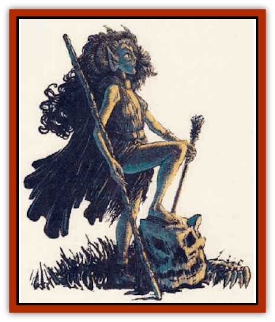

# Dragon - Half

| Statistic | **Dragon, Half-** |
| --- | --- |
| **Activity Cycle:** | Any |
| **Alignment:** | Lawful good |
| **Armor Class:** | 6 |
| **Climate/Terrain:** | Any |
| **Damage/Attack:** | By weapon |
| **Diet:** | Omnivore |
| **Frequency:** | Very rare |
| **Hit Dice:** | 1 |
| **Intelligence:** | Average (10) |
| **Magic Resistance:** | Nil |
| **Morale:** | Steady (11) |
| **Movement:** | 15 |
| **No. Appearing:** | 1 |
| **No. of Attacks:** | 1 |
| **Organization:** | Solitary |
| **Size:** | M (6½' tall) |
| **Special Attacks:** | See below |
| **Special Defenses:** | See below |
| **THAC0:** | 20 |
| **Treasure:** | O |
| **XP Value:** | 15 |

Half-dragons are the result of the mating of a demihuman female, usually [[Elf|elf]], [[Dwarf|dwarf]], or [[Gnome|gnome]], and a male metallic [[Dragon_General_Information|dragon]] - [[Dragon_Metallic_Gold|gold]], [[Dragon_Metallic_Silver|silver]], or [[Dragon_Metallic_Bronze|bronze]]. These dragon types have the natural ability to *polymorph* into demihuman form, and sometimes while in this form they produce offspring of mixed heritage.

Few physical features definitively mark a newborn babe as a half-hragon, though there are some telltale signs of the dragon parent; usually eyes or hair the color of gold, silver, or bronze. As they reach adulthood half-dragons grow tall and lean, no matter what demihuman blood mixes with their draconic heritage. During adolescence draconic abilities begin to manifest. These abilities become stronger and more pronounced over time and with use. Physical changes accompany the appearance of these abilities. A mature half-dragon appears as a very tall, very lithe humanoid with certain elflike features: a slender frame, lean muscles, long limbs, pointed ears. The skin has the look and texture of demihuman flesh, though with the pigmentation of the dragon parent. Hair is thick and luxurious, of a deeper and richer shade than the flesh color. A half-dragon's fingers are long and thin, with nails like talons. The true mark of draeon heritage is seen in the face, which has a distinctive reptilian appearance: snakelike eyes, elongated features, and the barest hint of horns protruding above the temples. Half-dragons have no wings, tails, or scales. No matter their demihuman heritage, all half-dragons mature in this way.

Half-dragons speak the language of their demihuman parent. A few can speak a draconic language (20%).

**Combat:** Half-dragons can use any weapon types that match the class they belong to. All half-dragons also begin with all of the racial abilities of their demihuman parent. As their dragon abilities manifest, they supersede and replace the demihuman ones. Each half-dragon type has discretionary abilities to choose from (one at 2nd, 4th, and 6th level), and fixed abilities that manifest automatically (at 5th and 7th respectively).

*Half-gold*

<ul><li>*Fixed Abilities:* Claw attacks (1d6/1d6), breath weapon, (spray of fire 10 feet long, damage 3d6, twice per day).</li><li>*Discretionary Abilities:* Water breathing (at will), speak with animals (at will), bless (twice per day), detect lie (twice per day), sleep (twice per day), dragon fear (three hmes per day), immune to fire, immune to gas, infravision to 90 feet.</li></ul>*Half-silver*

<ul><li>*Fixed Abilities:* Claw attacks (1d4/1d4), breath weapon (spray of cold 8 feet long, damage 4d4, twice per day).</li><li>*Discretionary Abilities:* Feather fall (once per day), wall of fog (once per day), cloud walk (one hour per level per day), dragon fear (twice per day), immune to cold, infravision to 90 feet.</li></ul>*Half-bronze*

<ul><li>*Fixed Abilities:* Claw attacks (1d4/1d4), breath weapon (bolt of lightning 8 feet long, damage 3d4, twice per day).</li><li>*Discretionary Abilities.* Water breathing (at will), speak with animals (at will), create food and water (twice per day), ESP (once per day), dragon fear (once per day), immune to electricaty, infravision to 60 feet</li></ul>**Habitat/Society:** Half-dragons tend to be loners. Most are raised by their demihuman parents, growing up in that culture. When the half-dragon's true nature becomes noticeable, the community often banishes the mixed being or makes life so unbearable that the half-dragon leaves. Half-dragons tend to become explorers and adventurers, traveling the world as they seek a place to call home. Half-dragons can belong to any class, and they set up lairs in remote places between the realms of dragons and demihumans.

**Ecology:** Half-dragons eat the same food as their demihuman parents. Half-golds can live to be 350, half-silvers to 310, and half-bronzes to a maximum of 240 years.

---
## Discovery & Documentation

**Source Publication:** Monstrous Compendium, 1995 Annual, Volume 2 (1995)
**Campaign Setting:** Advanced Dungeons & Dragons 2nd Edition
**Author(s):** Jon Pickens

### Other Creatures Found in This Source Book
   * [[Aboleth_Savant|Aboleth, Savant]]
   * [[Addazahr|Addazahr]]
   * [[Amiq_Rasol|Amiq Rasol]]
   * [[Arch-Shadow|Arch-Shadow]]
   * [[Automaton_Scaladar|Automaton, Scaladar]]
   * [[Automaton_Trobriand's|Automaton, Trobriand's]]
   * [[Bat_Sporebat|Bat, Sporebat]]
   * [[Beetle_Dragon|Beetle, Dragon]]
   * [[Bi-nou|Bi-nou]]
   * [[Boggle|Boggle]]
   * [[Brownie_Dobie|Brownie, Dobie]]
   * [[Brownie_Quickling|Brownie, Quickling]]
   * [[Cat_Crypt|Cat, Crypt]]
   * [[Cat_Great_Cath_Shee|Cat, Great, Cath Shee]]
   * [[Centaur-kin_Dorvesh|Centaur-kin, Dorvesh]]
   * [[Centaur-kin_Gnoat|Centaur-kin, Gnoat]]
   * [[Centaur-kin_Ha'pony|Centaur-kin, Ha'pony]]
   * [[Centaur-kin_Zebranaur|Centaur-kin, Zebranaur]]
   * [[Chronolily|Chronolily]]
   * [[Curst|Curst]]
   * [[Darktentacles|Darktentacles]]
   * [[Dinosaur_Aquatic|Dinosaur, Aquatic]]
   * [[Dinosaur_II|Dinosaur II]]
   * [[Dinosaur_III|Dinosaur III]]
   * [[Doppelganger_Greater|Doppelganger, Greater]]
   * [[Dragon_Brine|Dragon, Brine]]
   * [[Dragon-kin_Sea_Wyrm|Dragon-kin, Sea Wyrm]]
   * [[Dwarf_Wild|Dwarf, Wild]]
   * [[Ekimmu|Ekimmu]]
   * [[Elemental_Nature|Elemental, Nature]]
   * [[Elf_Winged|Elf, Winged]]
   * [[Fish_Great_Glacier|Fish (Great Glacier)]]
   * [[Fish_Subterranean|Fish, Subterranean]]
   * [[Fish_Toril|Fish (Toril)]]
   * [[Flareater|Flareater]]
   * [[Flumph|Flumph]]
   * [[Froghemoth|Froghemoth]]
   * [[Ghost_Casurua|Ghost, Casurua]]
   * [[Ghost_Ker|Ghost, Ker]]
   * [[Ghul|Ghul]]
   * [[Ghul-Kin|Ghul-Kin]]
   * [[Giant_Half-giant|Giant, Half-giant]]
   * [[Golem_Burning_Man|Golem, Burning Man]]
   * [[Golem_Phantom_Flyer|Golem, Phantom Flyer]]
   * [[Gulguthhydra|Gulguthhydra]]
   * [[Hakeashar|Hakeashar]]
   * [[Horse_Moon-|Horse, Moon-]]
   * [[Human_Dragonslayer|Human, Dragonslayer]]
   * [[Human_Vistana|Human, Vistana]]
   * [[Jellyfish_Giant|Jellyfish, Giant]]
   * [[Kalin|Kalin]]
   * [[Kholiathra|Kholiathra]]
   * [[Laerti|Laerti]]
   * [[Leucrotta_Greater|Leucrotta, Greater]]
   * [[Lich_Suel|Lich, Suel]]
   * [[Lurker_Shadow|Lurker, Shadow]]
   * [[Lycanthrope_Werepanther|Lycanthrope, Werepanther]]
   * [[Lycanthrope_Wereshark|Lycanthrope, Wereshark]]
   * [[Mammal_Herd_II|Mammal, Herd II]]
   * [[Marl|Marl]]
   * [[Meenlock|Meenlock]]
   * [[Mimic_Greater|Mimic, Greater]]
   * [[Mold_II|Mold II]]
   * [[Mummy_Creature|Mummy, Creature]]
   * [[Nyth|Nyth]]
   * [[Ooze_Slime_Jelly_Ghaunadan|Ooze/Slime/Jelly, Ghaunadan]]
   * [[Palimpsest|Palimpsest]]
   * [[Peltast|Peltast]]
   * [[Plant_Dangerous_II|Plant, Dangerous II]]
   * [[Pleistocene_Animal|Pleistocene Animal]]
   * [[Pudding_Subterranean|Pudding, Subterranean]]
   * [[Raggamoffyn|Raggamoffyn]]
   * [[Snake_Serpent|Snake, Serpent]]
   * [[Snake_Serpent_Vine|Snake, Serpent Vine]]
   * [[Sphinx_Draco-|Sphinx, Draco-]]
   * [[Sprite_Seelie_Faerie|Sprite, Seelie Faerie]]
   * [[Sprite_Unseelie_Faerie|Sprite, Unseelie Faerie]]
   * [[Squealer|Squealer]]
   * [[Turtle_Giant|Turtle, Giant]]
   * [[Umpleby|Umpleby]]
   * [[Vizier's_Turban|Vizier's Turban]]
   * [[Wall_Walker|Wall Walker]]
   * [[Webbird|Webbird]]
   * [[Yak-Man|Yak-Man]]
   * [[Zorbo|Zorbo]]
