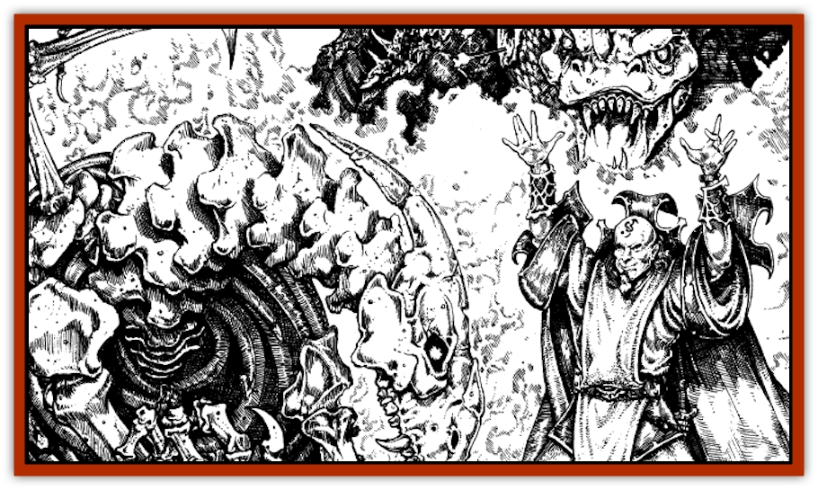

# Dragon - Lesser Undead

| Statistic | **Skeleton** | **Zombie** |
| --- | --- | --- |
| **Activity Cycle:** | Any | Any |
| **Alignment:** | Neutral | Neutral |
| **Armor Class:** | Same as living dragon form +1 | Same as living dragon form |
| **Climate/Terrain:** | Any land | Any land |
| **Damage/Attack:** | Same as living | Same as living |
| **Diet:** | None | None |
| **Frequency:** | Very rare | Very rare |
| **Hit Dice:** | Same as living | Same as living +1 |
| **Intelligence:** | Non- (0) | Non- (0) |
| **Magic Resistance:** | Same as living | Same as living |
| **Morale:** | Fearless (20) | Fearless (20) |
| **Movement:** | Same as living form; no flight | Half living form; no flight |
| **No. Appearing:** | 1 | 1 |
| **No. of Attacks:** | Same as living | Same as living |
| **Organization:** | Solitary | Solitary |
| **Size:** | Same as living | Same as living |
| **Special Attacks:** | Physical dragon attack forms not using flight; spell-like abilities of living form | Physical dragon attack forms not using flight; spell-like abilities of living form |
| **Special Defenses:** | All dragon type and age immunities from life; immune to <i>charm</i>, <i>hold</i>, <i>sleep</i>, paralysis, and poison; save as priests of a level equal to their HD while living | All dragon type and age immunities from life; immune to <i>charm</i>, <i>hold</i>, <i>sleep</i>, paralysis, and poison; save as priests of a level equal to their HD while living |
| **THAC0:** | Same as living | Same as living |
| **Treasure:** | Nil | Nil |
| **XP Value:** | Varies | Varies |

What does one do with the corpse of a [[Dragon_General_Information|dragon]] that failed to achieve [[Dracolich|dracolich]] status or one that foolishly perished in battle before the conversion could even be attempted? There's always dissecting the body to use the various pieces to create various magical items. But if one is a member of the Cult of the Dragon and does not wish to go to all that messy work or if one still has need of a fearsome, undead draconic warrior, then one can try to create a lesser form of dracoundead, specifically a [[Zombie|zombie]] or [[Skeleton|skeleton]] dragon.

In his work toward creating the ultimate undead dragon, the dracolich, Sammaster perfected several lesser forms of draconic undead as steps in his learning process. Two such undead forms are detailed here (as they are in Sammaster's *Tome of the Dragon*). These are the first two types Sammaster created and the easiest for modern Cult wizards to recreate today. The existence of other, more powerful forms of draconic undead is often hinted at by Cult necromancers, but no instances of such have ever been recorded.

A zombie dragon superficially resembles a dracolich. Its flesh is rotting and hangs in tatters from its bones, and it often has ripped and torn wing tissue. However, zombie dragons lack the evil fire of a dracolich in their eyes. Instead, the eyes of a zombie dragon are dull and dead and are often gone entirely, since the delicate tissue decays rapidly. The mindless dragon zombie cannot speak and can follow only the simplest commands.

Skeleton dragons are literally undead creatures formed from the animated skeleton of a dragon. They can also can be mistaken for dracoliches, though they too lack the fire present in a dracolich's eyesockets. They are mindless, cannot speak, and can follow only relatively simple commands.

**Combat:** The dragon zombie is a ponderous creature that always strikes last in any round. Its movement rate is half that of its living form, and it cannot fly. When created, the dragon zombie has one more Hit Die than the dragon had in life, though this additional Hit Die has no effect on the age-related abilities of the creature. Zombie dragons possess the same Armor Class they had in life.

Skeleton dragons take only half damage from edged and piercing weapons and are immune to cold-based attacks. Skeleton dragons have the same number of Hit Dice and movement rate that they possessed in life, but they cannot fly. Their Armor Class is one better than their AC in life.

Lesser undead dragons generally have the same number of physical attacks and inflict the same amounts of damage as when they were living. However, since they are flightless, they cannot perform the snatch and stall dragon attacks. Like their living counterparts, they can divide their attacks between opponents. Lesser undead dragons do not retain the fear aura of their living dragon form, nor can they use that form's breath weapon.

Lesser undead dragons retain all the immunities that they possessed while alive. For example, a zombie or skeletal dragon that was *old* or older when it died is immune to normal missile weapons, as zombie and skeletal dragons of the [[Dragon_Chromatic_Red|red dragon]] species are immune to fire. In addition, lesser undead dragons retain any magic resistance they had while alive. Lesser undead dragons also have the standard undead immunities to *charm*, *hold*, and *sleep* enchantments and are immune to paralysis and poison. Lesser undead dragons also can detect invisible objects and beings and can use *clairaudience* in their lairs. Undead dragons save as priests of a level equal to their HD while living rather than as fighters. Clerical spells and other spells that specifically target undead affect lesser undead dragons normally. Lesser undead dragons are turned as "Special" undead, and holy water inflicts 2d4 points of damage upon them.

The dragon's innate spell-like abilities, if any, are usable by the lesser undead form of the dragon despite its lack of intelligence. To a magical creature such as a dragon, using its spell-like abilities is as natural as biting or clawing its foe; it is an instinct, not a conscious decision. True spellcasting is, however, impossible for such mindless undead beings as listed here (unless an undead dragon has an *imbue undead with spell ability* spell cast upon it). It is theorized that other, more intelligent types of undead dragons - should they be proven to exist - might be able to cast spells as when they lived.

A *protection from evil* spell is ineffective against these lesser undead dragons (since they are neutral in alignment), but other spells relating to undead creatures or dragons may ward against them.

**Habitat/Society:** Zombie dragons and skeleton dragons are found at whatever posts they are stationed at by their creators or those assigned to direct them.

Creating either type of lesser undead dragon requires access to an *animate dead* spell as well as the corpse of an evil dragon of at least *young* age category or older to be animated (and only evil dragons of sufficient age can be reanimated, as Sammaster discovered to his chagrin). To create a zombie dragon, a relatively intact dragon corpse (in other words, one with no missing limbs) is required and at least 75% of the body tissue must be present. To create a skeleton dragon, an intact dragon skeleton is not necessary; the skull, spine and claws of the dragon are the only pieces that are absolutely required. About 60% of the rest of the skeleton must also be present. (The bones of some other large creature may be substituted for bones missing from the dragon skeleton in the final animated form.) To prepare the corpse for animation takes 1 day in the case of a zombie dragon and 3 days in the case of a skeleton dragon. In addition, a piece of zombie flesh or a shard of a skeleton's bone must be added to an arcane elixir (contents to be determined by the DM) worth at least 500 gp to create a zombie dragon or 1,000 gp to create a skeleton dragon, and the elixir must be poured over the corpse before the *animate dead* spell is cast.

Finally, the dragon corpse receives a saving throw vs. spell as if it were still a living dragon of the appropriate type, but with a with a -4 penalty. (Magic resistance is ignored for this purpose.) If the saving throw is successful, the dragon is not reanimated and the preparation time and potion have been wasted. If the saving throw is not successful, the corpse is reanimated as the appropriate type of lesser undead dragon. Attempts to animate a dragon corpse which succeeded at its saving throw may be repeated, but the preparation time and the concoction and use of a new elixir must also be repeated. A force other than the spirit of the actual dead dragon provides the animation for zombie dragons and skeleton dragons; their actual spirits and minds pass into the afterlife with their deaths.

**Ecology:** Zombie dragons and skeleton dragons eat nothing and hunt nothing they have not been told to attack. They often serve as guardians for Cult of the Dragon meeting places or hidden treasures, and sometimes serve as eternally vigilant door guards for Cult dragons or dracoliches. They have no treasure of their own, though they may be allowed or assigned to remain near their former hoards in some cases. Though they do not project a living dragon's fear aura, animals of all sorts instinctively dislike them and will not approach them if given a choice. The only exception is carrion-eaters, who may, in the case of zombie dragons, hang about in the vicinity of the dragon occasionally to feast on bits of flesh the zombie has sloughed off.

---
## Discovery & Documentation

**Source Publication:** Monstrous Compendium, 1996 Annual, Volume 3 (1995)
**Campaign Setting:** Advanced Dungeons & Dragons 2nd Edition
**Author(s):** Jon Pickens

### Other Creatures Found in This Source Book
   * [[Alaghi|Alaghi]]
   * [[Alhoon|Alhoon]]
   * [[Aranea_Savage_Coast|Aranea (Savage Coast)]]
   * [[Arcane_Head|Arcane Head]]
   * [[Banedead|Banedead]]
   * [[Banelich|Banelich]]
   * [[Bat_Bonebat|Bat, Bonebat]]
   * [[Beetle|Beetle]]
   * [[Belgoi|Belgoi]]
   * [[Bladeling|Bladeling]]
   * [[Braxat|Braxat]]
   * [[Bunyip|Bunyip]]
   * [[Burbur|Burbur]]
   * [[Bvanen|Bvanen]]
   * [[Cat_Great_Snow_Tiger|Cat, Great, Snow Tiger]]
   * [[Chosen_One|Chosen One]]
   * [[Chronovoid|Chronovoid]]
   * [[Cildabrin|Cildabrin]]
   * [[Coffer_Corpse|Coffer Corpse]]
   * [[Disenchanter|Disenchanter]]
   * [[Dog_Temporal|Dog, Temporal]]
   * [[Dragon_Cerilia|Dragon (Cerilia)]]
   * [[Dragon_Ghost|Dragon, Ghost]]
   * [[Dragon_Neutral_Amber|Dragon, Neutral, Amber]]
   * [[Dread_Warrior|Dread Warrior]]
   * [[Dreamweaver|Dreamweaver]]
   * [[Dream_Spawn_Greater_Ennui|Dream Spawn, Greater, Ennui]]
   * [[Dream_Spawn_Lesser_Morph|Dream Spawn, Lesser, Morph]]
   * [[Dwarf_Arctic|Dwarf, Arctic]]
   * [[Dwarf_Urdunnir|Dwarf, Urdunnir]]
   * [[Eel_Giant_Moray|Eel, Giant Moray]]
   * [[Elemental_Fire_Kin_Tome_Guardian|Elemental, Fire Kin, Tome Guardian]]
   * [[Elf_Rockseer|Elf, Rockseer]]
   * [[Ethyk|Ethyk]]
   * [[Faerie_Faerie_Fiddler|Faerie, Faerie Fiddler]]
   * [[Faerie_Petty_Bramble|Faerie, Petty, Bramble]]
   * [[Faerie_Petty_Gorse|Faerie, Petty, Gorse]]
   * [[Faerie_Petty|Faerie, Petty]]
   * [[Firenewt|Firenewt]]
   * [[Formian|Formian]]
   * [[Gargoyle_II|Gargoyle II]]
   * [[Giant_Cerilia|Giant (Cerilia)]]
   * [[Goblin_Cerilia|Goblin (Cerilia)]]
   * [[Golem_Magic|Golem, Magic]]
   * [[Golem_Shaboath|Golem, Shaboath]]
   * [[Hag_Bheur|Hag, Bheur]]
   * [[Hamadryad|Hamadryad]]
   * [[Hound_of_Ill-Omen|Hound of Ill-Omen]]
   * [[Human_Cerilia|Human (Cerilia)]]
   * [[Hybsil|Hybsil]]
   * [[Ibrandlin|Ibrandlin]]
   * [[Imp_Chaos|Imp, Chaos]]
   * [[Ixitxachitl_Ixzan|Ixitxachitl, Ixzan]]
   * [[Jabberwock|Jabberwock]]
   * [[Kyton|Kyton]]
   * [[Kyuss_Son_of|Kyuss, Son of]]
   * [[Lillend|Lillend]]
   * [[Life-Shaped_Creation_Guardian|Life-Shaped Creation, Guardian]]
   * [[Life-Shaped_Creation_Transport|Life-Shaped Creation, Transport]]
   * [[Lycanthrope_Werecrocodile|Lycanthrope, Werecrocodile]]
   * [[Lycanthrope_Werespider|Lycanthrope, Werespider]]
   * [[Magedoom|Magedoom]]
   * [[Manotaur|Manotaur]]
   * [[Mastiff_Shadow|Mastiff, Shadow]]
   * [[Meazel|Meazel]]
   * [[Mist_Scarlet_Dancer|Mist, Scarlet Dancer]]
   * [[Needleman|Needleman]]
   * [[Orc_Neo-Orog|Orc, Neo-Orog]]
   * [[Orc_Ondonti|Orc, Ondonti]]
   * [[Owlbear_II|Owlbear II]]
   * [[Pegataur|Pegataur]]
   * [[Phaerimm|Phaerimm]]
   * [[Reggelid|Reggelid]]
   * [[Render|Render]]
   * [[Saurial|Saurial]]
   * [[Scalamagdrion|Scalamagdrion]]
   * [[Sharn|Sharn]]
   * [[Snake_Messenger|Snake, Messenger]]
   * [[Spirit_Forest_Uthraki|Spirit, Forest, Uthraki]]
   * [[Spirit_Forest_Wood_Man|Spirit, Forest, Wood Man]]
   * [[Spirit_Ice_Orglash|Spirit, Ice, Orglash]]
   * [[Spirit_Rock_Thomil|Spirit, Rock, Thomil]]
   * [[Strider_Giant|Strider, Giant]]
   * [[Tembo|Tembo]]
   * [[Temporal_Glider|Temporal Glider]]
   * [[Temporal_Stalker|Temporal Stalker]]
   * [[Tether_Beast|Tether Beast]]
   * [[Thessalmonster|Thessalmonster]]
   * [[Time_Dimensional|Time Dimensional]]
   * [[Tomb_Tapper|Tomb Tapper]]
   * [[Undead_Dragon_Slayer|Undead Dragon Slayer]]
   * [[Unicorn_Black_Toril|Unicorn, Black (Toril)]]
   * [[Vaath|Vaath]]
   * [[Vortex_Spider|Vortex Spider]]
   * [[Weredragon|Weredragon]]
   * [[Zhentarim_Spirit|Zhentarim Spirit]]
