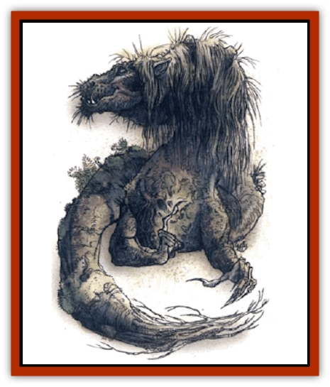

# Dragon - Linnorm - Corpse Tearer

| Statistic | **Dragon, Linnorm, Corpse Tearer** |
| --- | --- |
| **Activity Cycle:** | Any |
| **Alignment:** | Neutral evil |
| **Armor Class:** | -10 |
| **Climate/Terrain:** | Any/Land |
| **Damage/Attack:** | 3d12(&times;2)/4d10/special |
| **Diet:** | Special |
| **Frequency:** | Unique |
| **Hit Dice:** | 28 (170 hp) |
| **Intelligence:** | Genius (17-18) |
| **Magic Resistance:** | 50% |
| **Morale:** | Fearless (19) |
| **Movement:** | 24, Fl 39 (C), Sw 18, Br 18, Jp 18 |
| **No. Appearing:** | 1 |
| **No. of Attacks:** | 3 + special |
| **Organization:** | Solitary |
| **Size:** | G (330' long) |
| **Special Attacks:** | Spells, level drain, breath weapons |
| **Special Defenses:** | Spells, +1 weapon to hit |
| **THAC0:** | -3 |
| **Treasure:** | A&times;3, B&times;3, C, H&times;3, I |
| **XP Value:** | 35,000 |

Corpse Tearer is the most hideouts of the Norse [[Dragon_General_Information|dragons]], and the most feared. This mottled-brown dragon lacks rear legs, but has long front ones that end in broken yet deadly claws. Its slime-covered scales are small and weathered; when at rest, it looks like a fallen, dead tree. The linnorm's head is ringed with matted brown and gray hair, and tufts of the hair appear at random intervals over its body, in places so matted that it resembles loose, rotting flesh. Despite its deathly appearance, Corpse Tearer is very much alive, moving and striking quickly.

This ancient creature has traveled greatly and is fluent in nearly all human and demihuman tongues. It also is able to converse with ail linnorms and many evil, intelligent monsters.

**Combat:** Corpse Tearer enjoys combat, but isn't overly eager to fight. It watches foes carefully from a distance, noting their abilities and potential weaknesses, then enters combat by flying above and employing its paralyzing breath weapon, followed by its disease breath and spell-like abilities. If its adversaries survive the first onslaught, Corpse Tearer lands on the strongest ones, crushing them and then fights with its energy-draining claws and powerful bite. Each successful claw attack drains one life level automatically from its victim.

If Corpse Tearer suffers more than 100 points of damage, it flies away if possible or uses its *dimension door* ability to escape.

**Breath Weapon/Special Abilities:** Corpse Tearer's paralyzing breath is a cone 10' wide at the mouth, 300' long, and 50' wide at its apex. Gassed creatures with less than 4 HD are automatically paralyzed for 4d4 turns, but those with more than 4 HD are allowed a saving throw vs. breath weapon to avoid the effects. The disease breath is a cloud 100' long, 80' wide, and 80' thick, inflicting 8d12+12 points of damage (save for half damage allowed). Furthermore, victims are subjected to a magical disease that manifests within 1d6 rounds, cutting a victim's Strength score in half. Then, every three turns, the Strength score is halved again, until the creature's Strength drops to 1. A *cure disease* spell stops the strength loss, but a *wish* or *limited wish* is needed to restore lost Strength points. Corpse Tearer can breathe twice, then requires two rounds before it can breathe again (no limit otherwise).

This linnorm has the following abilities, useable at will: *continual darkness 100' radius*, *feign death*, *fly*, *polymorph self*, *speak with dead*, and *water breathing*. It is able to use the following, once per day, at will: *antimate dead*, *control undead*, *delude*, *dimension door*, *enervation*, *protection from good*, *spectral hand*, *vampiric touch*, and *wraithform*. Corpse Tearer uses all magical abilities at 15th level.

**Habitat/Society:** Corpse Tearer's lair is a vast chamber beneath an ancient burial cave, guarded by a pair of controlled [[Vampire_General_Information|vampires]], the corpses of dead linnorms, and other undead. This lair is almost impossible to find, and the few who have found their way there are now helping to guard it. The cavern is dank, stinks of rotting flesh, and is filled with Corpse Tearer's considerable wealth - the linnorm is obsessed with garnering gems, magic, art objects, and coins, and it uses animated corpses to dig through graves and obtain more. Further, it raids communities and ships to gain treasure.

Corpse Tearer claims only its sepulcher lair as territory, willingly leaving the surface to other linnorms. Because it spends an extraordinary amount of time cataloguing its wealth, it rarely leaves its home.

**Ecology:** Corpse Tearer does not need sustenance in its lair. Outside, it can eat virtually anything, although it prefers rotting carcasses. This linnorm has no known predators, as those who hate it are wise enough to avoid it.

---
## Discovery & Documentation

**Source Publication:** Monstrous Compendium, 1994 Annual, Volume 1 (1995)
**Campaign Setting:** Advanced Dungeons & Dragons 2nd Edition
**Author(s):** David Wise

### Other Creatures Found in This Source Book
   * [[Abyss_Ant|Abyss Ant]]
   * [[Achaierai|Achaierai]]
   * [[Afanc|Afanc]]
   * [[Al-Jahar|Al-Jahar]]
   * [[Baelnorn|Baelnorn]]
   * [[Baneguard|Baneguard]]
   * [[Banelar|Banelar]]
   * [[Bird_Talking|Bird, Talking]]
   * [[Blazing_Bones|Blazing Bones]]
   * [[Campestri|Campestri]]
   * [[Caniquine|Caniquine]]
   * [[Cat_Winged|Cat, Winged]]
   * [[Crypt_Servant|Crypt Servant]]
   * [[Death's_Head_Tree|Death's Head Tree]]
   * [[Dog_Saluqi|Dog, Saluqi]]
   * [[Dragon_Electrum|Dragon, Electrum]]
   * [[Dragon_Fang|Dragon, Fang]]
   * [[Dragon_Linnorm_Dread|Dragon, Linnorm, Dread]]
   * [[Dragon_Linnorm_Flame|Dragon, Linnorm, Flame]]
   * [[Dragon_Linnorm_Forest|Dragon, Linnorm, Forest]]
   * [[Dragon_Linnorm_Frost|Dragon, Linnorm, Frost]]
   * [[Dragon_Linnorm_Gray|Dragon, Linnorm, Gray]]
   * [[Dragon_Linnorm_Land|Dragon, Linnorm, Land]]
   * [[Dragon_Linnorm_Midgard|Dragon, Linnorm, Midgard]]
   * [[Dragon_Linnorm_Rain|Dragon, Linnorm, Rain]]
   * [[Dragon_Linnorm_Sea|Dragon, Linnorm, Sea]]
   * [[Dragon_Neutral_Jacinth|Dragon, Neutral, Jacinth]]
   * [[Dragon_Neutral_Jade|Dragon, Neutral, Jade]]
   * [[Dragon_Neutral_Pearl|Dragon, Neutral, Pearl]]
   * [[Dread|Dread]]
   * [[Dragon-kin|Dragon-kin]]
   * [[Elemental_Earth_Kin_Chrysmal|Elemental, Earth Kin, Chrysmal]]
   * [[Elemental_Earth_Kin_Earth_Weird|Elemental, Earth Kin, Earth Weird]]
   * [[Elemental_Fire_Kin_Azer|Elemental, Fire Kin, Azer]]
   * [[Elemental_Sandman|Elemental, Sandman]]
   * [[Elemental_Wind_Walker|Elemental, Wind Walker]]
   * [[Elemental_Vermin|Elemental Vermin]]
   * [[Feystag|Feystag]]
   * [[Flame_Skull|Flame Skull]]
   * [[Foulwing|Foulwing]]
   * [[Gambado|Gambado]]
   * [[Garbug|Garbug]]
   * [[Genie_Tasked_Administrator|Genie, Tasked, Administrator]]
   * [[Genie_Tasked_Deceiver|Genie, Tasked, Deceiver]]
   * [[Genie_Tasked_Harim_Servant|Genie, Tasked, Harim Servant]]
   * [[Genie_Tasked_Messenger|Genie, Tasked, Messenger]]
   * [[Genie_Tasked_Miner|Genie, Tasked, Miner]]
   * [[Genie_Tasked_Oathbinder|Genie, Tasked, Oathbinder]]
   * [[Gibbering_Mouther|Gibbering Mouther]]
   * [[Gnasher|Gnasher]]
   * [[Gnasher_Winged|Gnasher, Winged]]
   * [[Golem_Brain|Golem, Brain]]
   * [[Golem_Hammer|Golem, Hammer]]
   * [[Golem_Metagolem|Golem, Metagolem]]
   * [[Golem_Spiderstone|Golem, Spiderstone]]
   * [[Gorynych|Gorynych]]
   * [[Greelox|Greelox]]
   * [[Helmed_Horror|Helmed Horror]]
   * [[Jarbo|Jarbo]]
   * [[Laraken|Laraken]]
   * [[Lich_Psionic|Lich, Psionic]]
   * [[Living_Steel|Living Steel]]
   * [[Lock_Lurker|Lock Lurker]]
   * [[Loxo|Loxo]]
   * [[Lycanthrope_Loup_de_Noir|Lycanthrope, Loup de Noir]]
   * [[Lycanthrope_Werebadger|Lycanthrope, Werebadger]]
   * [[Lycanthrope_Werejaguar|Lycanthrope, Werejaguar]]
   * [[Lythlyx|Lythlyx]]
   * [[Magebane|Magebane]]
   * [[Marrashi|Marrashi]]
   * [[Metalmaster|Metalmaster]]
   * [[Mimic_House_Hunter|Mimic, House Hunter]]
   * [[Naga_Bone|Naga, Bone]]
   * [[Nautilus_Giant|Nautilus, Giant]]
   * [[Nightshade_Toril|Nightshade (Toril)]]
   * [[Nishruu|Nishruu]]
   * [[Noran|Noran]]
   * [[Opinicus|Opinicus]]
   * [[Ormyrr|Ormyrr]]
   * [[Parasite|Parasite]]
   * [[Pasari-Niml|Pasari-Niml]]
   * [[Plant_Vampire_Moss|Plant, Vampire Moss]]
   * [[Pteraman|Pteraman]]
   * [[Rautym|Rautym]]
   * [[Shadeling|Shadeling]]
   * [[Skum|Skum]]
   * [[Snake_Giant_Cobra|Snake, Giant Cobra]]
   * [[Snake_Stone|Snake, Stone]]
   * [[Spectral_Wizard|Spectral Wizard]]
   * [[Spell_Weaver|Spell Weaver]]
   * [[Spider_Brain|Spider, Brain]]
   * [[Suwyze|Suwyze]]
   * [[Tatalla|Tatalla]]
   * [[Tick_Heart|Tick, Heart]]
   * [[Tree_Dark|Tree, Dark]]
   * [[Tree_Singing|Tree, Singing]]
   * [[Tressym|Tressym]]
   * [[Troll_Snow|Troll, Snow]]
   * [[Tuyewera|Tuyewera]]
   * [[Ulitharid|Ulitharid]]
   * [[Undead_Dwarf|Undead Dwarf]]
   * [[Undead_Lake_Monster|Undead Lake Monster]]
   * [[Whipsting|Whipsting]]
   * [[Windghost|Windghost]]
   * [[Wolf_Dread|Wolf, Dread]]
   * [[Wolf_Stone|Wolf, Stone]]
   * [[Wolf_Vampiric|Wolf, Vampiric]]
   * [[Wraith_Shimmering|Wraith, Shimmering]]
   * [[Xantravar|Xantravar]]
   * [[Xaver|Xaver]]
