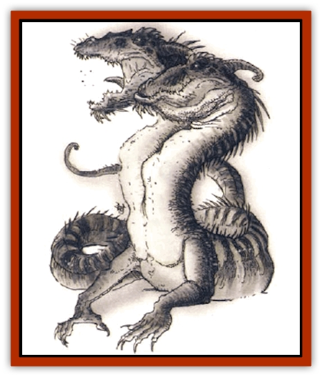

# Dragon - Linnorm - Dread

| Statistic | **Dragon, Linnorm, Dread** |
| --- | --- |
| **Activity Cycle:** | Any |
| **Alignment:** | Chaotic evil |
| **Armor Class:** | -4 (base) |
| **Climate/Terrain:** | Any/Land |
| **Damage/Attack:** | 5d10(&times;2)/6d10/specia1 |
| **Diet:** | Special |
| **Frequency:** | Very rare |
| **Hit Dice:** | 20 (base) |
| **Intelligence:** | High (13-14) |
| **Magic Resistance:** | See below |
| **Morale:** | Fanatic (17-18) |
| **Movement:** | 18, Sw 12 |
| **No. Appearing:** | 1 |
| **No. of Attacks:** | 3 + special |
| **Organization:** | Solitary |
| **Size:** | G (68' base length) |
| **Special Attacks:** | Spells, breath weapons |
| **Special Defenses:** | Spells, +1 weapon to hit |
| **THAC0:** | 1 (base) |
| **Treasure:** | See below |
| **XP Value:** | See below |

Dread linnorms, the only known two-headed Norse [[Dragon_General_Information|dragons]], have an ability to wreak havoc on human settlements that is legendary. When they hatch, their small, glossy scales are black. As they age, the scales become duller and larger, shifting from black to gray at the linnorms' whim.

Dread linnorms speak their own tongue and communicate only with other Norse dragons.

**Combat:** Dread linnorms attack first with spells, then with their twin breath weapons, the left head breathing one round before the right (the heads alternate their attacks every round thereaftcr, until each head has breathed three times). Survivors are then attacked with further spells before the dragon slithers closer and uses its twin bites and tail slap. Some dreads may simply continue their assaults from the air, using a *fly* spell.

**Breath Weapon/Special Abilities:** The right head of a dread breathes a magical cone of chilling wind that is 3 feet wide at the mouth, 120 feet long, and 60 feet wide at its terminus; this breath knocks victims back 2 feet per point of damage suffered. The left head of the dread breathes a cloud of hot dust 80 feet long, 50 feet wide, and 30 feet high. Creatures caught in either breath may attempt a saving throw for half damage.

Dreads are immune to all enchantment/charm spells. In addition, they gain the following abilities as they age

*Juvenile: telekinesis* once per round; *Adult: move earth* four times per day; *Old: power word, stun* three times per day; *Venerable: energy drain* (must make a successful bite attack); *great wyrm: antipathy-sympathy* twice per day. They also cast wizard spells. All spells and magical abilities are used at a level equal to 8 plus the linnorm's combat modifier.

**Habitat/Society:** Dread linnorms live in desolate places, preferring deep, twisting caverns in which they set traps to confuse and kill trespassers. They share their lairs only when mating, once every 40-50 years. The parents remain together until the eggs hatch, then go their separate ways, leaving the hatchlings to fend for themselves.

These rarest of linnorms inhabit any clime. They respect other linnorms and stay clear of their territories, but have no qualms about laying waste to human communities and making their lairs in the ravaged countryside.

While dreads accumulate vast wealth over the course of their long lives, they do not covet treasure and magic as do other dragons. To them, such things are merely incidental spoils they never bother to inventory; they keep treasure only out of instinct. Such riches are usually scattered throughout their lairs, in various mounds upon which they sometimes lie. Slaves and prisoners are never taken.

**Ecology:** Dreads seem to require little sustenance, but they enjoy wood seasoned by salt water and will attack ships to acquire that treat. Dreads at the juvenile stage and older have no known predators except perhaps brave giant bands. However, hatchlings and young are stalked by giants for food and trophies, and they are sometimes tracked by heroes.

| Age | Body Lgt. (') | Tail Lgt. (') | AC | Breath Weapon | Spells W | MR | Treas. Type | XP Value |
| --- | --- | --- | --- | --- | --- | --- | --- | --- |
| 1 Hatchling | 3-24 | 3-24 | -1 | 2d8+1 | 1 | 40% | ½H,S | 13,000 |
| 2 Very young | 25-42 | 25-42 | -2 | 4d8+2 | 2 | 45% | H,S | 14,000 |
| 3 Young | 43-57 | 43-57 | -3 | 6d8+3 | 3 | 50% | H,S | 15,000 |
| 4 Juvenile | 58-76 | 58-76 | -4 | 8d8+4 | 3 1 | 55% | H,S | 17,000 |
| 5 Young adult | 77-96 | 77-96 | -5 | 10d8+5 | 3 2 1 | 60% | H,Sx2 | 18,000 |
| 6 Adult | 97-107 | 97-107 | -6 | 12d8+6 | 4 3 2 | 65% | H,Sx2 | 20,000 |
| 7 Mature adult | 108-129 | 108-129 | -7 | 14d8+7 | 5 3 3 1 | 70% | H,Sx2 | 21,000 |
| 8 Old | 130-156 | 130-156 | -8 | 16d8+8 | 5 4 3 2 | 75% | H,Sx3 | 23,000 |
| 9 Very old | 157-186 | 157-186 | -9 | 18d8+9 | 6 4 4 3 | 80% | H,Sx3 | 24,000 |
| 10 Venerable | 187-217 | 187-217 | -10 | 20d8+10 | 6 4 4 4 1 | 85% | H,Sx3 | 26,000 |
| 11 Wyrm | 218-237 | 218-237 | -11 | 22d8+11 | 7 5 4 4 2 | 90% | H,Sx4 | 27,000 |
| 12 Great Wyrm | 238-265 | 238-265 | -12 | 24d8+12 | 7 5 5 4 3 | 95% | H,Sx4 | 28,000 |

---
## Discovery & Documentation

**Source Publication:** Monstrous Compendium, 1994 Annual, Volume 1 (1995)
**Campaign Setting:** Advanced Dungeons & Dragons 2nd Edition
**Author(s):** David Wise

### Other Creatures Found in This Source Book
   * [[Abyss_Ant|Abyss Ant]]
   * [[Achaierai|Achaierai]]
   * [[Afanc|Afanc]]
   * [[Al-Jahar|Al-Jahar]]
   * [[Baelnorn|Baelnorn]]
   * [[Baneguard|Baneguard]]
   * [[Banelar|Banelar]]
   * [[Bird_Talking|Bird, Talking]]
   * [[Blazing_Bones|Blazing Bones]]
   * [[Campestri|Campestri]]
   * [[Caniquine|Caniquine]]
   * [[Cat_Winged|Cat, Winged]]
   * [[Crypt_Servant|Crypt Servant]]
   * [[Death's_Head_Tree|Death's Head Tree]]
   * [[Dog_Saluqi|Dog, Saluqi]]
   * [[Dragon_Electrum|Dragon, Electrum]]
   * [[Dragon_Fang|Dragon, Fang]]
   * [[Dragon_Linnorm_Corpse_Tearer|Dragon, Linnorm, Corpse Tearer]]
   * [[Dragon_Linnorm_Flame|Dragon, Linnorm, Flame]]
   * [[Dragon_Linnorm_Forest|Dragon, Linnorm, Forest]]
   * [[Dragon_Linnorm_Frost|Dragon, Linnorm, Frost]]
   * [[Dragon_Linnorm_Gray|Dragon, Linnorm, Gray]]
   * [[Dragon_Linnorm_Land|Dragon, Linnorm, Land]]
   * [[Dragon_Linnorm_Midgard|Dragon, Linnorm, Midgard]]
   * [[Dragon_Linnorm_Rain|Dragon, Linnorm, Rain]]
   * [[Dragon_Linnorm_Sea|Dragon, Linnorm, Sea]]
   * [[Dragon_Neutral_Jacinth|Dragon, Neutral, Jacinth]]
   * [[Dragon_Neutral_Jade|Dragon, Neutral, Jade]]
   * [[Dragon_Neutral_Pearl|Dragon, Neutral, Pearl]]
   * [[Dread|Dread]]
   * [[Dragon-kin|Dragon-kin]]
   * [[Elemental_Earth_Kin_Chrysmal|Elemental, Earth Kin, Chrysmal]]
   * [[Elemental_Earth_Kin_Earth_Weird|Elemental, Earth Kin, Earth Weird]]
   * [[Elemental_Fire_Kin_Azer|Elemental, Fire Kin, Azer]]
   * [[Elemental_Sandman|Elemental, Sandman]]
   * [[Elemental_Wind_Walker|Elemental, Wind Walker]]
   * [[Elemental_Vermin|Elemental Vermin]]
   * [[Feystag|Feystag]]
   * [[Flame_Skull|Flame Skull]]
   * [[Foulwing|Foulwing]]
   * [[Gambado|Gambado]]
   * [[Garbug|Garbug]]
   * [[Genie_Tasked_Administrator|Genie, Tasked, Administrator]]
   * [[Genie_Tasked_Deceiver|Genie, Tasked, Deceiver]]
   * [[Genie_Tasked_Harim_Servant|Genie, Tasked, Harim Servant]]
   * [[Genie_Tasked_Messenger|Genie, Tasked, Messenger]]
   * [[Genie_Tasked_Miner|Genie, Tasked, Miner]]
   * [[Genie_Tasked_Oathbinder|Genie, Tasked, Oathbinder]]
   * [[Gibbering_Mouther|Gibbering Mouther]]
   * [[Gnasher|Gnasher]]
   * [[Gnasher_Winged|Gnasher, Winged]]
   * [[Golem_Brain|Golem, Brain]]
   * [[Golem_Hammer|Golem, Hammer]]
   * [[Golem_Metagolem|Golem, Metagolem]]
   * [[Golem_Spiderstone|Golem, Spiderstone]]
   * [[Gorynych|Gorynych]]
   * [[Greelox|Greelox]]
   * [[Helmed_Horror|Helmed Horror]]
   * [[Jarbo|Jarbo]]
   * [[Laraken|Laraken]]
   * [[Lich_Psionic|Lich, Psionic]]
   * [[Living_Steel|Living Steel]]
   * [[Lock_Lurker|Lock Lurker]]
   * [[Loxo|Loxo]]
   * [[Lycanthrope_Loup_de_Noir|Lycanthrope, Loup de Noir]]
   * [[Lycanthrope_Werebadger|Lycanthrope, Werebadger]]
   * [[Lycanthrope_Werejaguar|Lycanthrope, Werejaguar]]
   * [[Lythlyx|Lythlyx]]
   * [[Magebane|Magebane]]
   * [[Marrashi|Marrashi]]
   * [[Metalmaster|Metalmaster]]
   * [[Mimic_House_Hunter|Mimic, House Hunter]]
   * [[Naga_Bone|Naga, Bone]]
   * [[Nautilus_Giant|Nautilus, Giant]]
   * [[Nightshade_Toril|Nightshade (Toril)]]
   * [[Nishruu|Nishruu]]
   * [[Noran|Noran]]
   * [[Opinicus|Opinicus]]
   * [[Ormyrr|Ormyrr]]
   * [[Parasite|Parasite]]
   * [[Pasari-Niml|Pasari-Niml]]
   * [[Plant_Vampire_Moss|Plant, Vampire Moss]]
   * [[Pteraman|Pteraman]]
   * [[Rautym|Rautym]]
   * [[Shadeling|Shadeling]]
   * [[Skum|Skum]]
   * [[Snake_Giant_Cobra|Snake, Giant Cobra]]
   * [[Snake_Stone|Snake, Stone]]
   * [[Spectral_Wizard|Spectral Wizard]]
   * [[Spell_Weaver|Spell Weaver]]
   * [[Spider_Brain|Spider, Brain]]
   * [[Suwyze|Suwyze]]
   * [[Tatalla|Tatalla]]
   * [[Tick_Heart|Tick, Heart]]
   * [[Tree_Dark|Tree, Dark]]
   * [[Tree_Singing|Tree, Singing]]
   * [[Tressym|Tressym]]
   * [[Troll_Snow|Troll, Snow]]
   * [[Tuyewera|Tuyewera]]
   * [[Ulitharid|Ulitharid]]
   * [[Undead_Dwarf|Undead Dwarf]]
   * [[Undead_Lake_Monster|Undead Lake Monster]]
   * [[Whipsting|Whipsting]]
   * [[Windghost|Windghost]]
   * [[Wolf_Dread|Wolf, Dread]]
   * [[Wolf_Stone|Wolf, Stone]]
   * [[Wolf_Vampiric|Wolf, Vampiric]]
   * [[Wraith_Shimmering|Wraith, Shimmering]]
   * [[Xantravar|Xantravar]]
   * [[Xaver|Xaver]]
